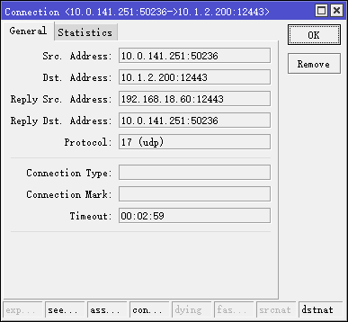
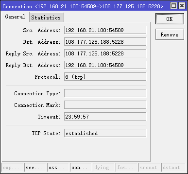

---
aliases:
- /archives/357
categories:
- 网络基础
date: 2019-09-17 07:58:34+00:00
draft: false
title: 102网管——负载平衡和连接跟踪
---

本文来谈一谈网关上的多IP负载平衡，以及其中的实现原理。


老规矩，先上图


图0

这张可能是所有素材里边我最喜欢的一张了

**接下来开始正题~**


## 前言

### 为什么要负载平衡

此处我们讲的负载平衡指L4负载平衡，而非应用层负载平衡。

L4负载平衡即在传输层进行平衡。在L4平衡相对于L3负载平衡即多出来一个连接参照，L3负载平衡目前只在RouterOS看到过，即按序标记包然后走不同路由转发。L3平衡相对于L4负载平衡，我目前唯独能想到的只有UDP协议的情况下的FullCone NAT模式，L3平衡时该模式能达到平衡的最大速度。L4平衡，依靠连接标记进而进行策略路由，实现相应的负载平衡。

而应用层负载平衡，目前我所了解的，是以一致性hash为主。此文就不再多讲

负载平衡的作用，就是平衡负载，字面意思，好像没有什么好解释的。

### 为什么要进行连接跟踪

因为网关要进行SNAT，同时状态防火墙需要使用。

可以说，连接跟踪是DNAT/SNAT的基础。

假设客户端地址为192.168.15.100，一个去往223.5.5.5的请求从客户端发出。此时，经过逐跳路由后，最终会抵达网关。假设网关的出接口eth0为221.123.123.123。NAT的过程即是把192.168.15.100->223.5.5.5这个请求记录下来（连接跟踪），然后进行SNAT，把源地址（192.168.15.100）替换成221.123.123.123，然后转发出去，即转发出去时就成了221.123.123.123->223.5.5.5，因此，IPv4地址不够用，通过NAT就是这样缓解的。SNAT改变的是源地址，DNAT改变的是目的地址。

进入网关时，以Linux为例，数据包会分别进入Raw表和Mangle表，进而进入到NAT表。由于NAT过程在POSTROUTING发生，在OUTPUT PATH中，因此PREROUTING和FORWARD阶段都不会对源地址做出更改。

NAT转换的源地址有两种方式，当为SNAT时，转换的地址即为SNAT手动指定的地址；当为MASQUERADE时，数据包会被按照默认路由的出路由接口IP作为SNAT的地址。在MASQUERADE的情况下，SNAT的地址是自动的，可用于PPPoE等动态出口IP的场景。


图1. 数据包流向

如上图1，我们可以看到，conntrack在Raw表的Prerouting和Mangle表的Prerouting之间，即表明了在进到Mangle表之前，连接就已经被完成了跟踪。

如下图2，该UDP是DNAT时的，蓝色标题栏也显示出了数据包的路径10.0.141.251->10.1.2.200，与SNAT不同的是，DNAT是在PREROUTING中进行。正是因为请求是从外到内，因此目标地址改变，Dst. Address由原本的10.1.2.200经过DNAT后成了192.168.18.60（回复的源地址，即访问的目标地址）



图2. UDP连接跟踪记录


 图3. TCP连接跟踪记录 

再看如上图3，TCP的连接跟踪记录相对UDP的来说，多了TCP状态和超时时间。

## 连接跟踪和负载平衡有什么关联

负载平衡需要在连接跟踪记录的基础上去做。

如果不以连接为基础分发，直接按包分发，我并没有做过相关测试，无法确定实际会造成什么影响。理论上来说，如果遇到状态防火墙，这相对来说构成了非法状态转移，理论上来说是并不会被接收的。具体的处理逻辑还要等待进一步确认

## 负载平衡的瓶颈

假设你的出口共三个IP，此时客户端发起一个下载连接，负载平衡按照连接平衡会随机选择一个出口IP，即单连接时速度指挥有随机选择IP的速度。当突然有众多连接涌入时，系统无法区分哪些是下载连接，单纯按照连接进行平衡，因此如果突发有100个连接涌入，可能那其中的3个连接不会被均分到三个出口IP上，因此理论上来说，整体速度总是会小于理论值。具体这个由分发策略和链路状态定界策略决定。

因此，在多IP平衡的情况下，如果以连接为基础进行平衡，速度由连接数决定。连接数越高，理论上线路利用率才能尽可能接近满，但是仍然可能会出现分发不是很均衡的情况。

## 负载平衡的原理

### 官方文档

  * mwan3 uses normal Linux policy routing to balance outgoing traffic over multiple WAN connections 即 使用Linux的策略路由同时使用多个WAN去平衡出向流量
  * Linux outgoing network traffic load-balancing is performed on a per-IP connection basis – it is not channel-bonding, where a single connection (e.g. a single download) will use multiple WAN connections simultaneously 即 Linux的出流量平衡时基于单个连接基础的，他并不是通道聚合，不是所谓的单个连接同时使用多个WAN
  * As such load-balancing will help speed multiple separate downloads or traffic generated from a group of source PCs all accessing different sites but it will not speed up a single download from one PC (unless the download is spread across multiple IP streams such as by using a download manager) 即 负载平衡它不会提升单个的下速度（单个连接），除非下载软件使用多个流进行下载（即连接数提高）

### iptables规则

```bash
*mangle

# X代表递增的数字

-A PREROUTING -j mwan3_hook
# 从任何接口进入的数据包均包含在内，跳转到mwan3_hook

-A FORWARD -o vwan_x -p tcp -m tcp --tcp-flags SYN,RST SYN -m comment --comment "!fw3: Zone wan MTU fixing" -j TCPMSS --clamp-mss-to-pmtu
# 调整TCP的MSS

-A OUTPUT -j mwan3_hook
# 源地址为本机接口的数据包，跳转到mwan3_hook

-A mwan3_connected -m set --match-set mwan3_connected dst -j MARK --set-xmark 0x3f00/0x3f00
# 所有已确立的连接打上0x3f00标记


-A mwan3_hook -j CONNMARK --restore-mark --nfmask 0x3f00 --ctmask 0x3f00
# restore-mark即恢复连接的标记到数据包，将ctmask的标记恢复到nfmask
-A mwan3_hook -m mark --mark 0x0/0x3f00 -j mwan3_ifaces_in
# 跳转到mwan3_ifaces_in，分离回程流量
-A mwan3_hook -m mark --mark 0x0/0x3f00 -j mwan3_connected
# 跳转到mwan3_connected
-A mwan3_hook -m mark --mark 0x0/0x3f00 -j mwan3_rules
# 跳转到mwan3_rules，这部分即只剩下了未确立的连接，即都为NEW状态（相对连接跟踪的）
-A mwan3_hook -j CONNMARK --save-mark --nfmask 0x3f00 --ctmask 0x3f00
-A mwan3_hook -m mark ! --mark 0x3f00/0x3f00 -j mwan3_connected


-A mwan3_iface_in_MACVLAN_X -i vwan_X -m set --match-set mwan3_connected src -m mark --mark 0x0/0x3f00 -m comment --comment default -j MARK --set-xmark 0x3f00/0x3f00
# 匹配回程流量，源地址为已确立的连接同时，对该接口进入的流量打上0x3f00的标记
-A mwan3_iface_in_MACVLAN_X -i vwan_X -m mark --mark 0x0/0x3f00 -m comment --comment MACVLAN_X -j MARK --set-xmark 0x900/0x3f00
# 对所有该接口进入的数据包打上0x900的标记

-A mwan3_ifaces_in -m mark --mark 0x0/0x3f00 -j mwan3_iface_in_MACVLAN_X
# 所有数据包跳转到mwan3_iface_in_MACVLAN_X，即分别匹配进入流量

-A mwan3_policy_balanced -m mark --mark 0x0/0x3f00 -m statistic --mode random --probability 0.01800000016 -m comment --comment "MACVLAN_X 1 53" -j MARK --set-xmark 0x3500/0x3f00
# 随机选择0.018的打上0x3500的标记

-A mwan3_policy_balanced -m mark --mark 0x0/0x3f00 -m comment --comment "MACVLAN_X 1 1" -j MARK --set-xmark 0x100/0x3f00
# 剩下的数据包打上0x100的标记
-A mwan3_rules -m mark --mark 0x0/0x3f00 -m comment --comment default_rule -j mwan3_policy_balanced
# 跳转到mwan3_policy_balanced
COMMIT
# Completed on Fri Sep 20 10:20:09 2019
# Generated by iptables-save v1.8.3 on Fri Sep 20 10:20:09 2019
```


此处我们只举例研究Mangle表的规则，NAT表中的不再额外讲述，看了NAT表实际Action只有MASQUERADE。

理清上述规则的功能后，大致分析一下处理逻辑：所有数据包（单纯PREROUTING，未指定接口，即代表所有）进入防火墙，将连接标记恢复到数据包上，然后分离掉回程包，再分离掉已经确立连接的包，剩下的只有相对连接跟踪为NEW类型的包，再将这些NEW请求随机进行分发，即确立了连接所对应的分流出口，后续包归属于已确立连接的规则中，直接接分离掉了。