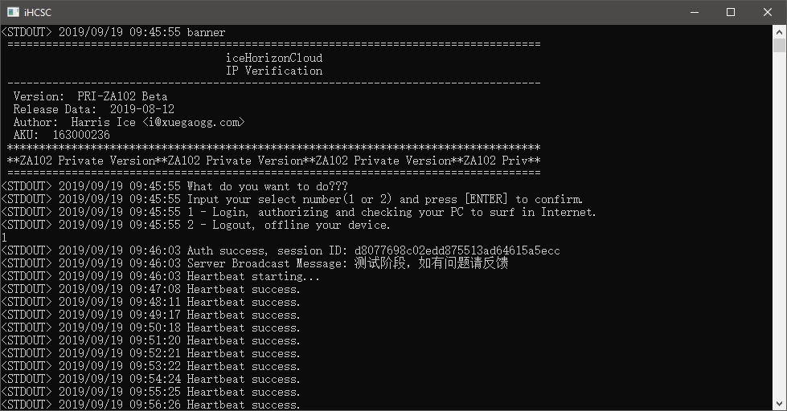

---
aliases:
- /archives/363
categories:
- 网络基础
date: 2019-09-18 09:02:42+00:00
draft: false
title: 102网管——策略随行与设备准入
---

本次文章主讲网络设备的准入和策略随行

老规矩~

图0

**以下是正文~**

## 前言

### 为什么要设备准入

举个栗子，假设我现在是一个世界500强的互联网企业。企业内部一般会有私有的Git仓库、公共存储、服务器等众多资源。那么，假设企业的网是开放无线，人人都可以连上使用，那么紧接着可能会产生一个现象是——随便一个路人看到有WiFi用就连上了，人人都可以随便使用这个企业的网络，当然，人人也可以随便访问他们的私有Git仓库等公共基础设施。这种非授权访问必定是有一定风险的，如果刚好路人是黑客出身，那么这个风险可能就会更大。因此，设备准入，就是要对所有可信设备进行的准许接入，阻挡掉非授权设备的访问，确保每一台设备接入企业网都是授权设备，确保设备归属可查，确保设备可审计 （国家要求） 。

### 为什么要策略随行

再举个栗子，我现在是校园网。全校一共有5万人用网，并且这些人的设备可能会不断变化位置（宿舍，教学楼，工作室，机房等）。一般来讲，开户时每个人可能会选择不同的资费（说到这里我就要吐槽一下我们的~~垃圾~~校园网了，820元一年20M，又限制连接数流控又做的非常激进，20M一般只能到1.7-1.9M/s，约15Mbps，上行30KB/s，动不动抽风），有的账号可能是10M套餐，有的账号可能是20M套餐。

在这种情况下，用户频繁换场所，但是设备却需要是对应的同一个套餐。用户设备随处走，策略一直是和设备（或用户）对应，这项技术就被成为策略随行。用户不论在任何位置，都可以享受到一样的套餐~~（一样的垃圾网）~~。难点之处，就在于无线和有线间漫游，或者说存在的跨三层漫游，可能会引起IP的变动，这种情况下，就需要防火墙去联动调整策略（即流控规则等）。无线网漫游还好，因为无线网可以使用IPVLAN配合AP隔离做大二层，搭配厂家的控制器也可以实现Mesh组网，IP不容易变动，全无线接入的情况下应该不必过于关注跨三层所带来的业务随行的需求。

再举个企业网中的例子， 就以企业网私有的Git仓库为例，都是开发人员才会用，假设后勤部门现在来一个人，他们理论上不会用到私有Git吧，毕竟不是研发部门。那么此时，如果他们可以访问企业网中的私有Git仓库，就有存在代码泄露的风险。因此，设备在网络中需要有策略，即授权的资源可以访问，未被授权的资源不能访问。这个不同的策略需要对应不同的人员（或设备），设备在企业中也可能会随时变动位置，因此可能会存在跨三层的情况，此时策略随行也是非常有必要的。

## 准入和策略随行的好处是什么

就准入来说，可以确保设备是经过授权或者备案的，而不是根本无法溯源的设备。一边可以保障不会受到非授权的访问，一边亦可以做到溯源。

就策略随行来说，好处就是，用户的设备在区域内随便移动，即便是跨三层，仍然没毛病。

## 如何实现准入

准入好做，有很多种实现方式

常见的，有HotSpot认证（涵盖微信联网等），也都是通过这种方式。即，客户端需要进入一个网页输入用户名和或者或者以特定方式进行身份核验，进而进行联网，一般是以网页为主。好处是，部署速度快，可以做前后分离，分离后HotSpot服务器压力不至于很大，实现方式也比较简单，基本都是HTTP的接口操作，需要加密的话直接使用HTTPS即可。但是，由于是网页认证，只能获取到终端的MAC地址、UA等（MAC地址需要由管理中心去主动检查ARP记录，UA由后端检查），但是由于UA是可以手动修改的（HTTP请求头），因此其实获取到的UA不一定是准确的，或者说存在一定的安全漏洞，这个方式最多也只能实现MAC绑定，结合微信可以做一些其他的身份验证扩展，暂且不多说。

除去Hotspot，还有802.1X认证，无线和有线通吃。由于这个我没用过，此处不再多提，只是，802.1X的协议也是一个国际标准协议，协议开放，因此从一定层面来说，有研发能力的情况下仍然可能会存在一定的安全风险。

最后的，也就是我比较提倡的做法——私有协议+私有客户端验证。举个比较成功的例子，H3C的iNode的私有Portal协议，私有的协议搭配私有的Portal，虽然我不知道这个客户端集成的安全检查都能检查什么（听说是可以检查杀毒软件类型和病毒库版本），但是至少我确认这东西能从用户设备上直接获取硬件信息，相比开源协议来讲，会更加可靠。同时，除去安全检查，我觉得心跳也是个很不错的做法，对于哑终端来说可以单独使用DHCP判断然后决定是否让防火墙为该设备直接放行。

## 如何实现策略随行

个人觉得，策略随行，最佳的解决方案，是大二层。如果说简化一些的话，有线+无线两套方案也是可以的。毕竟，有线和无线的网卡是独立的，MAC也会不同，设备也不会一边插着有线网一边去漫游无线。

大二层方案，是无线组网中一个较为不错的解决方案。只是，这个方案需要烧钱买AP买控制器，像大厂的无线控制器都支持设备漫游和自动剔除的。关于隔离问题，一个比较好的做法是IPVLAN，而不是AP隔离。如果开启AP隔离，该AP下设备就无法互访了，但是如果使用IPVLAN，只是IP作为VLAN ID了而已，数据仍然还会向上转发，互访通过上级路由解决。虽然这样可能会加大东西向的流量，但是至少安全得到了保障。通过IPVLAN，设备一方面得到了隔离，又可以在认证后实现互访，整个设备跨Mesh节点相当于在同一个二层中，IP地址无需变化可直接继续使用，客户端切换几乎是无感知。

除去大二层方案，还有一个比较常用的做法是跨三层路由结合准入。此处以有线网举例，跨三层是指客户端设备可以横跨子网移动。针对这个跨三层的策略随行，目前我们实际部署发现要确保IP地址不会变动，如果开启DHCP的话过期时间要尽量设置特别长，否则IP地址变动会影响策略，有没有其他解决方案目前也不得而知。但是DHCP过期时间设置过长也会有一个问题是，可能存在额外的浪费，这个问题在无线中跨三层尤为明显，一些菊花的设备（华为）会莫名其妙的连接上开放无线，实际部署中我发现确实存在这个问题，短短一天DHCP就用掉了100多个地址，全部都是菊花的设备。针对这个问题目前也没想到很好的解决方案，只能把DHCP时间再进行了调整。

## 我们的设备准入

我们的设备准入很简单，HotSpot认证。用的MikroTik自带的HotSpot方案，其实我还是更想自己去写的，只是研发周期可能会比较长，而且策略这块和防火墙联动可能会有一些问题。就以MikroTik RouterOS为例，虽然官方提供了API，但是官方在近期某个版本更新中又更新了API的认证方式，导致原本的接口认证方式失效了，因此觉得依赖第三方的太过于被动。如果有时间还是想拿Linux来搞

## 我们的策略随行

我们的策略随行是仿照iNode的私有客户端+私有协议的方式设计的。设计过程中面临跨平台的问题实在是头大，其他的都还好。我们的私有客户端取名为iceHorizonCloud SmartClient，看名字是智能客户端，实际上并没有这回事。看了如下图1你就知道了，并没有GUI，该客户端使用golang编写，由于Golang的Qt使用的是第三方的Qt bindings，并没有C++原生的Qt支持那么完善，想了想还是不写GUI了。golang解决了跨平台问题，但是无法解决GUI的问题（Gtk和WebView就算了吧），后边有时间能用C++重构还是重构吧。

图1. iHCSC

