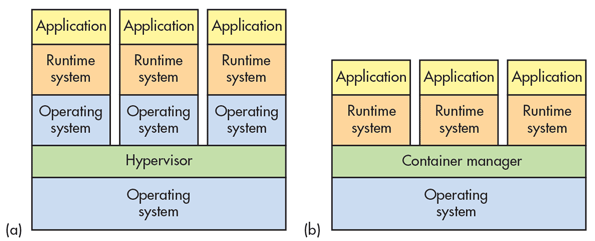

---
aliases:
- /archives/414
categories:
- Linux
date: 2019-09-23 07:44:26+00:00
draft: false
title: Docker安全机制
---

此文主讲Docker的安全机制


前几篇文章上课时写的，没有放图，本篇继续惯例~


图0


## 前言

Docker使用namespace和cgroup技术进行隔离和资源调控，各个namespace可直接与kernel通信并相互共享一个kernel，正因为低层资源共享，所以容器才能比虚拟化更加节省资源。但是，正因为低层资源共享，因此容器的安全控制也相对比较麻烦，需要留意的细节比较多。

## 虚拟化和容器技术的区别


图1. 虚拟化和容器化区别

original source of image is electronicdesign 

如图1，左侧（a）为虚拟化，右侧（b）为容器化。可以看到，在虚拟化中，每个OS是独立的，OS交付Hypervisor（即虚拟机管理模块）管理，由于各个虚拟机底层都是独立的，虚拟机逃逸穿透kernel还要穿透hypervisor，因此虚拟机逃逸并不太容易，安全上并没有容器那么麻烦；再看容器，容器管理工具管理容器的一切，将文件系统、网络协议栈和进程等进行隔离，所有容器公用一个OS的kernel，因此资源占用少，但是容器的安全因素是多方面的，比如容器管理工具自身漏洞、宿主机内核、错误的隔离机制等问题，都可能造成容器逃逸，进而危害宿主。

虚拟化和容器化，各有优劣。如何选择还是要看实际需求

## 容器安全基线


图2. 容器安全基线

如上图，容器安全总结一下分为这些内容：

### 宿主

  1. 避免使用不安全的镜像
  2. 保持容器管理平台为最新版（跟随更新）
  3. 创建独立的分区
  4. 端口绑定为通配地址

### 容器

  1. 容器创建独立的分区挂载
  2. 不要使用特权模式（亲测使用特权模式容易gg）
  3. 不要运行SSH
  4. 限制CPU和内存使用
  5. 挂载rootfs为只读
  6. 移除所有不重要的服务

## 容器安全工作

### 网络控制

各个容器的网络部分都在单独的命名空间中，相互之间是隔离的，且可以交付容器管理工具进行管理，相对全虚拟化解决方案制约少很多，非常便于大规模部署。

在容器编排中，我个人比较推荐目前还处于实验新特性的IPVLAN技术，上游只需要引出一条静态路由即可，但是考虑到是实验新特性，因此安全网络安全方面要尽可能把权限收紧，以避免不必要的麻烦。IPVLAN一方面可以实现租户间通信，一方面可以实现广播域的隔离（因为IPVLAN没有广播），正因为IPVLAN这一特性，不仅可以保障安全，也非常适合容器网络中的行为审计。

### 日志收集+行为分析

```bash
docker logs <容器ID> --details --follow
```


### 移除不必要的权限

SUID和GUID程序在受攻击导致任意代码执行（如缓冲区溢出）时将非常危险，因为它们将运行在进程文件所有者或组的上下文中。因此在部署时要移除相关权限，参照官方文档，容器启动时需要drop这两个权限


```bash
--cap-drop SETUID --cap-drop SETGID
```

| 权限名 | 详细 |
| ---- | ---- |
| SETGID | Make arbitrary manipulations of process GIDs and supplementary GID list. |
| SETUID | Make arbitrary manipulations of process UIDs. |

目前一个还在考虑的权限，是 NET_ADMIN ，按照man-pages的说法，该权限可以进行如下操作：

**CAP_NET_ADMIN**：Perform various network-related operations: 

  * interface configuration – 可以进行接口配置，包含修改IP地址等
  * administration of IP firewall, masquerading, and accounting – 管理IP防火墙、MASQUERADE NAT和统计等
  * modify routing tables – 修改路由表
  * bind to any address for transparent proxying – 绑定任何的地址进行透明代理
  * set type-of-service (TOS) – 设置TOS标记
  * clear driver statistics – 清除驱动状态（我没太明白啥意思）
  * set promiscuous mode – 设置接口为混杂模式
  * enabling multicasting – 启用多播
  * use setsockopt(2) to set some socket options – 允许使用一些socket选项

这个NET_ADMIN权限很有值得商榷，给的话，客户机将会获得修改接口配置的权限，随意修改IP地址可能会对管理造成不便，同时可能带来安全隐患；如果不给，客户机无法启用防火墙，所有端口直接暴露，潜在安全问题。

无论如何都会存在安全问题，要商榷下放弃哪个。

## 建议启动权限

基础权限：


```bash
docker run -it -e container=docker --tmpfs /run -v /sys/fs/cgroup:/sys/fs/cgroup:ro --stop-signal SIGRTMIN+3 --network ipvlan36 --ip <ipv4地址> --name <容器名> <镜像名>
```


批量部署建议移除GUID SUID权限，以避免移除导致的提权


```bash
docker run -it -e container=docker --cap-drop SETUID --cap-drop SETGID --tmpfs /run -v /sys/fs/cgroup:/sys/fs/cgroup:ro --stop-signal SIGRTMIN+3 --network ipvlan36 --ip <ipv4地址> --name <容器名> <镜像名> 
```


