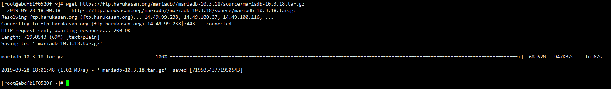
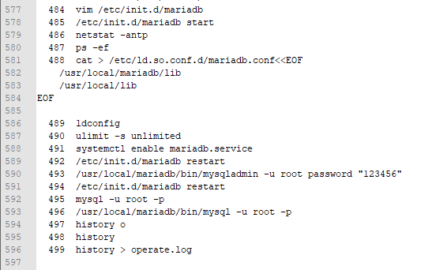
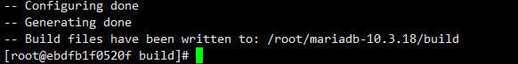
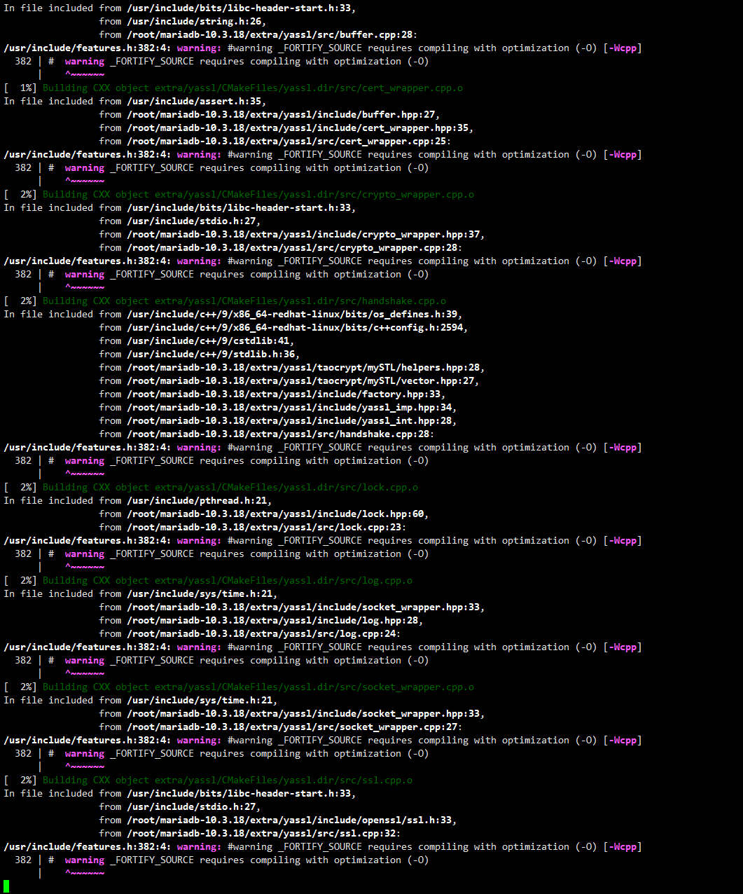
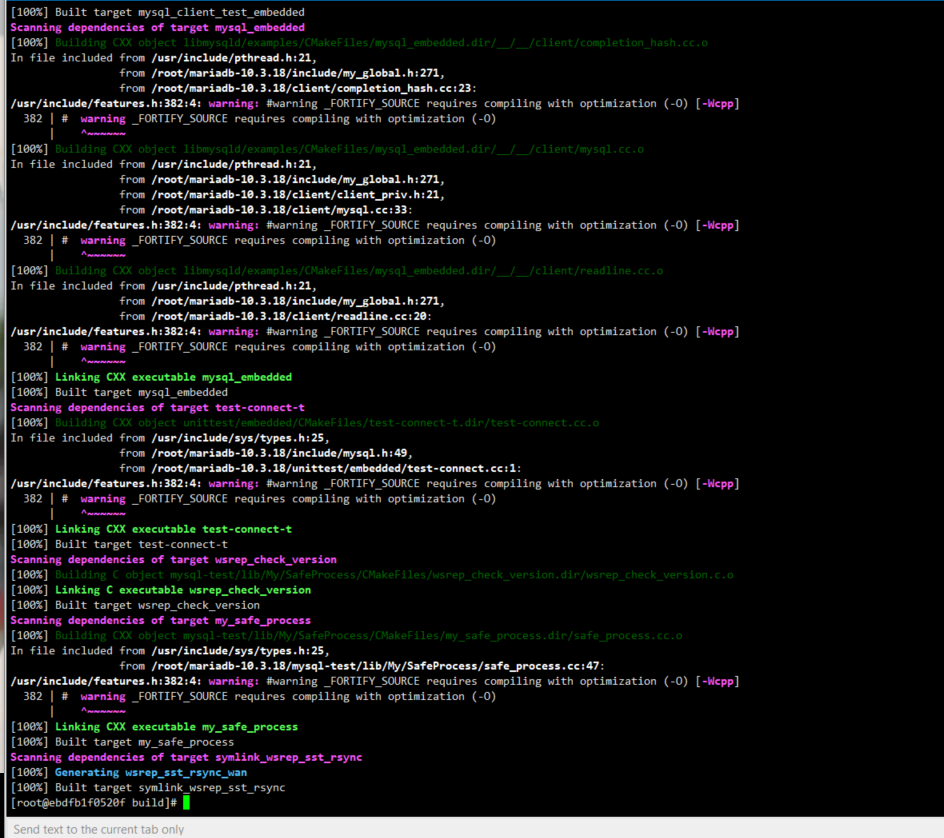
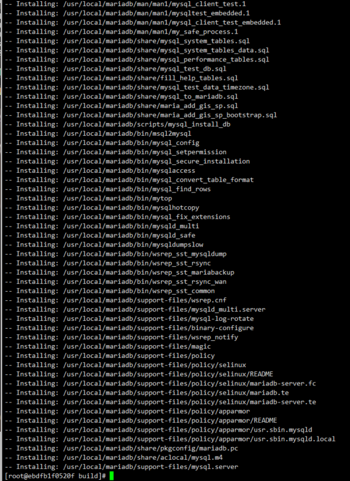
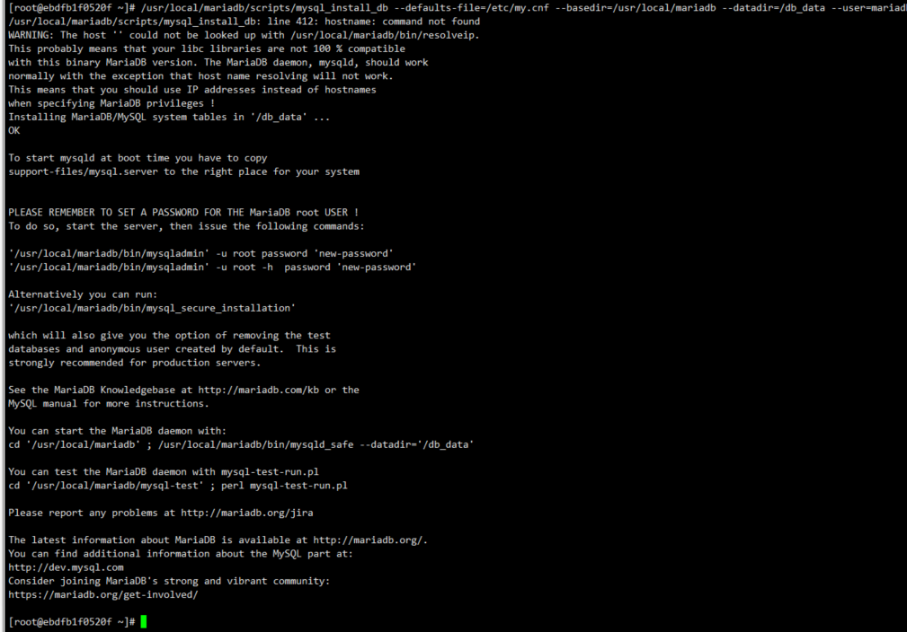
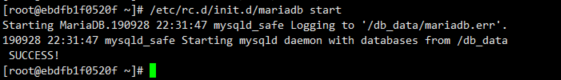
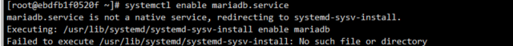
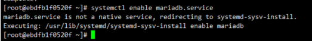

---
aliases:
- /archives/429
categories:
- Linux
date: 2019-09-28 10:19:40+00:00
draft: false
title: MariaDB编译和配置集群
---

嗯，正如标题中所讲的一样


老规矩~


图0

**接下来进入正题~**


## 前言

作为强迫症的我并不喜欢用Repo中的东西，于是我决定手动编译MariaDB以进行集群（一主一从）。此处我直接将MariaDB编译安装在容器（Fedora 30）中，完成编译后commit再复制出一个新的实例部署从数据库（相当于热备，应该也可以用作异地容灾）。

## 环境

**容器系统**：Fedora 30 x86_64

**容器内核**：5.1.18-200.fc29.x86_64

**网络环境**：IPVLAN 192.168.36.0/24

**单实例CPU**：单核 Intel(R) Xeon(R) CPU X5660 @ 2.80GHz

**单实例内存**：512M

**单实例SWAP**：512M

**实例Docker Image**： [链接](https://hub.docker.com/r/a980883231/ihc_fedora_cv)

**编译版本**：MariaDB 10.3.18

## 步骤

启动实例（我使用的docker）


```bash
docker run -it -d -e container=docker --dns="192.168.18.2" --dns-search="ihc.xuegaogg.com" --memory=512m --memory-swap=1g --cpus="1.5" --storage-opt size=30G --device-read-bps="/dev/sdb:30mb" --device-wr
ite-bps="/dev/sdb:30mb" --device-read-iops="/dev/sdb:90" --device-write-iops="/dev/sdb:90" --tmpfs /run --tmpfs /tmp  -v /sys/fs/cgroup:/sys/fs/cgroup:ro --stop-signal SIGRTMIN+3 --network ipvlan36 --ip 192.168.36.150 --name test-harris-pub-mariadb-m a980883231/ihc_fedora_cv
```


然后使用Xshell连接到192.168.36.150，开始进行编译

之前忘了在哪里看到过的MariaDB 10系列的需要1G以上内存才能运行，实测玩玩用512M的内存还是可以的（虚拟化就别了，容器的512M比虚拟化的能够利用的要多很多）

实例我已经安装好了Development Tools，依赖应该不会缺太多

首先去MariaDB官网下载源码

此处我用的10.3.18，因此实例里使用wget进行下载得到如下图1



图1. mariadb下载

解压后进入文件夹，新建 **build** 文件夹，进入该文件夹


```bash
cmake -DCMAKE_INSTALL_PREFIX=/usr/local/mariadb -DWITH_ARIA_STORAGE_ENGINE=1 -DWITH_XTRADB_STORAGE_ENGINE=1 -DWITH_INNOBASE_STORAGE_ENGINE=1 -DWITH_PARTITION_STORAGE_ENGINE=1 -DWITH_MYISAM_STORAGE_ENGINE=1 -DWITH_FEDERATED_STORAGE_ENGINE=1 -DEXTRA_CHARSETS=all -DDEFAULT_CHARSET=utf8mb4 -DDEFAULT_COLLATION=utf8mb4_general_ci -DWITH_READLINE=1 -DWITH_EMBEDDED_SERVER=1 -DENABLED_LOCAL_INFILE=1 -DWITHOUT_TOKUDB=1 ..
```


执行，报错。好吧忘了安装cmake了


```bash
yum install cmake
```


此处fedora源使用的cmake是3.14.5版本

`No CMAKE_CXX_COMPILER could be found.`

好吧没有安装g++工具链


```bash
yum install gcc-g++
```


fedora源中的gcc-g++版本为9.2.1

`Curses library not found. Please install appropriate package,remove CMakeCache.txt and rerun cmake.On Debian/Ubuntu, package name is libncurses5-dev, on Redhat and derivates it is ncurses-devel.`


```bash
yum install ncurses-devel
```


`Could NOT find GnuTLS (missing: GNUTLS_LIBRARY GNUTLS_INCLUDE_DIR) (Required is at least version “3.3.24”)`

事真多。


```bash
yum install gnutls-devel
```


很幸运的，Fedora 30集成了较高版本的GNUTLS，不用劳累了。想看CentOS7编译这个是什么样子的可以继续看下面这一段，不然可以直接跳过看下面的**配置创建成功**部分。

第一遍我用CentOS7编译，由于CentOS7真的是老古董系统了，印象里好像我高三时就在用，将近三年才出8，整个CentOS7默认还是使用Python2，很多依赖都是古董级别的，自带的GnuTls也是非常老，连带依赖又特别多，手工编译gnutls和相关依赖折腾了一下午。gnutls的依赖nettle由于默认没有gmp依赖因此动态链接没有编译齐全，后边补上gmp重新编译才解决。又可能是因为CentOS7过于古董或者是gnutls的bug，编译gnutls频繁报ck_rsa_pkcs_pss_params错误，仔细检查发现是define预编译中检查时没有将条件检查上，导致该部分声明没有编译上，最后报错，手动改了代码才通过了编译。**最后，分享一个经验，源码编译的软件，如果可以引出动态链接的话，这个代码是可以使用pkg-config进行命令替换的，但是默认make install并没有安装指示文件，可以手工复制编译目录下的.pc文件到/usr/lib64/pkgconfig（CentOS7）即可。pkg-config可以说是批量编译工程和大量引入动态链接编译的里程碑，开发者可以不用累死累活找头文件，直接安装依赖后写好makefile编译即可，太tm方便了。**

至于使用CentOS7编译这东西，导致我敲了多少命令，可以看看下面这个图。。。也就499个命令。。。。我酸了，laji古董系统浪费我生命


图N. 插图

创建配置成功了（如下图2），接下来可以开始编译了



图2. 生成编译配置成功

紧接着开始make


图3. 编译开始

如上图3，这是一个非常漫长的过程，要慢慢等待，因此我先去游泳了。

好了，我游完回来了~继续更

远程桌面看了一下，编译挺顺利的



图4. 编译成功

编译成功后进行安装，使用**make install** ，由于我cmake生成配置阶段定义了安装位置在/usr/local/mariadb，因此会自动安装到这个目录中。



图5. 安装结束

如图5，安装成功结束。由于安装只是帮我们把二进制文件和动态链接等安装了，因此我们还需要手动配置数据库。由于我编译时选择编译了innobase引擎，因此配置文件可以按照如下的配置，不建议使用MyISAM引擎，很多功能都不支持。该配置是参考lnmp的数据库部分的，优化的算是比较OK的，比较适合大众化使用。


```bash
#!/bin/bash

export MariaDB_Data_Dir=/db_data
# 数据库数据文件路径

cat > /etc/my.cnf<<EOF
[client]
port        = 3306
socket      = /tmp/mysql.sock

[mysqld]
port        = 3306
socket      = /tmp/mysql.sock
user    = mariadb
basedir = /usr/local/mariadb
datadir = ${MariaDB_Data_Dir}
log_error = ${MariaDB_Data_Dir}/mariadb.err
pid-file = ${MariaDB_Data_Dir}/mariadb.pid
skip-external-locking
key_buffer_size = 16M
max_allowed_packet = 1M
table_open_cache = 64
sort_buffer_size = 512K
net_buffer_length = 8K
read_buffer_size = 256K
read_rnd_buffer_size = 512K
myisam_sort_buffer_size = 8M
thread_cache_size = 8
query_cache_size = 8M
tmp_table_size = 16M

explicit_defaults_for_timestamp = true
#skip-networking
max_connections = 500
max_connect_errors = 100
open_files_limit = 65535

log-bin=mysql-bin
binlog_format=mixed
server-id   = 1
expire_logs_days = 10

default_storage_engine = InnoDB
innodb_file_per_table = 1
innodb_data_home_dir = ${MariaDB_Data_Dir}
innodb_data_file_path = ibdata1:10M:autoextend
innodb_log_group_home_dir = ${MariaDB_Data_Dir}
innodb_buffer_pool_size = 16M
innodb_log_file_size = 5M
innodb_log_buffer_size = 8M
innodb_flush_log_at_trx_commit = 1
innodb_lock_wait_timeout = 50

[mysqldump]
quick
max_allowed_packet = 16M

[mysql]
no-auto-rehash

[myisamchk]
key_buffer_size = 20M
sort_buffer_size = 20M
read_buffer = 2M
write_buffer = 2M

[mysqlhotcopy]
interactive-timeout
EOF
```


上面配置需要保存成.sh文件，将MariaDB_Data_Dir后的路径改成数据库数据文件的目录，使用chmod a+x 给上可执行权限再执行即可，配置文件默认覆盖生成到/etc/my.cnf 由于里边路径比较多，建议这样方便。

紧接着，按照下述命令新建用户组和用户


```bash
groupadd mariadb
useradd -s /sbin/nologin -M -g mariadb mariadb
```


然后把安装目录所有者设置给这个用户，顺便把数据目录一起设置了


```bash
chown -R mariadb:mariadb /usr/local/mariadb
chown -R mariadb:mariadb /db_data
```


然后初始化数据库


```bash
/usr/local/mariadb/scripts/mysql_install_db --defaults-file=/etc/my.cnf --basedir=/usr/local/mariadb --datadir=/db_data --user=mariadb
```


然后就可以看到如下图6的初始化成功了



图6. 初始化成功

我不知道为什么官方只给提供了systemv方式启动，rhel系的大多系统都已经在用systemd了，比systemv方式的方便很多。既然只给了这个，也没办法，将就用吧，使用如下命令复制文件并给上权限即可。如果是Ubuntu等其他系统可能复制到的路径不完全一样，这个自己查把。


```bash
cp /usr/local/mariadb/support-files/mysql.server /etc/rc.d/init.d/mariadb
chmod a+x /etc/rc.d/init.d/mariadb
```


启动！ 


```bash
/etc/rc.d/init.d/mariadb start
```


可以看到如下图7，启动成功


图7. 启动成功

启动成功。然后修改个默认密码把，改成123456好了


```bash
/usr/local/mariadb/bin/mysqladmin -u root password "123456"
```


为了方便动态链接使用，把mariadb的动态链接库注册到ld中去，可以使用如下命令


```bash
cat > /etc/ld.so.conf.d/mariadb.conf<<EOF
/usr/local/mariadb/lib
/usr/local/lib
EOF
```


然后执行一下 ldconfig 使其生效

然后使用systemd去管理服务，使其开机自动启动，对于systemd无法直接使用的systemv，它会调用systemv去执行，所以还是挺方便的。


```bash
systemctl enable mariadb.service
```


然后报错


图8. 错误

没有安装systemv的东西


```
dnf install chkconfig
```


再执行，可以了，如下图9


图9. 设置自启动成功

然后按照官方的建议，把堆栈限制调整为无限，使用如下命令


```bash
ulimit -s unlimited
```


到这里，数据库的编译安装就完成了。

为了方便各位会使用docker的部署数据库，我特地将这东西commit并push到了docker hub，由于镜像太大3G，上传要花点时间，晚点放链接

紧接着我开始部署一主一备的mariadb集群，由于我已经封装好了docker镜像，因此我直接克隆出来一个新的实例用来做slave节点，IP地址为192.168.36.151。上边编译的这台实例做master节点，IP为192.168.36.150


```
docker run -it -d -e container=docker --dns="192.168.18.2" --dns-search="ihc.xuegaogg.com" --memory=512m --memory-swap=1g --cpus="1.5" --storage-opt size=30G --device-read-bps="/dev/sdb:30mb" --device-wr
ite-bps="/dev/sdb:30mb" --device-read-iops="/dev/sdb:90" --device-write-iops="/dev/sdb:90" --tmpfs /run --tmpfs /tmp  -v /sys/fs/cgroup:/sys/fs/cgroup:ro --stop-signal SIGRTMIN+3 --network ipvlan36 --ip 192.168.36.151 --name test-harris-pub-mariadb-s a980883231/mariadb:fedora30-10.3.18
```


接下来集群按照官方文档走

首先我先操作master

要先修改数据库的ID，主数据库就保持1不改了，直接新建同步用户


```shell
[root@ebdfb1f0520f ~]# /usr/local/mariadb/bin/mysql -u root -p
Enter password: 
Welcome to the MariaDB monitor.  Commands end with ; or \g.
Your MariaDB connection id is 10
Server version: 10.3.18-MariaDB-log Source distribution

Copyright (c) 2000, 2018, Oracle, MariaDB Corporation Ab and others.

Type 'help;' or '\h' for help. Type '\c' to clear the current input statement.

MariaDB [(none)]> use mysql;
Database changed
MariaDB [mysql]> CREATE USER 'username'@'%' IDENTIFIED BY 'password';
Query OK, 0 rows affected (0.001 sec)

MariaDB [mysql]> GRANT REPLICATION SLAVE ON *.* TO 'username'@'%';
Query OK, 0 rows affected (0.001 sec)

MariaDB [mysql]> Bye
[root@ebdfb1f0520f ~]# 

```


按照如上登录数据库，添加用户名为username 密码为password的用户，并添加slave同步权限。紧接着使用如下命令查看数据库二进制日志文件


```shell
MariaDB [(none)]> SHOW MASTER STATUS;
+------------------+----------+--------------+------------------+
| File             | Position | Binlog_Do_DB | Binlog_Ignore_DB |
+------------------+----------+--------------+------------------+
| mysql-bin.000003 |      677 |              |                  |
+------------------+----------+--------------+------------------+
1 row in set (0.000 sec)

MariaDB [(none)]>

```


记好二进制日志文件名和后边的Position码，给子节点配置要用到

紧接着，我们开始配置slave节点

先修改slave数据库的id，直接vim修改/etc/my.cnf，找到其中如下字段改成不重复的值即可


```bash
server-id   = 2
```


然后重启数据库


```bash
systemctl restart mariadb.service
```


紧接着登录数据库，并且按照如下操作，对应的设置解释在下面一段


```bash
[root@3c418c528c27 ~]# /usr/local/mariadb/bin/mysql -u root -p
Enter password: 
Welcome to the MariaDB monitor.  Commands end with ; or \g.
Your MariaDB connection id is 11
Server version: 10.3.18-MariaDB-log Source distribution

Copyright (c) 2000, 2018, Oracle, MariaDB Corporation Ab and others.

Type 'help;' or '\h' for help. Type '\c' to clear the current input statement.

MariaDB [(none)]> CHANGE MASTER TO
    -> MASTER_HOST='192.168.36.150',
    -> MASTER_USER='username',
    -> MASTER_PASSWORD='password',
    -> MASTER_PORT=3306,
    -> MASTER_LOG_FILE='mysql-bin.000003',
    -> MASTER_LOG_POS=677,
    -> MASTER_CONNECT_RETRY=10;
Query OK, 0 rows affected (0.012 sec)

MariaDB [(none)]> START SLAVE;
Query OK, 0 rows affected (0.002 sec)

MariaDB [(none)]> 

```


如上，我直接把整个终端输入和输出全部复制下来了。MASTER_HOST对应master主机IP，即192.168.36.150；MASTER_USER和MASTER_PASSWORD分别对应刚刚设置的用户名和密码，MASTER_LOG_FILE填写刚刚看到的二进制日志的文件名，MASTER_LOG_POS即为刚刚的Position，最后一个为重试次数。_START SLAVE;_ 即表示开始进入副数据库模式（即开始同步）

查看副数据库同步状态可以使用如下命令查看


```
SHOW SLAVE STATUS \G
```


于是乎可以看到


```shell
MariaDB [(none)]> SHOW SLAVE STATUS \G
*************************** 1. row ***************************
                Slave_IO_State: Waiting for master to send event
                   Master_Host: 192.168.36.150
                   Master_User: username
                   Master_Port: 3306
                 Connect_Retry: 10
               Master_Log_File: mysql-bin.000003
           Read_Master_Log_Pos: 677
                Relay_Log_File: mariadb-relay-bin.000003
                 Relay_Log_Pos: 555
         Relay_Master_Log_File: mysql-bin.000003
              Slave_IO_Running: Yes
             Slave_SQL_Running: Yes
               Replicate_Do_DB: 
           Replicate_Ignore_DB: 
            Replicate_Do_Table: 
        Replicate_Ignore_Table: 
       Replicate_Wild_Do_Table: 
   Replicate_Wild_Ignore_Table: 
                    Last_Errno: 0
                    Last_Error: 
                  Skip_Counter: 0
           Exec_Master_Log_Pos: 677
               Relay_Log_Space: 866
               Until_Condition: None
                Until_Log_File: 
                 Until_Log_Pos: 0
            Master_SSL_Allowed: No
            Master_SSL_CA_File: 
            Master_SSL_CA_Path: 
               Master_SSL_Cert: 
             Master_SSL_Cipher: 
                Master_SSL_Key: 
         Seconds_Behind_Master: 0
 Master_SSL_Verify_Server_Cert: No
                 Last_IO_Errno: 0
                 Last_IO_Error: 
                Last_SQL_Errno: 0
                Last_SQL_Error: 
   Replicate_Ignore_Server_Ids: 
              Master_Server_Id: 1
                Master_SSL_Crl: 
            Master_SSL_Crlpath: 
                    Using_Gtid: No
                   Gtid_IO_Pos: 
       Replicate_Do_Domain_Ids: 
   Replicate_Ignore_Domain_Ids: 
                 Parallel_Mode: conservative
                     SQL_Delay: 0
           SQL_Remaining_Delay: NULL
       Slave_SQL_Running_State: Slave has read all relay log; waiting for the slave I/O thread to update it
              Slave_DDL_Groups: 0
Slave_Non_Transactional_Groups: 0
    Slave_Transactional_Groups: 0
1 row in set (0.001 sec)

MariaDB [(none)]> 
```


可以看到Slave_IO_Running和Slave_SQL_Running都已经yes了，说明已经在正常运行了

此时，我测试一下，在主数据库随便建个库和表，看副数据库能否同步


```shell
MariaDB [(none)]> create datebase harris;
ERROR 1064 (42000): You have an error in your SQL syntax; check the manual that corresponds to your MariaDB server version for the right syntax to use near 'datebase harris' at line 1
MariaDB [(none)]> create database harris;
Query OK, 1 row affected (0.001 sec)

MariaDB [(none)]> use harris;
Database changed
MariaDB [harris]> create table test(
    -> id int not null
    -> );
Query OK, 0 rows affected (0.012 sec)

MariaDB [harris]> 

```


好了，已经在主数据库创建了一个harris的数据库，紧接着我们来看slave副数据库


```shell
MariaDB [(none)]> show databases;
+--------------------+
| Database           |
+--------------------+
| harris             |
| information_schema |
| mysql              |
| performance_schema |
| test               |
+--------------------+
5 rows in set (0.001 sec)

MariaDB [(none)]> 
```


可以看到，副数据库已经显示同步成功了

好了，结束。
