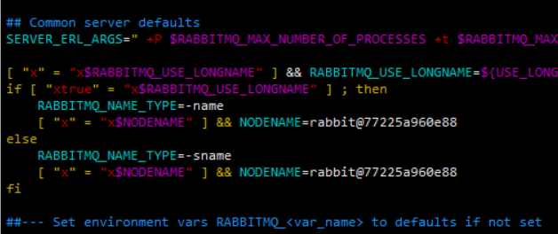
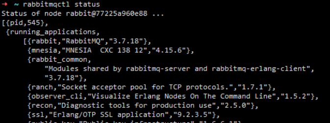
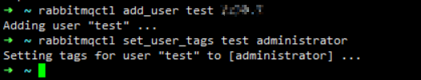
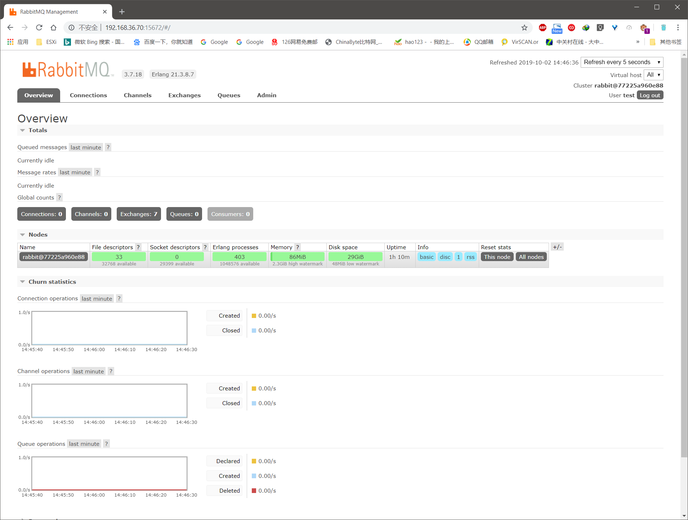

---
aliases:
- /archives/449
categories:
- Linux
date: 2019-10-02 06:49:08+00:00
draft: false
title: Fedora30安装RabbitMQ
---

研发需要，同时为了减轻后端的学习压力，业务上决定引入消息队列，不由自主想到了RabbitMQ。本篇文章记录RabbitMQ部署的过程


老规矩~

图0

**接下来开始正文~**


## 前言

**为什么业务中引入消息队列？**

不为什么，因为有些功能无法同时进行操作，否则会造成大量的IO请求。此时为了保障执行是顺序的 ，同时保障操作不会并发进行，再加上为了提高开发和上线速度，因此决定引入消息队列。这样一来，不仅可以减少研发投入，还可以更好地进行任务管理；再加上没有硬性实时响应的需求，因此此处引入消息队列是一个可靠的选择。

## 部署

### 环境

**系统**：Fedora 30 x86_64 （a980883231/ihc_fedora_cv:2.4）

**虚拟化环境**：Docker Container

**内核版本**：Linux 77225a960e88 5.1.18-200.fc29.x86_64

### 步骤

这些内容参考RabbitMQ官方的安装指南: https://www.rabbitmq.com/install-rpm.html


```bash
dnf update
dnf install erlang
dnf install socat
dnf install logrotate

rpm --import https://github.com/rabbitmq/signing-keys/releases/download/2.0/rabbitmq-release-signing-key.asc

cat > /etc/yum.repos.d/rabbitmq.repo << EOF
[bintray-rabbitmq-server]
name=bintray-rabbitmq-rpm
baseurl=https://dl.bintray.com/rabbitmq/rpm/rabbitmq-server/v3.7.x/el/7/
gpgcheck=0
repo_gpgcheck=0
enabled=1
EOF

dnf makecache
dnf install rabbitmq-server

echo "ulimit -S -n 4096" >> /etc/profile

systemctl start rabbitmq-server.service
systemctl enable rabbitmq-server.service
```


截至到这里，安装就已经完成了

此时，我们还需要配置这东西。由于rabbitmq-env中局部命令使用了特权，然而我容器又没有给这个权限，因此要手动删除这段，否则会报如下错误


```bash
env: ‘hostname’: Permission denied
```


具体删除方法是，使用如下命令打开该文件


```bash
vim /usr/lib/rabbitmq/lib/rabbitmq_server-3.7.18/sbin/rabbitmq-env
```


在打开的文件中，定位到第148和151行附近（我是依靠修改过的来找的，未修改的可能有几行差异，需要自行对比下方图1）。修改内容如下图1，删除**RABBITMQ_NAME_TYPE**下方的一个语句（共两处，我已经删除了）。然后将NODENAME的@后手动修改为主机名，即在**/etc/hostname**文件中。当修改完此处后，rabbitmq-env执行就不会报没有权限了，连带rabbitmqctl也可以正常使用



图1. 改动

如下图2，可以看到正常执行了



图2. 正常执行

紧接着，再使用如下命令打开WebUI即可


```bash
rabbitmq-plugins enable rabbitmq_management
```


然后添加全局管理员，并给其权限，如下图3



图3. 添加用户并分配权限

命令如下，administrator即用户类型，按需给即可


```bash
rabbitmqctl add_user <username> <password>
rabbitmqctl set_user_tags <username> administrator
```


然后登录WebUI默认的管理端口为15672，即可看到如下图4的内容



图4. WebUI

此时，新建的用户还没有默认Virtual Host /的访问权限，因此还需要将用户分配该Virtual Host的访问权限，如下命令即可


```
 rabbitmqctl  set_permissions -p /  test '.*' '.*' '.*'
```


后续研发工作直接套相关SDK等即可