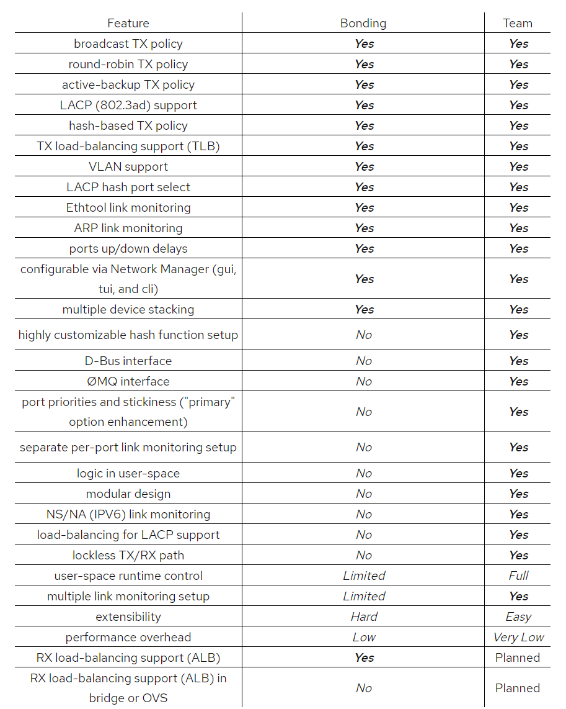

---
aliases:
- /archives/497
categories:
- 网络基础
date: 2019-11-13 06:48:54+00:00
draft: false
title: Linux虚拟网络接口模型概述
---

没有过多了解过Linux的虚拟网络接口，也只了解和使用过macvlan和ipvlan，但是持续使用的是常用模式（bridge和l2），直到看到RH的一篇文章才直到原来模型和模式还有好多种，特此介绍一下

老规矩~

接下来开始正题~

## 简介

Linux的虚拟网络接口（Linux interfaces for virtual networking）非常丰富，是vm和容器网络的基础。总共有如下几种：

  * Bridge
  * Bonded interface
  * Team device
  * VLAN (Virtual LAN) 
  * VXLAN (Virtual eXtensible Local Area Network)
  * MACVLAN
  * IPVLAN
  * MACVTAP/IPVTAP
  * MACsec (Media Access Control Security)
  * VETH (Virtual Ethernet)
  * VCAN (Virtual CAN)
  * VXCAN (Virtual CAN tunnel)
  * IPOIB (IP-over-InfiniBand)
  * NLMON (NetLink MONitor)
  * Dummy interface
  * IFB (Intermediate Functional Block)
  * netdevsim

本文围绕这些网络接口模型展开介绍

## 接口类型

### Bridge

图1. bridge

和交换机比较类似，bridge同样也是在接口间进行转发（即连接所有接口）。用于在不同vm、容器间转发流量。同时，bridge也支持STP和VLAN过滤等

如果非要对比switch和bridge有什么区别的话，个人觉得，switch更像是一个混合的bridge，每个vlan对应一个bridge，通过vlan id（或者vlan table）将层层的bridge分隔开。参照一些文档讲，交换机就是带缓冲的多端口的桥，并且效率和性能较高，可以在转发数据之前对其进行错误检查。

### Bonded interface

图2. bonded interface

即L2链路聚合。可以用来做热备或者负载平衡，讲多组逻辑链路捆绑成为一个大带宽的虚链路，提高容量和可靠性

### Team device

图3. team device

Team device和bonded的不同之处，在于team得到的虚链路的带宽并不会提升，而bonding则是同时使用两个管道进行传输，带宽会得到提升。

至于完整的特性对比，可以参考下图

图4. team和bonding特性对比

因此结合上表来看，使用bonding的情况下，由于其支持TLB和ALB，因此得到的虚链路可以聚合链路的容量，然而team由于并不支持ALB，因此也只能实现发送链路容量的增加，并没有办法提高接收链路容量（即单向）

### VLAN

图5. vlan

VLAN，即Virtual LAN，较为常用，一般用于分离广播域。其不同的VLAN ID对应不同的VLAN区域，广播域都隔离，如果需要跨VLAN通信只能通过路由方式解决（即L2向L3）

### VXLAN

图6. vxlan

VXLAN，Virtual eXtensible Local Area Network，即虚拟可扩展局域网，是SDN技术比较常用的一个方式。主要用于边缘用户接入使用，通过VNI标记VXLAN端口，由于VLAN ID最多只能有4096个，QinQ方式的情况下才能实现1600万左右的租户接入（配置麻烦），但是VNI使用的24bit标识，无需Tag Stack即可实现1600万左右的租户接入（VLAN ID也是12bit，QinQ情况下可以理解成和VNI一样的标识范围）

vxlan网关对所有的数据进行解封装后，可以结合SDN实现扁平化组网和大二层网络

### MACVLAN

图7. macvlan

macvlan，即通过MAC划分广播域。玩过openwrt多拨的应该都知道，其原理就是macvlan

macvlan共有3种模式：

#### Private Mode

图7. macvlan private

即不同macvlan间全部隔离，不允许互相访问。隔离方式为二层内隔离

#### VEPA Mode

图8. vepa mode

允许互通，但是所有二层流量必须走到父接口之上才可以，父接口内不予以进行转发。上联的设备需要支持Hairpin（发卡模式， 802.1Qbg），否则按照默认的规则，帧是不会回传到入口的接口，将会导致无法通讯。

同时，这种情况下一定要确保除了父接口的上联支持hairpin之外，其他的接口都不能开启。一旦父接口开启了hairpin，arp请求将会在父接口和上联交换间泛洪，造成重大事故。

#### Bridge Mode

图8. bridge mode

所有macvlan在父接口处完成forward，上联交换无法看到转发过程。此种方法的流量转发路径最短，性能最好，但是需要额外考虑安全问题

####  Passthru Mode

图9. passthru mode

允许单个虚拟机直接连接到物理接口，应该是单根虚拟化（SR-IOV）的方式。一个独立的物理网卡即为一个PF（Physical Function，物理功能），当其支持单根虚拟化时，该PF可以激活多个VF（Virtual Functions，虚拟功能），这些VF可以被直接直通进虚拟机，这样一来相当于所有的网络处理全部直接交给了硬件完成，借此提高性能。

### IPVLAN

图10. ipvlan

IPVLAN比较类似MACVLAN，只是MACVLAN使用MAC分割广播域，IPVLAN使用IP分割广播域而已。在IPVLAN中，所有的Endpoint均拥有相同的MAC地址

对于IPVLAN，分别有L2和L3模式

#### L2 Mode

图11. l2 mode

比较类似于MACVLAN的Bridge模式，转发均是通过父接口完成

#### L3 Mode

图12. l3 mode

在各个endpoint间使用L3路由来转发

### MACVTAP/IPVTAP

图13. MACVTAP/IPVTAP

比较类似于一个虚拟化的网桥，当MACVTAP/IPVTAP实例在物理接口上被创建时，内核将会自动创建TAP/TUN设备，可以直接对虚拟机使用。常规方式将会分别创建一个TAP/TUN设备和一个Bridge，使用MACVTAP/IPVTAP只会创建一个设备而已。

### MACsec

图14. macsec

比较类似于IPsec，只是MACsec在L2进行加密，可以保护ARP、DHCP、ND等众多请求

### VETH

图15. veth

VETH为一个本地的网络隧道，并且成对出现。主要用在跨网络命名空间的情况下数据的传输，其使用pipe管道的形式传输数据。由于veth要求设备必须成对出现，因此当一端断开后，另一端也会自动断开

剩下几种没怎么用过，只是看到了CAN支持（想当年这东西在我们RoboMaster电机和主控之间通讯用的还挺多）熟悉一点，目前没接触过这样的使用场景，因此后边的，不做解释了，需要的话自己查把

## 参考文献

1. https://developers.redhat.com/blog/2018/10/22/introduction-to-linux-interfaces-for-virtual-networking/
1. https://www.design-reuse.com/articles/32998/single-root-i-o-virtualization.html
1. https://www.redhat.com/en/blog/if-you-bonding-you-will-love-teaming
1. https://sysadminupdates.com/blog/2013/09/12/what-is-the-difference-between-nic-teaming-and-bonding/
1. https://www.geeksforgeeks.org/network-devices-hub-repeater-bridge-switch-router-gateways/