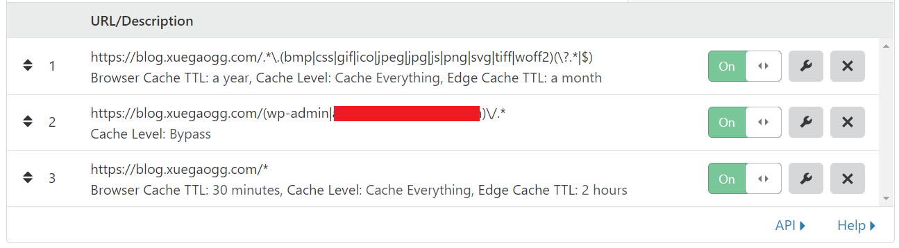

---
aliases:
- /archives/565
categories:
- 建站
date: 2019-12-08 04:54:08+00:00
draft: false
title: Cloudflare Page Rules针对博客优化缓存
---

本规则适用于大多网站，特定的BYPASS需要根据网站类型不同做一定的修改


首先，推荐一个不错的网站：regex101.com 。这个网站可以在线进行正则测试，同时会显示出来匹配的个数、步数、时间、每个组的详细和相关的提示内容，测试正则的不二之选~


## 标准规则

**注意：**标准规则亲测CF用不了，下方有cf专用的，可以看那个

### 匹配静态资源(bmp,css,git,ico,jpeg,jpg,js,png,svg,tiff,woff2)


```js
https:\/\/blog\.xuegaogg\.com\/.*\.(bmp|css|gif|ico|jpeg|jpg|js|png|svg|tiff|woff2)(\?.*|$)
```

### 匹配管理页面

```js
https:\/\/blog\.xuegaogg\.com\/(wp-admin|脱敏内容)\/.*
```


### 匹配全局

```js
https:\/\/blog\.xuegaogg\.com\/.*
```

## CF专用

### 匹配静态资源

使用该规则同时能匹配到这些静态资源扩展名结尾的（如下例1）和包含参数的（如下例2）

  * 例1： https://blog.xuegaogg.com/wp-includes/js/wp-emoji-release.min.js
  * 例2： https://blog.xuegaogg.com/wp-includes/js/wp-emoji-release.min.js?ver=5.3 

那么如果链接是类似于这样的【 https://blog.xuegaogg.com/wp-includes/js/wp-emoji-release.min.js/a 】会直接落回到匹配全局的规则中


```js
https://blog.xuegaogg.com/.*\.(bmp|css|gif|ico|jpeg|jpg|js|png|svg|tiff|woff2)(\?.*|$)
```


### 匹配管理页面


```js
https://blog.xuegaogg.com/(wp-admin|脱敏内容)\/.*
```


### 匹配全局


```js
https://blog.xuegaogg.com/*
```


最后配置完成后大概是这样的：




## 额外

至于为什么给全站上了一个缓存，唯独能解释的就是减轻源站的压力吧，毕竟博客更新不是很快的情况下，边缘缓存两个小时对于浏览者来说应该是能接受的，对博主来说（至少对我来说）也是可以接受的

## 一点小问题

全站缓存容易把管理员预览文章时的bar一起带上去（MVC的通病、、哎），想判断一下cookie加rule但是三个刚好又用完了，就这样吧，也算挺好了