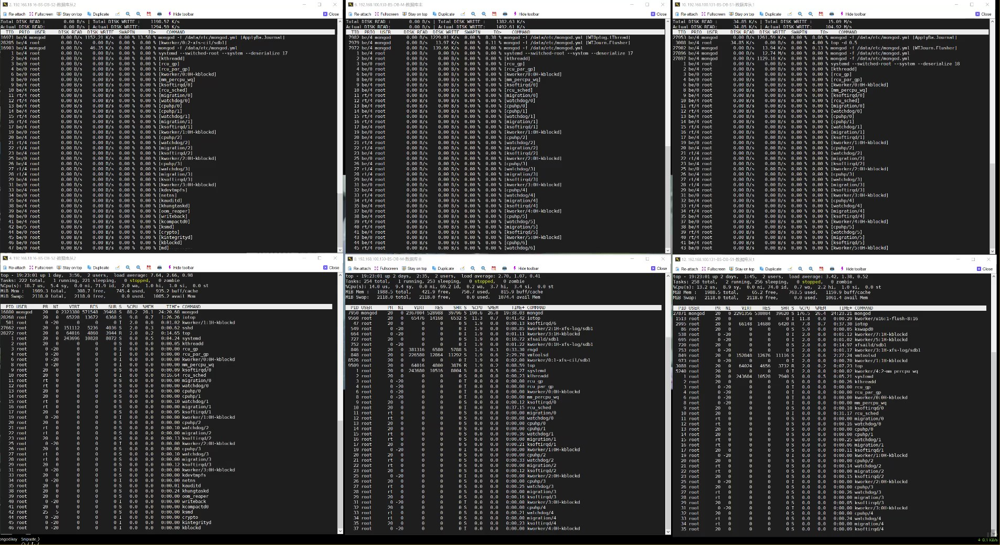
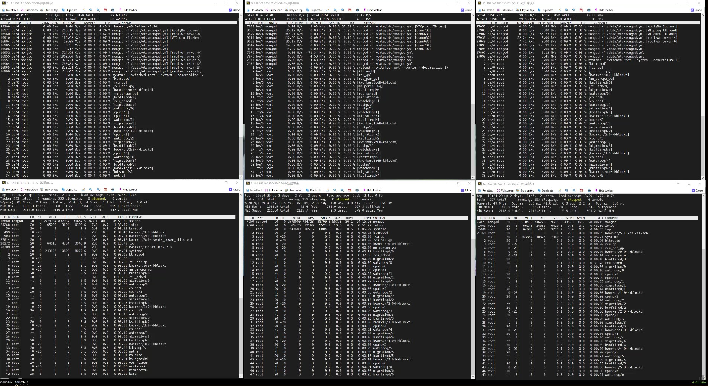
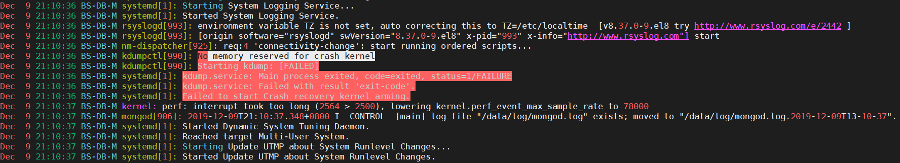

---
aliases:
- /archives/574
categories:
- Linux
date: 2019-12-10 05:00:04+00:00
draft: false
title: MongoDB性能分析
---

业务需要，数据库使用了MongoDB集群，集群状态全部正常，但是压测发现总是有一些问题，需要特别关注问题所在

下面开始正文~

集群当前总共有4个节点，同机房内1主1副1仲裁，跨机房还有1个冷备节点。昨天进行压力测试时发现主节点直接出现死机的情况，还好做压力测试时对所有终端的数据进行了同步录屏，相关记录还可以重新回放出来继续看

图1. 1分47秒时录屏

该录屏中共留个窗口，左侧为跨机房的冷备节点，中间为主几点，右侧为同机房热备。上图都为iotop，下图都为top

从图一中可以看到，在1分47秒时，主节点的CPU有69.2的空闲，IO等待时间比为0.2，持续观察可以看到内存持续在下降，IO等待时间比在0.3-2.0之间频繁波动，IO等待时间比大多都在1以上。左侧的冷备IO等待时间比甚至是一路飙上了7.0，但是CPU空闲有69

图2. 3分15秒时录屏

从图1到图2，可以看到所有的从节点在同步主节点时，内存是一路在下降😤😤😤。说明从节点的IO延迟也太高了，IO成了瓶颈，缓冲区的数据跟不上IO速度，导致内存里积压的数据越来越多。而主节点就比较惨了，内存下降速度更快，但是不知道为什么却迟迟没有触发页面交换，导致内存持续缩紧然后直接导致内核crash

图3. 事发后主节点的日志

如上图3，不知道为什么主节点在内存不足的情况下迟迟没有触发页面交换，导致在内存剩余80M的时候直接OOM然后kernel crash，具体原因未知，然而按照官方文档给出的是可以进行swap交换的，虽然会导致非常慢，但是至少服务器不会直接挂了

同时，wiredTiger引擎的cacheSizeGB我设置的为1G，服务器内存分配了2G，出问题后内存调整到40G的情况下进行压力测试主节点时不时开始卡死，但是至少不会出现OOM了。随着时间的迁移，从节点的内存压力在逐渐增加，IO满载导致内存不断积压，临近满时就阻塞了部分同步任务进而导致CPU使用率下降了。

那么总结起来，真正的元凶是——IO

