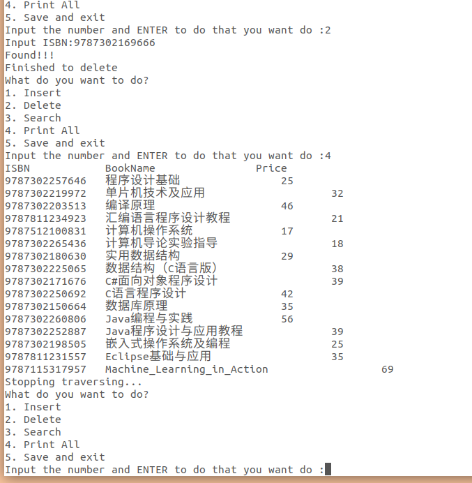
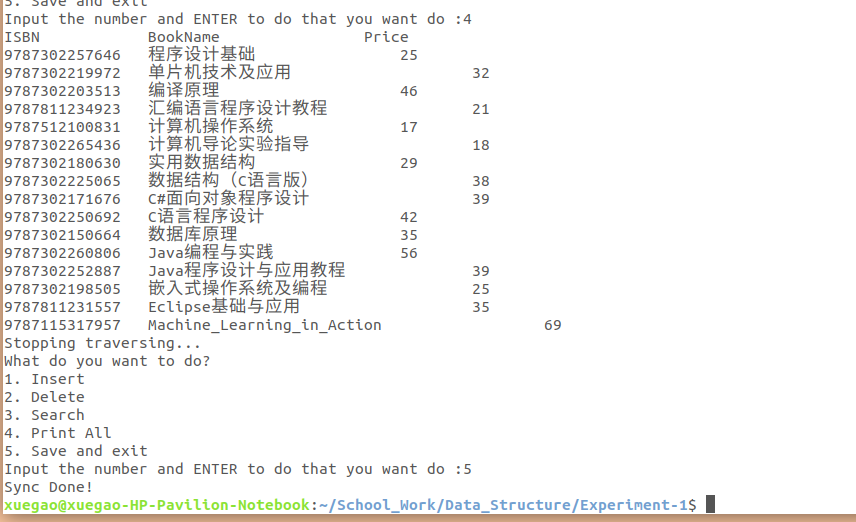
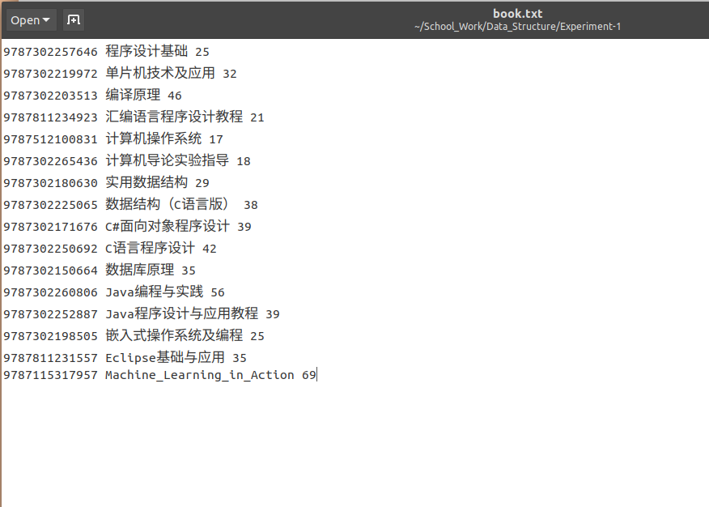

---
aliases:
- /archives/65
categories:
- 语言
date: 2018-10-11 09:42:13+00:00
draft: false
title: C语言链表实现图书管理系统
summary: 使用链表实现一个小的图书管理系统，有基础的增改删查功能。详细理了一下开发过程中的思路和收获
---

使用链表实现一个小的图书管理系统，要求有基础的增改删查功能

## 代码存放地址

代码放在了这里[^1]
[^1]: https://github.com/ic0xgkk/SchoolWork/

## 开发环境及说明

### 环境

Ubuntu 18 Desktop x64 + GCC 7.3.0 + Code Blocks

### 说明

1. 源码仅仅为**main.c**，图书列表为**book.txt** ，确保两个文件在同一目录下，不然执行会出错（没有写判断是否成功读取）
2. 代码已经经过测试目前没有发现问题，如有发现问题可以给我开issue或者PR
3. blog只阐述core功能方便后期回顾，代码可能会更新，请关注我的GitHub
4. 可能会存在Compiler版本不同出一些奇怪的问题，使用TDM-GCC和低版本GCC编译的话建议升级使用版本号7.0+的MinGW64或者GCC
5. **book.txt**文件只能按照此处提供的格式修改，否则可能会出错
6. 由于Windows和Linux系统对文字的编码方式不同以及换行符不同，此处的**book.txt**因为在Linux下所以使用的UTF8编码，直接在Windows中打开可能会中文乱码，具体可以使用Windows下的NotePad++转换成GBK编码
7. 此代码仅供学习参考，不做任何保证

## C语言基础

### Heap 和 Stack 之区别

以下内容引用自这里[^2]
[^2]: https://www.gribblelab.org/CBootCamp/7_Memory_Stack_vs_Heap.html

```text
Stack vs Heap
So far we have seen how to declare basic type variables such as int, double, etc, and complex types such as arrays and structs. The way we have been declaring them so far, with a syntax that is like other languages such as MATLAB, Python, etc, puts these variables on the stack in C.

The Stack
What is the stack? It's a special region of your computer's memory that stores temporary variables created by each function (including the main() function). The stack is a "LIFO" (last in, first out) data structure, that is managed and optimized by the CPU quite closely. Every time a function declares a new variable, it is "pushed" onto the stack. Then every time a function exits, all of the variables pushed onto the stack by that function, are freed (that is to say, they are deleted). Once a stack variable is freed, that region of memory becomes available for other stack variables.
The advantage of using the stack to store variables, is that memory is managed for you. You don't have to allocate memory by hand, or free it once you don't need it any more. What's more, because the CPU organizes stack memory so efficiently, reading from and writing to stack variables is very fast.
A key to understanding the stack is the notion that when a function exits, all of its variables are popped off of the stack (and hence lost forever). Thus stack variables are local in nature. This is related to a concept we saw earlier known as variable scope, or local vs global variables. A common bug in C programming is attempting to access a variable that was created on the stack inside some function, from a place in your program outside of that function (i.e. after that function has exited).
Another feature of the stack to keep in mind, is that there is a limit (varies with OS) on the size of variables that can be stored on the stack. This is not the case for variables allocated on the heap.
To summarize the stack:
the stack grows and shrinks as functions push and pop local variables
there is no need to manage the memory yourself, variables are allocated and freed automatically
the stack has size limits
stack variables only exist while the function that created them, is running

The Heap
The heap is a region of your computer's memory that is not managed automatically for you, and is not as tightly managed by the CPU. It is a more free-floating region of memory (and is larger). To allocate memory on the heap, you must use malloc() or calloc(), which are built-in C functions. Once you have allocated memory on the heap, you are responsible for using free() to deallocate that memory once you don't need it any more. If you fail to do this, your program will have what is known as a memory leak. That is, memory on the heap will still be set aside (and won't be available to other processes). As we will see in the debugging section, there is a tool called valgrind that can help you detect memory leaks.
Unlike the stack, the heap does not have size restrictions on variable size (apart from the obvious physical limitations of your computer). Heap memory is slightly slower to be read from and written to, because one has to use pointers to access memory on the heap. We will talk about pointers shortly.
Unlike the stack, variables created on the heap are accessible by any function, anywhere in your program. Heap variables are essentially global in scope.

Stack vs Heap Pros and Cons

Stack
very fast access
don't have to explicitly de-allocate variables
space is managed efficiently by CPU, memory will not become fragmented
local variables only
limit on stack size (OS-dependent)
variables cannot be resized

Heap
variables can be accessed globally
no limit on memory size
(relatively) slower access
no guaranteed efficient use of space, memory may become fragmented over time as blocks of memory are allocated, then freed
you must manage memory (you're in charge of allocating and freeing variables)
variables can be resized using realloc()
```

综上我们可以看到，常规的像**int，double，struct**等数据类型都是在Stack（栈区），变量由固定函数分配内存空间并且在内存中长度固定，这就使得能够实现LIFO队列进而使得操作更加简单，函数结束后分配的内存会被自动释放，运行速度也很快；缺点是无法手工分配内存并且内存使用有大小限制，变量在函数结束会被释放，因此只能在当前函数内使用

相反地，Heap（堆区）的数据则可以手工分配并且不会随着函数结束而被释放！！！正因如此，此链表才能循环使用data变量的内存空间，因为他并没有在函数结束时被释放掉！（释放掉的是data这个指针，指针指向一个内存地址）并且，使用Heap没有内存大小限制，内存操作也相对比较灵活，并且，在任何位置都可以操作（前提是你留的有备份的指针）！！！

### 特别注意

1. 指针指向的是内存地址，所以sizeof返回的而是一个指针的大小而不是对应的内存空间大小！
2. 函数结束会释放掉声明的指针（在Stack），但是指针指向的malloc分配的那块区域（在Heap）并没有被释放
3. 正因为Heap区无内存大小限制，在循环分配时特别注意一定要释放掉无用区域，否则指针一旦丢失不但无法释放内存并且会导致内存泄露
4. 养成好习惯，对任何变量和内存区域都进行初始化，可以使用memset或者bzero操作
5. 指针指向的数据段操作常规IDE无法直接看到，需要dump出指向的内存中的数据以查看

### 部分函数说明

可以在Linux下使用man命令来查看[^3]
[^3]: https://linux.die.net/man/3/malloc

```text
Name
malloc, free, calloc, realloc - allocate and free dynamic memory

Synopsis
#include <stdlib.h>

void *malloc(size_t size);
void free(void *ptr);
void *calloc(size_t nmemb, size_t size);
void *realloc(void *ptr, size_t size);
Description
The malloc() function allocates size bytes and returns a pointer to the allocated memory. The memory is not initialized. If size is 0, then malloc() returns either NULL, or a unique pointer value that can later be successfully passed to free().

The free() function frees the memory space pointed to by ptr, which must have been returned by a previous call to malloc(), calloc() or realloc(). Otherwise, or if free(ptr) has already been called before, undefined behavior occurs. If ptr is NULL, no operation is performed.

The calloc() function allocates memory for an array of nmemb elements of size bytes each and returns a pointer to the allocated memory. The memory is set to zero. If nmemb or size is 0, then calloc() returns either NULL, or a unique pointer value that can later be successfully passed to free().

The realloc() function changes the size of the memory block pointed to by ptr to size bytes. The contents will be unchanged in the range from the start of the region up to the minimum of the old and new sizes. If the new size is larger than the old size, the added memory will not be initialized. If ptr is NULL, then the call is equivalent to malloc(size), for all values of size; if size is equal to zero, and ptr is not NULL, then the call is equivalent to free(ptr). Unless ptr is NULL, it must have been returned by an earlier call to malloc(), calloc() or realloc(). If the area pointed to was moved, a free(ptr) is done.

Return Value
The malloc() and calloc() functions return a pointer to the allocated memory that is suitably aligned for any kind of variable. On error, these functions return NULL. NULL may also be returned by a successful call to malloc() with a size of zero, or by a successful call to calloc() with nmemb or size equal to zero.

The free() function returns no value.

The realloc() function returns a pointer to the newly allocated memory, which is suitably aligned for any kind of variable and may be different from ptr, or NULL if the request fails. If size was equal to 0, either NULL or a pointer suitable to be passed to free() is returned. If realloc() fails the original block is left untouched; it is not freed or moved.

Conforming To
C89, C99.
```


* malloc函数，传入要分配的内存空间大小的数值，返回分配的Heap区域的空间的起始内存地址
* free函数，传入分配的内存地址，来释放掉这块区域
* calloc函数，传入nmemb作为元素数量，传入size作为每个元素的内存空间，传出Heap区分配的空间的起始内存地址
* realloc函数，传入分配的内存地址和改变后的内存区域大小，传出一个新的指针指向新分配的空间的起始内存地址

比较有用的函数


```text
NAME    
       bzero, explicit_bzero - zero a byte string
SYNOPSIS      
       #include <strings.h>

       void bzero(void *s, size_t n);

       #include <string.h>

       void explicit_bzero(void *s, size_t n);
DESCRIPTION       
       The bzero() function erases the data in the n bytes of the memory
       starting at the location pointed to by s, by writing zeros (bytes
       containing '\0') to that area.

       The explicit_bzero() function performs the same task as bzero().  It
       differs from bzero() in that it guarantees that compiler
       optimizations will not remove the erase operation if the compiler
       deduces that the operation is "unnecessary".
RETURN VALUE     
       None.
```


* bzero函数，传入一个指针和数据长度，将这段长度的内存空间全部置0x0


```text
Name
memset - fill memory with a constant byte
Synopsis
#include <string.h>
void *memset(void *s, int c, size_t n);
Description
The memset() function fills the first n bytes of the memory area pointed to by s with the constant byte c.
Return Value
The memset() function returns a pointer to the memory area s.
Conforming to
SVr4, 4.3BSD, C89, C99, POSIX.1-2001.
```


* memset函数，内存中的数据置为某个指定值，传入一个指针，形式参数c为要置为的数值（0的话即与bzero功能相同），还有一个长度参数

## 代码段

此处代码是分块的，完整版的详见上述我的GitHub

### 单链表的两种处理方式

目前我能想到的是这两种单链表的处理方式

#### 1. 备份头指针，使用结构体自身进行遍历

此文章我写的代码就是以这种思路写的，首先看一下结构体和全局变量的定义


```c
struct Books{
    uint64_t ISBN;
    char BookName[128];
    uint32_t PRICE;
    struct Books *next;
};
void *backup_header=NULL;
struct Books *head=NULL;
```


再来看一下后续插入操作的代码


```c
head->next=data;
data->ISBN=isbn;
strcpy( data->BookName, bookname );
data->PRICE=price;
head=data;
head->next=NULL;
```


这种处理方式就是将链表的头指针备份起来，备份头指针地址的变量为**backup_header**，**head**则负责在代码中循环遍历和操作数据，遍历结束如果需要从头开始的话就从备份的头指针中取出备份的地址即可，相比第二种办法的话，这种每次遍历完**head**指针会停留在链表尾部，追加操作会较为方便

#### 2. 保持头指针不动，操作时复制头指针进行遍历再操作

另外一种思路就是得到头指针后就不动这个头指针，如需追加数据或者查找等操作时，直接重新定义一个新指针并且取头指针的地址，此种相对于第一种的话，追加操作每次都需要进行遍历，要从头跑到屁股后才能进行追加；优点的话，相对简单一些

### 读取操作

```c
f=fopen("book.txt","r");
    while(!feof(f))
    {
        char tmp[512];
        uint64_t isbn;
        uint32_t price;
        char bookname[128];
        memset(tmp, 0, sizeof(tmp));
        fgets(tmp, sizeof(tmp)-1, f); // 包含了换行符
        if( strlen(tmp) < 14 ) //　此处手动感谢TUNA成员帮我查出了读入空行的bug
        {
            break;
        }
        sscanf(tmp, "%lu%s%u\n",&isbn, bookname, &price);
        insert_b(isbn,bookname,price); //插入函数，请看下边
    }
    finished_loading=true;
    fclose(f);
```


上述代码将**book.txt**进行逐行读取，sscanf是从流中读取，即Stream-Scanf，将字符流按照指定格式进行读取（可以理解成字符流格式化输入），遇到空行即停止

### 插入操作

```c
void insert_b(uint64_t isbn, char bookname[], uint32_t price)
{
    struct Books *data;

    int tz=sizeof(struct Books);
    data=(struct Books *)malloc(tz);
    memset(data,0,tz);
    if(data==NULL)
    {
        printf("Malloc failed.\n");
        exit(-1);
    }

    if(head==backup_header && finished_loading==true)
    {
        while(1)
        {
            if(head->next==NULL)
            {
                break;
            }
            else
            {
                head=head->next;
                continue;
            }
        }
    }

    if(head==NULL)
        head=data;

    if(backup_header==NULL && finished_loading==false)
    {
        backup_header=head;
    }

    head->next=data;
    data->ISBN=isbn;
    strcpy( data->BookName, bookname );
    data->PRICE=price;
    head=data;
    head->next=NULL;
}
```

此处传入了三个参数为书目的基本信息，此处插入操作我们将会把书目信息插入到链表中去，一步一步来看：

1. 第3行处先定义了一个指针，后续用来接收malloc传过来的分配的内存地址
2. 第6-7行分配内存空间（Heap）并且全部置零
3. 第8行的判断是因为文档提到malloc如果返回NULL的话即为错误，错误信息可以使用Linux下的API函数strerror重定向至Terminal，此处不再赘述
4. 第14-28行，当**backup_header**备份的头指针和head相同时并且文件加载已经完成，则说明此链表只有一个元素，跳出以进行后续操作，否则则继续？？？我写的这什么鬼来着。。我也忘了
5. 第33-36行备份头指针
6. 最后将链表连起来，将上一个链表的next指向后继元素，再将后继元素的next指向NULL，最后将head指针指向后移，方便下一次操作

### 搜索和输出全部

```c
void search_b(void)
{
    bool found=false;
    head=backup_header;

    printf("Search Mode:\n");
    printf("Input ISBN:");
    uint64_t isbn;
    scanf("%lu", &isbn);

    while(1)
    {
        if(head->next==NULL)
        {
            if(isbn==head->ISBN)
            {
                printf("Found!!!\n");
                printf("ISBN\t\tBookName\t\tPrice\n");
                printf("%lu\t\t%s\t\t%u\n\n",head->ISBN,head->BookName,head->PRICE);
                found=true;
                head=head->next;
                break;
            }
            printf("Stopping traversing...\n");
            if(found==false)
            {
                printf("Not found!!!\n");
            }
            break;
        }
        else
        {
            if(isbn==head->ISBN)
            {
                printf("Found!!!\n");
                printf("ISBN\t\tBookName\t\tPrice\n");
                printf("%lu\t\t%s\t\t%u\n\n",head->ISBN,head->BookName,head->PRICE);
                found=true;
                head=head->next;
                break;
            }
            else
            {
                head=head->next;
                continue;
            }
        }
    }
}

void print_all(void)
{
    head=backup_header;
    printf("ISBN\t\tBookName\t\tPrice\n");
    while(1)
    {
        if(head->next==NULL)
        {
            printf("%lu\t%-2s\t\t%6u\n",head->ISBN,head->BookName,head->PRICE);
            printf("Stopping traversing...\n");
            break;
        }
        else
        {
            printf("%lu\t%-2s\t\t%6u\n",head->ISBN,head->BookName,head->PRICE);
            head=head->next;
        }
    }
}
```


说白了就是遍历然后格式化输出到终端窗口

### 删除操作

```c
void delete_b(void)
{
    head=backup_header;
    uint64_t isbn=0;
    bool exist=false;
    printf("Input ISBN:");
    scanf("%lu",&isbn);

    while(1)
    {
        if(head->ISBN==isbn)
        {
            void *tmp=head;
            head=head->next;
            free(tmp);
            exist=true;
            backup_header=head;
            break;
        }
        if(head->next->ISBN==isbn)
        {
            void *tmp=head->next->next;
            free(head->next);
            head->next=tmp;
            exist=true;
            break;
        }
        else
        {
            if(head->next==NULL)
            {
                break;
            }
            head=head->next;
        }
    }

    if(exist==true)
    {
        printf("Found!!!\nFinished to delete\n");
    }
    else
    {
        printf("Not found!!!\n");
    }

}
```


遍历比较输入的ISBN，遇到相同的则把当前节点删除，具体操作分为两类，当目标节点在头部和在除了头部的其他位置

#### 在头部

当节点在头部时，直接将指针指向下一个节点，并且修改备份的头指针使其生效

#### 在非头部

判断下一个节点的ISBN是不是要删除的ISBN，是的话备份下个节点的下个节点的地址，然后释放掉下个节点，并将原本的指向下个节点的指针指向下下个节点即可

### 同步到文件

```c
void write_file(void)
{
    FILE *ff=fopen("book.txt","w");
    uint16_t num=0;
    head=backup_header;
    while(1)
    {
        if(head->next==NULL)
        {
            num++;
            break;
        }
        else
        {
            num++;
            head=head->next;
        }
    }
    head=backup_header;

    uint64_t mem_size=sizeof(struct Books)*num;
    char *fls=(char *)malloc(mem_size);
    bzero(fls, mem_size);
    char *tmp=(char *)malloc(sizeof(struct Books));
    bzero(tmp, sizeof(struct Books));
    while(1)
    {
        if(head->next==NULL)
        {
            bzero(tmp, sizeof(struct Books));

            snprintf(tmp, sizeof(struct Books), "%lu %s %u\n",head->ISBN, head->BookName, head->PRICE);
            strcat(fls, tmp);

            break;
        }
        else
        {
            bzero(tmp, sizeof(struct Books));

            snprintf(tmp, sizeof(struct Books), "%lu %s %u\n",head->ISBN, head->BookName, head->PRICE);
            strcat(fls, tmp);

            head=head->next;
            continue;
        }
    }
    free(tmp);

    fprintf(ff, "%s",fls);
    free(fls);

    fclose(ff);

    printf("Sync Done!\n");
    exit(0);

}
```


此处，snprintf函数是将流格式化输出到新的流中

因为不知道有多少个节点，因此直接遍历一遍计算出节点数，使用**struct Book**的大小和节点数乘积 去分配新的内存空间（肯定是够用的）去存储格式化后的文件内容的流，将每个节点的数据格式化输出成一行并且依次连接到fls流的尾部，以便拼合成完整的**book.txt**的内容，最后使用fprintf将完整的字符流格式化输出到文件流中即可

### 测试一下看看

此处，我插入了一条**Machine_Learning_in_Action**的记录，再完整输出可以看到已经加到尾部了  



再来删除一条ISBN为9787302169666的记录，然后输出全部，我们可以看到已经成功删除了  


最后，将其同步到文件，可以看到操作成功了



再来打开文件看看，好的没毛病



至于为什么输出到终端那么乱的话，是因为书名长度不固定导致的，使用制表符仍然会有偏差，虽然可以通过计算字符串长度来使用空格进行补齐，但是我懒得写了

好了，差不多写完了我要去吃午饭了。
