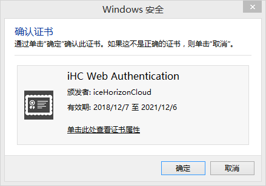

---
aliases:
- /archives/71
categories:
- Linux
date: 2018-12-08 10:04:00+00:00
draft: false
title: 自签发证书配置Nginx客户端认证
---

由于部分业务安全敏感程度略高，使用密码认证相对来说又有些low，故此处配置SSL客户端认证来进行身份验证

## 自签发证书

操作系统为CentOS7 。先创建个文件夹，干净些


```bash
# mkdir private
# cd private
```


### 自签发CA

```bash
# openssl genrsa -des3 -out ./ca.key 4096
```


提示输入口令时输入设定的口令

签发3年有效期的CA（1095天）


```bash
# openssl req -new -x509 -days 1095 -key ./ca.key -out ./ca.crt
```


期间会提示输入CA Key的口令等


```bash
Enter pass phrase for ./ca.key:
You are about to be asked to enter information that will be incorporated
into your certificate request.
What you are about to enter is what is called a Distinguished Name or a DN.
There are quite a few fields but you can leave some blank
For some fields there will be a default value,
If you enter '.', the field will be left blank.
-----
Country Name (2 letter code) [XX]:城市名称
State or Province Name (full name) []:街道或者省
Locality Name (eg, city) [Default City]:具体位置
Organization Name (eg, company) [Default Company Ltd]:组织名称
Organizational Unit Name (eg, section) []:部门
Common Name (eg, your name or your server's hostname) []:通用名称（重要）
Email Address []:邮箱
```


这一步完成后，就完成了CA的自签发，不过很可惜因为这个CA是我们自己签发的，并不像公共CA一样在系统中默认就被信任了，所以我们还要将CA证书导入Windows的信任的颁发机构中，后续使用此CA签发的证书才能够被系统信任

### 修改OpenSSL配置文件

此处，我先将OpenSSL的配置文件备份到了当前目录下并且创建了副本再修改，保证生成的文件全部在一个目录中


```bash
# cp /etc/pki/tls/openssl.cnf .
# cp ./openssl.cnf ./openssl.cnf.bak
# vim openssl.cnf
```


手动修改openssl.cnf中的dir位置到当前目录，改成下边这样的


```bash
[ CA_default ]

dir             = /usr/local/nginx/conf/ssl/private             # Where everything is kept
```


然后将openssl.cnf复制到原本的目录中


```bash
# cp openssl.cnf /etc/pki/tls/
cp: overwrite ‘/etc/pki/tls/openssl.cnf’? y 
# openssl ca -name CA_default -gencrl -keyfile ./ca.key -cert ./ca.crt -out ./ca.crl -crldays 1095
```


输入CA口令


```bash
/usr/local/nginx/conf/ssl/private/index.txt: No such file or directory
unable to open '/usr/local/nginx/conf/ssl/private/index.txt'
140148921628560:error:02001002:system library:fopen:No such file or directory:bss_file.c:402:fopen('/usr/local/nginx/conf/ssl/private/index.txt','r')
140148921628560:error:20074002:BIO routines:FILE_CTRL:system lib:bss_file.c:404:
```


提示错误，不小心漏了index.txt文件和吊销列表，执行下面的就可以了


```bash
# touch index.txt
# echo '01' > ./crlnumber
```


然后再执行刚刚的命令，使用自签发的CA生成吊销证书列表


```bash
# openssl ca -name CA_default -gencrl -keyfile ./ca.key -cert ./ca.crt -out ./ca.crl -crldays 1095
```


成功

### 签发用户证书

接下来为用户生成用户证书，为了方便区分用户证书和CA，我创建了user-ssl文件夹将用户证书放在该目录下


```bash
# openssl genrsa -des3 -out ./user-ssl/mgr.key 4096
Generating RSA private key, 4096 bit long modulus
..................++
..................................................................................................................................++
e is 65537 (0x10001)
Enter pass phrase for ./user-ssl/mgr.key:
Verifying - Enter pass phrase for ./user-ssl/mgr.key:
# cd ./user-ssl
# openssl req -new -key mgr.key -out mgr.csr
Enter pass phrase for mgr.key:
You are about to be asked to enter information that will be incorporated
into your certificate request.
What you are about to enter is what is called a Distinguished Name or a DN.
There are quite a few fields but you can leave some blank
For some fields there will be a default value,
If you enter '.', the field will be left blank.
-----
Country Name (2 letter code) [XX]:城市名称
State or Province Name (full name) []:街道或者省名
Locality Name (eg, city) [Default City]:位置
Organization Name (eg, company) [Default Company Ltd]:组织名称
Organizational Unit Name (eg, section) []:部门
Common Name (eg, your name or your server's hostname) []:通用名称
Email Address []:邮箱

Please enter the following 'extra' attributes
to be sent with your certificate request
A challenge password []:不用填即可
An optional company name []:不用填即可
```


完成了证书请求（csr）后接下来再去使用CA签发证书即可


```bash
# openssl x509 -req -days 1095 -in ./mgr.csr -CA ../ca.crt -CAkey ../ca.key -CAserial ../serial -CAcreateserial -out ./mgr.crt
Signature ok
xxxxxxxxxxxx此处内容省略xxxxxxxxxxxxxxx
Getting CA Private Key
Enter pass phrase for ../ca.key:
```


至此签发用户证书完成，所有签发的证书务必留好记录并且定期查验！谨慎签发，如有问题证书需要及时在CA做吊销处理，避免证书被不法利用


```bash
# ls
mgr.crt  mgr.csr  mgr.key
# ls -a ..
.  ..  ca.crl  ca.crt  ca.key  crlnumber  crlnumber.old  index.txt  openssl.cnf  openssl.cnf.bak  serial  user-ssl
```


此时我们就可以看到用户证书

最后，还需要把证书导出，亲测直接把客户端crt导入Chrome并无用……还需要导出成p12证书（私钥）才可以


```bash
# openssl pkcs12 -export -clcerts -in mgr.crt -inkey mgr.key -out mgr.p12
Enter pass phrase for mgr.key: 输入客户端证书口令
Enter Export Password: 为空即可
Verifying - Enter Export Password: 为空即可
# ls
mgr.crt  mgr.csr  mgr.key  mgr.p12
```


将生成的p12证书导入浏览器即可

## 配置Nginx客户端认证

找到相应的vhost配置文件，在server中加入下面几行即可（建议使用Let’s Encrypt做HTTPS，当然有EV可以用EV，自签发证书做客户端验证）


```bash
ssl_client_certificate /xxxxxxx/ca.crt;
ssl_crl /xxxxxxx/ca.crl;
ssl_verify_client on;
```


然后重新启动nginx即可（生产环境不要restart）


```bash
service nginx restart
```


最后记得还原openssl.cnf，直接使用备份的文件去覆盖即可


```bash
cp ../openssl.cnf.bak /etc/pki/tls/openssl.cnf
```


为了方便管理，我将nginx的目录索引也打开了，在nginx中加入下述配置


```nginx
location ~ {
    autoindex on;
    autoindex_localtime on;
    autoindex_exact_size off;
}

```


干脆把HSTS也加上去好了


```bash
add_header Strict-Transport-Security "max-age=31536000; includeSubDomains" always;
```


## 效果

将用户证书导入证书库的`个人`中，将自签发的CA也导入受信任的颁发机构，保证系统信任自签发的用户证书，然后去浏览页面时会自动弹出证书认证请求



两次授权后就可以正常使用~