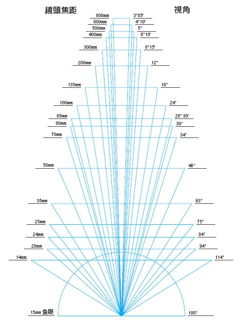
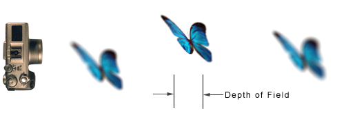

---
aliases:
- /archives/716
categories:
- 摄影
date: 2020-01-12 06:01:01+00:00
draft: false
title: 摄影入门——单反选择之争
---

作为入门摄影的新人，第一件事务必就是选择一款心仪的单反，这个选择对于选择困难症的人群来说必定是艰辛的，所以一边整理资料一边寻找适合自己的

## 前言

截至到最后一次更新时，博主我的索法A7M2已经到手了。对于博主我这种几乎完全不会用上录像的（一般录像的话我就直接用飞机录了，还有云台），考虑了许久后觉得A7M2是最佳选择。一方面，7k左右是残幅和全幅的分水岭，个人觉得同等价位的情况下，既然要做后期，底质就要靠谱，就算不做后期，底质好一些看起来也舒服，因此就上了这款老机。

就目前已经使用了一周了将近，谈几点感受：

  * 机身防抖。说真的，这个功能，我现在好像并没有发现用处到底有多大。前几天有打算入一个50mm f/1.9定焦镜，看参数不支持镜头防抖，不过1/50的安全快门+大光圈应该快门可以拉到更短了，阉割掉一些防抖觉得也说得过去。那么有机身防抖的情况下，至少能够补偿两轴还是三轴的防抖，因为没有实际比对过，因此我也不好说效果
  * 边缘偏绿。据说是索法A7M3之前所有机器的共性问题，（只限）强光出现在边缘区域时成像会偏绿色，还是挺明显的，对这个介意的建议加钱买A7M3。
  * 不支持静音快门。虽然感觉好像也没什么，但是在全景拍摄的时候就感觉很明显了。单张拍摄的时候咔嚓一下觉得还好，全景拍摄的时候会不停连续拍，因此就一直咔嚓咔嚓咔嚓，听着就很蛋疼。。。
  * 夜拍画质，觉得真的牛逼。当然这个真的牛逼是对比手机的而言，对比残幅机我也不清楚，还没有和朋友的残幅出去外拍对比过。至少对比手机的相机来说，夜拍ISO同样调整到2000的情况下，手机的黑色成像区域噪点已经多到眼瞎的，但是A7M2的看着黑色仍然还是相当干净的
  * APP还挺多的，虽然我不用。淘宝10块钱可以直接买全套app，随便装随便用，和机器绑定。万能的淘宝
  * 个人觉得电池还挺够用的。连续两天外拍，两天电池都没有充电，能够完整支撑两天，还是足够的。最重要的是，索法的相机可以直接用MicroUSB的线加充电宝给相机充点，如果真的没电了，可以拿充电宝撑一会
  * OLED屏幕不能180度翻转，只能向上110度左右-向下45度左右翻转（极限），所以说如果是举高的情况下，可能就看不到屏幕了
  * 色差明显的地方对焦还是挺快的。说真的，这对焦速度我觉得够用了，因为我个人外拍时比较偏向风光摄影和人像，大多数情况下都是以手动对焦为主（因为要做后期），人像静态的脸部对焦速度不错的够用了，动态人像直接手动调焦做陷阱对焦即可

总结一下，评价这个相机的话，至少我觉得这价位上一个老机全画幅，还是挺划算的。当然这个也要根据自身需求来评定，有的人摄影的类别不一样，适合自己的才是最好的~要评估自己的需求点，然后去寻找最合适的解决需求的办法

## 关注点

我们把关注点分开，分别讨论镜头和机身

建议买相机和镜头的时候，去查查相关的数据，可以去这里：www.dxomark.com

### 机身

#### 价位

好了这个就不解释了。不过有句话说的好，只有穷人才考虑性价比，所以作为一个穷人，认真选择一个单反还是比较重要的嗯

#### 画幅和焦距

镜头也分为全幅镜头和半幅镜头，全幅镜头可以装在半幅机上，半幅镜头是不能装在全幅机上的（我这个索法可以，但是画面会剪裁）。

半幅机上，镜头焦距都要乘以1.5的系数转换，我们称之为等效焦距。因此，半幅机在同样视角的情况下需要的焦距更短，在用同一只镜头的情况下，半幅机能够看得更远，但是会损失一定的视野。

在网上看到了一张图

由于残幅相比全副存在等效焦距系数，因此视角度数会有一定的损失。假定全幅机镜头焦距14mm，视角为114度，残幅机的实际焦距为21mm（假定等效焦距系数为1.5，该系数不同牌子的可能会有一定差异），视角为94度偏高一点，损失了20度的视角。

以索法的两个机器对比，套机（标准镜头）焦距分别为

  * Alpha 6400 APS-C：16-50mm
  * Alpha 7 II A7M2 全画幅：27-70mm

索尼的等效焦距系数为1.5，因此残幅机的焦距对比全副机实际应该是24-75mm和27-70mm，短焦损失了3mm，缺额外获得了5mm的长焦，由于等效后短焦差别不大因此视角不会存在很大差别

当然，极限的焦距大小也是会有代价的。比如超广角（超小焦距）会造成成像边缘畸变；而超长焦则会造成距离压缩，而且用光需要更加注意。

#### 机身防抖

为什么要把机身防抖也纳入一个参考指标呢，因为我觉得还是有一定的必要的。防抖决定了你的安全快门，在极限情况下，这一防抖功能可以让你获得更加长的安全快门，从而减少画质问题

#### 像素

像素就不多说了，不过以手机和相机的像素作为对比，一加5的像素为1600万（广角）和2000万（长焦），单反的像素也差不多偏高一些（2430万左右），好像也差不是很多。当然人民币玩家可以去烧哈苏的1亿像素

#### 感光度

感光度标准一般使用ISO的感光度标准，因此相机中会有一个ISO范围，用来表示传感器对光线的敏感程度。

感光度较高时，表示对光线的敏感度较高，在暗光拍摄的情况下会比较有帮助；感光度偏低时则需要调大光圈或者拉长快门来改善暗处细节

在光圈恒定的情况下，感光度和曝光度有一个联系，即低感光时需要长时间曝光，高感光时需要短时间曝光。在一些场景中，为了防止闪光灯破坏色彩，需要依靠感光度来捕捉弱光。在明亮的环境中，较高的感光度可以使得传感器短时间即可捕获大量的光线，从而加快快门速度，对于运动镜头来说，过长的曝光时间会导致成像重影

但是，低感光长曝光可以使得影像品质清晰并且锐利，高感光情况下光线的影响因素也逐渐增加，最明显的就是暗处的噪点，多得一码批

全画幅比半画幅的最大优势，就在ISO上，所以有拍夜景的同学，建议还是以高感光为主，建议入全幅机甚至中画幅。该ISO看实际ISO，不要看参数给的ISO范围，相关数据上文推荐的dxomark都有收录

#### 色深

色彩深度越高，可用的颜色就越多，颜色之间的过渡更自然和平滑

色彩深度单位为bit，2位即2的2次方，12位即为2的12次方，越大色彩过渡越自然

不过说真的，我的相机支持每个像素点12bit的色深，然后我昨天刚发现我的4k显示器是8bit显示色深。。。所以，嗯，够用了。有钱建议上整套的设备

### 镜头

#### 类型

镜头一般分为这两类：定焦镜头和变焦镜头

定焦镜头即焦距固定，好比50mm定焦，变焦镜头可以调整焦距，如28-70mm，可以手动调整焦段

#### 焦距

镜头一般分为这三种：广角、标准、长焦

广角镜头的焦距很小，一般是17-40mm左右的焦段

标准镜头比较常见，一般是套机给的镜头，一般在28-70mm左右的焦段

长焦镜头的焦距就比较大了，一般是60mm+的焦段，清一色基本到210mm左右，钱烧够了可以烧到400mm的焦段（望眼欲穿的感觉。？）

广角镜头角度越大，畸变越严重，没有这个概念的同学可以去看看那种家用的小监控，那种就是鱼眼镜头，角度相当广但是代价是畸变相当严重。长焦镜头的话，会产生距离压缩的感觉，即两个人明明相隔很远，但是看起来却离得很近的样子，并且长焦需要注意用光

#### 光圈

光圈决定了进光量和景深。

光圈越大（F/后边的数值越小），同一时间的进光量就越大，就会使得画面更亮，并且光圈越大的情况下，景深也就越短（浅）；光圈越小（F/后的数值越大），同一时间的进光量就越少，画面就偏暗，景深也就越长（深）。关于景深的解释，可以看下边这个图，背景虚化的实现即是通过浅景深，景深越浅，其他物体成像时就会越模糊，从而实现虚化的效果。当然如果你要拍摄的主体人很多而且分布距离稍微远一些的话，还是老老实实用小光圈，以避免出现主体模糊的情况。

> 
> 
> 由Redjar，CC BY-SA 3.0，https://commons.wikimedia.org/w/index.php?curid=204097

手机摄像头的光圈一般都是固定的，除了我看朋友的三星可以调光圈外，其他的还不知有哪些手机可以调光圈。背景虚化效果，对于相机来说是靠光圈实现的，但是对于手机来说无法大幅度调整光圈的情况下，就通过双摄像头来实现，通过两个摄像头的不同的取景并配合后期算法，来实现虚化效果，即相机是硬件虚化，手机是软件虚化。

#### 镜头防抖

大光圈可以不怎么考虑防抖，但是个人觉得标准焦段和长焦还真的需要。中长焦稍微晃动很容易影响成像，除非你愿意每次拍摄都提着脚架去并且模特能忍受你架脚架的时间（尤其是夜晚），否则还是建议考虑下防抖级数吧。

安全快门时间=焦距的倒数，当相机支持防抖时，安全快门的时间=焦距的倒数*(1/2)^防抖级数

不超过安全快门的情况下，成像质量才有保障，否则会糊。

