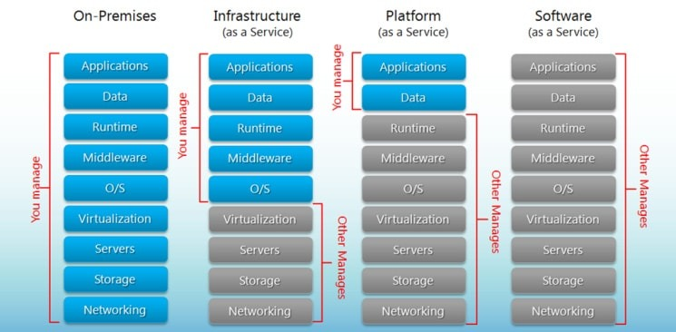
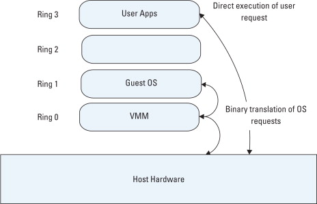
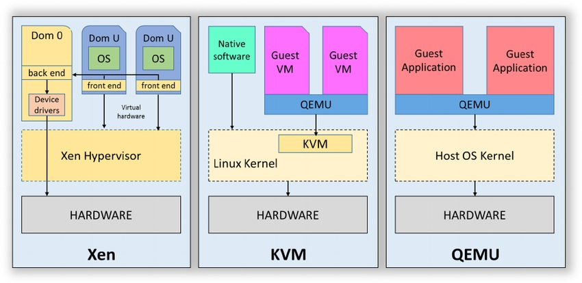
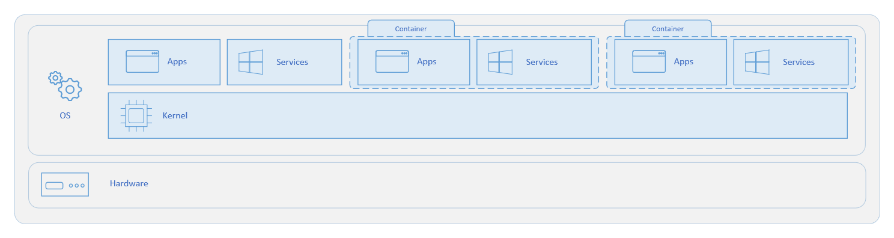
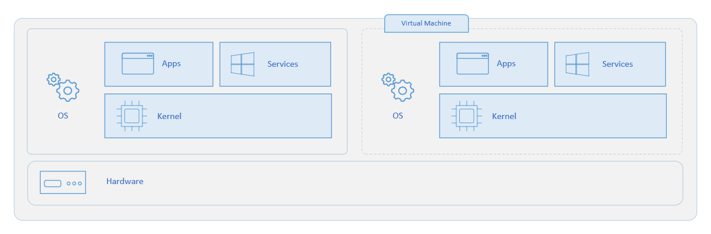
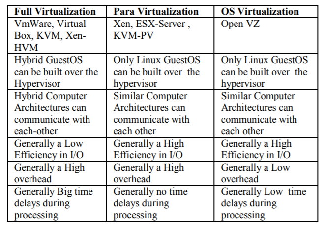
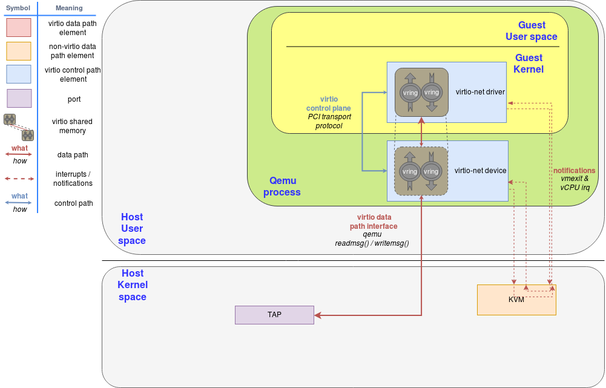
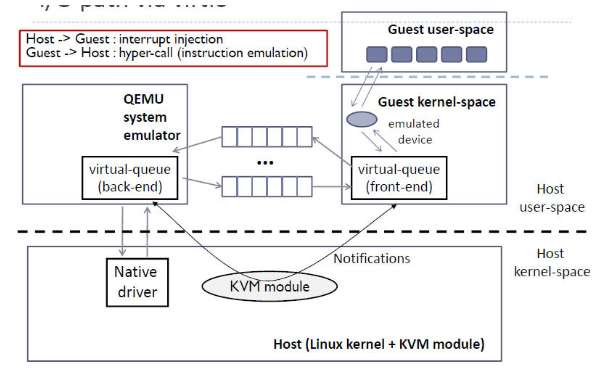
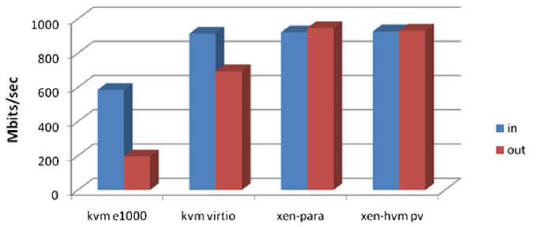

---
aliases:
- /archives/721
categories:
- 云计算
date: 2020-01-17 14:16:32+00:00
draft: false
title: 云计算概述
---

## 云计算的定义

**大白话：** 云计算就是计算放在云端

正常情况下，我们在使用自己的电脑时，所有的任务是在当前电脑执行（即计算）；而云计算是相当于在使用一台云端的电脑，所有的任务是在云端的电脑中执行（即计算）。阿里云、腾讯云、Linode和Vultr等这样的服务商所提供的VPS（Virtual Private Server，虚拟专用服务器）/ECS（Elastic Compute Service，云服务器）其实都是一台运行在云端的电脑，因为这些云端的电脑对外提供服务，因此他们又有了一个很好听的名字——云服务器。这些云服务器运行在服务商托管的数据中心中，通过一整套自动化管理平台实现用户自助购买、自助管理等操作。

## 服务类型

云计算提供如下三种服务类型

  * IaaS-基础设施即服务
  * PaaS-平台即服务
  * SaaS-软件即服务

其中，IaaS是最简单的交付。

IaaS、PaaS、SaaS更直观的区别，如下图1：

> 
> 
> 图1. IaaS、PaaS、SaaS区别
> 
> 图片来源：https://www.bigcommerce.com/blog/saas-vs-paas-vs-iaas/

可以看到，从IaaS到PaaS和SaaS，用户所需要管理的部分越来越少。IaaS平台帮助用户交付到虚拟化环境，意味着虚拟化环境之上的操作系统、运行时环境等都需要用户自主进行设置，云主机即这样的IaaS产品。PaaS帮助用户交付到运行时环境，即帮你封装好了你所需要的开发环境或者部署环境，帮助开发者或者企业用户批量部署时减少相应的工作量，虚拟主机即PaaS产品，但当虚拟主机同时给用户提供安装相关的应用时，严格来讲它就成了SaaS。SaaS平台帮助用户交付到应用，意味着所有的应用和相关数据已经全部被集成完成，面向用户直接提供相关的应用服务，举例就是交付给用户的是直接的应用——CRM、ERP应用等。

## 特性

### 依靠虚拟化技术

虚拟化应当理解为一种资源管理方式，通过合理的资源管理和计算调度，抽象出相应的“云主机”提供给用户使用。通俗的讲，就是很多虚拟机在同时运行在很多台实体服务器上，但是这些虚拟机间通过特殊的管理平台实现计算调度（含负载平衡）、热迁移等高级特性。虚拟化按照设备分为两种，一种是桌面虚拟化，即我们在电脑上所安装的虚拟机并使用该虚拟机进行操作，另外一种是服务器虚拟化，即将服务器安装相关的管理软件，将整个服务器完全用于虚拟化任务提供众多的虚拟机进行服务。

在此解释一下上边提到的热迁移。众所周知数据中心需要保证业务不能中断，因此所有的业务都会存在热备份，用户的虚拟机也就包含在其中。当用户的虚拟机在运行期间，该内存数据会实时和其他节点的设备进行同步并通过心跳检查是否正常，当物理机突发故障时，该物理机上的虚拟机会实时（用户基本感觉不到，迁移的时间一般是毫秒级）迁移到其他物理机上，保障业务不会中断，这个所实现的特性叫做**高可用**。

将虚拟化按照等级分类，共分为如下几种：

#### 硬件仿真（Emulation）

在宿主机上通过虚拟机模拟其他硬件，比较常见的是QEMU，QEMU可以在x86平台模拟arm平台的硬件，一般用于研发测试等场景，由于指令需要通过软件进行翻译，因此效率极低性能极差。

#### 全虚拟化（Full Virtulization）
>  In full virtualization primary hardware is replicated and made available to the guest operating system, which executes unaware of such abstraction and no requirements to modify.
> 
> 在全虚拟化中，宿主机的硬件资源被提供给客户机（即虚拟机）使用，并且客户机的操作系统不知道这一抽象（指虚拟化），同时客户机的系统也并不需要做出任何修改。
> 
> 来源：https://www.geeksforgeeks.org/virtualization-vmware-full-virtualization/

上述是对全虚拟化的定义。全虚拟化是当今并且是未来的主流（如下图2），全虚拟化一般辅以硬件辅助虚拟化进行硬件加速，用于减少相应的性能损失。

硬件辅助虚拟化主要在宿主机和虚拟机之间捕获并处理特权指令，使得虚拟机能够不经修改直接运行。通过软件实现的虚拟化通过使用陷入-模拟的方式来模拟特权指令，这无疑会增加性能开销。正因如此，Intel和AMD分别引入了自家的硬件辅助虚拟化技术，该技术分别引入了根模式和非根模式，虚拟机指令将会运行在非根模式中，宿主机指令将会运行在根模式中，通过这样的方式分隔指令，每个模式中都包含了单独的RING0-RING3域（详见分级保护域）。

使用全虚拟化方式的产品有VirtualBox、KVM、VMware Workstation（桌面版）、VMware ESX（服务器版）

> 
> 
> 图2. 全虚拟化
> 
> 图片来源：Diane Barrett, Gregory Kipper, in Virtualization and Forensics, 2010

#### 半虚拟化（Parairtulization）

对客户机操作系统进行了一定的修改，这种虚拟化方式被称作半虚拟化，最经典的产品就是Xen。这样的半虚拟化技术通常使用前端-后端驱动的方式进行通信（VirtIO），进而减少IO行程，提高IO效率

> Xen Project runs in a more privileged CPU state than any other software on the machine.
> 
> Responsibilities of the hypervisor include memory management and CPU scheduling of all virtual machines (“domains”), and for launching the most privileged domain (“dom0”) – the only virtual machine which by default has direct access to hardware. From the dom0 the hypervisor can be managed and unprivileged domains (“domU”) can be launched.
> 
> Xen运行在一个比其他软件更多特权的状态中。它包含了内存管理和CPU调度模块，借此对所有的虚拟机进行管理，并启动特权域dom0。只有dom0能够直接访问硬件，并且只有它能管理Hypervisor和非特权域。
> 
> 来源：https://en.wikipedia.org/wiki/Xen

> 
> 
> 图3. KVM vs Xen  
> 
> 图片来源：https://zhuanlan.zhihu.com/p/33324585

通过图2我们可以看到，所有的IO指令会在修改过的内核处进行筛选，IO指令将会被单独投递到Dom0，经过Dom0的处理和执行后重新转回虚拟机，因此可以看到这样的处理方式将IO指令的执行行程拉长了一倍，知乎上的说法以贬义的语气去阐述了这一IO行程拉长的行为，但是个人觉得这个IO拉长但是相比KVM模拟硬件的IO行程还是要短的，不然怎么会有Xen的IO效率比KVM高的说法？具体可以看下边的总结。Xen的历史比KVM还要久远，并且瓶颈越来越多，因此它正在逐渐退出时代潮流。

#### 容器（Container）

容器技术作为一种新的虚拟化方式，正在逐渐成为下一代虚拟化技术的领导者。在当今容器技术越来越火的情况下，我们联合上边的全虚拟化对容器技术进行一个对比，来观察技术差别

> 
> 
> 图4. 容器技术架构  
> 
> 图片来源：https://docs.microsoft.com/en-us/virtualization/windowscontainers/about/containers-vs-vm

> 
> 
> 图5. 全虚拟化技术架构  
> 
> 图片来源：https://docs.microsoft.com/en-us/virtualization/windowscontainers/about/containers-vs-vm

对比图4和图5，我们可以看到，全虚拟化中的虚拟机是独立的，每个虚拟机都拥有独立的内核；而容器中，宿主机的内核是被共享的，应用及其运行时环境是独立的，所有的容器共享宿主机内核，因此节省掉了内核资源开销，较为轻量，在部分场景下比较受青睐。

#### 总结

我们对上述的几种虚拟化方式做一个总结

> 
> 
> 图6. 全虚拟化、半虚拟化和操作系统虚拟化对比
> 
> 图片来源：Igli TAFA, Ermal BEQIRI, Hakik Paci, Elinda KAJO and Aleksandër XHUVANI. “The evaluation of Transfer Time, CPU Consumption and Memory Utilization in XEN-PV, XEN-HVM, OpenVZ, KVM-FV and KVM-PV Hypervisors using FTP and HTTP approaches”. Third International Conference on Intelligent Networking and Collaborative Systems, 2011.

> 
> 
> 图7. VirtIO 网络模型  
> 
> 图片来源：https://www.redhat.com/en/blog/deep-dive-virtio-networking-and-vhost-net

> 
> 
> 图8. VirtIO的完整IO处理流程
> 图片来源：https://www.bbsmax.com/A/A2dmjGNbze/

如图6，对比操作系统支持，我们可以看到全虚拟化能够支持多种类型的操作系统，并且可以支持相异架构（arm、mips等），而半虚拟化和操作系统虚拟化均只能够支持Linux并且要求架构必须相似（即x86_64，架构需要相同）；由于半虚拟化（Xen）引入了前端-后端通信方式，通过直接通信方式免去了IO模拟时的中断捕获过程，客户机操作系统相当于直接在操作宿主机的IO设备，因此拥有更加高效的IO，相对于全虚拟化中的模拟IO设备，免去了过长的IO行程。**需要特别注意的是**，**VirtIO是QEMU中的半虚拟化方式**，VMware ESXi中也通过VMXNET网卡实现这一DirectPath IO特性，减少IO行程提高效率，**Xen的做法也是类似**，**由于并没有找到相关的文献**，**因此只能拿QEMU的VirtIO来阐述Xen的IO技术**，**不过根本都还是通过前端-后端驱动方式来实现这一特性**。其网络IO模型和IO路径如图7和图8

> 
> 
> 图9. KVM硬件模拟、VirtIO、Xen网络设备性能对比
> 
> 图片来源：A. Chierici, R. Veraldi and D. Salomoni. “Measuring performances of linux hypervisors”. Il Nuovo Cimento C, 32(2):213-225, February 2009.

刚刚讲到，网络IO设备一部分是通过模拟实现，一部分是通过VirtIO这样的半虚拟化方式实现。通过文献中的测试数据（如图9），可以看到半虚拟化的VirtIO和Xen都达到了较为理想的性能，反观模拟的E1000却差强人意。

#### 扩展

伴随着云计算的发展，操作系统在虚拟化同时，存储虚拟化和网络虚拟化也慢慢成为数据中心硬性需求。关于存储虚拟化和网络虚拟化将会在后续文章中提及

### 灵活性高

借助存储虚拟化、网络虚拟化等特性实现软件定义的网络和存储模型，可以跟随用户操作自助完成整套自动化部署工作，同时也可以满足动态扩展等需求

### 可靠性高

不会出现单点故障而导致的整体业务不可用情况，一般的数据中心都提供了多机热备，不仅仅是计算热备，连带存储、网络都有相关的热备份，可靠性高

### 成本低

维护成本相对较低，计算性能也不逊于大型主机。对于中小型企业来说，现在越来越推崇“服务上云”，即将原本私有化部署的服务全部部署在云端，由云服务商提供计算服务和周边的扩展服务（好比自动化运维、应用防火墙和安全保障等），对于中小企业来说是一个降低成本的很好的途径。