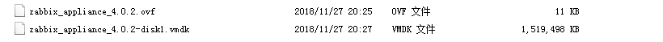
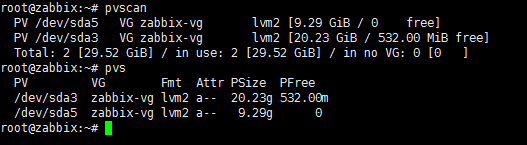

---
aliases:
- /archives/74
categories:
- Linux
date: 2018-12-06 10:10:45+00:00
draft: false
title: 调整LVM分区大小
---

为了避免机房服务器跪了，特此部署了ZABBIX盯着服务器，一旦异常就直接邮件我，微信就能直接收到邮件通知，第一时间解决问题

由于ZBX高中时就已经部署过好几次了，懒得再重复操作，正好看到ZBX官方提供了OVF，于是干脆想偷下懒了


## 将OVF文件导入ESXi

解压下载到的压缩包，看到是下面这两个文件



顿时感觉不妙，我这个ESXi经常性导入OVF失败，OVA倒是没事。于是尝试导入了下，还真的失败了。。。

虚拟磁盘文件也只有一个，看起来应该不是ESX的磁盘镜像格式。总不能在一棵树上吊死，只能先把vmdk传到ESXi上了，Google查了查如何使用ESXi Cli转换后，按照下面命令试了试发现可以用（如果直接本地转，原本1.4G的虚拟磁盘转完10G，再传到ESXi浪费带宽，没什么必要，而且带宽本来就不高）


```bash
vmkfstools -d thin -i zabbix_appliance_4.0.2-disk1.vmdk zabbix.vmdk
```


新生成的精简置备（Thin）的虚拟磁盘zabbix.vmdk实际上还包含一个zabbix-flat.vmdk，此时转换后的虚拟磁盘文件就可以用了，手动配置完VM后将其导入虚拟机，即可正常使用

## 调整LVM分区

我按照官方的文档调整了分区，启动时提示无法找到对应的UUID，Google到的方法试了几个并没有什么意义。所以还是按照自己的办法来好了

并不推荐fdisk调整分区，我自己在调整分区时发现明明未分配空间还有30G，使用fdisk新建的分区大小却只有3000多KB。。。此处我是用的gparted live，将虚拟机启动进去，把未分配的空间全部分配给新分区  **/dev/sda3**，保存后看效果一切正常

首先将虚拟磁盘扩容，有足够的空间扩充LVM卷

重启进入系统，新建物理卷并将其归入zabbix-vg这个卷组中


```bash
pvcreate /dev/sda3
vgextend zabbix-vg /dev/sda3
```


执行**pvscan**，可以看到加入成功，但是空间还没被利用，那么再紧接着再调整逻辑卷的大小并且调整分区大小


```bash
lvextend -l +100%FREE /dev/mapper/zabbix--vg-root 
resize2fs /dev/mapper/zabbix--vg-root
```



看图，已经调整成功，根目录可用空间也已经扩大


再来看ZBX，监控数据已经正常，并无太大问题

## 开启网络

默认情况下，Appliance并没有开启网络，接口全部是关闭的。使用如下命令打开接口


```bash
ifconfig [接口名] up
```


激活端口后，需要留意一下如下这个文件中的网卡设备是不是对的，否则DHCP是无效的


