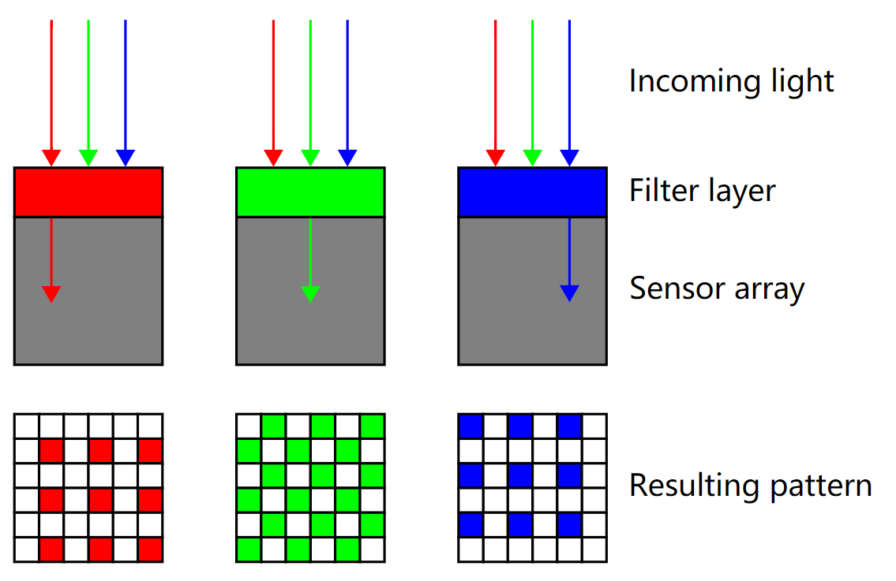
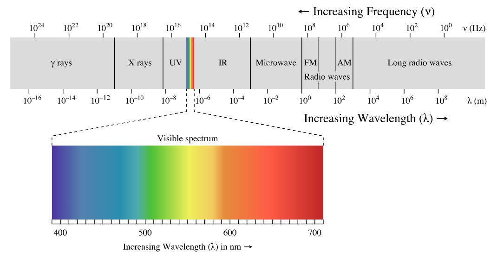
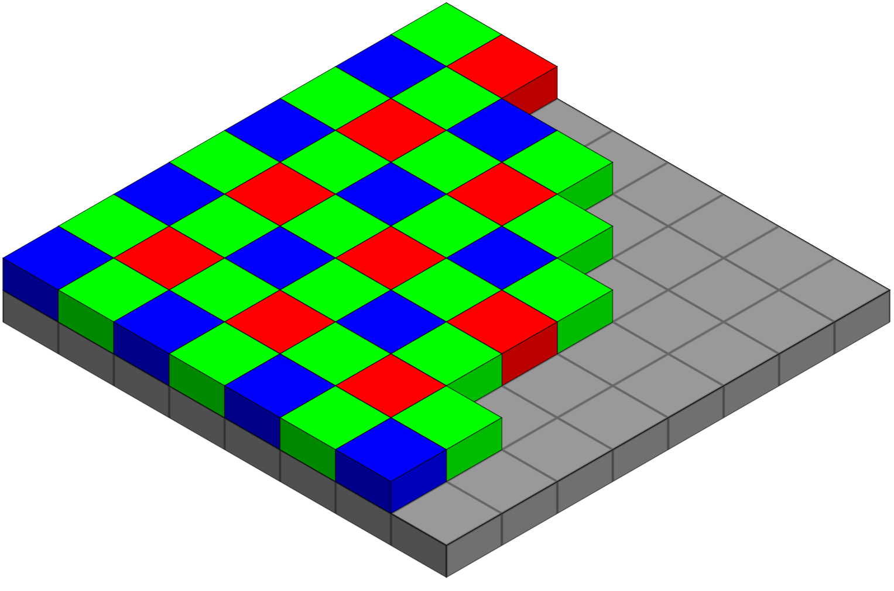
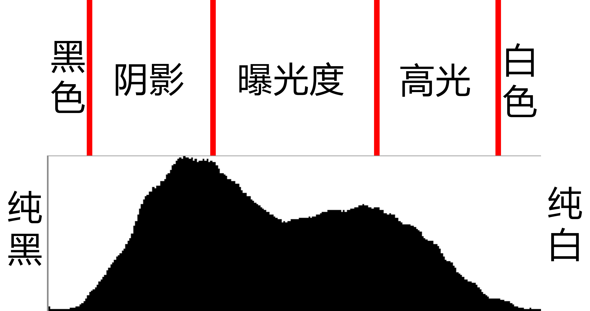
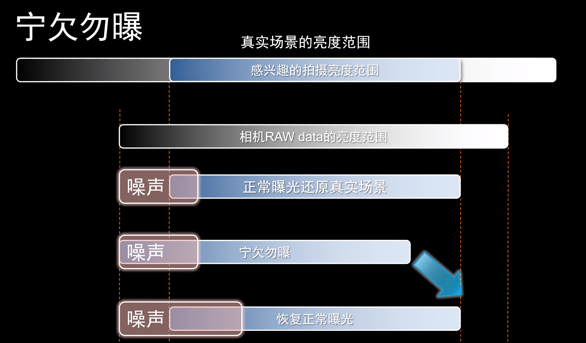
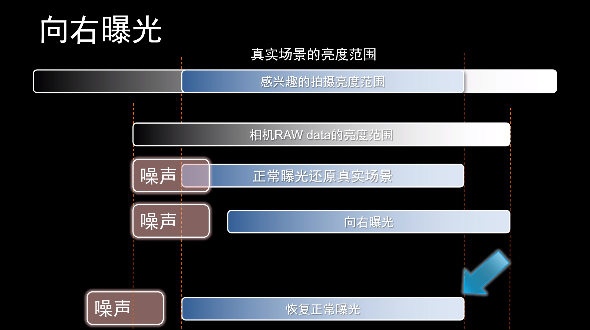
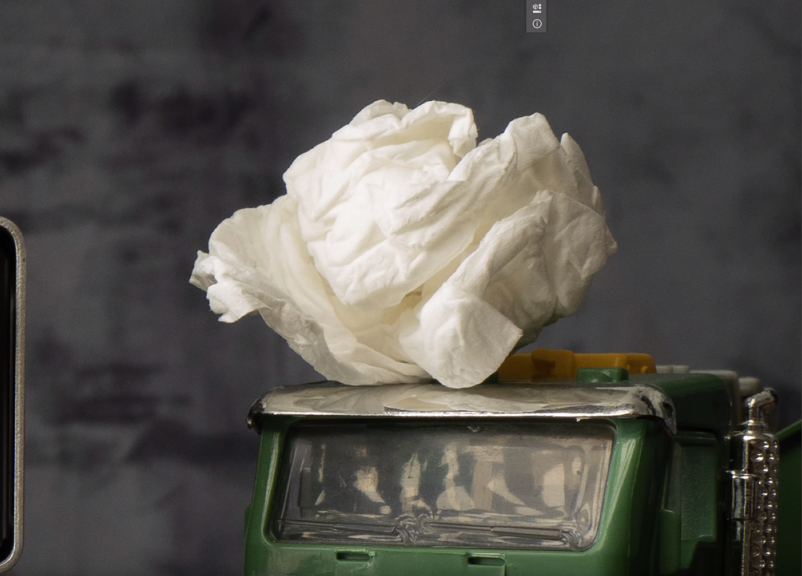
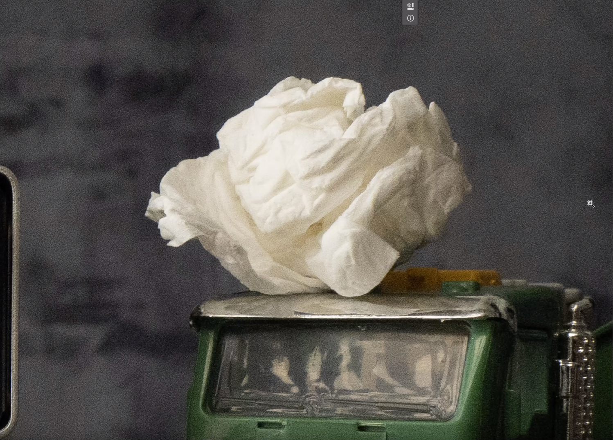
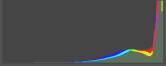
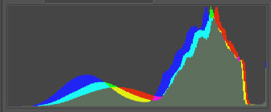

---
aliases:
- /archives/764
categories:
- 摄影
date: 2020-01-28 06:57:55+00:00
draft: false
title: 摄影入门——向右曝光
---

一些老法师给我说宁可欠曝不要过曝，在我查阅了一些资料后发现过曝还是需要的，并且这个曝光方式有个专有的叫法——向右曝光——即向着色彩直方图的右侧曝光（高亮曝光） 。

在提到向右曝光的正文前，我们先对CMOS、颜色通道和色彩直方图等基础内容稍微提及一些，为下文展开向右曝光的内容时做好铺垫，这些内容都是我在查阅过维基、百度和逼乎认证回答后总结的，总体上应该不会有什么错误，但是由于本人也是才入摄影不久，一些表述和细节上可能存在一些错误，还请指正。

**在本文开始之前，先感谢一下“巫师后期”的相关视频，博主我也是靠着该作者的视频学起来的，非常喜欢他的授之以渔的授课方式。b站也有他的视频噢~**

## 图像传感器

在讲到相机原理的开始，不得不提的是CMOS和CCD，近些年来CCD已经很少用了基本都是以CMOS为主，本文也通过CMOS阐述相机成像感光的原理。

CMOS的大小即决定了相机的画幅，博主我的A7M2的CMOS大小是35mm（35.8mm*23.9mm），也是全画幅的大小，对于不同画幅大小差别可以看下图（图1）。

> 
> 
> 图1. 画幅
> 
> 图片来源： https://digiphoto.techbang.com/posts/9785-what-is-the-biggest-difference-between-the-aps-c-format-and-the-full-frame

35mm全画幅再向上还有中画幅和大画幅，不过这一般是人民币玩家或者非常专业的人士才玩得起的，本文就不再介绍这些了。向下还有8.8mm、7.76mm、6.16mm和4.13mm等众多规格的图像传感器大小，这种较小体积的CMOS一般都是在手机等移动终端使用。相同像素的情况下，画幅越大，像素的密度越低，这也就是为什么手机、半幅机的高感情况下画质始终不如全幅的原因，当然大画幅也是同理强于中画幅，中画幅也是强于全画幅，当然等我们有钱了再去细细讨论这些。

那么通过上述内容，我们知道了CMOS的感光基础单元叫做“像素”，像素的数量越大，成本也随之增加，成像质量也随之提高。现在你可能会问了，每个“像素”是如何分辨颜色的呢？在阐述这个问题前，我们先来了解 一下三原色，其实这个三原色分为两种，一种是在光学中所讲的三原色，也即我们初中时候还是小学时候讲过的“红R绿G蓝B”；另外一种是色彩三原色，分别有“品红M黄Y青C黑色K”，其中，K（black，黑色）是为了确保黑色的输出浓度因而加入做调和用。相机CMOS感受色彩使用的是光学三原色，将这三个颜色分别分成三个通道进行感光，三个通道组成一个像素点（pixel）。

> 
> 
> 图2. 色彩通道
> 
> 图片来源： By en:User:Cburnett – Own workThis W3C-unspecified vector image was created with Inkscape., CC BY-SA 3.0, https://commons.wikimedia.org/w/index.php?curid=1496872

看到这里，我补充一个基础常识。众所周知，可见光的每种光的频率都是不同的，人类能看到的色彩只占一小部分（如下图3）。那么我们再提及滤色镜，红色滤镜就是一种只能透过同色光的滤色镜，只有波长在红色光区域的可以透过，其他的都会被滤掉，因此即可得到红色的色彩深度。

> 
> 
> 图3. 光的波长
> 
> 图片来源：CC BY-SA 3.0, https://commons.wikimedia.org/w/index.php?curid=2521356

相机的感光元件中使用了一种滤色镜——拜尔滤色镜（Bayer filter），这是一种将RGB滤色镜排列在传感器方格上的马赛克彩色滤色阵列，一些改良的滤色镜也是类似原理。在拜尔滤色镜中，4个通道（RGBG/GRGB/RGGB）分别构成一个像素（pixel），最后得到了RGB三个通道的色彩深度，图片的色彩也就这样捕捉到了。当所有像素的色彩通道在传感器上平铺开时，大概就是下边图片（图4）这样。

> 
> 
> 图4. 所有像素的色彩通道
> 
> 图片来源：由en:User:Cburnett – 自己的作品，CC BY-SA 3.0，https://commons.wikimedia.org/w/index.php?curid=1496858

## 色彩直方图

提及完色彩通道，我们再来讲讲色彩直方图。

色彩（颜色）直方图在摄影和后期中起到相当大的作用，一边可以用于观察亮度分布，一边亦可以在前期发现照片中的欠曝和过曝区域，对于判断照片风格也有帮助，同时也可以辅助向右曝光，在后期中也会起到重大帮助。

一张色彩直方图的表示内容如下（图5）：

> 
> 
> 图5. 色彩（颜色）直方图
> 
> 图片来源： https://www.zhihu.com/question/20511799

## 向右曝光

**前提条件：**开启了raw拍摄

在拍摄时，如果启用了色彩直方图，可能会看到高光警报，但实际上不用理睬，因为相机在预览时是临时生成了jpeg然后使用jpeg去计算的色彩直方图，因此jpeg会过曝但是实际raw并没有过曝，完全可以忽视高光警报，但是过曝的力度需要根据相机去把控，不同的ISO能支持的最大过曝程度都会存在一些差异。jpeg对比raw，宽容度稍低，具体可以查看如下两张图（图6和图7）。通过向右曝光这一方式，可以更好得还原暗处细节并减少图像噪声

> 
> 
> 图6. 宁欠勿曝
> 
> 图片来源：https://www.youtube.com/watch?v=uKDXQJR0WPY

> 
> 
> 图7. 向右曝光 
> 
> 图片来源：https://www.youtube.com/watch?v=uKDXQJR0WPY

如果你想看到差别，那么下边的两幅图（图8和图9）可以告诉你向左（欠曝）向右（过曝）在后期后图像质量差别有多大

> 
> 
> 图8. 向右曝光后减亮  
> 
> 图片来源：视频，找不到了

> 
> 
> 图9. 欠曝后增亮  
> 
> 图片来源：视频，找不到了

如图所示，图9是欠曝后增亮得到的，明显的图像的噪点比图8多得多。因此不得不说这个向右曝光还是非常有意义的，对整个景进行过曝，后期可以添加渐变滤镜调整光（在Camera Raw中），使得图像暗处细节更加真实亮出细节也能够显示出来。

由于不同的相机的raw对曝光容忍度不同，因此博主我专程背上我的A7M2外拍了一番，在向右曝光后得到的jpeg是这样的（如下图10），该图是相机jpeg+raw出图中的jpeg图，整个图几乎全部都是高亮警告。

图10. 向右曝光后得到的jpeg

图11. 图10的色彩直方图

从图11的直方图中我们可以看出，整个图10几乎全部都是高光，而且曝光已经超出了容忍范围，以至于整个画面几乎都是白色并且使用Camera Raw滤镜最大只能矫正0.95左右的过曝，而且画质并不如意。

此时，我使用Camera Raw直接处理raw图调整曝光，得到了如下图12。我们可以看到，即便上边的jpeg高光警告已经到如此严重的地步，但是其raw还是能够容忍的，在降了。。。（我忘了调的多少了）EV后还是能够还原出来了细节。

图12. 后期处理过的图

图13. 图12的色彩直方图

如上图13的直方图我们可以看到，在对raw进行减EV后，高光部分得到了大幅度的缓解，而且细节已经能还原得很完整，对比图11的色彩直方图明显能够看出来差异。图12相对相机生成的jpeg图（图10）进行了减亮同时进行了拉直，因此会存在细微的不同，可以忽略~以及由于WordPress对于图像默认会进行处理，因此这些图片并不是原图的质量，因此图片只能用于对比参考，但是不要下载下来去细节比对因为不是原图。

博主我所使用的是索法A7M2，在ISO开到1000的情况下，EV的容忍度大概为2.6EV左右，意味着超曝不超过2.6EV的通过raw滤镜以及渐变滤镜在后期都是能够矫正回来的，甚至可以通过这样一个方式在后期获得高动态范围（HDR）的图像，而无需在后期去做HDR合成的工作，静态景色还无所谓了，但是动态景色的HDR合成是真的难搞。