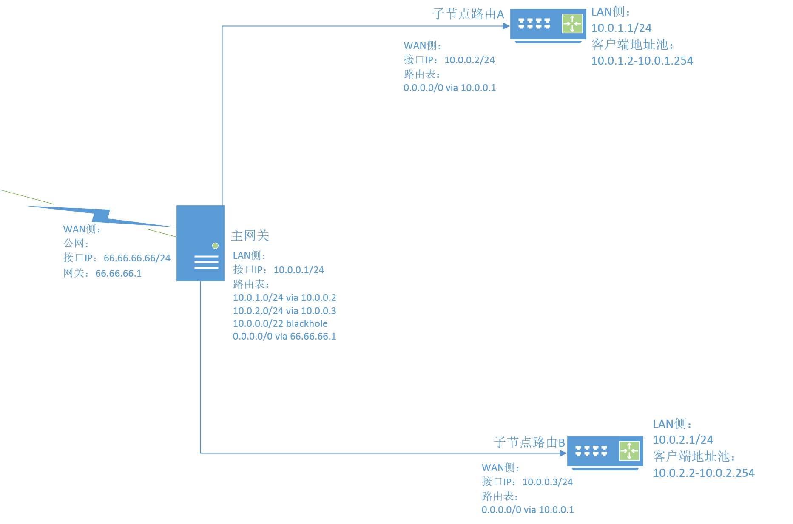

---
aliases:
- /archives/79
categories:
- 网络基础
date: 2019-06-19 10:21:20+00:00
draft: false
title: 超网与无类域间路由(CIDR)
---

计算机专业的多多少少都应该会讲计算机网络吧，计算机网络这本书中很详细地把超网介绍了一遍，然后兴致勃勃去实践去配了，发现如果单纯按照计网的思路去配置，抱歉，完全不通。这就有时候让人怀疑概论和实践简直是两码事，实践固然重要（我没说概论也不重要），经验也很重要。在此再次感谢TUNA的小伙伴们的耐心解答，周边做网络的朋友和老师没有成功解答，百度和Google也都没能解决我实践中的问题（都太偏理论），多谢最后TUNA的朋友们指点光明。

# 感谢

**在此先衷心地感谢TUNA的小伙伴们，感谢他们耐心细致解答了我的疑惑，助我顺利拿下了CIDR这块东东，非常感谢**

# 简介

## 超网的意义

1. 其把若干个小的子网合并成一个很大的地址块，在配合NAT后可以实施“大局域网”，缓解IP V4地址不够用的局面
2. 剪裁了广播域，假设在一个10.0.0.0/8的域中，如果不剪裁广播域的情况下，一旦有主机中毒或者恶意行为导致广播风暴，该风暴需要在整个域中广播，导致整个网络呈现风暴和拥塞。使用CIDR后对很大的地址块进行了再划分，广播域得到了剪裁
3. 能明显简化网络拓扑结构
4. 没有L3的修改操作，只路由而不NAT减少了硬件开销，在整个CIDR过程中，L3的packet只进行了路由选择，并没有进行任何的SNAT和DNAT，直到总网关处才会统一进行NAT（网络地址转换）。纯路由的情况下大多数机器都能够实现硬件转发，效率会高很多
5. 方便了管理，在网关才进行SNAT，此处SNAT时可以顺带根据L3 Packet的源地址和目的地址进行策略路由或者QoS等。同时，ACL可以在汇聚进行整合
6. 结合动态路由好比OSPF，可以实现L3冗余和路由环，路由表较多时使用动态路由会方便很多

## 缺点

其对地址块进行了划分，导致原本一个很大的广播域被划分成了一个又一个小的广播域，跨三层会导致很多策略上的问题。对准入控制也并不是非常方便，同时，由于跨三层，也使得很多功能无法使用，好比UPnP

# CIDR的拓扑结构

此处我画了一个简易的拓扑图

如上图，A B节点分别对应10.0.1.0/24和10.0.2.0/24这两个地址块，主网关对LAN侧分配的地址块为10.0.0.0/24，因此该三个地址块聚合后的最小单位的地址为10.0.0.0/22，该地址块包含10.0.0.1-10.0.3.255，即完成了对AB两处的路由聚合。看似聚合，实际上也只是类似于编程中的抽象

**特别需要注意的是：**

  * 按照计网的理解方式，可能我需要在主网关的下联接口上配置出来一个聚合后的地址块，实际上这是错的！（反正我是这么理解的）实际上聚合后的地址块是在路由表中体现出来的，路由黑洞指向的地址即代表聚合后的地址块
  * 子节点的设备只需要路由不需要NAT，请勿在子节点配置NAT，避免不必要的开销，要知道NAT会导致包的源地址改变，需要额外开销！
  * 务必在子节点的上游配置回程路由，因为AB路由并没有开启NAT，如果上游不配置回程路由，主网关在对回程的包进行DNAT后查找路由表发现没有此条目会予以丢弃！
  * 上游路由务必配置路由黑洞(blackhole)，避免在两级路由的情况下造成环路，因为转发请求会持续在两侧传递。
  * 尽量不要去通过LAN、WAN这些人造的定义去理解网络，真正的端口其实都是平级的，不存在LAN、WAN这个说法（此博文内便于理解先这么讲了，但是希望还是平级理解）
  * 需要进行NAT的包的源地址可以是任意的，只要确保回程能够正常返回即可，所以源地址不必须是主网关LAN侧接口的IP地址中的地址，但是LAN侧的IP需要符合RFC1918中的对私网地址的规范，不然有的设备会丢弃这些源地址异常的包（数据中心等除外）
  * 数据是双向的，考虑流量的时候，要关注流量的往返
  * 路由器的行为是逐跳的，到目标网络的沿路径每个路由器都必须有关于目的地的路由
  * 默认采用最长匹配原则，匹配，则转发；无匹配，则找默认路由，默认路由都没有，则丢弃；同时，目标的IP一定会是在最长前缀匹配到的地址块中，否则仍然会走默认路由

## 最长前缀匹配

浅谈一下最长前缀匹配在CIDR中的意义，个人觉得最长前缀匹配+掩码匹配在超网中有效避免了路由回路的产生，再加上正因为有最长前缀匹配，才使得整个分块的地址块得以聚合在一起形成一个大地址块（抽象），并且同时也避免了目标地址为RFC1918中的私网地址的请求转发到公网去。