---
aliases:
- /archives/795
categories:
- 摄影
date: 2020-02-19 15:21:00+00:00
draft: false
title: 摄影入门——曲线基础
---

博主我是跟巫师后期的教程学的，觉得这个视频（包括这个作者所有的视频）都很不错，一边讲原理一边讲操作，科学又严谨，又容易理解，墙裂推荐大家去看看。

## 特别注意

**阅读本文建议分为两次阅读，第一次确保完整看完文章可以不用多加思考，第二遍再精读。由于本文是一边实践一边写的，中间有截图和步骤是错误的但是随后文章里又纠正了，因此建议先完整看一遍以避免被误导。**

**本篇文章已经假定你理解色彩空间（HSL和RGB）及HSL的三要素，否则建议去看一下**

**本文中各种变换使用的图片是下面这一张。由于WP默认对图片进行了一定的处理，因此如果想对比实际效果请自行寻找图片不要用这张（因为被压缩过）。图片是我自己拍的，不存在版权争议**

原图

## 前言

**为什么要用曲线？**

> 曲线，是Photoshop当中最重要的工具之一，很多人在使用曲线调节对比度的时候，基本上都是凭感觉。然而你可能不知道，曲线使用不当，非常有可能损失画质。如果你不深入了解曲线使用的窍门，请慎用这一强大的工具；相反，一旦你掌握其精髓，你的后期处理可以产生质的飞跃
> 
> 巫师

**为什么我要写这一篇文章？**

关于曲线调整图像的原理，我带着PS/Photoshop关键词找了众多文章没有找到一个带着数学基础讲的。之所以很欣赏巫师的视频，因为他本身就是图像信号处理博士+程序猿，对于PS的讲解确实是真的贴近基础去讲的，是好文（视频）。 

个人觉得，图像相关的内容其实本身就是数学，有些基础的东西还是需要了解一下的，仅此而已，后期做起来阻力会少一些（但愿吧）。由于本人数学比较low b，因此行文可能会存在错误（不含文中纠正的），欢迎联系指正。

## 什么是曲线

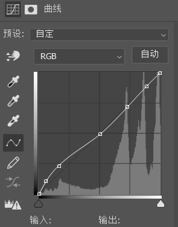

图1. 曲线

如图1，这样的就是曲线。

## 曲线基本原理

在开始前，我个人建议在直方图、曲线中都点击图中或者旁边的感叹号，让PS计算更加精确的直方图，便于我们查看。如下图2

图2. 曲线中的计算更精确直方图的按钮

在彩色图像中，会有R、G、B三个颜色通道，这三个不同的通道的值（即分量）构成的了一个彩色像素。直方图从左（0）到右（255）描述了当前通道（RGB或R或G或B）的暗亮程度，0-255就是一种常用的等级范围。曲线调整的其实就是选定通道中像素的等级，曲线（图4）的背景其实就是直方图（图3）

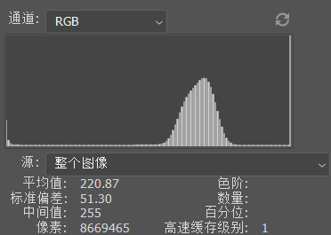

图3. 直方图

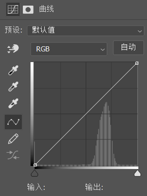

图4. 曲线

说到这里不得不提一下，百度百科给的解释：灰度等级=灰阶=色阶，然而不论是灰度等级还是灰阶，都不免让人和Gray扯上联系。经过一番查证，中文版PS对直方图的256个区间翻译为“色阶”（如下图5），经过百度百科这样一解释我觉得彻底乱了；然而在英文版的PS中这个名词被叫做“Levels”（如下图6），即等级。不得不说的是，这个Levels我个人觉得反而比灰度、灰阶直观很多。尽管如此，请你记好，灰度等级=灰阶=色阶，后续的内容中可能会有涉及。

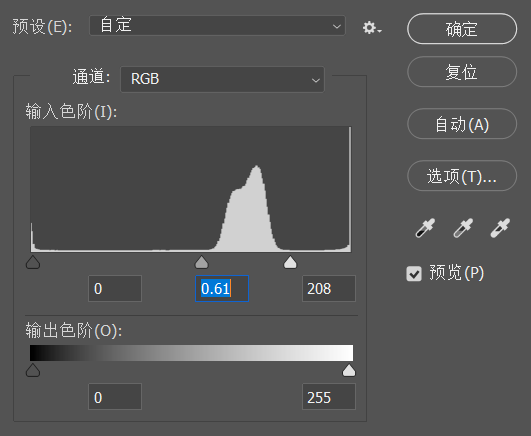

图5. 中文版PS对直方图0-255的翻译

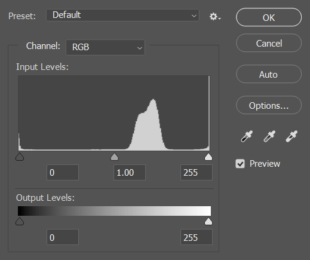

图6. 英文版PS对直方图0-255的表达

在Photoshop的直方图中，分别定义了RGB、R、G、B等通道，R、G、B独立的通道就不多说了，在此我只讨论第一个RGB通道。在同色阶的情况下，RGB通道的值等于R、G、B三个通道值的累加。

在此，我们定义f(i, j)表示原图的像素，g(i, j)表示输出图像的像素，α表示gain（增益），用于控制图像对比度，β表示bias（偏置），用于控制图像的明度。其关系可以用如下图7中的公式表示

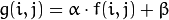

图7. 对比度和明度的关系

那么通过如上的公式，我们可以知道，当斜率（α）大于1同时截距（β）不变时，图像对比度增加，表现为图像的所有像素值均为原始输入值的α倍。

图8. OpenCV计算偏置

我通过OpenCV来读取图像并直接给矩阵乘2（相当于偏置为2），由上图8可以看到三个通道的像素值都已经变化，需要特别注意的是，OpenCV在读取图片时矩阵的数据类型设置在了uint8，在对矩阵乘后可能会存在溢出，因此要对结果进行纠正，为了省事，此处我直接给替换了而没有用移位。需要特别注意的是，图8中我将图片保存成了jpg，由于jpg带压缩，所以直方图会存在错误。如下图9，这个直方图是原图的直方图，而我在偏置2之后得到的图保存成jpg后，直方图却成了图10这个样子，显然是有问题的。

这里就要感谢一下郭教授了，多谢她的指点，发现了问题在于图片被压缩了。因此我将图片使用tiff位图保存后，得到的直方图便是图11中的栅格状了。这才是正确的直方图

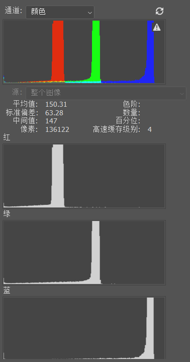

图9. 原始图片直方图

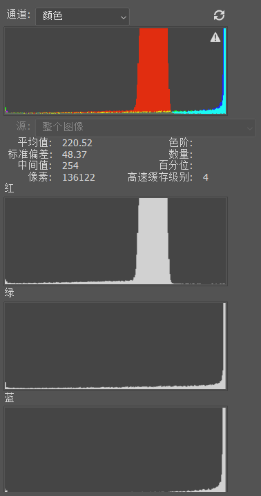

图10. 偏置2之后保存jpg图的直方图

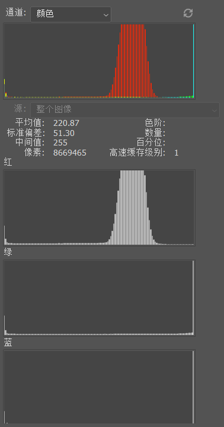

图11. 偏置2之后保存tiff图的直方图

正如上边所述，图像偏置2的情况下同时不做增益，每个通道的变换就可以看作一个线性函数。我把输入设为x，输出设为y，它的方程在平面坐标系上表示出来是如下图12。由于横纵坐标的范围都是0-255，因此只有深紫色区域才是有效区域，直线y=2x中自变量x在(127.5-255]区间上的值已经超出范围，在图像中最大只能为255。

因此，完整处理的方程应该是个分段函数，其公式如下图13，具体的函数图像如下图14

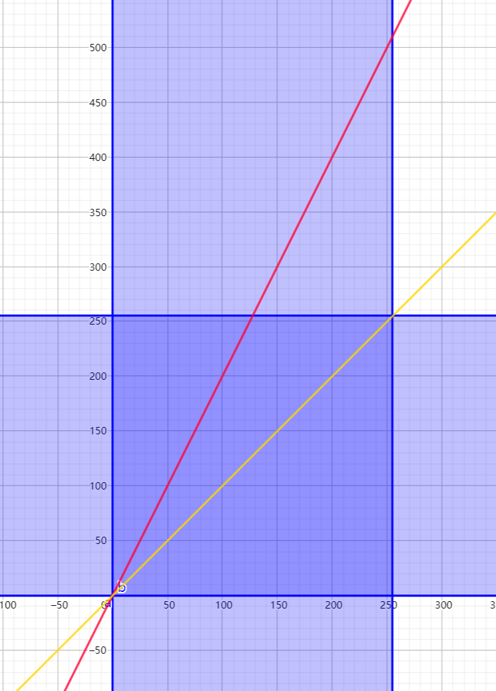

图12. 斜率（偏置）为2截距（增益）为0的方程的图像

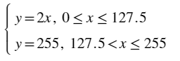

图13. 每个通道单独变换实际公式

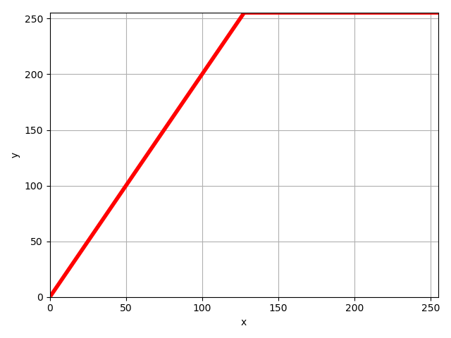

图14. 图13函数的图像

我手动将原图加上曲线，并拉成如下图15中的样子，可以看到OpenCV偏置得到的图和PS调整曲线得到的图完全一样了，直方图也完全相同。此时，PS中的曲线就和上边图14的函数图像完全一样

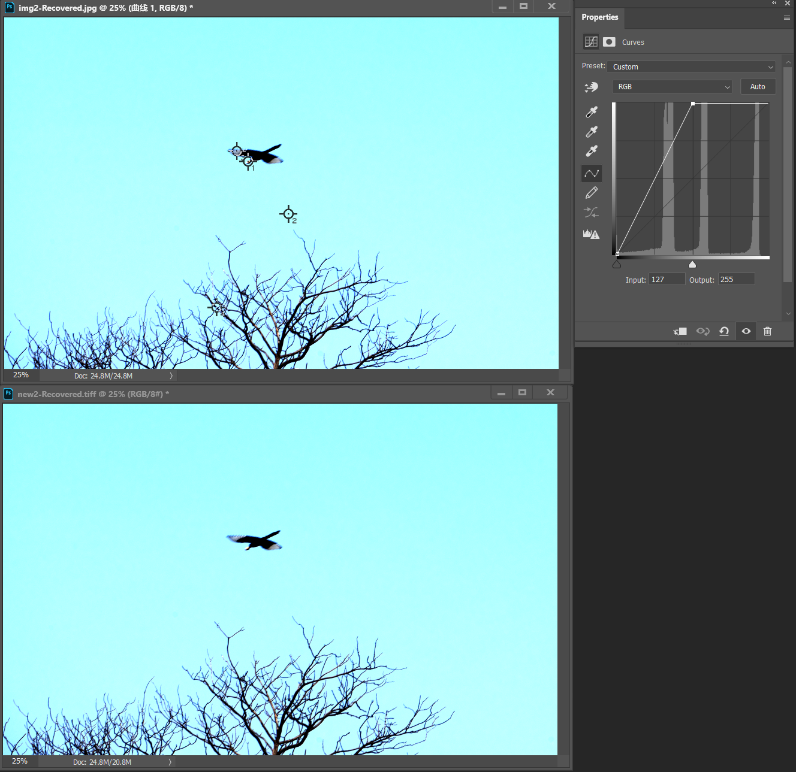

图15. 曲线调整对比

从上边这一过程我们可以得到什么？

从上边的图9和11我们可以看到，斜率（偏置）的增大（从1到2），色彩分布发生了变化，G（绿色）和B（蓝色）通道的色阶在乘2之后向右伸展，超出了255的最大值，因此全部集中在了255的白色一条线上，这样一来，这些细节就丢失了。

初中数学曾经讲到过，样本同时乘以或除以一个数，方差乘以或除以该数的平方；样本同时乘以一个数，方差不变。当然我们在调整曲线时并不可能只调整增益，只调整增益即截距改变，意味着函数在平移，在曲线中就会产生如下图16这样的效果。在这样的曲线中，直接会导致色阶（整个直方图）向右偏移127，原本处在直方图中右半侧的细节会全部丢失，而处在暗部的细节被加亮（方差不变），因此不会损失暗处细节；而如果调整成为图17中的曲线时，直方图中左半侧，即暗部细节会全部丢失，同时亮处向左偏移127的情况下图像会被压暗但并不会损失细节。

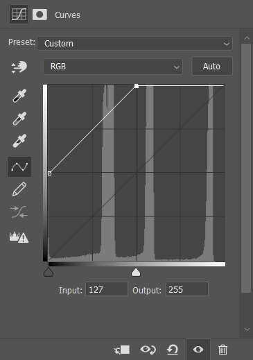

图16. 只调整增益（+127）

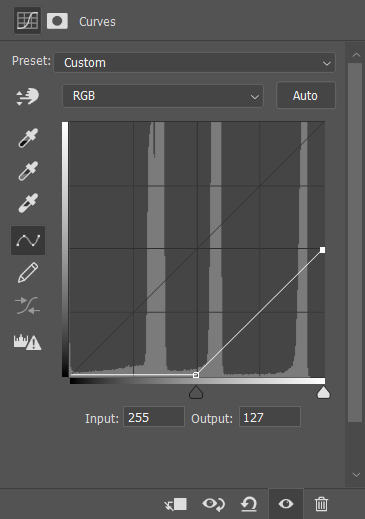

图17. 只调整增益（-127）

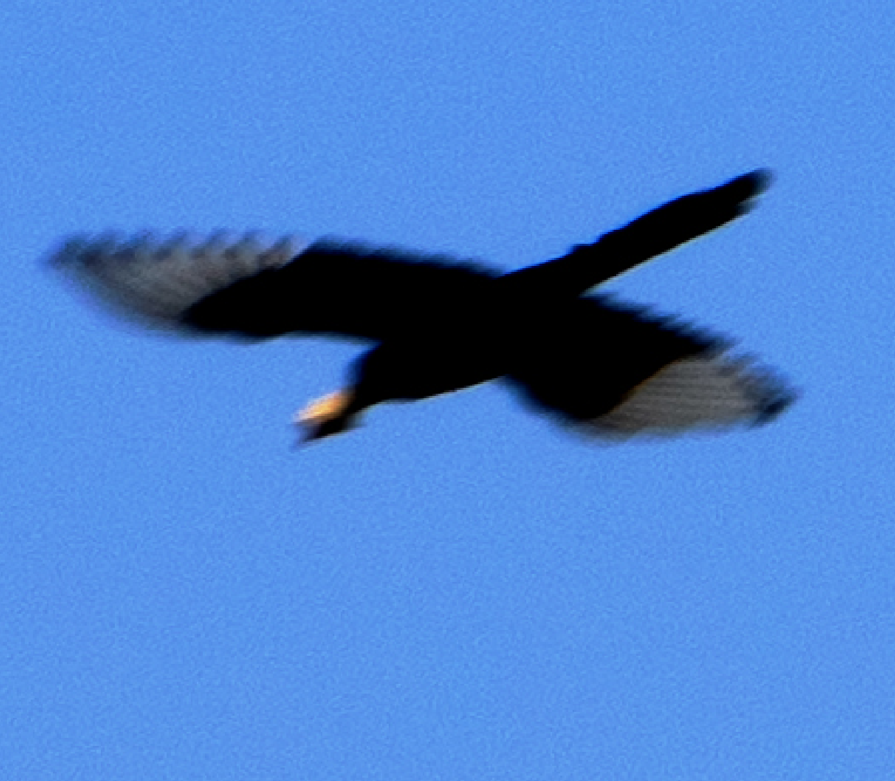

图18. 原图局部放大

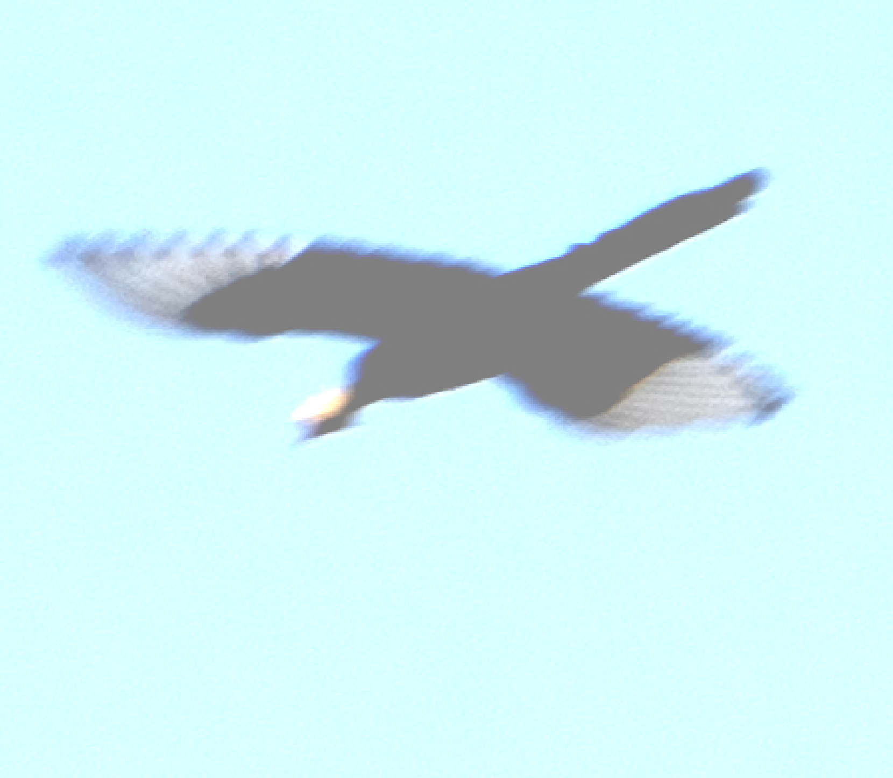
图19. 使用图16中的曲线调整后局部放大（放大部分与图18相同）

对比一下图18和图19就知道了，图19是原图在经过图16中的曲线调整后局部放大得到的，放大区域和图18的相同。我们眼睛看起来噪点不仅没有增多反而变少了，其数学基础是什么我也还不清楚，之前有看过人眼对亮度的辨识度是一个近似的对数函数，经过伽马矫正是相当于线性响应，而当加亮后可能又还原到了像如下图20这样的曲线，增加的光强度给人眼带来的亮度感觉却并不如线性响应时那么敏感，因此觉得噪点减少了。（我猜的）

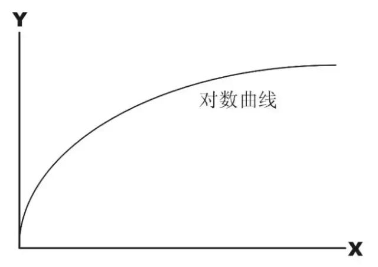

图20. 经过伽马矫正后的线性响应增亮后对人眼的响应度曲线（类似）

这也很好地解释了为什么向右曝光还原图像后质量能够提升，而欠曝拉亮后图像质量会损失——由于图像由暗向亮过渡时，偏置系数是倍增的，像素值的方差会被拉大，这种信号放大拉大了色彩差异，就给人眼更加直观得呈现出了更多得噪点；而当图像压暗时，原本像素值倍减，像素值的方差减小，实际上噪点并没有减少，只是因为压暗后更不明显了，人眼更加不容易分辨出来了而已，带给人眼直观的呈现就是——图像更加干净了。

## 为什么曲线是连续的

因为不连续的话你看到的色彩就会存在断层…

## 对比度和亮度的本质是什么

> 图像对比度指的是一幅图像中明暗区域最亮的白和最暗的黑之间不同亮度层级的测量，即指一幅图像灰度反差的大小。
> 
> 百度百科

上边又提到了灰度，也就我们上文所提到的色阶。这个色阶存在于直方图中，当色阶的反差越大时对比度就大。这或许也很好解释了为什么曲线调整为S形状可以增加画面的对比度——因为中间部分的偏置增加，像素值的方差被拉大（即直方图中的色阶差异被拉大）。假设原图两个像素点色阶分别处在20和100，那么偏置2之后就达到了40和200，可以看下下边图21和图22就差不多理解了。

图21. 灰度图：左20右100

图22. 灰度图：左40右200

## 曲线的根本

曲线的根本是灰度变换，它直接针对像素进行变换。灰度变换总共有三种：

  * 线性变换
  * 对数变换
  * 幂律变换（即伽马变换，Power-law函数）

总体的变换有一个图：

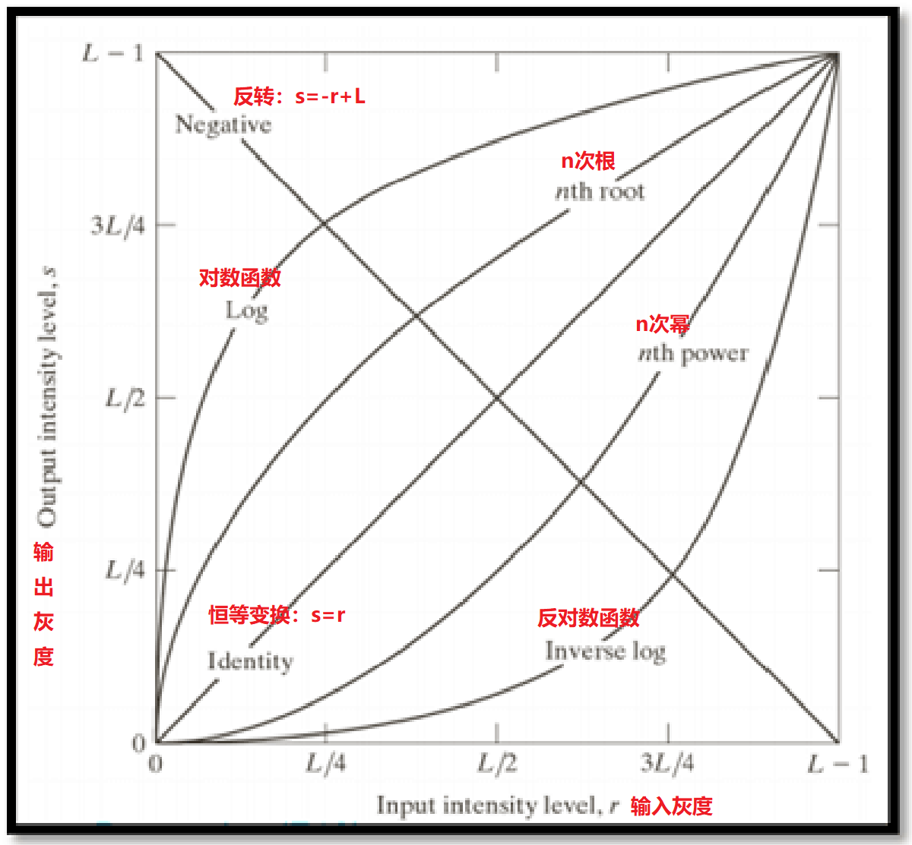

图23. 常见的灰度变换函数图像

### 线性变换

图23中的恒等变换s=r即保持和原图一样的输出，也因此叫做恒等变换

反转函数s=-r+L将整个直方图反转，原本在直方图左侧位置的反转到右侧，原本在右侧的反转到左侧。这样一个变换形成了负片。

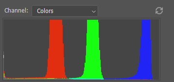

图24. 原图的直方图

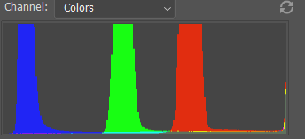

图25. 反转后的图像的直方图

经过这番操作后，如图24和25，我们可以看到直方图确实是反转了，其处理后的图就如下图26

图26. 负片

我们上文解释曲线也是使用了一个线性函数举例，这些都是线性变换的类型。

对于线性变换，在图23中，负片使偏置（斜率）从1到了-1，使增益（截距）从0到了L。这样一个过程中，图像的整个颜色全部取其补色，然后再使用255去减。

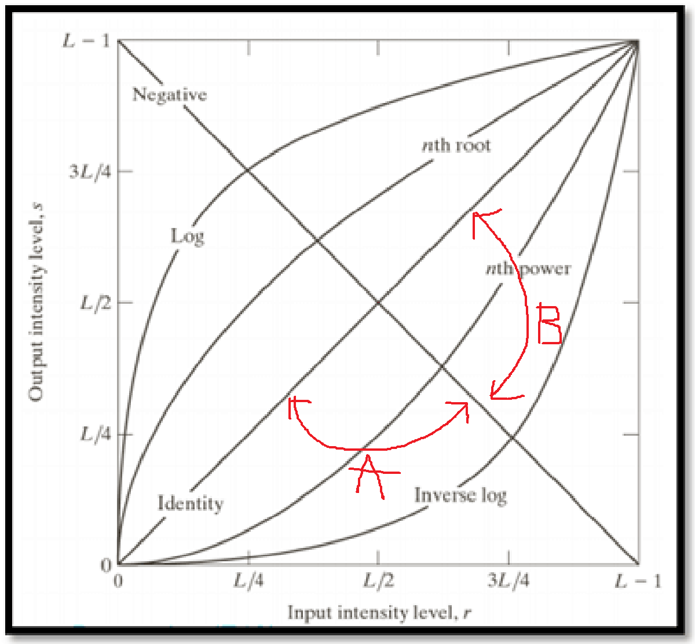

图27. 常见的灰度变换函数图像

在线性变换中，我们将其分为两个区域，分别是A和B。

在A区域中，**以两个直线的交点（L/2, L/2）为旋转中心旋转**（下边也是），偏置系数从1向-1过渡，中间会经过偏置=0。在**1<=偏置<=+无穷**时，图像对比度无限增大，在偏置=0时函数为s=L/2，此时图像以L/2为阈值进行分割。需要特别注意的是，此处分割的阈值为三个通道分别的值，因此每个通道的颜色会有两种可能，使得一个像素共2\*2\*2=8种色彩可能，分别如下

  * R=255, G=255, B=255, RGB=FFFFFF
  * R=255, G=255, B=0, RGB=FFFF00
  * R=255, G=0, B=255, RGB=FF00FF
  * R=255, G=0, B=0, RGB=FF0000
  * R=0, G=255, B=255, RGB=00FFFF
  * R=0, G=255, B=0, RGB=00FF00
  * R=0, G=0, B=255, RGB=0000FF
  * R=0, G=0, B=0, RGB=000000

需要特别注意的是，由于曲线是连续的，所以上边我所使用的s=L/2实际上在曲线中的图像是这样的（图28）。但是要注意我这是OpenCV处理的，实际上PS是并不能拉中间这个垂直的线的，所以如果你用PS处理可能看起来会有一点偏差

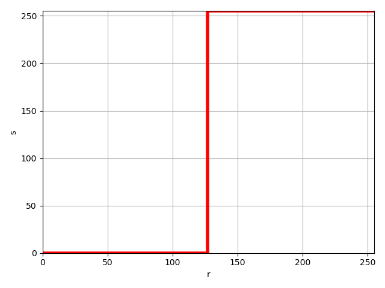

图28. s=L/2在曲线中的实际图像

最后得到的图片的三个通道的直方图（如下图2），中间没有聚集，都分散在了两侧，图片大概张这样（图30）。

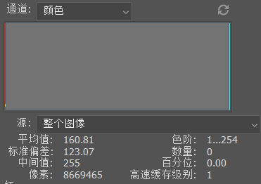

图29. 整图直方图

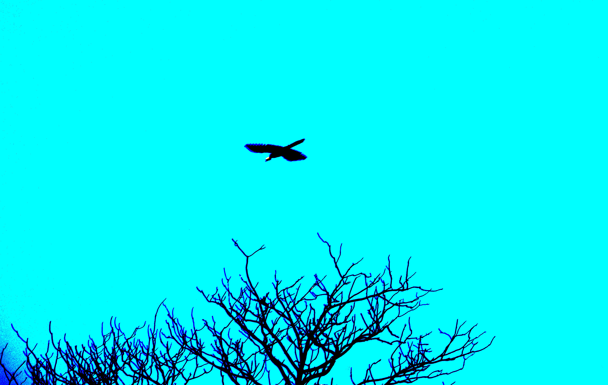

图30. s=L/2处理得到的图像

同理，当偏置系数**无穷&lt;=偏置&lt;=-1**时，图像为负片并且对比度从有限最大到等同于原图，当等同原图时此时就是负片出来的效果。

在B区域中，以两个直线的交点为旋转中心旋转，偏置系数**1&lt;=偏置&lt;=+无穷**，图像整体对比度不断减小直到整个图都是RGB(128, 128, 128)，也就是18%的中性灰。

同理，当偏置系数**无穷&lt;=偏置&lt;=1**时，图像整体对比度从有限最小逐渐增大到原图。

### 对数变换

对数变换又分为两部分，分别是正对数变换和反对数变换。公式为 s=clog(r+1)

#### 正对数变换

如上图23中的对数变换区域，正对数变换时，偏置在不断改变，从无穷大到无穷小，中间会等于1。在从无穷大到1的过程中，0-L/4的图像对比度被拉大，暗处细节更加明显，肉眼可见噪点增多；而L/4-(L-1)的图像的对比度缩小，亮处细节被压缩。**从始至终图像明度一直在增加，0-L/4段明度增加迅速，L/4-(L-1)段明度增加缓慢**。图像的**整体特征**就是：**图像阴影处细节还原，高光处细节损失，直方图中就是原本的窄域变宽，亮度差距减小**。

#### 反对数变换

如上图23中的反对数变换区域，反对数变换时，偏置不断改变，从无穷小到无穷大，中间会等于1。在从无穷小到1的过程中，0-3L/4的图像对比度被压缩，暗处细节丢失，肉眼可见噪点减少；3L/4-(L-1)的图像的对比度增加，亮处细节更加明显。**从始至终图像明度一直在减少，0-3L/4段明度减少缓慢，3L/4-(L-1)段明度减少剧烈。**图像的**整体特征**就是：**图像阴影处细节丢失，高光处细节还原，直方图中就是原本的宽域变窄，亮度差距增大。**

#### 总结

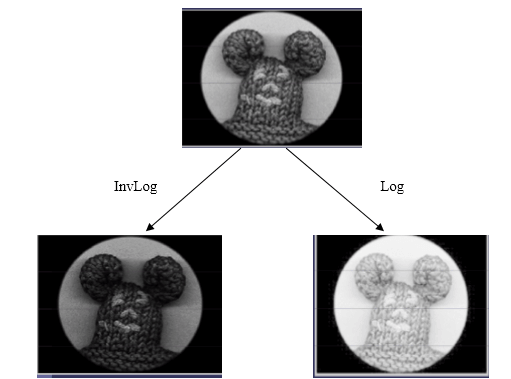

图31. 正对数（右）和反对数（左）变换效果

如上图31，图中上部分右侧为正对数变换，左侧为反对数变换。

### 幂律变换

也即伽马变换，公式为：s=cr^y。其中c和y为常数

图32. 伽马变换函数图像

伽马变换和对数变换比较类似，分界为y=1，当y&gt;1时，图像中原本的宽域变窄，和反对数变换效果一样；当y&lt;1时，图像中原本的窄域变宽，和正对数变换一样的效果。

