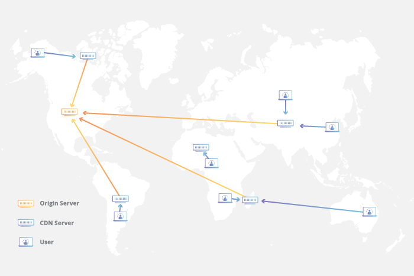
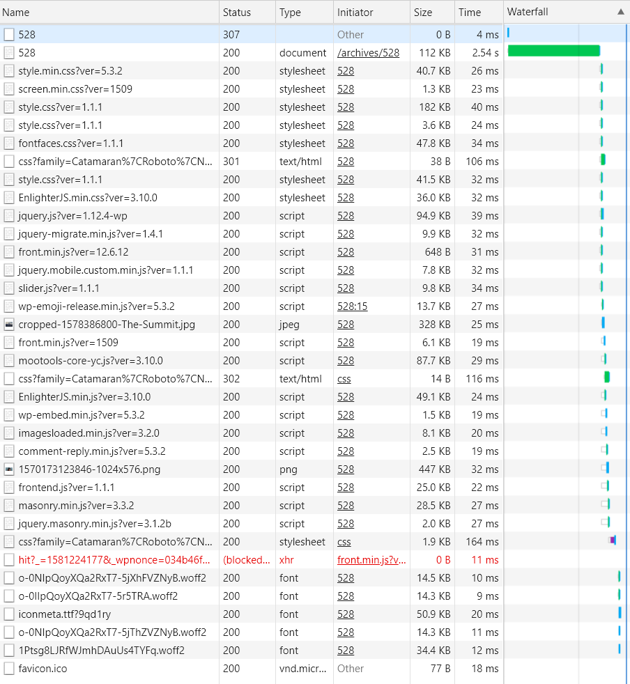
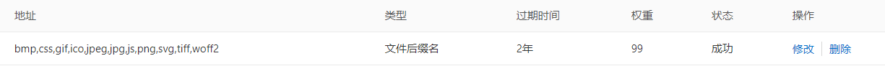
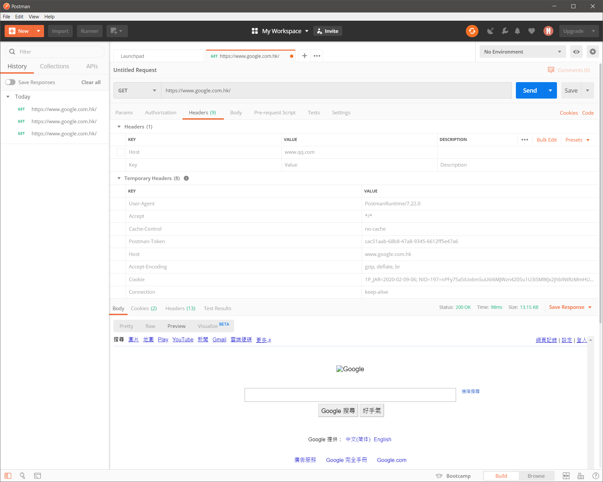
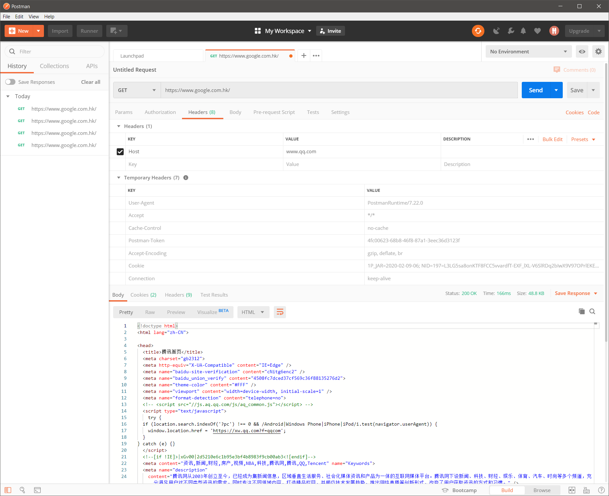
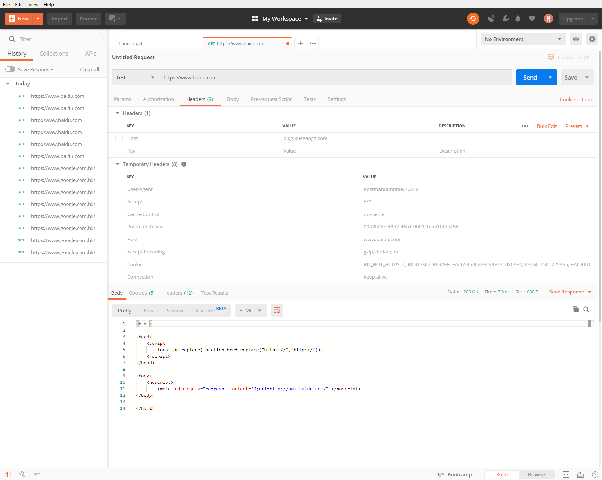
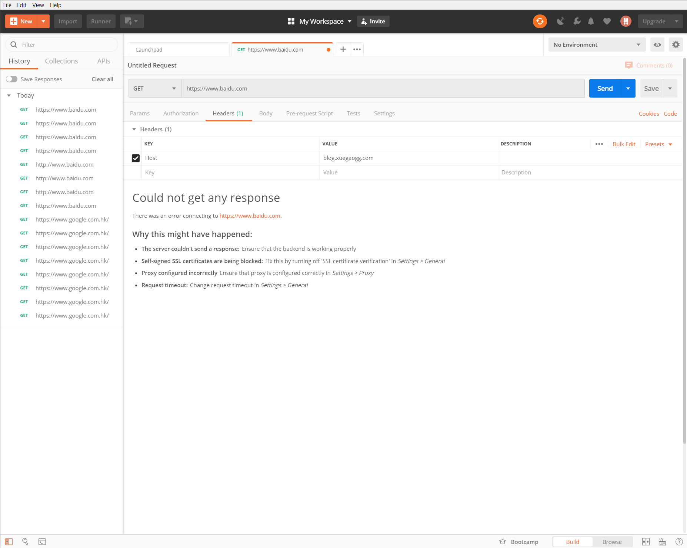

---
aliases:
- /archives/819
categories:
- CDN
date: 2020-02-09 07:46:33+00:00
draft: false
title: CDN配置一把梭
---

我的博客莫名其妙出现了一些问题，例如URL后多加”/”就会直接301跳转回源站域名访问，包含画廊也同样有这个问题。经过一夜的问题排查和Google，确认了问题在CDN上，同时针对CDN的规则设置等本文做出了更详细的解释。


在本文开始之前，我们先对CDN的原理和虚拟主机原理进行一番探讨。


## CDN

### 什么是CDN
<blockquote class="wp-block-quote">
<p>
    A content delivery network (CDN) refers to a geographically distributed group of servers which work together to provide fast delivery of Internet content.
  </p>
<p>
    A CDN allows for the quick transfer of assets needed for loading Internet content including HTML pages, javascript files, stylesheets, images, and videos. The popularity of CDN services continues to grow, and today the majority of web traffic is served through CDNs, including traffic from major sites like Facebook, Netflix, and Amazon.
  </p>
<p>
    A properly configured CDN may also help protect websites against some common malicious attacks, such as Distributed Denial of Service (DDOS) attacks.
  </p>
<cite>What Is a CDN? – Cloudflare <a href="https://www.cloudflare.com/learning/cdn/what-is-a-cdn/">https://www.cloudflare.com/learning/cdn/what-is-a-cdn/</a> </cite>
</blockquote>

CDN，content delivery network，内容分发网络。

CDN依靠众多的节点共同为网站提供更快的交付速度，同时由于CDN存在于互联网的边界，依靠众多的节点为最近所能覆盖的互联网用户提供资源。CDN一般用于加速静态资源，好比html、js、css和视频音频等资源，动态资源一般会回源加载，通过这样一个方式来提升全站加载速度，减少源站压力，再加上CDN是分布式的，因此天生具有抵抗DDoS的能力，好一点的CDN甚至能抵抗TB级别的DDoS，也就是我们常说的高防。

<div class="wp-block-image">
<figure class="aligncenter size-large is-resized">

<figcaption>图1. CDN系统整体架构<br/>图片来源：<a href="https://www.cloudflare.com/learning/cdn/what-is-a-cdn/">https://www.cloudflare.com/learning/cdn/what-is-a-cdn/</a> </figcaption></figure>
</div>

CDN系统的整体架构如上图1所示，源服务器（Origin Server）在美国，如果不使用CDN的情况下，在较远地区的访客（比如亚洲）直接访问源站可能需要较长时间。

此处我拿我的博客举个例子，博主我的博客托管在DreamHost，服务器在美国。如果亚洲的访客直接访问远在美国的服务器，即便墙不存在，也要等待较长的时间。那么在墙存在的情况下，几乎是慢到了无法理喻的地步。

<div class="wp-block-image">
<figure class="aligncenter size-large">

<figcaption>图2. 页面元素类型</figcaption></figure>
</div><figure class="wp-block-image size-large">


 <figcaption>图3. CDN缓存规则</figcaption></figure> 

我随便打开一篇文章，我们可以看到整个页面的元素有如上图2这些，由于我设置的CDN缓存规则（图3）只缓存了bmp,css,gif,ico,jpeg,jpg,js,png,svg,tiff,woff2这些扩展名的文件，因此可以看到图2中整个加载时长中，只有528花费了2.54秒加载（第一个528是http向https的跳转，CDN响应），剩下的元素缓存都命中了，因此加载时间大幅缩短。在这种情况下，只有528没有被缓存直接回源请求，其他的全部从CDN加载缓存，因为528没有被设置缓存规则，因此也不会被缓存，因此作为动态资源的528就不会收到CDN的影响，动态的内容可以实时呈现但静态资源能够被CDN加速。

关于CDN的架构细节，内容太多本文就不再讨论了，感兴趣的可以去Google查找相关资料。

### CDN的基础

大量的请求是如何分别命中不同的CDN边缘节点呢？这个服务就是CDN的入口服务，即——DNS。DNS服务器会根据所请求的域名依靠地理位置查找记录，进而找到合适的IP地址（地理位置最接近的）返回给客户端。

### CDN参数理解

此处我只捡几个对我来说比较重要的参数去说，其他的还需要自己去查资料。

#### 回源HOST
<blockquote class="wp-block-quote">
<p>
    A client MUST include a Host header field in all HTTP/1.1 request messages . If the requested URI does not include an Internet host name for the service being requested, then the Host header field MUST be given with an empty value. An HTTP/1.1 proxy MUST ensure that any request message it forwards does contain an appropriate Host header field that identifies the service being requested by the proxy. All Internet-based HTTP/1.1 servers MUST respond with a 400 (Bad Request) status code to any HTTP/1.1 request message which lacks a Host header field.
  </p>
<cite><a href="https://tools.ietf.org/html/rfc2616">RFC 2616</a> </cite>
</blockquote>

在RFC2616中，规定了HTTP 1.1必须携带Host这个头，除非请求的URI中不包含网络域名，这个Host才允许为空。只有包含Host这个字段的，在经过代理时才能够被服务器正常转发，否则将会返回400错误。

此处，我使用Postman来进行一番测试

<div class="wp-block-image">
<figure class="aligncenter size-large">

<figcaption>图4. 测试1</figcaption></figure>
</div>
<div class="wp-block-image">
<figure class="aligncenter size-large">

<figcaption>图5. 测试2</figcaption></figure>
</div>

上述图4和图5，GET请求的URI都为https://www.google.com.hk/，同时Header中所带的参数一致（暂且不说Postman-token），两张图的差别就在于Host不同。我们可以看到，图4中，Host保持默认为www.google.com.hk，因此得到了Google的主页（不含样式），图5中，我修改Host为www.qq.com，因此得到了腾讯的首页。

起初我以为Host必须是托管在该服务商的域名才能够被CDN所代理，但是我将Host改为blog.xuegaogg.com后，发现仍然能正常打开。在这种情况下我又尝试使用无CDN的站点做测试，发现仍然能够打开，所以目前看起来Google的CDN策略是Host只是作为回源的依据，不会对Host是否被托管进行判断，只要域名可达会直接依据Host进行代理。这个我也只是猜测，还有待考证

<div class="wp-block-image">
<figure class="aligncenter size-large">

<figcaption>图6. 测试3</figcaption></figure>
</div><figure class="wp-block-image size-large">


 <figcaption>图7. 测试4</figcaption></figure> 

紧接着，我将GET后的URI改成了https://www.baidu.com，如图6和7中的结果。百度的CDN有对Host进行判断，因此存在了当我修改Host直接不响应的情况。我使用阿里云的CDN同样进行了一遍测试，和百度CDN一样的结果，这个结果还是比较符合常规逻辑的，至于Google的做法我有点迷。

从上边的测试我们可以知道，Host这个字段是CDN进行转发和代理的依据，它决定了你所访问的实际的目标。在知道了CDN判断目标的依据后，我们还要了解一个东西叫做——虚拟主机（VirtualHost）。

<blockquote class="wp-block-quote">
<p>
    The term Virtual Host refers to the practice of running more than one web site (such as 
```
company1.example.com
```
 and 
```
company2.example.com
```
) on a single machine. Virtual hosts can be “<a href="https://httpd.apache.org/docs/2.4/vhosts/ip-based.html">IP-based</a>“, meaning that you have a different IP address for every web site, or “<a href="https://httpd.apache.org/docs/2.4/vhosts/name-based.html">name-based</a>“, meaning that you have multiple names running on each IP address. The fact that they are running on the same physical server is not apparent to the end user.
  </p>
<p>
    Apache was one of the first servers to support IP-based virtual hosts right out of the box. Versions 1.1 and later of Apache support both IP-based and name-based virtual hosts (vhosts). The latter variant of virtual hosts is sometimes also called <em>host-based</em> or <em>non-IP virtual hosts</em>.
  </p>
<cite> <a href="https://httpd.apache.org/docs/2.4/vhosts/">https://httpd.apache.org/docs/2.4/vhosts/</a> </cite>
</blockquote>

通过虚拟主机这样的方法可以让多个网站托管在同一个物理服务器上。而如何在众多的托管的网站中选出真正的目标，这个即依靠Host来实现查找。但是我仍然没搞明白CDN的工作原理差异，即为什么百度和Google的CDN对于Host字段的使用方式不一，这个后边在继续查阅资料研究吧。

### 相关资料

  * <https: 11="" 2011="" 29="" blog="" how-content-delivery-networks-cdns-work="" humanwhocodes.com=""></https:> 
  * <https: cdn="" learning="" what-is-a-cdn="" www.cloudflare.com=""></https:> 
  * <https: 2.4="" docs="" httpd.apache.org="" vhosts=""></https:> 
  * <https: community="" http-1-1-vs-http-2-what-s-the-difference="" tutorials="" www.digitalocean.com=""> 

## 本站如何设置

### 基础配置

本站的源站域名为resolve-to.blog.xuegaogg.com，回源地址（不是Host）也是相同的。但是回源时，所带的Host字段需要是blog.xuegaogg.com，综合上边所讲的，博主我也亲自测试了，回源Host配置为源站域名（resolve-to.blog.xuegaogg.com）时，当URI错误（WordPress典型为尾部多一个/）时会直接301跳转到源站。这个问题主要表现为URL错误（还暂时没办法确定错误范围）的情况下，返回301响应后直接跳转到源站（即Host字段的域名），不仅WordPress有这样的情况，Piwigo也同样有这样的问题。

因此正确的配置应当为：

  * 源站信息：类型：源站域名
  * 源站信息：地址：resolve-to.blog.xuegaogg.com 
  * 回源HOST：域名类型：加速域名
  * 回源HOST：域名地址：blog.xuegaogg.com 

至于为什么会出现这样的情况，个人觉得除去CDN配置问题外，应该还有一部分因素在代码中，具体还有待研究。

### 缓存配置

我个人觉得，缓存分为三种：

  * 只缓存静态资源
  * 暂时动态缓存+持久静态缓存
  * 全局缓存

只缓存静态资源，即只缓存样式、音频和视频等静态的内容，而网站内容相关直接回源，这种模式我称之为只缓存静态资源。这种情况有个极大的好处是，动态的资源如果被修改，用户端刷新即可看到，不存在延迟，但是也带来的问题是根页面加载速度会成为制约全站加载速度的一个最大影响因素。

暂时动态缓存+持久静态缓存，即静态资源持久缓存（长时间），动态资源也进行缓存，可以针对目录进行短时缓存，或者也可以使用伪静态的方式进行缓存。这样所导致的问题就是，CDN对该缓存的过期时间配置可能会影响用户端看到的修改的生效的时间，即动态资源更改的情况下，用户无法实时看到，但是在请求密集的情况下对整站会有较大的访问质量提升。

全局缓存，即动态静态全部缓存并且持久缓存（当然有的服务商提供自动的策略）。抛开自动策略只考虑全局持久缓存的情况下，我觉得这不是一个明智的办法。因为实际部署过，发现修改生效的周期太长，几乎每次都需要手动刷新CDN缓存，尤其在突发情况下更难把握缓存生效时间，问题比较多。当然如果你博客文章长期不改动，并且对新文章的质量把握得非常好，那么这种方式或许比较适合你。

可以参考本站的CDN缓存规则：<figure class="wp-block-table aligncenter is-style-regular">
<table class="">
<tr>
<td class="has-text-align-left" data-align="left">
<strong>地址</strong>
</td>
<td>
<strong>类型</strong>
</td>
<td>
<strong>过期时间</strong>
</td>
<td>
<strong>权重</strong>
</td>
</tr>
<tr>
<td class="has-text-align-left" data-align="left">
      bmp,css,gif,ico,jpeg,jpg,js,png,svg,tiff,woff2
    </td>
<td>
      文件后缀名
    </td>
<td>
      2年
    </td>
<td>
      99
    </td>
</tr>
<tr>
<td class="has-text-align-left" data-align="left">
~~html ~~
</td>
<td>
~~文件后缀名~~
</td>
<td>
~~10分钟~~
</td>
<td>
~~50~~
</td>
</tr>
</table></figure> 

其中，权重数字越大，优先级越高，优先生效

### 安全相关

我在CDN回源上加了一个自定义的回源头，自定义了这个头的字段名称和值，CDN回源时会带上这个字段，源站会对所有请求进行判断，只有涵盖这个字段时，请求才会被放行，否则会被跳转。这样一来，可以确保源站不会被随便访问（前提是这个自定义得字段没有泄露），只能通过CDN访问站点。

相应的.htaccess配置如下


```

# BEGIN WordPress
# 在`BEGIN WordPress`与`END WordPress`之间的指令（行）是
# 动态生成的，只应被WordPress过滤器修改。
# 任何对标记之间的指令的修改都会被覆盖。
# 已修改。
# END WordPress


# 雪糕修改的
<ifmodule mod_rewrite.c="">
RewriteEngine On
RewriteBase /

# 检查来源（是否来自CDN），否则强制跳转
RewriteCond %{HTTP:CUSTOM_HEADER} !CDN_KEY [NC]
RewriteRule ^(.*)$ https://blog.xuegaogg.com/$1 [L,R=301]

# WP URL重写规则
RewriteRule ^index\.php$ - [L]
RewriteCond %{REQUEST_FILENAME} !-f
RewriteCond %{REQUEST_FILENAME} !-d
RewriteRule . /index.php [L]
</ifmodule>
```


需要特别注意的是，如果WordPress重新生成.htaccess后，需要对该文件进行重新修改。我将WordPress自动生成的规则写到了下边，就不会被WP所控制了，但是为了防止冲突还是要在每次重新生成后特别留意。

在上边的规则里，CUSTOM_HEADER即代表自定义的HTTP Header的字段名称，后边的CDN_KEY即为对应的值。该字段配合CDN填好，然后即可运行。

### 伪静态缓存

在WordPress的固定链接中，配置自定义结构为：/archives/%post_id%.html 即可

这样，所有的文章链接后就会多出来一个.html，即伪造成了静态页面。同时可以更方便CDN对其进行缓存，~~本站对于伪静态内容的缓存时间是10分钟~~，用于缓解集中请求，同时也确保更新不会太久才生效。

**但是一定不要忘了在重新配置固定链接后修改.htaccess！否则刚刚配置的CDN安全规则就失效了**

但是我忘了缓存会把评论一起缓存了，因此我又把伪静态的缓存关掉了。</https:>