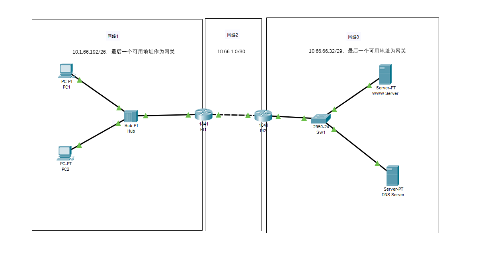

---
aliases:
- /archives/84
categories:
- 网络基础
date: 2018-12-24 10:23:10+00:00
draft: false
title: 子网计算和Packet Tracer入门
---

大部分情况下都要计算子网以实现环境内按需配置，博主我入坑网络大概有5年了，结合自己玩过的很多东西总结下经验，子网计算可以并不像课本中讲到的那么麻烦

当然，也可以使用工具在线计算，好比[^1]，这个工具还是挺好用的
[^1]: https://www.sojson.com/convert/subnetmask.html

## 地址数量与掩码

当子网掩码为/24时，其相应的点分十进制表示为255.255.255.0，对应的二进制格式为11111111.11111111.11111111.00000000。子网掩码（24）即对应其二进制形式中从头到尾1的数量，进而再将00000000取反求值，为255，加上网络地址的1个地址，该地址块包含256个地址

当子网掩码为/25是，对应的二进制形式为11111111.11111111.11111111.10000000，最后一段10000000又可以按照下面的表格来计算

| 第8位 | 第7位 | 第6位 | 第5位 | 第4位 | 第3位 | 第2位 | 第1位 |
| ---- | ---- | ---- | ---- | ---- | ---- | ---- | ---- |
| 2^7 | 2^6 |  2^5 | 2^4 | 2^3 | 2^2 | 2^1 | 2^0 |
| 128 | 64 | 32 | 16 | 8 | 4 | 2 | 1 |

其中100000000的1对应上述表格第8位，其余位为0，直接快速计算得128，因此按照点分十进制记法表示就是255.255.255.128。最后一段为100000000，对7个0取反，得到127，加上一个网络地址，得到该地址块数量为128

综上规律，我们就可以得到下述表格:

| 掩码 | 点分十进制 | 取反的地址 | 地址块中地址数量 |
| ---- | ---- | ---- | ---- |
| 31 | 255.255.255.254 | 1 | 2 |
| 30 | 255.255.255.252 | 11 | 4 |
| 29 | 255.255.255.248 | 111 | 8 |
| 28 | 255.255.255.240 | 1111 | 16 |
| 27 | 255.255.255.224 | 11111 | 32 |
| 26 | 255.255.255.192 | 111111 | 64 |
| 25 | 255.255.255.128 | 1111111 | 128 |
| **24** | **255.255.255.0** | **11111111** | **256** |
| 23 | 255.255.254.0 | 1.11111111 | 512 |
| 22 | 255.255.252.0 | 11.11111111 | 1024 |
| 21 | 255.255.248.0 | 111.11111111 | 2048 |
| 20 | 255.255.240.0 | 1111.11111111 | 4096 |
| 19 | 255.255.224.0 | 11111.11111111 | 8192 |
| 18 | 255.255.192.0 | 111111.11111111 | 16384 |
| 17 | 255.255.128.0 | 1111111.11111111 | 32768 |
| 16 | 255.255.0.0 | 11111111.11111111 | 65536 |
| 15 | 255.254.0.0 | 1.11111111.11111111 | 131072 |
| 14 | 255.252.0.0 | 11.11111111.11111111 | 262144 |
| 13 | 255.248.0.0 | 111.11111111.11111111 | 524288 |
| 12 | 255.240.0.0 | 1111.11111111.11111111 | 1048576 |
| 11 | 255.224.0.0 | 11111.11111111.11111111 | 2097152 |
| 10 | 255.192.0.0 | 111111.11111111.11111111 | 4194304 |
| 9 | 255.128.0.0 | 1111111.11111111.11111111 | 8388608 |
| 8 | 255.0.0.0.0 | 11111111.11111111.11111111 | 16777216 |

## 由数量快速推地址池

### 10.1.66.192/26

由掩码/26可得该地址块中地址数量有64个，由于点分十进制记法每段最大值只能是255（由于是从0开始，所以实际数量是256），使用192除以地址块数量64，刚好整除，因此该10.1.66.192就是网络地址（相当于192.168.1.0/24中的0），下一个地址块的网络地址为256，因此减去1得到广播地址为10.1.66.255，可用地址即为10.1.66.193-10.1.66.254

### 10.66.1.0/30

掩码：30

地址块中地址数量：4

0除以4，整除，下一个地址块网络地址为10.66.1.4，减1得到广播地址10.66.1.3，可用地址即为10.66.1.1-10.66.1.2

### 10.66.66.32/29

掩码：29

地址块中地址数量： 8

32除以8，整除，该地址为网络地址。于是下一个地址块的网络地址为10.66.66.40，减一得广播地址10.66.66.39，可用地址10.66.66.33-10.66.66.38

## 算地址

由上文计算可得，

**网络一**：10.1.66.192/26，子网掩码点分十进制记法：255.255.255.192，地址池：10.1.66.193-10.1.66.254。

我将PC1的接口地址配置为10.1.66.193，PC2的接口地址为10.1.66.194，该区域中网关地址配置为10.1.66.254

**网络二**：10.66.1.0/30，子网掩码点分十进制记法：255.255.255.252，地址池：10.66.1.1-10.66.1.2

因为该地址池中只有两个可用IP，所以我们可以认定可以将该区域归属到一个局域网中，并没有存在NAT

我将Rt1（路由器1）的在网络2中的接口IP配置为10.66.1.1，将Rt2在网络2中的接口IP配置为10.66.1.2

**网络三**：10.66.66.32/29，子网掩码点分十进制记法：255.255.255.248，地址池：10.66.66.33-10.66.66.38

我将WWW服务器的接口IP配置为10.66.66.33，将DNS服务器的接口IP配置为10.66.66.34

## 配置接口IP和静态路由

  * 配置PC1的接口IP，PC2和服务器以此类推。
  * 配置路由器1在网络一区域中的接口IP：，并且完成路由器1在网络二中的网卡接口IP，添加如下的静态路由：，确保前往10.66.66.32/29这个地址块中的所有L3报文能够正常被路由过去；同时也要为路由器2添加相应的回程路由
  * 为DNS服务器添加静态的A记录，使**www.baidu.com**解析到WWW服务器，如图 
  * 打开WWW服务器的HTTP服务
  * 在PC1或者PC2中启用WEB浏览器，即可访问成功

## 特别注意

  * 默认情况下，路由器的接口默认是关闭的，请记得将接口打开后再执行ping等操作，不然网络不会通的
  * 对于路由并不了解的，可以再看我的另外一篇主讲路由的文章**超网与无类域间路由(CIDR)**
