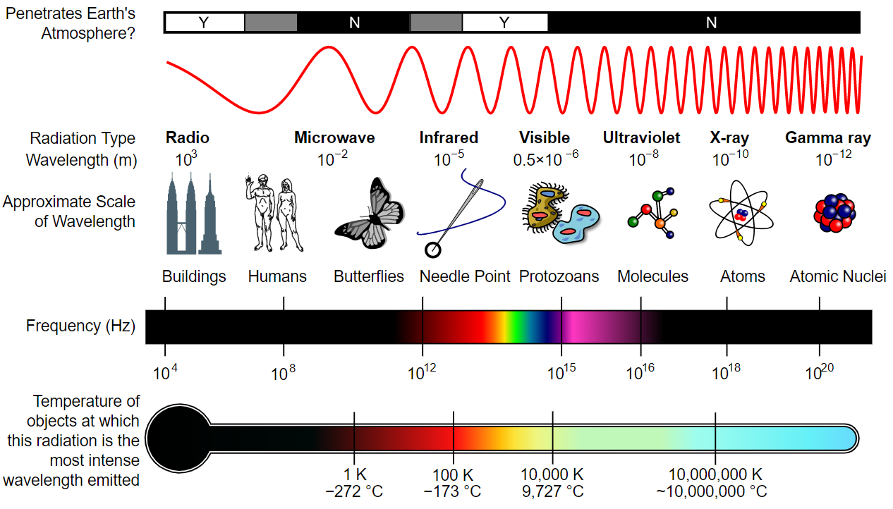
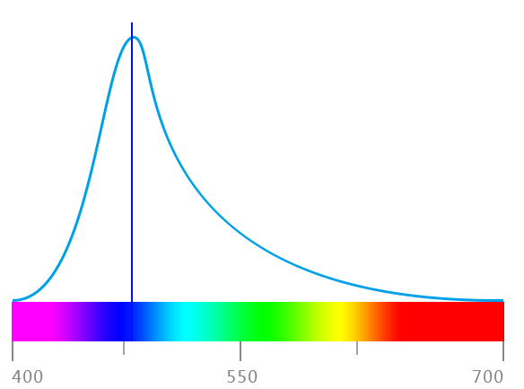
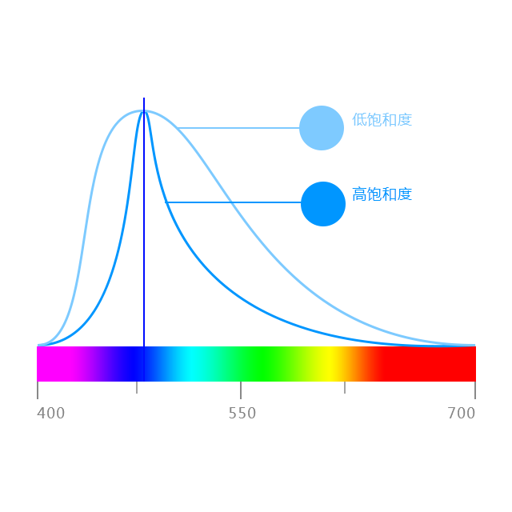
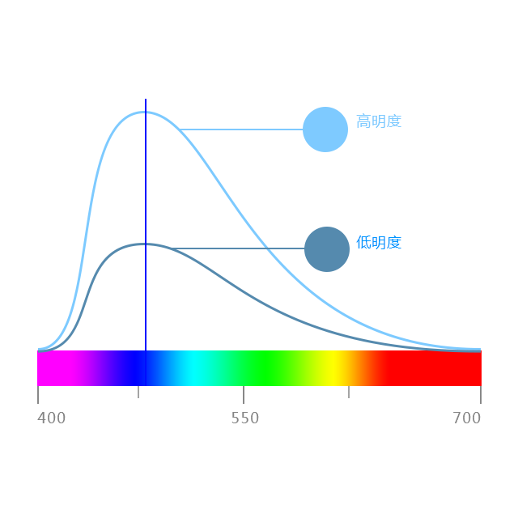
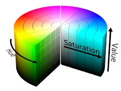
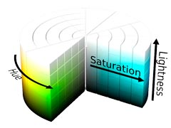

---
aliases:
- /archives/915
categories:
- 摄影
date: 2020-02-14 06:39:07+00:00
draft: true
title: 摄影入门——色彩基础
---

这篇文章是我在写其他文章写到一半不得不拐回来写的，理由就是我把色彩好多术语混淆了(。

在本文开始之前，让我们先了解一下可见光<figure class="wp-block-image size-large">

 <figcaption>图1. 电磁波谱  
图片来源：By Inductiveload, NASA – self-made, information by NASABased off of File:EM Spectrum3-new.jpg by NASAThe butterfly icon is from the P icon set, File:P biology.svgThe humans are from the Pioneer plaque, File:Human.svgThe buildings are the Petronas towers and the Empire State Buildings, both from File:Skyscrapercompare.svg, CC BY-SA 3.0, https://commons.wikimedia.org/w/index.php?curid=2974242</figcaption></figure> <figure class="wp-block-image size-large">

<figcaption>图2. 可见光  
图片来源：CC BY-SA 3.0, https://commons.wikimedia.org/w/index.php?curid=2521356</figcaption></figure> 

可以看到，可见光谱只是电磁波谱中的一小部分，这400nm – 700nm波长的电磁波就是我们所能看到的色光。

## 色彩三要素

色彩三要素即色彩模式，常见的有RGB、CMYK、HSB和HSL等，HSL（Hue、Saturation、Lightness），HSB（等同于HSV，最后一个词是Value/Brightness）。虽然有RGB模式存在，但是这种模式只对机器比较友好，这三个数字对人类来说并不是很直观，因此设计了HSB/HSL模式便于人类选择。

这么说起来其实RGB、HSL、HSB等不同的色彩模式可以相互转化，只是基本构成元素不一样而已。于是我博主我默默选择了RGB并抛弃了HSL、HSB等，决定下边的内容不再详细阐述了。

### 色相 Hue

又被称为色调，是色彩最重要的特征。这一属性通常就指的红、橙、黄、绿等，改变色相比改变饱和度和明度带来的视觉差异更加显著，因此也才被认为是色彩最重要的特征。

关于色相的定义，其实就是指的光谱中波峰的位置，就比如下图3

<figure class="aligncenter size-large">

<figcaption>图3. 色相在光谱中的定义</figcaption></figure>

### 饱和度 Saturation

饱和度也即色彩浓度，从最纯的色彩到无色彩的过程

<figure class="aligncenter size-large">

<figcaption>图4. 饱和度（纯度）在光谱中的定义</figcaption></figure>

### 明度 Brightness

<figure class="aligncenter size-large">

<figcaption>图5. 明度在光谱中的定义</figcaption></figure>

### HSL/HSV的对比

<figure class="aligncenter size-large">

<figcaption>图6. HSV色彩模式</figcaption></figure>

<figure class="aligncenter size-large">

<figcaption>图7. HSL色彩模式</figcaption></figure>

