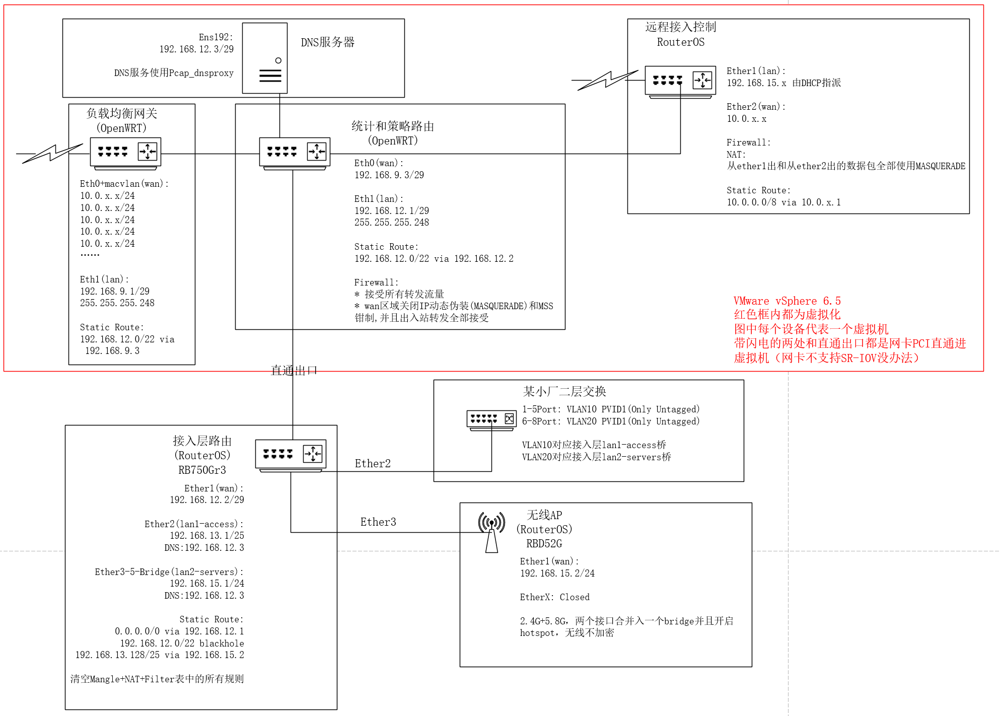
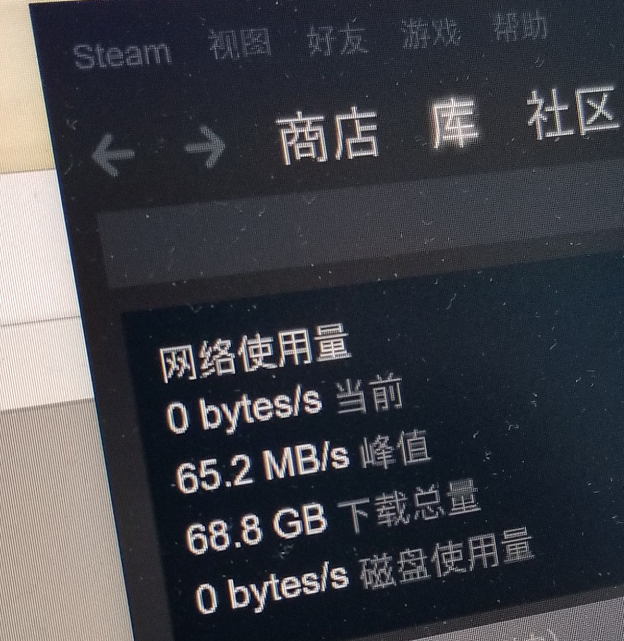
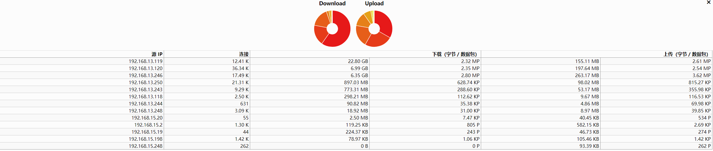

---
aliases:
- /archives/95
categories:
- 网络基础
date: 2019-01-22 10:32:27+00:00
draft: false
title: 一个小型的办公网结构及优化方案
---

首先，这套网络的拓扑结构在实验室部署并且已经投入使用，稳定性和扩展性确实还不错，比较适合小型办公网部署。当前该网络实现了一些很不起眼但是确实很实用的功能：有将近600Mbps的带宽、策略路由、校园网内远程接入和访问、全局流量分析、DNS查询优化、Windows激活、路由结构优化等。都是些很容易实现而且很简单的功能，只不过堆起来形成体系后带来的效果确是非常棒的

# 拓扑



# 详解

在整个拓扑的规划和实施过程中，也考虑了很多东西，总结一下，这个自己娱乐的办公网有什么功能呢：

  1. 局域网内所有**非标记流量**(见下文)全网内只有一次经过NAT表，即在最后负载均衡Mangle表结束后才会进一次NAT并完成MASQUERADE，除了网关处的此次DNAT，其他所有节点都是只路由不做地址转换，降低负载，提高转发率。相对于纯L2转发确实会损失掉不少的（设备不行）背板带宽，但是广播泛洪控制和L3 ACL做不了。网内总路由节点位于RB750Gr3，CPU是MT7621A，无规则情况下路由(fast path)吞吐可达1,972.2Mbps的极限（官方数据），够用了
  2. 至于为什么要使用RB750Gr3+RBD52G来分离有线和无线，而不使用一台RBD52G完成所有的工作的原因是：我要开Hotspot，Hotspot会在Filter和NAT表中产生规则，流量要走进防火墙就没办法使用Fast Path，性能会骤降
  3. 负载均衡我使用的mwan3搭配自己写的平衡算法，暂时先不公开，感兴趣后边可以去关注我的论文和相关文章。在mwan3的规则里，针对所有目的IP为10.0.0.0/8的包开启了粘滞模式并设置了超长的粘滞时间，同时在该规则之前，还会对前往校内DNS的所有请求进行平衡。为了确保DNS查询足够稳定，每次DNS远程请求均会触发一次重复请求，以降低DNS请求的丢失率提高DNS的服务质量，由于DNS的无状态性，平衡了也没事，正好避免粘滞后万一有出口down掉了导致转发的DNS请求直接挂了…由于校内总出口是统一的，出口也部署了相关的负载均衡，所以直接按包做标记和统计而不必标记连接进行平衡
  4. macvlan是个好东西， **ip link add link ethX vifX type macvlan** 即可，相关配置写个bash shell script循环在/etc/config/network写入接口配置和跃点就行了
  5. 学校的交换机开启了端口隔离，以至于整个广播域内Ping都Ping不通（什么傻逼操作），为了判定哪些IP是持久空闲的，不得不在另外一个段的服务器上做持续ping监控，然后用Python随便写了个工具Pinger ，仓库地址： https://github.com/ic0xgkk/pinger ，ping操作持续记录进SQLite3的数据库中，想看最后哪些IP是空闲的直接 `SELECT DstIP FROM (SELECT DstIP, SUM(Delay) AS DS FROM 10_0_x_0_24_20190116 GROUP BY DstIP) AS ALT WHERE DS=0;` 输出的结果就是ping统计为0（即持续没人用的）的IP地址，可以长期观察个几天。 为了高效使用好校园网，该工具适当使用了多线程和数据库队列，娱乐一番 
  6. 附赠几个规则，用于策略路由 
```bash
#!/bin/bash

#Restore ipset list

ipset restore > /fre/ge/ipset

#iptables Ge
ip route add local default dev lo table 100
ip rule add fwmark 1 lookup 100

iptables -t mangle -N VTFRE_M_GE_GATE
iptables -t mangle -N VTFRE_M_GE_TCP
iptables -t mangle -N VTFRE_M_GE_UDP

iptables -t mangle -A PREROUTING -m set --match-set ge_userlist src -i br-lan -j VTFRE_M_GE_GATE
iptables -t mangle -A VTFRE_M_GE_GATE -p tcp -g VTFRE_M_GE_TCP
iptables -t mangle -A VTFRE_M_GE_GATE -p udp -g VTFRE_M_GE_UDP

iptables -t mangle -A VTFRE_M_GE_TCP -m set --match-set ge_chnroute dst -j RETURN
iptables -t mangle -A VTFRE_M_GE_TCP -m set --match-set ge_exdclist dst -j RETURN
iptables -t mangle -A VTFRE_M_GE_TCP -m set --match-set ge_locallist dst -j RETURN
iptables -t mangle -A VTFRE_M_GE_TCP -j MARK --set-mark 11

iptables -t mangle -A VTFRE_M_GE_UDP -m set --match-set ge_chnroute dst -j RETURN
iptables -t mangle -A VTFRE_M_GE_UDP -m set --match-set ge_exdclist dst -j RETURN
iptables -t mangle -A VTFRE_M_GE_UDP -m set --match-set ge_locallist dst -j RETURN
iptables -t mangle -A VTFRE_M_GE_UDP -p udp -j TPROXY --on-port 10888 --tproxy-mark 0x01/0x01

iptables -t nat -A PREROUTING -p tcp -m mark --mark 11 -j REDIRECT --to-ports 10888

#start ge
/fre/ge/vxxx -config /fre/ge/config.json > /dev/null &

```
ipset的列表自行man导入和保存方法。此处不得不说的是，由于网内关闭了NAT，很方便得，所有通过该处的流量均会拥有其原本的源IP，ge_userlist即用户IP列表，匹配到的源IP的流量才会进到相应的Chain中。所以，此处的**标记流量**由于还会在NAT表中经过一次REDIRECT，所以这部分流量是全局两次NAT（总比层层NAT好吧 = =） 
7. 上条所见，开头都有个ge_，意思是general，相对还有一个game。我要PUBG，这鬼东西流量走HK无法登录 = = ， 所以在完整的规则中ga_会先在ge_前完成匹配，确保我能正常PUBG。意外发现，PUBG走台湾快很多
8. 编译了vlmcsd到策略路由的设备里，DNS服务器加一条SRV记录指向该路由器即可安装后自动激活。下列是手动激活方法： 
```powershell
:: Office2016（x64）
cd C:\Program Files\Microsoft Office\Office16
CSCRIPT OSPP.VBS /SETHST:192.168.12.1
CSCRIPT OSPP.VBS /ACT
CSCRIPT OSPP.VBS /DSTATUS

:: Windows
cd C:\Windows\System32
CSCRIPT /NOLOGO SLMGR.VBS /SKMS 192.168.12.1
CSCRIPT /NOLOGO SLMGR.VBS /ATO
CSCRIPT /NOLOGO SLMGR.VBS /XPR
```

  1. 使用Hotspot方便管理无线接入，接入的无线自动绑定MAC和IP，网关处调整起来也方便。对于常用设备，设置了bypass。无线Hotspot开启了SSL，开放的WiFi认证肯定不能再明文传输密码啊
 1.  DNS使用了三向解析，学校DNS+CloudflareDNS+114DNS，对DNS请求使用了正则去匹配，包含学校域名的会转发到校内DNS请求免得绕到公网去，剩下的根据域名判断使用哪个DNS解析。同时，部署了查询缓存。对于Pcap_dnsproxy的使用方法，详情可以看我的另外一篇文章
 2.  远程接入吧，由于10.0.0.0/8的流量要走主网关，再加一条回程路由到远程接入系统会冲突，干脆直接两边都NAT得了，反正流量也不大，Filter表写好防护规则就行了，正好还对IP进行了匿名化（traceroute看不到路由的，只会显示1跳）
 12. 所有用到的OpenWRT都是自己编译的，裁剪掉了很多没用的模块，连驱动都是只编译了vmxnet，专用。模块和功能全部是按需编译

# 结果

所以说最后网速到底有多快呢？


临走时看了CPU负载，处处负载都在10%以下

出去吃个饭的功夫GTA5下好了 (ಥ _ ಥ)

其他功能就不做展示了，自行想象吧

另外，流量的统计一览无余：




接入端口和无线是有做绑定的，只有DHCP下发才会添加进ARP记录，非ARP绑定列表内的会全部丢掉~手工改IP没用的~