---
categories:
- 建机房
date: 2025-01-13 23:13:21+00:00
draft: false
tags:
- 嵌入式
- ESP8266
- Arduino
- ZABBIX
- Grafana
- HomeAssistant
title: 降本25%——闭环数据和设备，改善机房散热效率
description: 自己有个机柜，常年运行，由于风扇风量不够，导致机柜里积热，散热效率低，只能通过把空调温度调低的方式改善积热，但是又带来了高额的电费账单。为了解决这个问题，我手搓了一个风扇控制器，把传感器数据都接入了，最终实现了机器健康运行、机柜不积热、空调省电三重效果，一年能给机房省上千电费。
---

## 背景

自己有个机柜，常年运行，由于风扇风量不够，导致机柜里积热，散热效率低，只能通过把空调温度调低的方式改善积热，但是又带来了高额的电费账单。

## 解决方案

为了解决这个问题，需要一套方法估算机柜是否积热，在尽可能调高空调温度的情况下，动态调整风扇转速，并预留转速空间，以实现机器健康运行、机柜不积热、空调省电三重效果。

要实现这一目的，有这几件事要做：

- 把风扇接入到监控体系内，确保转速能够上报，停转（故障）能够第一时间报警。
- 把温度传感器接入到监控体系内，可视化数据并且用于分析是否积热。
- 允许动态控制风扇转速，确保风扇转速能够跟随机柜内温度变化和积热情况调整。

这篇文章，我就着重前两项分享一下，第三项数据的反馈环节还需要一些时间才能落地，这篇文章先不提，后边看要不要单独出一篇文章讨论，想看就在下方留个评论～

## 结果

**这个方案有用吗？有用。**

我们来看下边这个图，从8月21日这个方案上线开始，温度传感器数据显示，环境温度在上升（空调调高），但是机柜顶部温度（排出风温度）在下降，并且顶部温度-底部温度的函数求导后没有递增，说明机柜不再积热。当然不再积热，主要功劳应该是更换了风量更大的风扇。

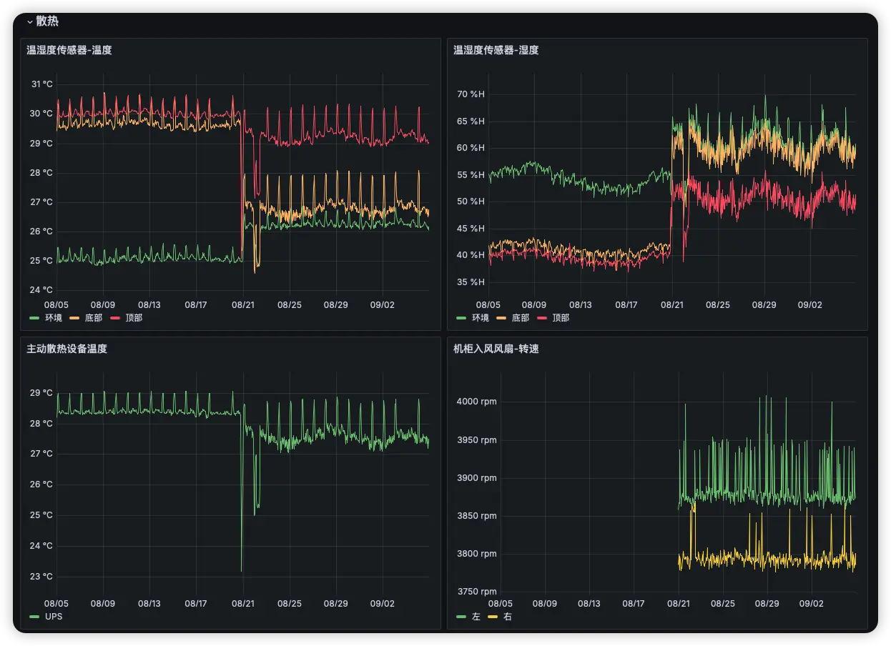

我们看下边这个图，从8月21日这个方案上线开始，空调能耗波动开始加剧，因为是定频空调，不是变频空调，所以能耗波峰、波谷数据间隔加大，展示出了更多的毛刺，说明产生了效果。

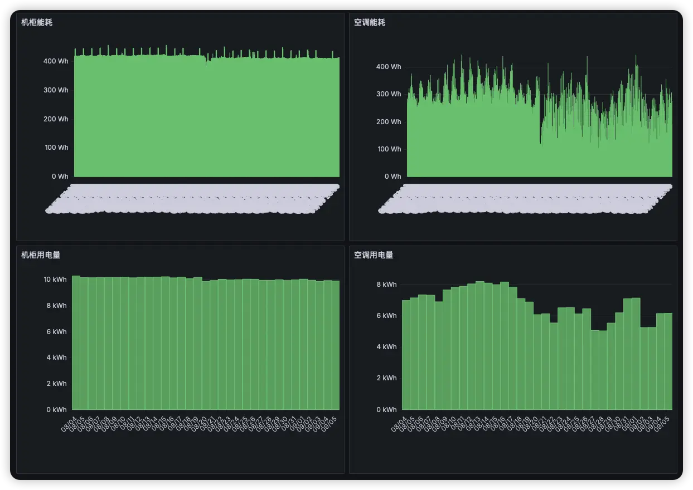

**那么这套方案带来了多大的收益？**

由于上边两个图数据较多，不太好量化结果，这里我画了一个新的看板，直接对比8月12日-8月19日、8月21日-8月28日两段时间内的平均能耗数据。

从下边两个图可以看到，平均功率从326W下降到了246W，降低了24.5%，也就是节省了24.5%的电费。**而且，在达到这个结果的同时，机柜温度反而更低了。**

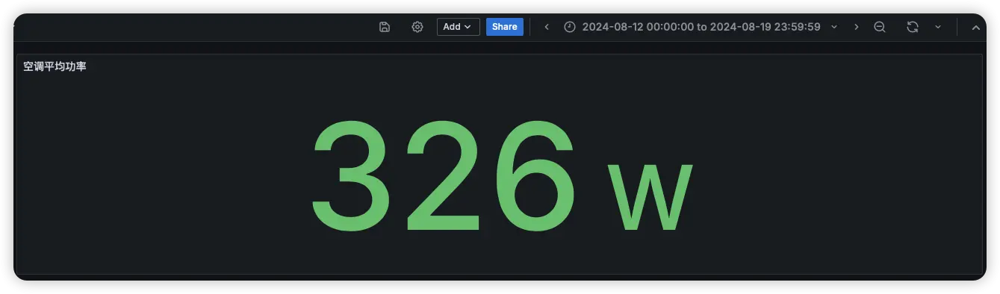

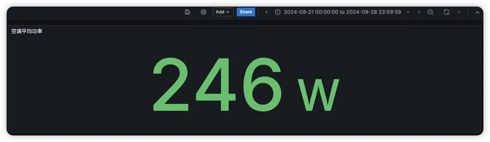

## 风扇控制器

为了能让风扇上报转速信息、能够动态控制转速信息，我需要一个独立的控制板来连接风扇硬件和监控系统，由于市面上没有适合的产品，我就唤起了我死去的知识，设计了一个PCB板来做这个工作。

这个PCB板使用ESP8266主控，配合两级稳压实现对12V、24V风扇电源的兼容，同时也可以兼容普通的台式机电脑风扇。还加了一个串口，因为我比较懒，直接把配置直接写在代码里的，因此需要通过刷机来给板子写配置，这时候就需要板子本身带有串口芯片。刚好我是嘉立创的新用户，送去打样+SMT总共才40多块钱，加上自己焊的ESP8266，一个板子的成本大概在20块钱左右，价格很划算，即便不SMT，自己手焊一个钟也可以焊完2片。

### 电路设计

这里我公开电路图给大家，工程文件放博客容易被刷CDN流量，就不放这里了，想要工程文件或者成品板子的朋友可以私聊我。

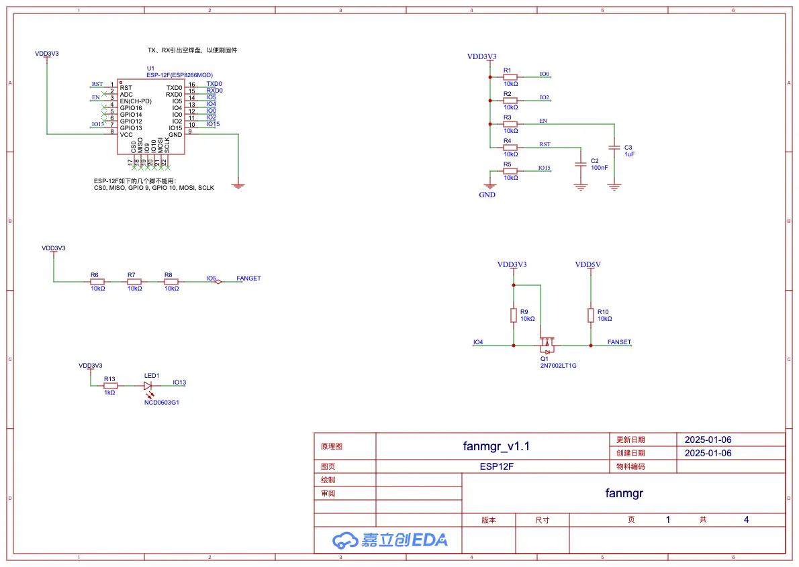

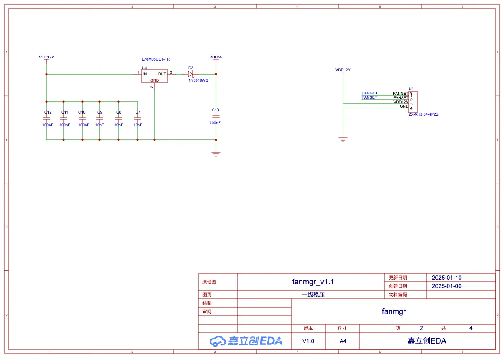

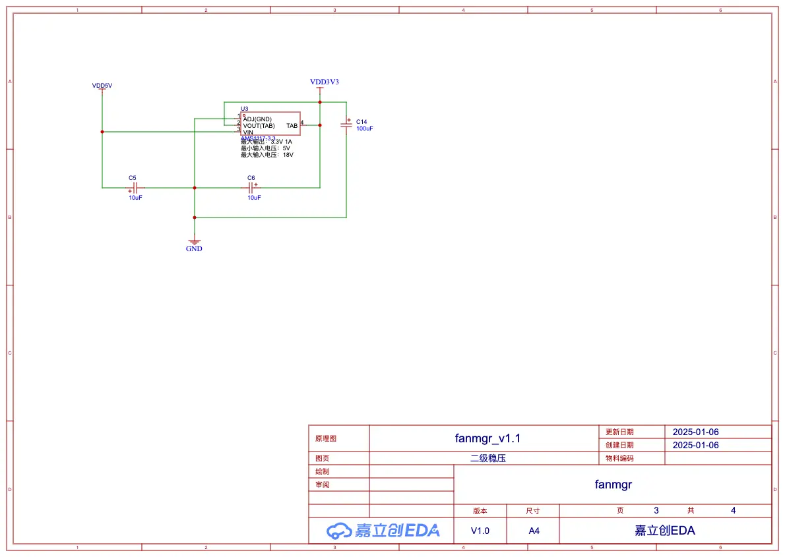

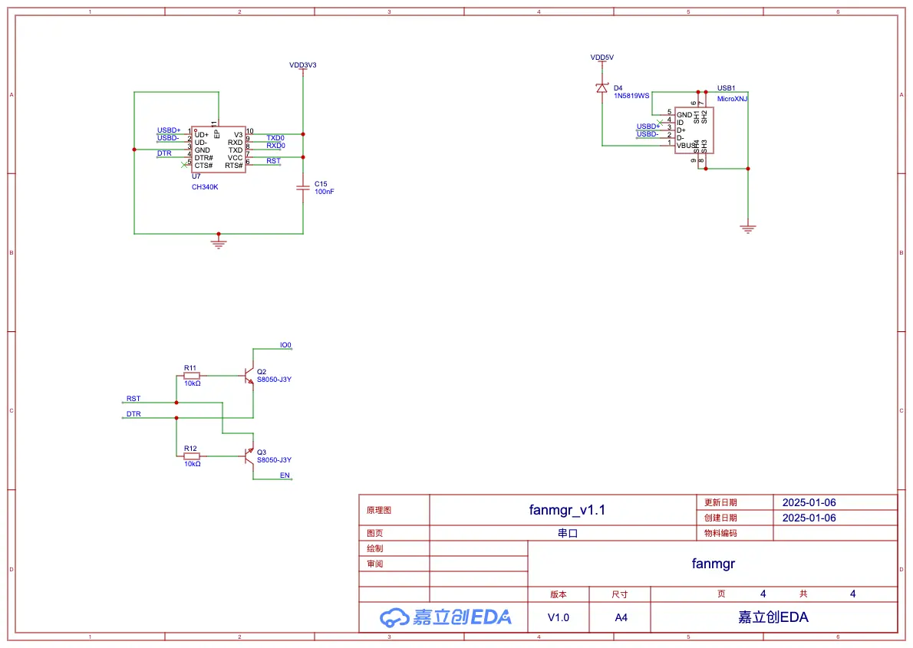

### 成品图

成品就是下面这样，左侧是刚刚焊好的，右侧是已经打胶的。

整个板子我做了一层胶封，用硅胶密封，以保证绝缘、防水、防静电、阻燃，这样就不用再去Solidworks画外壳和3D打印外壳了。等待硅胶固化后，背面粘几个磁铁（避开天线），吸在机柜里的托盘下方就可以了，还可以被风扇吹着，帮助LDO稳压芯片降温。

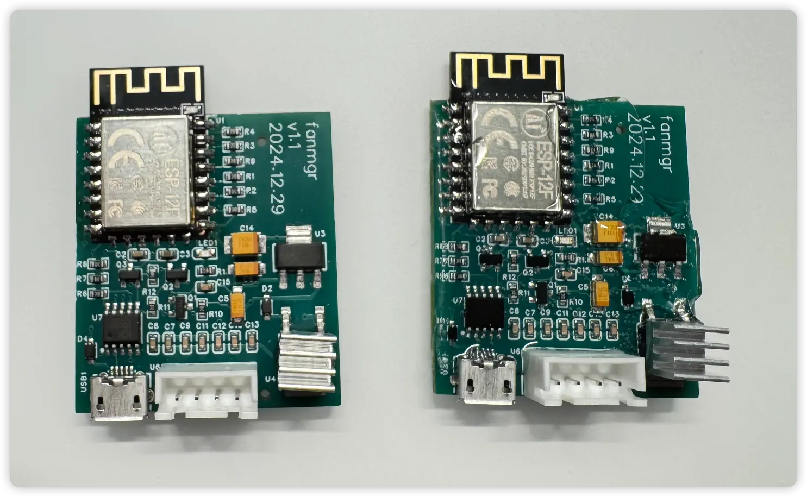

### 为什么不使用标准接口

台式机电脑主板用的风扇接口是标准的2510规格，根据是否支持PWM调速会分为3P和3+1P插针。这里不使用标准接口，是因为我在机柜里使用的风扇电流可以到5A，虽然电源层还有很大的空间可以铺铜走5A电流，但是通孔和插针不一定能扛得住，会比较极限，出于安全考虑，没有这样设计。

其次一个原因是，标准的风扇接口没有固定卡扣，加上我是倒着安装，伴随机柜长期的高频振动，可能会松动。我这个板子背面可以装小磁铁，打算是吸在机柜托盘的下面，再插线控制风扇，换用了XH 2.54接口，它带了两个卡扣，一定程度上有利于固定。

出于这些考虑，索性没有在板子上设计DC供电口，也就不打算支持电源-控制板-风扇的路径，而是电源-风扇-旁路控制板。

### 为什么不使用电压控制

因为四线的风扇带有霍尔传感器，可以测速，如果风扇停转坏掉了，通过霍尔传感器可以读到停转，进而就可以通过ESP8266把停转信息发出去。如果单纯使用电压控制，就没办法知道风扇的情况了。

## 风扇选型和使用

风扇需要支持PWM控制，并且要考虑风量尽可能大，这里我选择了台达的PFC1212DE风扇，12038规格，12V电压，最高5500RPM。

这个风扇最牛逼的地方在于，风量足足有252CFM，风压也大，这对于我进风口还加了灰尘滤网的条件下非常有用。但是也有代价，这个风扇有峰值接近5A的电流。

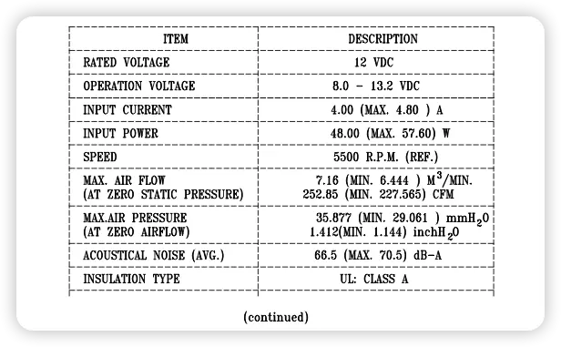

由于进风口还有灰尘滤网，因此风扇不能和滤网直接装在一起，不然太近距离会产生乱流，导致风压降低。为了尽可能提高风压，我想到了一个非常简单的办法——去买坏的120XX规格风扇，买两个几块钱，到货之后把风扇内部件拆掉，只留一个外框，然后买一点M4的螺栓，100mm长，把风扇套在一个空框上，再用热溶胶密封，就可以达到一定的增压效果了。由于风扇不在我旁边，没有办法拍图，这里就不放了。

拿到风扇后，改装一下风扇线，将电源（VDD12V、GND）短接给控制板，将PWM测速（FANGET）、控制线（FANSET）完全接给控制板，就可以使用了，具体引脚定义如下图。

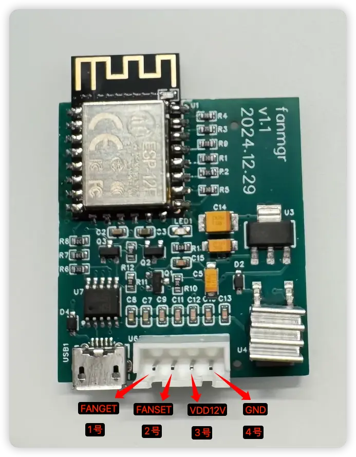

## 使用HTTP控制风扇

接下来，要把风扇和应用层打通，这里我使用HTTP协议，方便后续和其他系统集成，也方便手动调测和ZABBIX采集数据。ESP本身就有WebServer的库可以用，直接就可以在ESP8266上运行HTTP服务。

在VSCode中，安装一个叫做PlatformIO的插件，使用如下配置创建项目。

```bash
[env:nodemcuv2]
platform = espressif8266
board = nodemcuv2
framework = arduino
lib_deps = bblanchon/ArduinoJson@^7.3.0
```

配置文件的代码。

```cpp
// WiFi名称，最长31个字符。
const char *wifi_ssid = "ssid";

// WiFi密码，最长63个字符。
const char *wifi_password = "password";

// 主机名，最长23个字符。
// 注意需要符合正则`[a-zA-Z0-9\-]+`，否则可能无法启动。
const char *hostname = "hostname";

// HTTP请求头Authorization的Bearer Token，最长63个字符。
// 通过HTTP请求修改风扇等配置时使用。
// 注意需要符合正则`[a-zA-Z0-9]+`，否则可能解析失败。
const char *token = "token";
```

风扇控制器的代码。

```cpp
#include <ESP8266WiFi.h>
#include <WiFiClient.h>
#include <ESP8266WebServer.h>
#include <EEPROM.h>
#include <ArduinoJson.h>
#include "config.hpp"

// 选择0号UART作为日志输出口。
HardwareSerial serial = HardwareSerial(0);
ESP8266WiFiClass wifi = ESP8266WiFiClass();
// 监听80端口。
ESP8266WebServer server(80);

struct flash_config {
    // 风扇转速百分比，0-100。
    uint8_t fan_percent;
} config;

// ESP核心板的LED灯，拉低点亮。
const uint8_t WIFI_LED_PIN = D4;
// GPIO 5 风扇测速针脚。
const uint8_t FAN_GET_PIN = D1;
// GPIO 4 风扇调速针脚。
const uint8_t FAN_SET_PIN = D2;
// GPIO 13 系统LED灯，拉低点亮。
const uint8_t SYS_LED_PIN = D7;

inline void reverse_pin(uint8_t pin) {
    int s = digitalRead(pin);
    s = s == LOW ? HIGH : LOW;
    digitalWrite(pin, s);
}

inline void turn_off_pin(uint8_t pin) {
    digitalWrite(pin, LOW);
}

inline void turn_on_pin(uint8_t pin) {
    digitalWrite(pin, HIGH);
}

void load_config() {
    EEPROM.get(0, config);
}

// 如果保存失败，返回非0值。
int save_config() {
    EEPROM.put(0, config);
    if (!EEPROM.commit()) {
        serial.println("save config failed.");
        return -1;
    }

    return 0;
}

// 设置IO口的占空比，0-100。
void set_pin_percent(uint8_t pin, uint8_t percent) {
    if (percent < 0 || percent > 100) {
        serial.printf("invalid fan percent `%d`.\n", percent);
        return;
    }

    serial.printf("set fan percent to `%d`.\n", percent);
    analogWrite(pin, float_t(percent) / 100.0 * 255.0);
}

void handle_not_found() {
  server.send(404, "application/json", "{\"error\": \"not found\"}");
}

// 计算转速。
int get_fan_rpm() {
    uint8_t pin = FAN_GET_PIN;

    // 读两次，得出高低电平的时间，两次读取超时均0.5秒，因此如果风扇停转，1秒就会返回结果。
    int highTime = pulseIn(pin, HIGH, 500000UL);
    int lowTime = pulseIn(pin, LOW, 500000UL);

    // 如果高低电平时间都为0，说明超时了，一般是风扇停转了，可以直接返回0。
    if (highTime == 0 && lowTime == 0)  
        return 0;
    
    // 算出一秒内的周期数量。
    int period = highTime + lowTime;
    float freq = 1000000.0 / (float)period;

    // 一个周期对应两个脉冲，因此转速是频率的一半。
    return (freq * 60.0) / 2.0;
}

bool has_right_token() {
    if (!server.hasHeader("Authorization"))
    {
        server.send(401, "application/json", "{\"error\": \"missing Authorization header\"}");
        return false;
    }

    String auth = server.header("Authorization");
    if (auth != "Bearer " + String(token))
    {
        server.send(401, "application/json", "{\"error\": \"invalid token\"}");
        return false;
    }

    return true;
}

void handle_get_fan_percent_and_rpm() {
    int rpm = get_fan_rpm();

    char buf[128];
    snprintf(buf, sizeof(buf), "{\"fan_percent\": %d, \"fan_rpm\": %d}", config.fan_percent, rpm);

    server.send(200, "application/json", buf);
}

void handle_set_fan_percent() {
    if (!has_right_token()) return;

    String jsonString = server.arg("plain");

    // 解析json body。
    JsonDocument doc;
    DeserializationError err = deserializeJson(doc, jsonString);
    if (err)
    {
        server.send(400, "application/json", "{\"error\": \"invalid json body\"}");
        return;
    }

    // 从json body中获取风扇转速百分比。
    if (!doc["fan_percent"].is<int>())
    {
        server.send(400, "application/json", "{\"error\": \"fan_percent must be integer\"}");
        return;
    }
    int fan_percent = doc["fan_percent"].as<int>();
    if (fan_percent < 0 || fan_percent > 100) {
        server.send(400, "application/json", "{\"error\": \"invalid fan_percent\"}");
        return;
    }
    
    config.fan_percent = fan_percent;
    if (save_config() != 0) {
        server.send(500, "application/json", "{\"error\": \"failed to commit config to flash\"}");
        return;
    }

    set_pin_percent(FAN_SET_PIN, fan_percent);

    server.send(200);
}

void setup()
{
    serial.begin(9600);
    EEPROM.begin(512);

    pinMode(WIFI_LED_PIN, OUTPUT);
    pinMode(SYS_LED_PIN, OUTPUT);
    pinMode(FAN_SET_PIN, OUTPUT);

    load_config();

    // 启动时先打开WIFI LED，然后把SYS LED设置为低亮度。
    turn_off_pin(WIFI_LED_PIN);
    set_pin_percent(SYS_LED_PIN, 95);
    
    set_pin_percent(FAN_SET_PIN, config.fan_percent);

    serial.printf("connecting to wifi `%s`...\n", wifi_ssid);
    if (!wifi.hostname(hostname))
    {
        serial.println("failed to set hostname.");
        return;
    }
    wifi.begin(wifi_ssid, wifi_password);
    
    serial.println("starting web server...");
    server.onNotFound(handle_not_found);
    server.on("/fan", HTTP_GET, handle_get_fan_percent_and_rpm);
    server.on("/fan", HTTP_POST, handle_set_fan_percent);
    server.begin();

    while (wifi.status() != WL_CONNECTED)
    {
        delay(1000);
        serial.println("waiting for wifi connection...");
        reverse_pin(WIFI_LED_PIN);
    }

    serial.println("WiFi connected.");
    serial.printf("IP address: `%s`\n", wifi.localIP().toString().c_str());
    serial.printf("MAC address: `%s`\n", wifi.macAddress().c_str());
    serial.printf("Hostname: `%s`\n", wifi.hostname().c_str());

    // WiFi连上了，核心板上的灯常亮。
    turn_off_pin(WIFI_LED_PIN);

    // 初始化完成，系统灯常亮。
    turn_off_pin(SYS_LED_PIN);
}

void loop()
{
    // 确保WiFi是连上的，再进行后续操作，否则就结束循环。
    while (wifi.status() == WL_CONNECTED)
    {
        server.handleClient();
    }
}

```

完成后，接通风扇，等待控制板连接上WiFi后，就可以通过curl请求获取到风扇转速。

```bash
curl http://XX.XX.XX.XX/fan
{"fan_percent": 55, "fan_rpm": 3868}
```

也可以通过curl请求设置风扇转速，这里我设置50%转速。

```bash
curl -XPOST \
     -H "Content-Type: application/json" \
     -H "Authorization: Bearer token" \
     -d '{"fan_percent": 50}' \
     http://XX.XX.XX.XX/fan
```

## 接通ZABBIX

将下边JSON保存，并导入到ZABBIX中。

```json
{
    "zabbix_export": {
        "version": "6.4",
        "template_groups": [
            {
                "uuid": "659a713f15cd4752869bd75227237d52",
                "name": "Templates"
            }
        ],
        "templates": [
            {
                "uuid": "5db40bdc4275436484cf3aa76fc0629e",
                "template": "fanmgr.v1",
                "name": "\u98ce\u6247\u63a7\u5236\u5668V1",
                "groups": [
                    {
                        "name": "Templates"
                    }
                ],
                "items": [
                    {
                        "uuid": "dfbca98e20054d40b6fffabc0e429ec7",
                        "name": "\u8f6c\u901f",
                        "type": "HTTP_AGENT",
                        "key": "rpm",
                        "history": "365d",
                        "trends": "0",
                        "units": "RPM",
                        "preprocessing": [
                            {
                                "type": "JSONPATH",
                                "parameters": [
                                    "$.fan_rpm"
                                ]
                            }
                        ],
                        "timeout": "10s",
                        "url": "http://{$IP}/fan",
                        "headers": [
                            {
                                "name": "Content-Type",
                                "value": "application/json"
                            }
                        ],
                        "triggers": [
                            {
                                "uuid": "2b80475081d042d8819eaaf704e127ae",
                                "expression": "nodata(/fanmgr.v1/rpm,3m)=1",
                                "name": "\u65e0\u8f6c\u901f\u6570\u636e",
                                "priority": "HIGH",
                                "description": "\u98ce\u6247\u65e0\u8f6c\u901f\u6570\u636e"
                            },
                            {
                                "uuid": "56490161a4a646899cb92c641f73bc7f",
                                "expression": "avg(/fanmgr.v1/rpm,3m)<=100",
                                "name": "\u8f6c\u901f\u8fc7\u4f4e",
                                "priority": "HIGH",
                                "description": "\u98ce\u6247\u8f6c\u901f\u4f4e\u4e8e100RPM"
                            },
                            {
                                "uuid": "9240b26cc3e849ebbae0aa112ce4b9ed",
                                "expression": "avg(/fanmgr.v1/rpm,3m)=0",
                                "name": "\u98ce\u6247\u505c\u8f6c",
                                "priority": "DISASTER",
                                "description": "\u98ce\u6247\u505c\u8f6c"
                            }
                        ]
                    }
                ],
                "macros": [
                    {
                        "macro": "{$IP}",
                        "value": "127.0.0.1",
                        "description": "\u63a7\u5236\u5668IP\u5730\u5740"
                    }
                ]
            }
        ]
    }
}
```

然后使用此Template创建Host，在创建时指定macro `{$IP}`为风扇控制器的IP地址，即可。

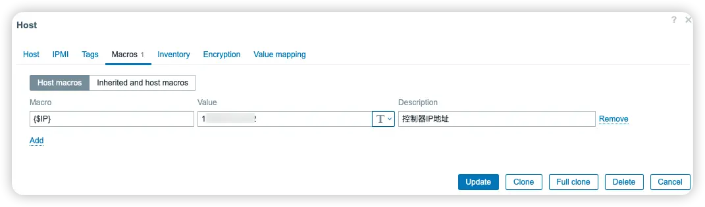

使用此模板添加后，风扇的转速数据也会创建告警规则，故障的时候就可以及时收到信息了。

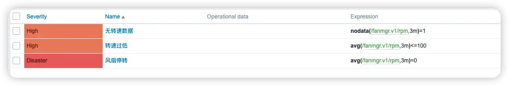

## 接入温度数据

温度数据很简单，随便买个米家的智能插座就好了，再买几个米家的温度传感器，让开关连接WiFi充当蓝牙网关，然后将温度传感器改装一下，外加一个电池盒，串联两节5号电池，就是3.4V左右的电压，可以支撑一个传感器使用至少一年（因为目前用了刚好一年）。

这里我犯了一个错误，一开始我串联了4节5号电池，然后贴了一个AMS1117 LDO稳压器在外壳上，降压3.3V给传感器供电，结果用了一个月就没电了，后来我的朋友告诉我，LDO稳压器件本身有自耗电，效率不高，如果是我这个场景，直接串两节5号电池就足够了，没必要再加一个稳压，事实证明也确实是这样。

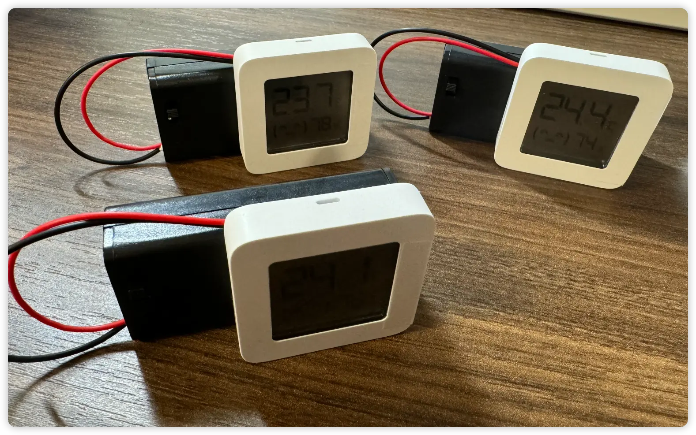

将传感器数据接入ZABBIX很简单，其实就是安装一个HomeAssistant，然后将米家传感器接入，再暴露HomeAssistant API出来，就可以让ZABBIX采集到数据了，这个步骤就不赘述了，官方有详细的文档。

这里我贴出来我做的ZABBIX的Template，将其导入即可。

```json
{
    "zabbix_export": {
        "version": "6.4",
        "template_groups": [
            {
                "uuid": "659a713f15cd4752869bd75227237d52",
                "name": "Templates"
            }
        ],
        "templates": [
            {
                "uuid": "a0591dfc36db4db2bb8a58b136237a6d",
                "template": "miaomiaoce.sensor_ht.t2",
                "name": "\u5c0f\u7c73\u6e29\u6e7f\u5ea6\u8ba12",
                "groups": [
                    {
                        "name": "Templates"
                    }
                ],
                "items": [
                    {
                        "uuid": "7c000cec39374a67b7a4f8f705d9e20a",
                        "name": "\u7535\u6c60\u7535\u91cf",
                        "type": "HTTP_AGENT",
                        "key": "battery",
                        "delay": "12h",
                        "history": "30d",
                        "trends": "0",
                        "value_type": "FLOAT",
                        "units": "%",
                        "preprocessing": [
                            {
                                "type": "JSONPATH",
                                "parameters": [
                                    "$[?(@.entity_id == \"sensor.miaomiaoce_t2_{$ENTITY_ID}_battery_level\")].state.first()"
                                ]
                            }
                        ],
                        "timeout": "5s",
                        "url": "{$URL_PREFIX}/api/states",
                        "headers": [
                            {
                                "name": "Authorization",
                                "value": "Bearer {$TOKEN}"
                            },
                            {
                                "name": "Content-Type",
                                "value": "application/json"
                            }
                        ],
                        "triggers": [
                            {
                                "uuid": "03c26b3531844d6f8bea520d3ac33eb9",
                                "expression": "nodata(/miaomiaoce.sensor_ht.t2/battery,36h)=1",
                                "name": "\u65e0\u7535\u6c60\u7535\u91cf\u6570\u636e",
                                "priority": "WARNING"
                            },
                            {
                                "uuid": "08278f7e555b456ab5bbe1f08a0285d3",
                                "expression": "avg(/miaomiaoce.sensor_ht.t2/battery,5m)<=30",
                                "name": "\u7535\u6c60\u7535\u91cf\u4f4e",
                                "priority": "WARNING",
                                "description": "\u7535\u6c60\u7535\u91cf\u4f4e\u4e8e30%"
                            }
                        ]
                    },
                    {
                        "uuid": "dca8da5005d04734a3f470058f669508",
                        "name": "\u6e7f\u5ea6",
                        "type": "HTTP_AGENT",
                        "key": "humidity",
                        "history": "365d",
                        "trends": "0",
                        "value_type": "FLOAT",
                        "units": "%",
                        "preprocessing": [
                            {
                                "type": "JSONPATH",
                                "parameters": [
                                    "$[?(@.entity_id == \"sensor.miaomiaoce_t2_{$ENTITY_ID}_relative_humidity\")].state.first()"
                                ]
                            }
                        ],
                        "timeout": "5s",
                        "url": "{$URL_PREFIX}/api/states",
                        "headers": [
                            {
                                "name": "Authorization",
                                "value": "Bearer {$TOKEN}"
                            },
                            {
                                "name": "Content-Type",
                                "value": "application/json"
                            }
                        ],
                        "triggers": [
                            {
                                "uuid": "e6cae11e789c46f4905ca0d7caf118eb",
                                "expression": "nodata(/miaomiaoce.sensor_ht.t2/humidity,3m)=1",
                                "name": "\u65e0\u6e7f\u5ea6\u6570\u636e",
                                "priority": "HIGH"
                            }
                        ]
                    },
                    {
                        "uuid": "bad8608776f54ca8b4f72a01f53f8e70",
                        "name": "\u6e29\u5ea6",
                        "type": "HTTP_AGENT",
                        "key": "temperature",
                        "history": "365d",
                        "trends": "0",
                        "value_type": "FLOAT",
                        "units": "\u00b0C",
                        "preprocessing": [
                            {
                                "type": "JSONPATH",
                                "parameters": [
                                    "$[?(@.entity_id == \"sensor.miaomiaoce_t2_{$ENTITY_ID}_temperature_humidity_sensor\")].state.first()"
                                ]
                            }
                        ],
                        "timeout": "5s",
                        "url": "{$URL_PREFIX}/api/states",
                        "headers": [
                            {
                                "name": "Authorization",
                                "value": "Bearer {$TOKEN}"
                            },
                            {
                                "name": "Content-Type",
                                "value": "application/json"
                            }
                        ],
                        "triggers": [
                            {
                                "uuid": "d2b8f835247a4f48b8b3ae1830375302",
                                "expression": "nodata(/miaomiaoce.sensor_ht.t2/temperature,3m)=1",
                                "name": "\u65e0\u6e29\u5ea6\u6570\u636e",
                                "priority": "HIGH"
                            },
                            {
                                "uuid": "0a65bc2900134a28863eab2f6da199aa",
                                "expression": "avg(/miaomiaoce.sensor_ht.t2/temperature,3m)>{$WARN_TEMPERATURE}",
                                "name": "\u6e29\u5ea6\u7565\u9ad8",
                                "priority": "WARNING",
                                "description": "\u6e29\u5ea6\u8d85\u8fc7 {$WARN_TEMPERATURE} \u5ea6"
                            },
                            {
                                "uuid": "36335fdf3e97450badfa77417ed1d1f0",
                                "expression": "avg(/miaomiaoce.sensor_ht.t2/temperature,3m)>{$HIGH_TEMPERATURE}",
                                "name": "\u6e29\u5ea6\u8fc7\u9ad8",
                                "priority": "HIGH",
                                "description": "\u6e29\u5ea6\u8d85\u8fc7 {$HIGH_TEMPERATURE} \u5ea6"
                            }
                        ]
                    }
                ],
                "macros": [
                    {
                        "macro": "{$ENTITY_ID}",
                        "value": "4456"
                    },
                    {
                        "macro": "{$HIGH_TEMPERATURE}",
                        "value": "45"
                    },
                    {
                        "macro": "{$TOKEN}",
                        "value": "token"
                    },
                    {
                        "macro": "{$URL_PREFIX}",
                        "value": "http://127.0.0.1:8123"
                    },
                    {
                        "macro": "{$WARN_TEMPERATURE}",
                        "value": "35"
                    }
                ]
            }
        ]
    }
}
```

使用Template创建Host时，需要添加以下几个macro：

- `{$ENTITY_ID}` 这个是HomeAssistant的实体，找到它的实体ID，中间的4个字串填到这里。
    
    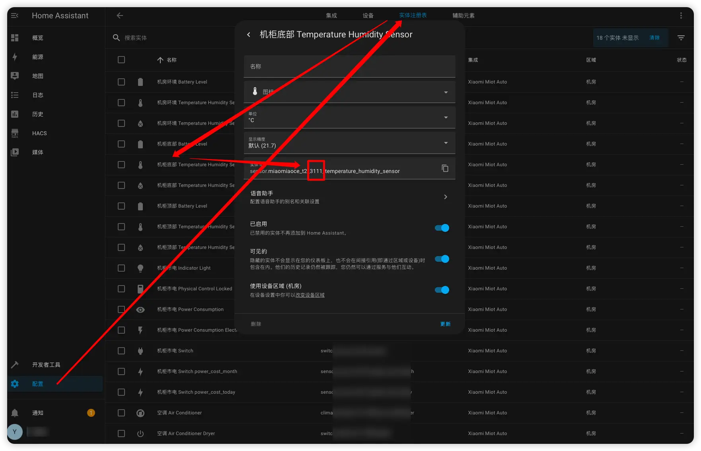
    
- `{$HIGH_TEMPERATURE}` 触发报警的高温度线。
- `{$WARN_TEMPERATURE}` 触发报警的警告温度线。
- `{$TOKEN}` HomeAssistant API Token。
- `{$URL_PREFIX}` 也就是HomeAssistant的HTTP地址，例如`http://XX.XX.XX.XX:8123`。

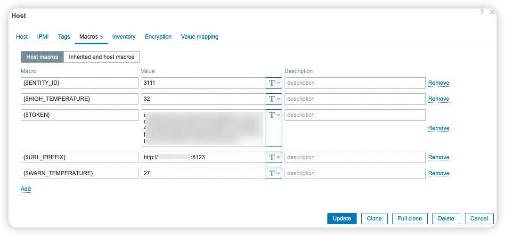

接入成功后，稍后就可以看到数据了。

这已经用了一年了，电量竟然还是100%，这个传感器有这么省电？

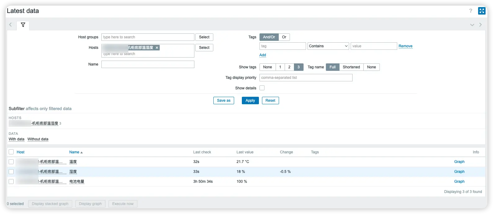

## 在Grafana可视化数据

Grafana有一个Zabbix的插件，安装这个插件，以便使用Zabbix作为数据源。

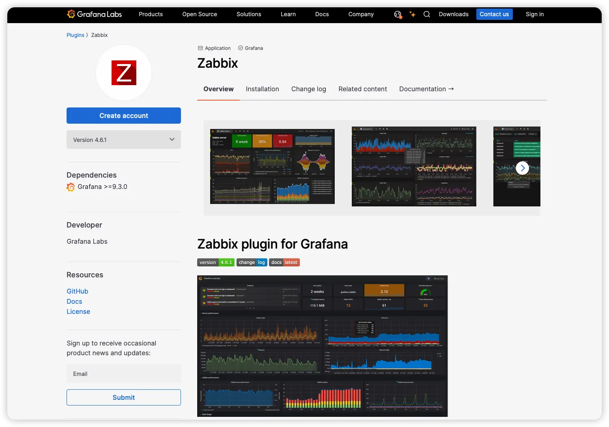

安装后，就可以开始使用Zabbix的数据来做可视化了。

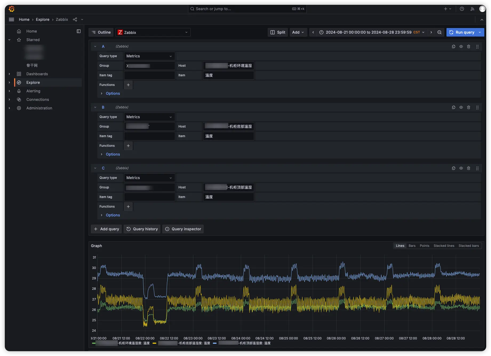

在拿到了顶部、底部、环境温度数据后，我就可以画出如下这样的积热曲线。这个曲线，其实就是使用顶部-底部温度得来，通过观察曲线整体的斜率（导数），就可以知道机柜中是否积热。由于Grafana使用ZABBIX数据源时，没有办法进行回归分析，因此只能画到这个曲线了，回归、求导和结果分析将会使用单独开发的程序来处理，不在本篇文章的讨论范围，就先不讲了。

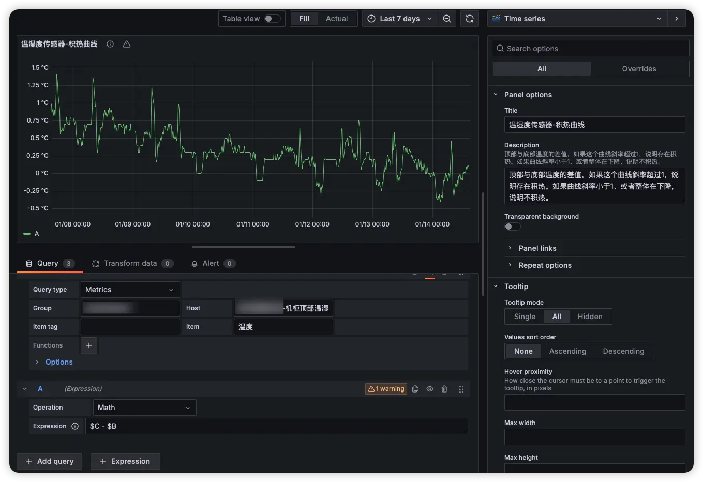

## 总结

这么一通操作之后，可以看到效果还是非常显著的，节省了不少电费。现在，机柜内有没有积热，通过一个曲线图就可以看出来了，同时也可以知道风扇转速、空调温度是否设置的合理。

下阶段，我在尝试使用一个程序去进行回归、求导分析，计算出是否积热的结果，并且结合温度数据、导数来判断是调整空调温度，还是临时加高风扇转速，并控制相关设备完成调整，把调整粒度放更细，进一步提高散热效率。