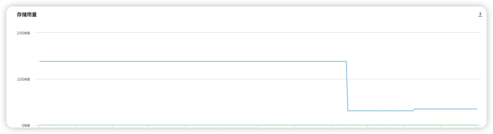
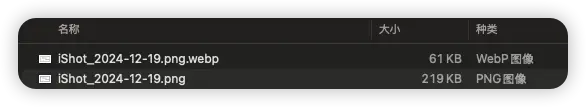
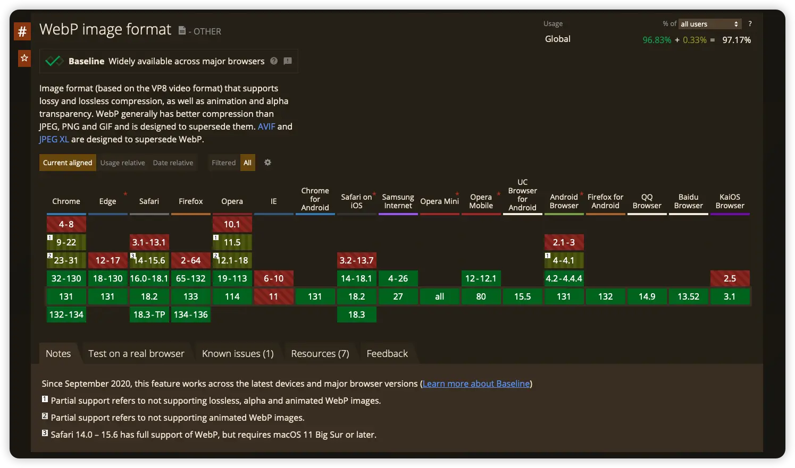

如果你也在用Hugo建设你的个人博客或者个人网站，一定要对全站的图片进行优化，因为效益非常显著——存储桶用量下降了66%、EXIF信息会被移除。存储桶用量下降，会直接让CDN流量大幅下降，从而降低分发图片带来的费用。移除EXIF信息，可以避免不经意间发的照片携带有GPS坐标、设备等信息，这可能会泄露隐私。


从腾讯云COS存储桶的用量数据来看，图片优化上传后，存储用量骤降，从原本的138M用量，到现在的36M用量。



## 背景

由于我最近刚好从WordPress迁移回来，WordPress中有非常多的优化插件，其中有一个就是图片优化插件，好比Smush。这些插件能够把WordPress媒体库中的图片压缩为webp格式，并且自动替换页面中的图片为优化后的webp，webp图片体积小因此传输速度快，可以节省CDN流量，网站加载速度变快同时，还更省钱了。

我就随便截了一张图，然后把它转为了webp，看看下边这张图你就知道差别能有多少了。如果你的网站里截图又比较多，用webp的意义就更加凸显了。



最近这些年的浏览器对webp支持都非常好了，完全可以放心使用。



受到Smush插件的启发，我决定在Hugo中引入webp，但是经过一番搜索后，发现目前Hugo中并没有相关功能，因此自己做了个适配。

## 检查是否满足使用条件

我做了一个工具来适配hugo博客优化图片。在使用它之前，需要确保博客文章的结构是正确的，所有的文章都有单独的目录，并且在`content/posts`下。例如，这里的文章`accelerate-xdp-for-lightweight-sdn-data-plane`就是个单独的目录，它在`content/posts`目录下，并且包含一个`index.md`用于存放文章内容，`index.md`中的引用的图片也都在这个文章目录下。

```bash
.
├── content
│   ├── posts
│   │   ├── accelerate-xdp-for-lightweight-sdn-data-plane
│   │   │   ├── index.md
│   │   │   ├── Linux_Virtual_Memory_Layout_64bit.svg
│   │   │   └── 未命名绘图.drawio
│   │   ├── affordable-home-network-solution
│   │   │   ├── arch.svg
│   │   │   ├── image-20211202155644904.webp
│   │   │   ├── image-20211202155752542.webp
│   │   │   ├── image-20211202155911723.webp
│   │   │   └── index.md
```

确保`index.md`中引用图片的格式正确。`[]`中的内容为图片名称，可为空，`()`中的内容为图片路径，需要以`./`开头并且指向文章所在目录中的图片文件。

```markdown

```

## 准备文件

在确保文章结构和引用图片格式正确之后，就可以开始批量优化图片了。

这里我写了一个Python脚本，它会扫描博客根目录中的所有文章，并且从文章中找出所有引用本地的png、jpg格式的图片，将它们优化成webp并且移除所有的EXIF信息，自动删除原始图片文件，并且替换掉文章中的图片为webp文件。它可以用在你发布文章前，对图片进行脱敏优化，也可以用在现有的文章中，一键优化所有已有的文章的图片。

这里我使用的是Linux系统。如果你是macOS、Windows，则可能需要先安装Python3。

将下边的Python脚本保存到博客根目录的`tools/image_compress.py`中即可，由于脚本中使用的库都是标准库，因此只要执行脚本的机器中安装有Python3，就可以使用。

```python
import os
import re
import subprocess

md_image_reg = re.compile(r"!\[(?P<img_name>.*)\]\((?P<img_path>.*)\)")
support_img = [
    ".png",
    ".jpg",
    ".jpeg",
]

# 获取所有content/posts中存在index.md的目录。
def get_all_posts_dir() -> list[str]:
    ret = []
    posts_dir = "./content/posts/"
    
    dirs = os.walk(posts_dir)
    for dirpath, dirnames, filenames in dirs:
        if dirpath == posts_dir:
            continue

        if filenames.count("index.md") != 1:
            print(f"Skip directory: {dirpath} !!!")
            continue
        
        ret.append(dirpath)

    return ret

# 获取markdown文件中的所有图片路径，尝试替换为webp。
def patch_index_md_images(md_path: str) -> list[str]:
    print(f">>> Patching {md_path}")
    
    f = open(f"{md_path}/index.md", "r")
    text = f.read()
    f.close()
    
    edited = False
    
    ms = md_image_reg.finditer(text)
    for m in ms:
        md_image_name = m.group("img_name")
        md_img_path = m.group("img_path")
        if md_img_path.endswith(".webp"):
            continue
        
        print(f"  - Convert {md_img_path}: ", end="")
        if not md_img_path.startswith("./"):
            print("\t\t NOT LOCAL !!!")
            continue
        
        img_path = f"{md_path}/" + md_img_path.removeprefix("./")
        
        md_webp_path = ""
        for si in support_img:
            if md_img_path.endswith(si):
                md_webp_path = md_img_path.removesuffix(si) + ".webp"
                break
        if md_webp_path == "":
            print("\t\t NOT SUPPORT FORMAT !!!")
            continue
        
        webp_path = f"{md_path}/" + md_webp_path.removeprefix("./")
        
        if not os.path.exists(img_path):
            print("\t\t NOT EXIST !!!")
            continue
        
        # fix binary permission
        os.chmod("./cwebp", 0o755)
        # convert image to webp
        child = subprocess.Popen(["./cwebp", img_path, "-metadata", "none", "-o", webp_path], stdout=subprocess.PIPE, stderr=subprocess.PIPE)
        child.wait()
        if child.returncode != 0:
            print("\t\t FAILED !!!")
            
            print(child.stdout.read().decode())
            print(child.stderr.read().decode())
            continue
        
        print("\t\t success")
        
        # delete old image
        os.remove(img_path)
        
        # replace image path
        text = text.replace(
            f"",
            f""
        )
        
        edited = True
        
    if not edited:
        return
    
    # 有需要的时候再写入文件，避免中途出错导致文件损坏。
    f = open(f"{md_path}/index.md", "w")
    f.write(text)
    f.close()

if __name__ == "__main__":
    posts_dirs = get_all_posts_dir()
    for d in posts_dirs:
        patch_index_md_images(d)

```

然后，还需要下载`cwebp`程序到博客根目录中。在下边的网站中下载`Linux (x86-64)`的预编译文件，解压后在bin目录中就可以看到`cwebp`，把它复制到博客的目录中即可。如果你是macOS、Windows用户，下载不同系统的文件就好，解压之后都会有`cwebp`文件，只是Windows会是`cwebp.exe`，需要修改上边Python脚本中的`child = subprocess.Popen(["./cwebp",` 这行，在`cwebp`后加上`.exe`。

[https://developers.google.com/speed/webp/download?hl=zh-cn](https://developers.google.com/speed/webp/download?hl=zh-cn)

文件准备完成后，大概会以这么个结构。

```bash
.
├── cwebp
├── tools
│   ├── image_compress.py
```

## 开始使用

在博客根目录中执行`python3 tools/image_compress.py`，图片就会被优化为webp，然后再构建发到线上就可以了。

执行命令的时候，特别留意一下有没有`!!!`的输出，这种说明遇到了错误。目前，错误主要是因为这几种原因：

- 引用图片路径不是`./`开头的，需要修改。如果本身引用的是其他网站的图片，可以忽略这个错误。
- 引用的图片的格式不被支持。目前webp只能支持从png、jpg格式转码，svg、gif这些格式不支持，因此会报错，可以忽略这个错误。
- 转码时错误。这个只能遇到时处理了，但是一般不太容易遇到这个问题。

```bash
# python3 tools/image_compress.py 
>>> Patching ./content/posts/a-small-office-network-structure-and-optimization-scheme
>>> Patching ./content/posts/accelerate-xdp-for-lightweight-sdn-data-plane
  - Convert ./Linux_Virtual_Memory_Layout_64bit.svg:             NOT SUPPORT FORMAT !!!
>>> Patching ./content/posts/affordable-home-network-solution
  - Convert ./arch.svg:                  NOT SUPPORT FORMAT !!!
>>> Patching ./content/posts/assign-japanese-ipv6-address-to-lan-clients-using-tunneling-technology
```

## 注意

如果你使用GitHub Action构建和发布，不推荐使用Action执行这个脚本。因为GitHub Action拉代码之后优化完，一般不会重新推回仓库，如果你增加了重新推送这个环节，仓库就会多一层commit，额外占用了空间，并且原始照片还是被留在了先前的commit中，如果是公开仓库的话，仍然存在隐私泄露的可能，所以这个用法并不推荐。再加上Action是有免费时间限制的，如果你的图片比较多，优化可能会需要一些时间，如果提交commit频率比较高，可能很快就把免费额度用完了。因此，更建议提交文章前使用优化脚本，Action就只交给它构建和发布就好了。

## 总结

图片优化我也是才发上线，立马就把教程公开出来给有需要的朋友使用，因此还没有CDN账单的数据可以做对比。但是单从存储桶的用量数据来看，效果还是非常显著的，对全站的益处是显而易见的。

希望这篇文章对你有所帮助。