最近尝试对博客进行转型，继续发硬核技术帖的同时，会增加一些贴地气的内容。如果说以前使用Hexo、Hugo本质上是为了解决穷的问题，那么现在换回了WordPress是为了解决数据运营的闭环问题。纯静态博客有很多的好处，但是内容和数据成了一个个孤岛，整合起来需要做一定的开发工作，从投入产出来看，换用WordPress是一个比较具有性价比的选择，虽然它很重，有些地方又很ugly，响应速度会慢一些，但是它的生态提供的扩展能力和业务连续性，目前找不到替代品。

所以，这篇文章，记录一下安装WordPress的过程。这篇文章从写完到发布，间隔了大概一个多月的时间，就是希望实际上线测试一段时间看看，再公开教程，避免遗留一些坑给大家踩，截止到发文时，整个系统应该是已经趋于稳定了，满足需求的同时，每年成本在500元左右。

当你看到这句话的时候，我已经从WordPress回滚到Hugo了，不为什么，只能说WordPress还是太难用了。虽然我已经重新回到了Hugo，但是不妨碍这篇文章给想要装WordPress的朋友参考，所以这篇文章我也不下掉了，就放在这里供大家有需要的人参考。

## 写在开始

建议使用`Ubuntu 24.04.1 LTS`系统，不再推荐使用Rocky Linux、Alma Linux这些系统，原因可以查看后文。由于我一开始就是使用Rocky Linux安装的，因此接下来的文章就按照这个系统写的命令，对于新开始的朋友，建议使用Ubuntu系统，参考下文的命令改动一下，大多数都能直接用。

建议先一口气看完文章，再进行操作，因为后文有很多纠正了前文的操作，因此中间有些操作可能是不必要的。这也是我一边操作一边写文章的遗留问题，没有办法一步到位，只能做了哪些记录哪些。

## 存储选型

一开始我选择使用阿里云的NFS存储来放数据库、WordPress的文件，Docker镜像也在其中，后来发现博客打开速度非常慢，一个页面差不多要等3-5秒左右才能打开，排查发现是CPU的iowait非常多，NFS成瓶颈了，因此这里不建议使用NFS。我在系统盘之外专门开了一块ESSD（PL0）的云盘存数据库、WordPress的文件，Docker镜像就直接放在系统盘中了。


其实这里也没太多必要分两个云盘，合在一起是完全可以的，只是我的云主机内存比较小，如果swap和数据库文件在一个盘上，经验来看内存满的时候会把磁盘负载打满，系统盘和数据盘切割开来一定程度上有助于控制爆炸半径，提供一个上机排错的机会。

## 配置docker

安装docker后，禁用掉docker自带的bridge网络和iptables规则。这里我并不推荐使用docker的`-p`参数暴露端口，这样改动iptables规则后重启服务，就会把docker加的规则给清掉了，导致容器网络出现问题，所以一开始就禁掉。

```bash
cat > /etc/docker/daemon.json << EOF
{
    "iptables": false,
    "bridge": "none",
    "log-driver": "local",
    "log-opts": {
        "max-size": "1m"
    }
}
EOF
```

然后重启docker服务以生效。

```bash
systemctl restart docker.service
```

创建一个docker网络，不用默认的bridge。

```bash
docker network create 
  --driver=bridge 
  --subnet=192.168.1.0/24 
  --gateway=192.168.1.1 
  xuegao
```

## 安装mysql

由于WordPress的表都是InnoDB类型，因此这里着重优化一下InnoDB，然后把不用的功能关了省点内存。

```ini
[mysqld]
# 禁用性能统计,反正部署上了就不会管了，关了这个功能省点内存
performance_schema = off
# WordPress都是用的InnoDB类型,这里着重优化InnoDB
# 默认128M,这里减小pool大小,注意控制在docker的内存限额内
# 不要256M，实测会OOM。
innodb_buffer_pool_size = 64M
# 默认64M,但是WP没有这么大的事务,给16M就行了,超过的刷磁盘去
innodb_log_buffer_size = 16M
max_connections = 500

character-set-server = utf8mb4
collation-server = utf8mb4_unicode_ci

bind_address = 0.0.0.0
mysqlx=off

# 不需要binlog
skip-log-bin

# default
host-cache-size=0
skip-name-resolve
datadir=/var/lib/mysql
socket=/var/run/mysqld/mysqld.sock
secure-file-priv=/var/lib/mysql-files
user=mysql

pid-file=/var/run/mysqld/mysqld.pid
[client]
socket=/var/run/mysqld/mysqld.sock

!includedir /etc/mysql/conf.d/
```

初始化mysql容器，让mysql生成相关的文件。

```bash
docker run --restart=unless-stopped --name mysql \
    -v /data/mysql/data:/var/lib/mysql \
    -v /data/mysql/config:/etc/mysql \
    -e MYSQL_ROOT_PASSWORD="<填root密码>" \
    --network=host \
    -d mysql:8.4.2
```

然后停止并重新创建mysql容器，就可开始使用了，这样可以避免把root密码留在环境变量中。

```bash
docker run --restart=unless-stopped --name mysql 
    -v /data/mysql/data:/var/lib/mysql 
    -v /data/mysql/config:/etc/mysql 
    --memory 512m 
    -e TZ="Asia/Shanghai" 
    --network xuegao 
    --ip 192.168.1.2 
    -d mysql:8.4.2
```

为了方便管理，再创建一个phpmyadmin的容器，不过不用的时候最好停了，省点内存。

```bash
docker run --restart=unless-stopped --name pma 
    -e PMA_HOST=192.168.1.2 
    -e TZ="Asia/Shanghai" 
    --memory 512m 
    --network=xuegao 
    --ip 192.168.1.3 
    -d phpmyadmin:5.2.1
```

## 安装WordPress

修改上传文件的大小限制和执行时长限制，注意记下这两个数值，后边在nginx和CDN中都需要配置。

```bash
cat > /data/wordpress/config/php/uploads.ini << EOF
file_uploads = On
memory_limit = 32M
upload_max_filesize = 100M
post_max_size = 100M
max_execution_time = 300
EOF
```

启动WordPress容器。

```bash
docker run --restart=unless-stopped --name wordpress 
    -v /data/wordpress/data:/var/www/html 
    -v /data/wordpress/config/php/uploads.ini:/usr/local/etc/php/conf.d/uploads.ini 
    --memory 1024m 
    -e WORDPRESS_DB_HOST="192.168.1.2" 
    -e WORDPRESS_DB_USER="数据库用户名" 
    -e WORDPRESS_DB_PASSWORD="数据库密码" 
    -e WORDPRESS_DB_NAME="数据库名" 
    -e TZ="Asia/Shanghai" 
    --network xuegao 
    --ip 192.168.1.11 
    -d wordpress:6.6.2-apache
```

## 配置防火墙

首先在阿里云的防火墙上只放开ICMP和TCP 80端口，我这里有堡垒机，就走内网SSH管理了，公网只需要开一个80口。

安装防火墙相关的服务，以便开机能自启动。

```bash
dnf remove firewalld
dnf install ipset-service iptables-service
```

然后添加CDN的所有IP。

```bash
ipset create permit80 hash:net family inet hashsize 1024 maxelem 1000000

# 添加所有的允许的来源IP地址。
ipset add permit80 X.X.X.X/24

# 保存
ipset save > /etc/sysconfig/ipset
```

配置防火墙，把除了CDN的来源IP全部拦掉。直接把下边的内容贴到`/etc/sysconfig/iptables`文件中即可，`filter`表中的规则是拦非CDN来源的IP的，`nat`表的是docker容器出网规则。这里的`filter`中的规则主要是拦掉不可信来源的流量，不会拦SSH流量，如果需要开SSH，需要去阿里云的安全组放开。

```bash
# Completed on Mon Oct 14 20:58:07 2024
# Generated by iptables-save v1.8.10 (nf_tables) on Mon Oct 14 20:58:07 2024
*filter
:INPUT ACCEPT [25:1732]
:FORWARD ACCEPT [0:0]
:OUTPUT ACCEPT [17:2408]
-A INPUT -i eth0 -p tcp -m tcp --dport 80 -m set ! --match-set permit80 src -j DROP
COMMIT
# Completed on Mon Oct 14 20:58:07 2024
# Generated by iptables-save v1.8.10 (nf_tables) on Mon Oct 14 20:58:07 2024
*nat
:PREROUTING ACCEPT [0:0]
:INPUT ACCEPT [0:0]
:OUTPUT ACCEPT [0:0]
:POSTROUTING ACCEPT [0:0]
-A POSTROUTING -d 100.64.0.0/10 -o eth0 -j SNAT --to-source 100.64.11.101
-A POSTROUTING -o eth0 -j MASQUERADE
COMMIT
```

重启两个服务，并设置开机自启动。

```bash
systemctl restart ipset.service 
systemctl restart iptables.service

systemctl enable --now ipset.service
systemctl enable --now iptables.service
```

## 配置反向代理

这里我加了一层nginx做反代，这样更新时可以先启动一个新容器，确保更新成功后再删除老容器，让nginx自动切换上游即可，这样不会影响访问，其实就是K8S的滚动更新。其次，因为配置了virtual host，所以可以支持多个网站同时跑。

源站和CDN都是IDC的，中间不太可能会被运营商劫持，因此我也懒得配置HTTPS了，CDN分发的时候再打开HTTPS就行。

直接dnf安装nginx。

```bash
dnf install -y nginx
```

打开日志滚动，免得把存储撑爆了。

```bash
systemctl enable --now logrotate.service
```

修改nginx的配置。

```nginx
# cat /etc/nginx/nginx.conf

user nginx;
# 设置为2个线程（和CPU统一）
worker_processes 2;
error_log /var/log/nginx/error.log;
pid /run/nginx.pid;

# Load dynamic modules. See /usr/share/doc/nginx/README.dynamic.
include /usr/share/nginx/modules/*.conf;

events {
    # 加大连接数
    worker_connections 2048;      
}                                  

http {
    # 注意我在这里加了个 $request_time ，以便记录下来PHP的执行时间，后续慢的话可以有东西拿来分析
    log_format  main  '$remote_addr - $remote_user [$time_local] $request_time "$request" '
                      '$status $body_bytes_sent "$http_referer" '
                      '"$http_user_agent" "$http_x_forwarded_for"';

    access_log  /var/log/nginx/access.log  main;

    sendfile            on;
    tcp_nopush          on;
    tcp_nodelay         on;
    keepalive_timeout   65;
    types_hash_max_size 4096;

    include             /etc/nginx/mime.types;
    default_type        application/octet-stream;

    # Load modular configuration files from the /etc/nginx/conf.d directory.
    # See http://nginx.org/en/docs/ngx_core_module.html#include
    # for more information.
    include /etc/nginx/conf.d/*.conf;

    # 删掉其他没用的配置，只保留下边这一段。
    server {
        listen       80;
        listen       [::]:80;
        server_name  _;

        # 没有匹配到virtual host的，全部都返回404
        location / {
            return 404;
        }
    }
}
```

然后加WordPress的反代。`192.168.1.12:80`的上游，仅在更新容器时才需要启用，默认情况下不建议启用，不然感觉响应延迟会增加。

```nginx
# cat /etc/nginx/conf.d/wordpress.conf 
upstream wordpress_backend {
    server 192.168.1.11:80;
#    server 192.168.1.12:80;
}

server {
    listen 80;
    server_name blog.xuegaogg.com;

    client_max_body_size 100M;

    location / {
        proxy_pass http://wordpress_backend;

        proxy_set_header Host $host;
        proxy_set_header X-Real-IP $remote_addr;
        proxy_set_header X-Forwarded-For $proxy_add_x_forwarded_for;
        proxy_set_header X-Forwarded-Proto $scheme;

        proxy_connect_timeout 10s;
        proxy_read_timeout 300s;
        proxy_send_timeout 300s;
    }
}
```

测试一下没问题。

```bash
# nginx -t
nginx: the configuration file /etc/nginx/nginx.conf syntax is ok
nginx: configuration file /etc/nginx/nginx.conf test is successful
```

然后就可以启动nginx了。

```bash
systemctl enable --now nginx.service
```

## 不保存历史命令

为了防止命令里泄露一些凭据，使用如下命令可以不记录历史命令到文件中。

```bash
> ~/.bash_history && chattr +i ~/.bash_history
```

## 配置WordPress计划任务

WordPress插件的自动备份等一些功能需要依赖wp-cron.php，但是在容器中这个脚本似乎不会被定期执行，需要我们手工调起。

在主机上添加cronjob任务，定期触发容器中的计划任务执行。

```bash
# crontab -l
* * * * * docker exec -it wordpress curl http://127.0.0.1/wp-cron.php?doing_wp_cron
```

## 安装netdata监控

单机监控，注意netdata开源版的没有登录认证的，不要暴露到公网上。我是绑定在了`127.0.0.1`上，需要查问题的时候，通过SSH端口转发访问。

```bash
curl https://get.netdata.cloud/kickstart.sh > /tmp/netdata-kickstart.sh && sh /tmp/netdata-kickstart.sh --no-updates --stable-channel --disable-telemetry
```

有了这个东西之后，服务出现问题就有数据可以回溯了，不然都不知道啥原因挂了。

## WordPress配置

修改WordPress下的`wp-config.php`文件，在`stop editing`这行注释前添加配置。

```php
// 强制HTTPS,以避免配合CDN一起用时提示重定向的次数过多
// 只有在开启了CDN和HTTPS才需要配置
$_SERVER['HTTPS'] = 'on';
define('FORCE_SSL_LOGIN', true);
define('FORCE_SSL_ADMIN', true);

// 关闭自动更新
define('WP_AUTO_UPDATE_CORE', false);

/* That's all, stop editing! Happy publishing. */
```

## WordPress推荐插件

- `Block Specific Plugin Updates` 禁用指定插件的更新。

- `Code Block Pro` 代码高亮。

- `Disable & Remove Google Fonts` 禁用并移除Google字体。有一些字体会使用Google字体的CDN，这个地址在大陆打开非常慢，会导致网页一直卡在渲染阶段，所以不如直接禁用了。

- `Disable User Gravatar` 禁用用户的Gravatar头像。设置里现在可以关了，不用这个插件了，而且这个插件现在已经不维护了。

- `Rank Math SEO` SEO插件。有很多高级SEO功能，我到现在还没摸完，强推。其中有一个重定向功能，可以把迁移前的链接添加进来，这样就可以保障迁移后搜索引擎不会检索丢了。

- `Smush` 图片优化和懒加载插件，可以自动优化图片大小，效果非常显著。

- `Wordfence 安全` 可以配置一些安全配置，并且支持漏洞扫描、登录时二步验证，强烈推荐。

- `WP Mail SMTP` 支持SMTP更多参数的外发邮件。企业微信的邮箱用这个插件就可以使用了。

- `WP Statistics` 统计插件。老牌统计插件，我从2015年就开始用WordPress了，那时候这个插件非常干净，现在搞了一堆收费项目牛皮藓，功能是比较完善，但是在找替代品了。找了几个月，没找到替代品，它DataPlus支持Google Analytics那样的行为分析，是一个很好的运营工具，除了贵其他都挺好。

- `UpdraftPlus - Backup/Restore` 备份插件。每天往OSS备份数据，以防万一。

- `WP微信` 支持微信注册和登录。有点难用，已经卸载。

- `微信公众号引流` 基于网上找的一个插件修改而来，支持关注公众号获取验证码再查看内容。做博客10年了，学生时代都是靠着饭钱买的服务器，现在成本日趋上升，本身对内容有信心，是时候该做点转变了。

- `简易目录` 自动生成目录的插件。

## 排查性能问题

部署完成之后，安装插件发现非常卡，排查发现CPU iowait非常高，看来是NFS的性能差，换成本地盘就好多了。

再排查一些接口，仍然需要半秒左右才能打开，抓包看发现是数据库请求太多了。

中间截掉了很多内容，主要关注查数据库的时间就好了，发起了N多次数据库操作，耗费了0.3s。


一个请求竟然有这么多查询？看了一下差不多有80多个，这性能也太难好到哪去了，查了一下StackOverflow，这个是WordPress的常规操作，只能加层缓存缓解一下。

那就安装个redis好了，先打配置。

```bash
cat > /data/redis/config/redis.conf << EOF
bind 0.0.0.0
tcp-backlog 4096
timeout 0
tcp-keepalive 30
supervised no
loglevel notice
logfile ""
maxclients 10000
# 256MB,超过之后就报错
maxmemory 268435456
io-threads 4
EOF
```

然后启动容器。

```bash
docker run --restart=unless-stopped --name redis 
    -v /data/redis/data:/data 
    -v /data/redis/config:/config 
    --memory 512m 
    -e TZ="Asia/Shanghai" 
    --network xuegao 
    --ip 192.168.1.4 
    -d redis:7.4.1 
    redis-server /config/redis.conf
```

由于WordPress的官方镜像默认不带redis的PHP模块，这里需要手工打进去，先创建一个Docker构建脚本。

```bash
cat > Dockerfile.wordpress << EOF
FROM wordpress:6.6.2-apache

RUN pecl install redis && 
    docker-php-ext-enable redis
EOF
```

然后开始构建。

```bash
docker build -f Dockerfile.wordpress -t wordpress:6.6.2-apache-redis --network host .
```

然后使用这个新的镜像重启WordPress容器，就可以生效了。

为了减少查询次数，我安装了一个Redis Object Cache Pro的插件，SQL的查询量直接砍半，查询速度确实有一定的提升，但是不是特别显著。

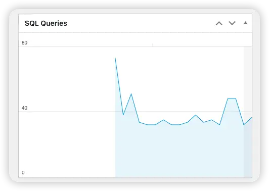

经过几天的观察，发现这玩意效果实在是不显著，还得多维护一个redis，因此干掉。看来WordPress想快只有生成静态页面这一条路走了。

## 服务器卡死问题

刚装机没几天，就挂了。晚上回来发现SSH连接不上了，看了一下阿里云的监控，发现磁盘打满了，CPU也拉满了，从经验来看，大概率是什么应用把内存用满了，导致了内核在不停地驱逐页，但是又有服务在运行，就又一直装载页，就把磁盘load爆了。

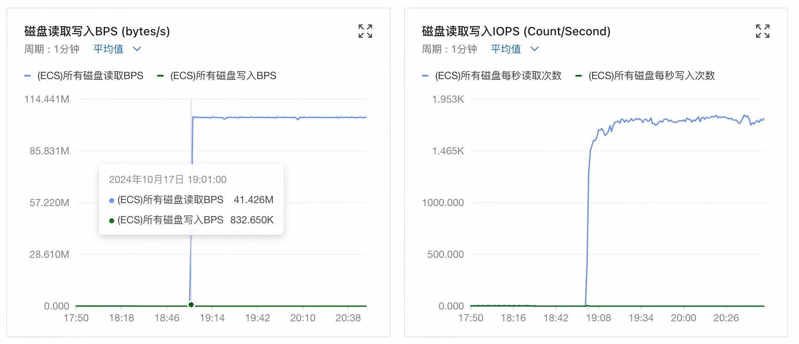

但是，MySQL我已经关掉很多特性了，是啥玩意会把内存搞满？看了一下日志，原来是`dnf-makecache.timer`搞的，印象里dnf一直内存用量很高，这次直接把系统搞挂了，自此之后我应该不会再开这玩意了。

```bash
systemctl disable --now dnf-makecache.timer
```

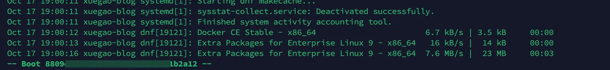

这个问题在GitHub和Bugzilla都有收录，都可以追溯到2020年了。

[https://github.com/rpm-software-management/dnf/issues/2010](https://github.com/rpm-software-management/dnf/issues/2010)

连夜把我所有的系统禁用掉这个功能。

## 解决PHP内存泄露问题

只关注1点半这会就行，后边数据乱了是因为我重启了服务。只要有持续的请求进来，机器的内存消耗就一直会增长，1点半这里有一个小的凸起，就是因为我又进了控制台执行了一些操作，可以看到`Active(file)`和`Active(anon)`两个都是增长的，`Active(file)`增长不必担心，因为文件背景的page能够在触发内核水位线的时候被驱逐，`Active(anon)`增长就需要特备注意，因为是匿名的page，没有办法驱逐到文件中，如果有swap的话可以临时换到swap中，但是如果匿名page一直增加的话，迟早会把内存打爆的。

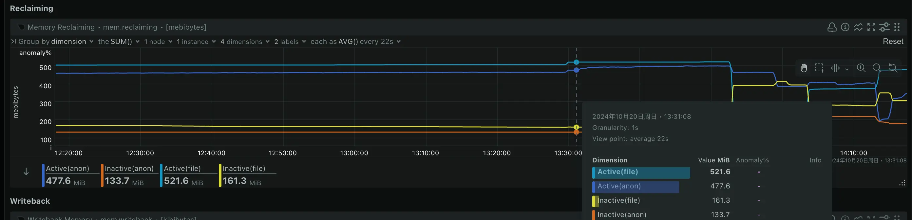

然后看一下内存排名，果然是httpd用的最多，不出意外的话就是`mod_php`泄露了。再确认一下，`httpd`在1点半左右内存使用确实有增加。

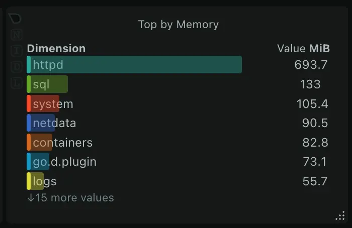

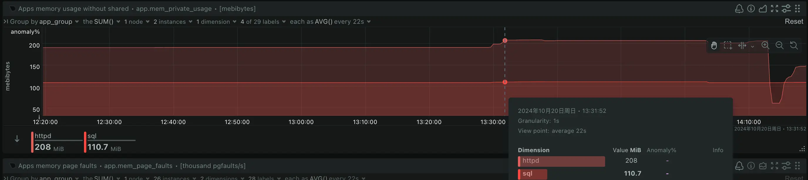

这个问题很多年前就遇到过了，能确定的就是PHP内存泄露了，暂时没有更好的解决办法，让httpd定期回收进程是一个比较可靠的解决办法，只是没想到这个问题这么多年了还么解决。

切换httpd的并发处理为prefork模式，不要用prefork之外的模式，不然还是会泄露。这里我用的镜像里的httpd默认就已经是在使用`mpm_prefork`，因此我只需要改一下参数即可。

下边的命令中创建了一个新的`mpm_prefork.conf`文件，后边将会挂进WordPress容器中，以便控制内存使用。这个文件相对WordPress容器中的文件，缩减了httpd的并发数，改动了`MaxConnectionsPerChild`，从0设置为了100，即每个prefork的进程只要处理过100个请求后，就必须销毁并开启新的进程，那么即便内存有泄露，进程销毁之后也就不复存在了，泄露问题自然就解决了。

**特别注意，下面的参数还是有点大，仍然会导致OOM，因此实际操作时这一步可以跳过，看下边的文章有新的配置。**

```bash
cat > /data/wordpress/config/apache2/mpm_prefork.conf << EOF
# prefork MPM
# StartServers: number of server processes to start
# MinSpareServers: minimum number of server processes which are kept spare
# MaxSpareServers: maximum number of server processes which are kept spare
# MaxRequestWorkers: maximum number of server processes allowed to start
# MaxConnectionsPerChild: maximum number of requests a server process serves

StartServers            5
MinSpareServers         5
MaxSpareServers         10
MaxRequestWorkers       50
MaxConnectionsPerChild  100
EOF
```

然后把这个配置文件挂进WordPress容器中。

```bash
docker run --restart=unless-stopped --name wordpress 
    -v /data/wordpress/data:/var/www/html 
    -v /data/wordpress/config/php/uploads.ini:/usr/local/etc/php/conf.d/uploads.ini 
    -v /data/wordpress/config/apache2/mpm_prefork.conf:/etc/apache2/mods-available/mpm_prefork.conf 
    --memory 1024m 
    -e WORDPRESS_DB_HOST="192.168.1.2" 
    -e WORDPRESS_DB_USER="数据库用户名" 
    -e WORDPRESS_DB_PASSWORD="数据库密码" 
    -e WORDPRESS_DB_NAME="数据库名" 
    -e TZ="Asia/Shanghai" 
    --network xuegao 
    --ip 192.168.1.11 
    -d wordpress:6.6.2-apache
```

可以看到，在这样改完配置之后，再持续使用WordPress，内存用量就不会持续增长了，`Active(anon)`开始出现了下降，整体就维持在了一个比较正常的水平。

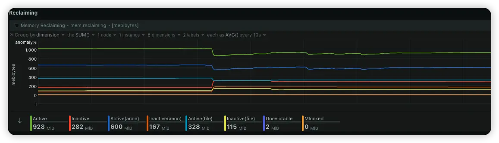

## 内核task hung住

正准备夸奖PHP现在比5年前我用它时稳定了一些，它就出问题了。

问题表现为运行WordPress的容器完全无法kill掉，但是httpd的进程已经全部没有了，容器网络也已经不通了，内核日志里刷出来了task hung的内容，我心头一凉，难道迁移要失败了？

```bash
[280523.782810]  </TASK>
[280523.782814] INFO: task apache2:1167474 blocked for more than 245 seconds.
[280523.783241]       Tainted: G               X  ------- --- 5.14.0-427.37.1.el9_4.x86_64 #1
[280523.783775] "echo 0 > /proc/sys/kernel/hung_task_timeout_secs" disables this message.
[280523.784254] task:apache2         state:D stack:0     pid:1167474 ppid:399804 flags:0x00000002
[280523.784257] Call Trace:
[280523.784258]  <TASK>
[280523.784259]  __schedule+0x21b/0x550
[280523.784261]  schedule+0x2d/0x70
[280523.784263]  d_alloc_parallel+0x385/0x3f0
[280523.784265]  ? __pfx_default_wake_function+0x10/0x10
[280523.784269]  lookup_open.isra.0+0x285/0x570
[280523.784272]  open_last_lookups+0x176/0x3d0
[280523.784274]  ? path_init+0x2c5/0x3f0
[280523.784277]  path_openat+0x89/0x280
[280523.784280]  do_filp_open+0xb2/0x160
[280523.784284]  ? __check_object_size.part.0+0x47/0xd0
[280523.784287]  do_sys_openat2+0x96/0xd0
[280523.784289]  __x64_sys_openat+0x53/0xa0
[280523.784292]  do_syscall_64+0x5c/0x90
[280523.784294]  ? exit_to_user_mode_prepare+0xec/0x100
[280523.784298]  entry_SYSCALL_64_after_hwframe+0x72/0xdc
# 省略了一些内容
[280523.784312]  </TASK>
```

看主机上的进程，容器里的httpd进程已经没有了。

```bash
# ps -ef | grep httpd
root     1174253 1170046  0 18:44 pts/0    00:00:00 grep --color=auto httpd
```

docker看容器还在运行中，但是不论如何停止都停不掉了。


docker停止、kill容器都失败了。

```bash
# docker restart wordpress 
Error response from daemon: Cannot restart container wordpress: tried to kill container, but did not receive an exit event
```

nginx的反向代理日志直接报502错误。

```bash
125.X.X.X - - [21/Oct/2024:18:46:17 +0800] 0.000 "GET /wp-admin/admin.php HTTP/1.1" 502 559 "https://blog.xuegaogg.com/wp-admin/admin.php" "Mozilla/5.0 (Macintosh; Intel Mac OS X 10_15_7) AppleWebKit/537.36 (KHTML, like Gecko) Chrome/130.0.0.0 Safari/537.36" "X.X.X.X"
```

docker的日志直接报kill容器失败。

```bash
# journalctl -u docker.service --follow 
Oct 21 18:45:43 xuegao-blog dockerd[850]: time="2024-10-21T18:45:43.627858872+08:00" level=error msg="Handler for POST /v1.47/containers/wordpress/restart returned error: Cannot restart container wordpress: tried to kill container, but did not receive an exit event" spanID=xxxxxxx traceID=xxxxxxxx
```

这些日志看不出来问题，只能再从netdata找数据看看了。首先缩小一些时间窗口，发生这个事件的事件窗口在18点30分到18点40分，就直接选择这个时间窗口的数据。

可以看到，在18点33分前后，system消耗了大量的CPU，紧接着iowait就把整机打满了，这可是固态啊，能这么容易打满，绝对不是应用能够导致的了。

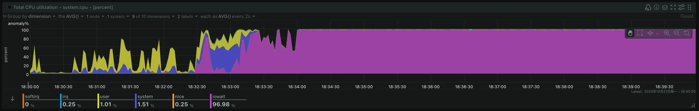

这时候需要找一下iowait主要发生在哪块硬盘了，因为有一块是系统盘，一块是数据盘。由于netdata中似乎没有区分磁盘，我从zabbix找到了数据，vda打满了，也就是系统盘打满了，不出意外又是swap。

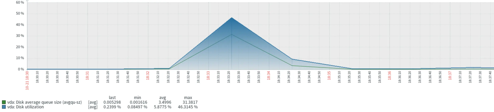

可以看到，18点33前后，刚好是swap置换高峰的时候，swap用量也在上升，所以确定是swap导致的问题没得跑了。

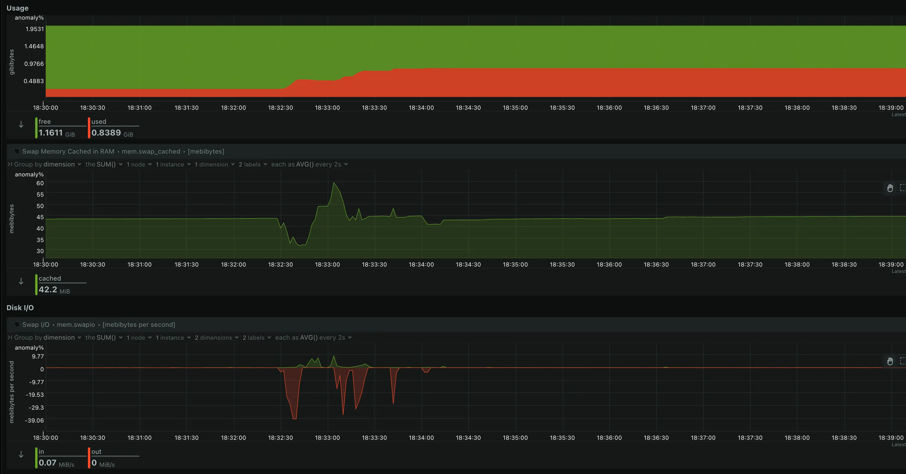

但是，为啥这次的问题这么温和？以往每逢swap把CPU打满，一定会导致SSH都登录不上，这次的不仅能登录上，甚至监控数据都还能看到，只是httpd也确实挂了没有办法恢复了，只能通过重启解决，好歹留了个现场我，难道这就是容器的好处？

进一步去看磁盘的IOPS，18点33分这里，vda的IOPS直接被打到了1900，直接把云盘拉满了。

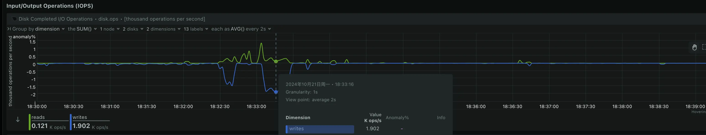

再看CPU硬件中断，可以看到，在18点33分16秒这个高峰这里，CAL、TLB分别有19K、10K的中断次数。

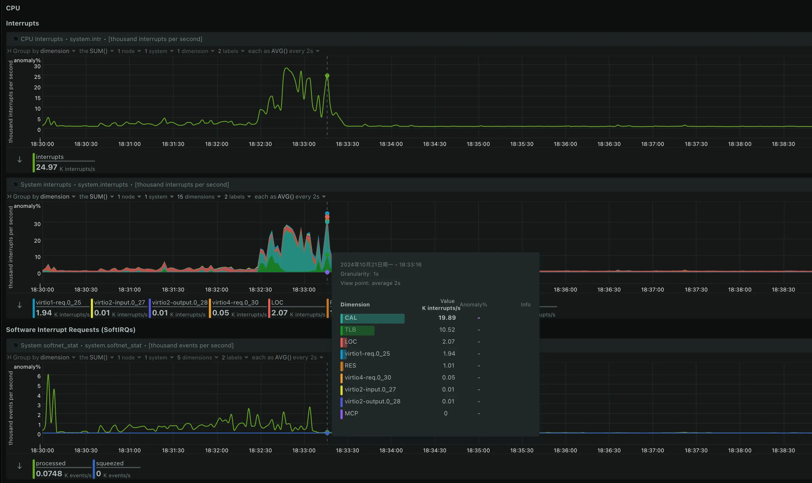

netdata官方给出了这些指标的解读，CAL为内核的函数调用中断，TLB为CPU的VM地址查物理地址中断。

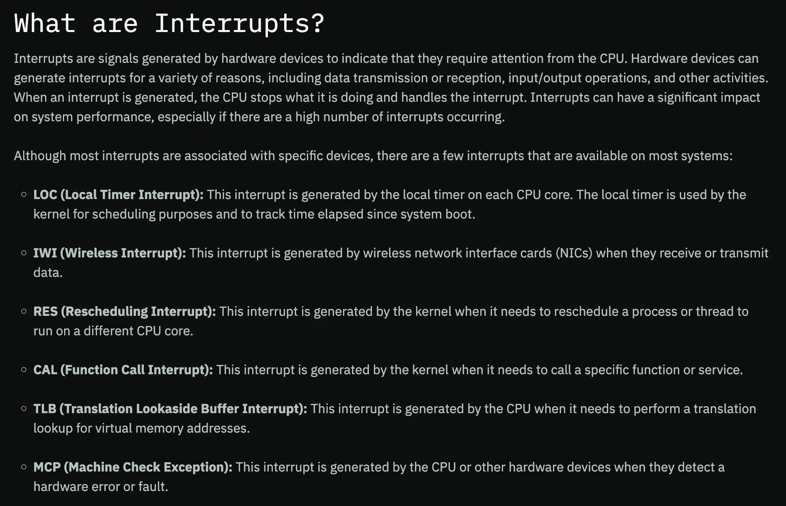

再看软中断，18点33分16秒这个高峰这里，BLOCK、SCHED分别有1.9K、0.7K的中断次数。

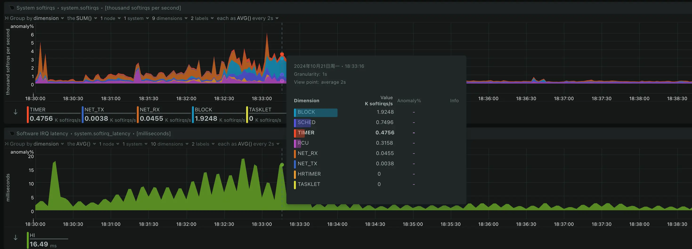

netdata官方给出了这些指标的解读，BLOCK为IO设备的阻塞，SCHED为调度更高优先级活动。

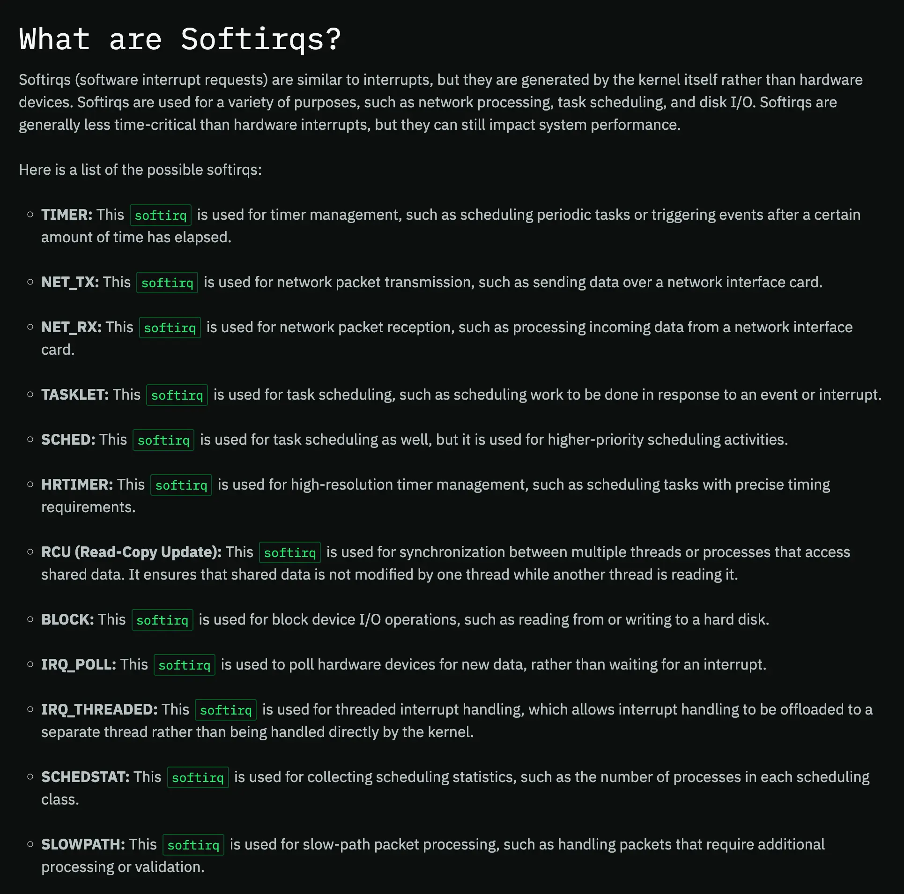

再看18点33分16秒的高峰这里不同程序的CPU用量，发现system的已经比httpd还要多了，整体看起来内核内部的问题严重性已经比httpd的要高了。

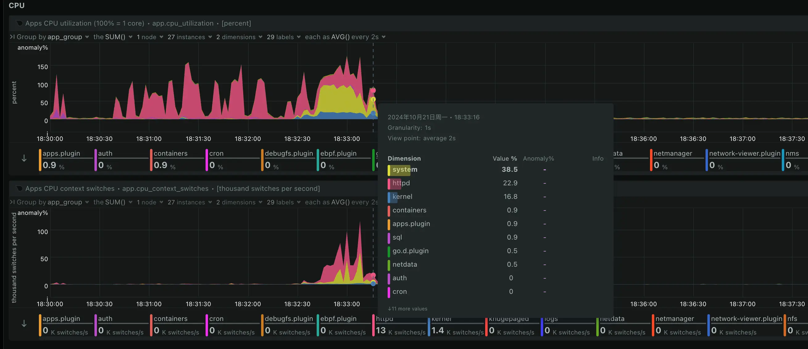

这也太奇怪了，18点33分16秒，httpd的内存访问造成的page fault已经有59K/s了，一旦page fault就要涉及查TLB，所以产生了一大堆的TLB中断。但是，在这个时间点之后httpd在ps命令中已经看不到了，然而swap还在使用，没有回收。

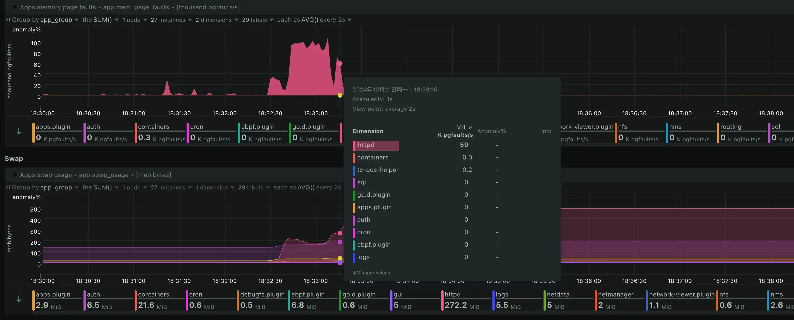

再看高峰时间点，脏页也非常多，有可能是文件背景的内存消耗比较多，触发了内核的水位线置换了更多的匿名页面。

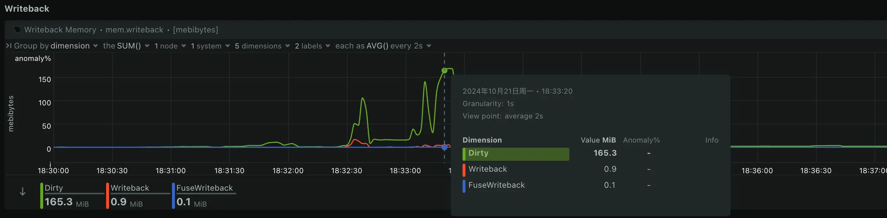

在内存的图上，看不活动的匿名页确实是上升了，说明httpd2的匿名页被swap置换到了磁盘上，在进程没了之后又没有回收。最重要的是，在18点33分14秒左右，活动的文件继续增多，这时候内核不得不驱逐了活动的匿名页，swap到了磁盘中更多的页。

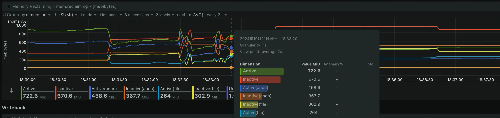

那么总结一下，这看起来又是一个swap引发的惨案，无非就是因为现在服务是在容器里，并且在docker层面加了内存限制，所以没有导致整个系统hung住，但是容器的进程hung住了，而且无法重启，这和系统hung住也没什么区别了，无非给我留了点数据可以看罢了。细节来看，又是一个page驱逐的问题，频繁又要使用结果换到swap里了，用的时候引发page fault又拉高了TLB中断，从磁盘频繁读写swap进一步拉高了iowait，成了一个死循环。

看来mpm的参数调的还是有点大了，还是再保守一些，然后把swap关了，cgroup配合swap一起用，看起来还是会引发一些问题，还是不要开了，docker加了限制，只要内存用超了直接kill了，就别再置换了，免得又搞成死循环。

关了swap后，再执行`dnf update`，然后内存满了又死机了。自从CentOS被RedHat搞没了之后，新生派的Rocky Linux和Alma Linux看起来还是不太行，问题频发，是时候换到Ubuntu了，希望这背后的商业公司能比RedHat晚点收割用户。

为了解决这个问题，我把系统更换为了Ubuntu 24.04.1 LTS，按照上边的配置步骤，我简单列举了一些命令步骤。

安装iptables、ipset的持久化服务，这样可以把规则保存起来，开机自启动。

```bash
apt install iptables-persistent ipset-persistent
```

迁移上边Rocky Linux中的配置到Ubuntu中，如果是新装的就不用迁移了，直接配置规则即可。

```bash
cat sysconfig/ipset > /etc/iptables/ipsets 
cat sysconfig/iptables > /etc/iptables/rules.v4 
cat sysconfig/ip6tables > /etc/iptables/rules.v6
```

重启服务使这些规则生效。

```bash
systemctl restart netfilter-persistent.service
```

为了避免swap再换出问题，这次索性不开swap了，并且WordPress的容器相关参数换成了如下。

主要是进一步调低了httpd的mpm的工作进程数量，同时调小了容器内存限制数值，增加了容器CPU限制参数，以便给系统留一点余量，避免影响到主机上的监控和报警插件。

```bash
cat > /data/wordpress/config/apache2/mpm_prefork.conf << EOF
# prefork MPM
# StartServers: number of server processes to start
# MinSpareServers: minimum number of server processes which are kept spare
# MaxSpareServers: maximum number of server processes which are kept spare
# MaxRequestWorkers: maximum number of server processes allowed to start
# MaxConnectionsPerChild: maximum number of requests a server process serves

StartServers            2
MinSpareServers         2
MaxSpareServers         4
MaxRequestWorkers       10
MaxConnectionsPerChild  20
EOF
```

```bash
docker run --restart=unless-stopped --name wordpress 
    -v /data/wordpress/data:/var/www/html 
    -v /data/wordpress/config/php/uploads.ini:/usr/local/etc/php/conf.d/uploads.ini 
    -v /data/wordpress/config/apache2/mpm_prefork.conf:/etc/apache2/mods-available/mpm_prefork.conf 
    --memory 768m 
    --cpus="1.5" 
    -e WORDPRESS_DB_HOST="192.168.1.2" 
    -e WORDPRESS_DB_USER="数据库用户名" 
    -e WORDPRESS_DB_PASSWORD="数据库密码" 
    -e WORDPRESS_DB_NAME="数据库名" 
    -e TZ="Asia/Shanghai" 
    --network xuegao 
    --ip 192.168.1.11 
    -d wordpress:6.6.2-apache
```

自从我更换系统为Ubuntu并且改了一些配置之后，内存的用量就正常多了，持续观察了几天，没有再出问题了。

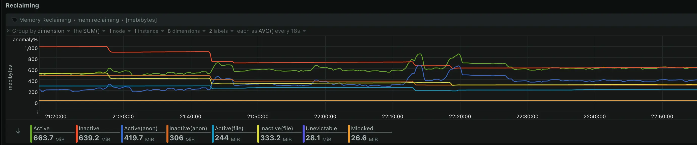

又观察了一个月，已经没有再出过问题了。
