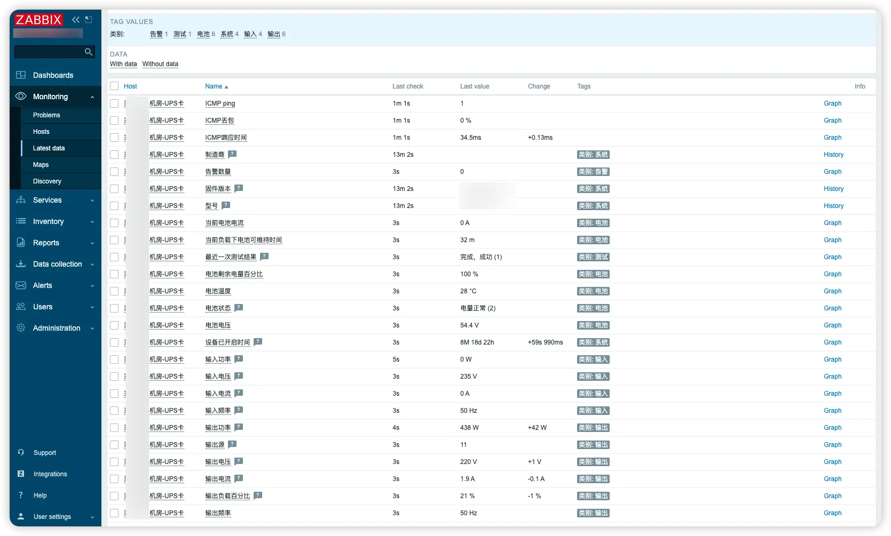
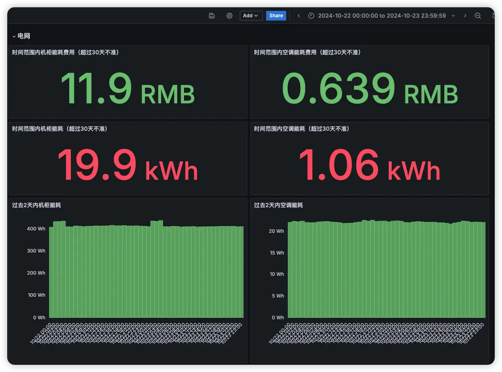
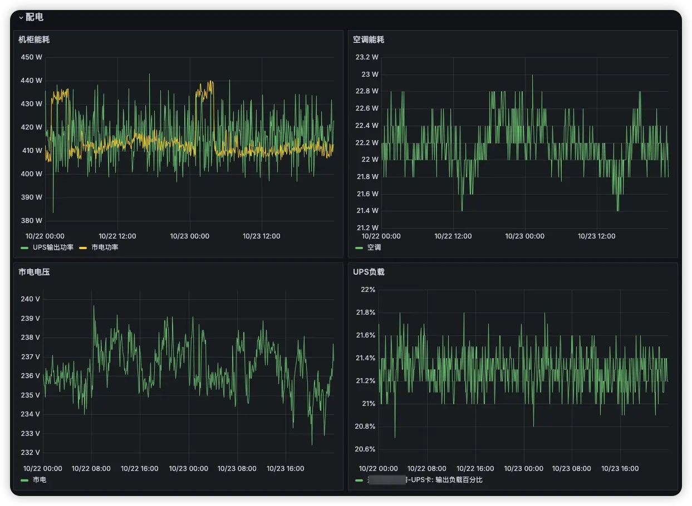

前边的文章中，我把NAS装到了Proxmox VE（后边简称PVE）中，为了避免突然断电导致文件系统乃至硬盘损坏，这篇文章我就讲讲如何把UPS和PVE联动起来，让电量低到设定值或者断电超过设定时间时开始按照特定顺序关闭虚拟机，并最后把PVE和主机关闭，保护数据安全。

https://blog.xuegaogg.com/windows-nas-openwrt-all-in-one-home-server/

https://blog.xuegaogg.com/truenas-and-synology-security-and-functionality-combined/

## 安装依赖

安装相关的软件包。

```bash
apt update
apt install nut-snmp
```

## 接入UPS

### SNMP连接

修改`/etc/nut/ups.conf`，添加下边的内容。这里我接入的是带SNMP卡的UPS，所以就使用`snmp-ups`的驱动。

```bash
# vim /etc/nut/ups.conf
[sk_sc1k]
   driver = snmp-ups
   port = 100.97.73.22
   community = public
   snmp_version = v2c
   pollfreq = 15
   desc = "SK SC1K SNMP"

   # 忽略UPS本身的Low Battery阈值，
   ignorelb
   # 还剩80%电就标记为低电量，就要关机了
   override.battery.charge.low = 80
   # 或者等待了5分钟，就要关机
   override.battery.runtime.low = 300
```

### USB线连接

如果你是第一次运行，可以直接使用下边命令扫描生成配置文件。注意，一定要等他执行出结果或者直接加个`-U`参数扫描USB，这玩意卡住不代表没有扫描出来，它只是最后才会输出出来而已。

```bash
# nut-scanner -U
SNMP library not found. SNMP search disabled.
Neon library not found. XML search disabled.
IPMI library not found. IPMI search disabled.
Scanning USB bus.
[nutdev1]
	driver = "blazer_usb"
	port = "auto"
	vendorid = "0665"
	productid = "5161"
	vendor = "INNO TECH"
	bus = "001"
```

扫描出的配置不是所有都需要的，对于USB的机器（例如国产的山克、山特，以及其他一些杂牌机都可以用），把上边扫描出的配置中的`driver`、`port`、`vendorid`、`productid`、`bus`复制到`/etc/ups/ups.conf`就行了，其他参数就不用了。

```bash
# vim /etc/ups/ups.conf
[ups]
        driver = "blazer_usb"
        port = "auto"
        vendorid = "0665"
        productid = "5161"
				# bus设置后最好测试一下，有些机器重启后，bus编号会变动，导致无法连接UPS
        bus = "001"
        
        # 忽略UPS本身的Low Battery阈值，
        ignorelb
        # 还剩80%电就标记为低电量，就要关机了
        override.battery.charge.low = 80
        # 或者等待了5分钟，就要关机
        override.battery.runtime.low = 300
```

## 接入监控报警

如果你还需要把SNMP UPS接入到ZABBIX、Grafana等监控报警系统中，或者把USB UPS接入进去，可以联系我，可提供整套解决方案。

接入ZABBIX，数据一览无余，已经稳定运行了8个月。



接入Grafana，统计用电量和费用，洞察开支。





接入企业微信或者邮箱，遇到断电、故障立即告警，快速发现和处理问题。


## 配置监听

修改`/etc/nut/nut.conf`，我这里只给PVE一台机器使用，因此设置模式为`standalone`，如果还有其他机器要使用，则需要修改为`netserver`。

```bash
# vim /etc/nut/nut.conf
MODE=standalone
```

修改`/etc/nut/upsd.users`，添加一个用户，由于后文我只在本地机器上使用，所以密码就随意了，如果你是要开放给其他机器使用，建议设置强密码。

```bash
# vim /etc/nut/upsd.users
[upsmon]
    password = password
    upsmon secondary
```

修改`/etc/nut/upsd.conf`，由于仅本地机器使用，所以设置为只监听`lo`接口。

```bash
# vim /etc/nut/upsd.conf
LISTEN 127.0.0.1 3493
```

修改`/etc/nut/upsmon.conf`，添加本地的UPS服务，才可以和UPS联动。

```bash
# vim /etc/nut/upsmon.conf
MONITOR sk_sc1k@127.0.0.1 1 upsmon password secondary
```

启动相关服务，并且设置开机自动启动。

```bash
systemctl start nut-server.service
systemctl start nut-monitor.service

systemctl enable nut-server.service
systemctl enable nut-monitor.service
```

使用`upsc <UPS名称>`，就可以查看当前系统已经接入的UPS的信息，包括电压、功耗、负载、电量等。

```bash
# upsc sk_sc1k                                                                                      
Init SSL without certificate database                                                                                
battery.charge: 100                                                                                                                                                                                                                        
battery.charge.low: 80                                                                                               
battery.current: 0                                                                                                                                                                                                                         
battery.runtime: 22440                                                                                               
battery.runtime.low: 300                                                                                             
battery.temperature: 28                                                                                              
battery.voltage: 27.20
# ...省略
```

此时，当UPS断开后，电量低于设定阈值时，或者断电超过设定时长后，系统将会自动关闭。如果PVE上有开启的虚拟机，则会按照虚拟机设定的顺序、等待时间依次排队关机，最后自动关闭系统，就不会再停电丢数据了。

## 测试一下

为了确保配置正确，一定要手工断开UPS电源做测试，验证是否生效，这非常重要。

拔掉UPS的市电，稍等片刻等待满足设定的电量阈值，PVE中只要看到`Bulk shutdown VMs and Containers`这一行，说明已经在批量关机了，就说明符合预期了，再次开机后就可以开始正常使用了。


## 参考资料

- [https://networkupstools.org/docs/man/snmp-ups.html](https://networkupstools.org/docs/man/snmp-ups.html)

- [https://rymnd.net/blog/2018/ups-monitoring/](https://rymnd.net/blog/2018/ups-monitoring/)
