其实想了很久，我有从小到大的照片、日常的资料文档、备份这种比较重要的资料需要存放，从白群晖到黑群晖，是不是一个不太稳妥的方案？

结合我的DS220+三年以来的使用经历，越是重要的数据，就越不会去经常更新，我的DS220+用了三年，系统就更新过一次，最常用的功能也就是Photos、Video Station、Cloud Sync，这些插件应该是就没有更新过，因此也非常稳定。出于这个背景，使用黑群晖完全没有问题，只要不再折腾，安安稳稳存点东西，也是足够的，既能满足需要，也能省出来白群的钱。（但是就是会有各种瞎折腾然后就炸了

数据无价，所以这里我使用TrueNAS存数据，群晖挂载和使用数据。

这里我打算将TrueNAS和黑群晖结合起来使用。TrueNAS ZFS+双盘Mirror+定期快照保护数据，通过NFS挂载给黑群晖，让黑群晖只负责除了存储的其他功能，这样即便炸了数据还在TrueNAS上，也不担心，还可以白嫖到群晖的APP。这篇文章，就来看看如何在Proxmox VE中安装黑群晖，并且安全地使用黑群晖。

上一篇文章中，我将我的核显虚拟化成了两个虚拟核显，一个给我的Windows虚拟机串流，一个就给黑群晖转码和人脸识别用。这篇文章，我就在那台机器上的Proxmox VE（下边简称PVE）中继续安装TrueNAS+黑群晖虚拟机，并接通它们。

https://blog.xuegaogg.com/windows-nas-openwrt-all-in-one-home-server/

## 直通SATA控制器

我的主板有4个SATA槽位，因此我打算把SATA控制器直通给TrueNAS中，让TrueNAS直接管理硬盘，这样也能获取到硬盘的SMART信息，而且整盘用于存储，后边机器挂了恢复数据难度也会低很多。

配置SATA控制器直通，需要在PVE中屏蔽相关驱动，SATA控制器的驱动为ahci，就修改`/etc/default/grub`，在`GRUB_CMDLINE_LINUX_DEFAULT`中添加`modprobe.blacklist=ahci`，如果这个参数已经存在，则追加`,ahci`即可。如果你的PVE系统盘就是SATA盘，就不要直通了，不然很有可能开不了机。

```bash
GRUB_CMDLINE_LINUX_DEFAULT="... modprobe.blacklist=ahci"
```

然后重新生成grub配置和initramfs。

```bash
update-grub
update-initramfs -u -k all
```

然后重启系统即可。

## 配置网络

这里我总共创建了3个虚拟网络，`vmbr0`为管理网，会跑VLAN，`vmbr1`为PVE内部使用的NFS网络，`vmbr2`为WiFi网络。注意`vmbr1`需要分配一个IP地址，不然TrueNAS没办法和PVE互通。

由于我的管理网和WiFi网络不是一个子网，为了避免管理网的OpenWRT和NAS共用一个千兆口抢速度，才单独开了一个vmbr2桥接2.5G网卡给NAS用，如果你没有这种场景，`vmbr0`接WiFi就行，下边配VLAN的过程就不用看了，直接跳到下一节就好。

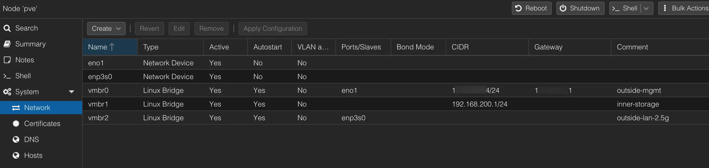

`vmbr0`的VLAN用于跑OpenWRT的虚拟机，所以我需要为PVE配置VLAN。

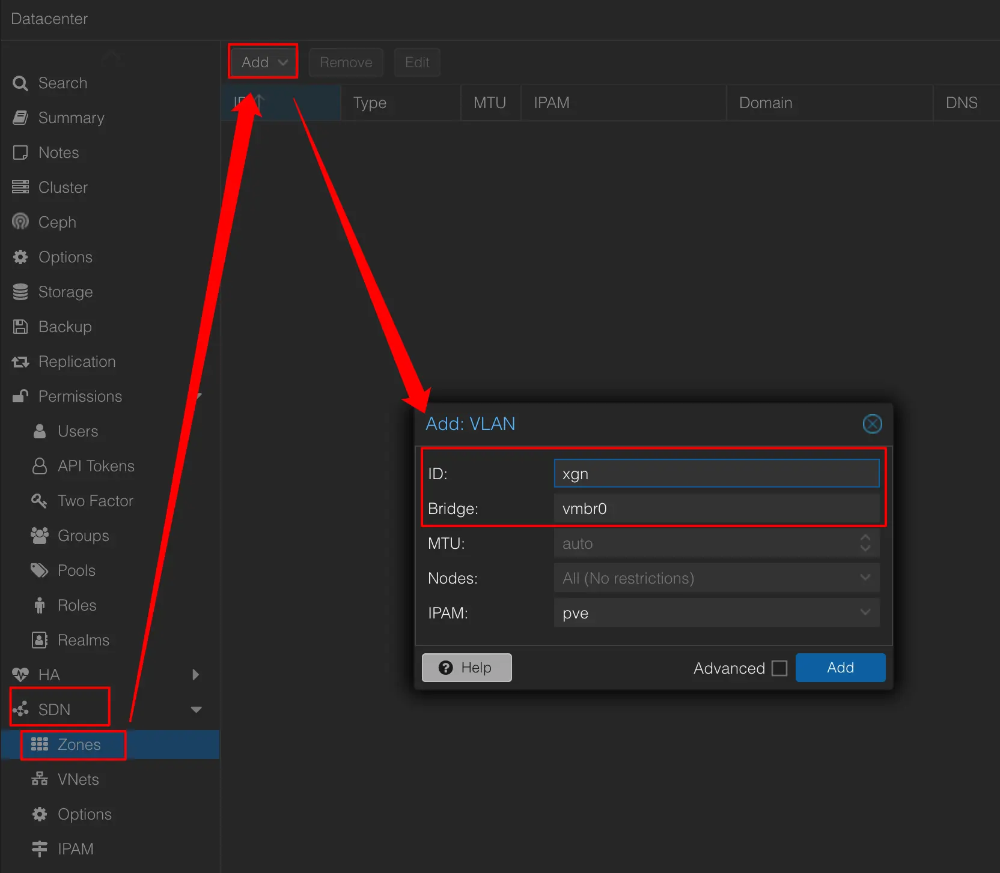

这里我创建了一个`xgn`的区域，然后需要回到SDN中点击`Apply`，这样这个区域才会生效。

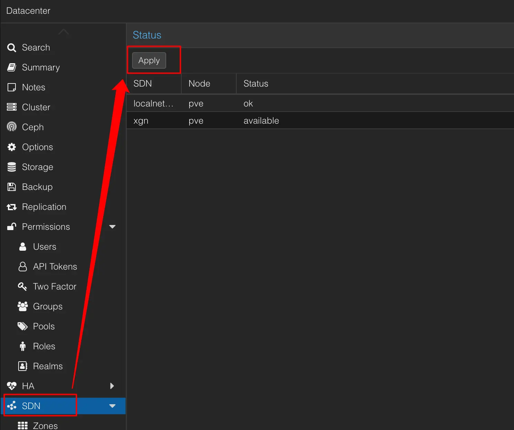

紧接着再创建一个`vlan20`的VNet，并且配置VLAN ID为20，然后再回去SDN中点一下`Apply`，就可以生效了。

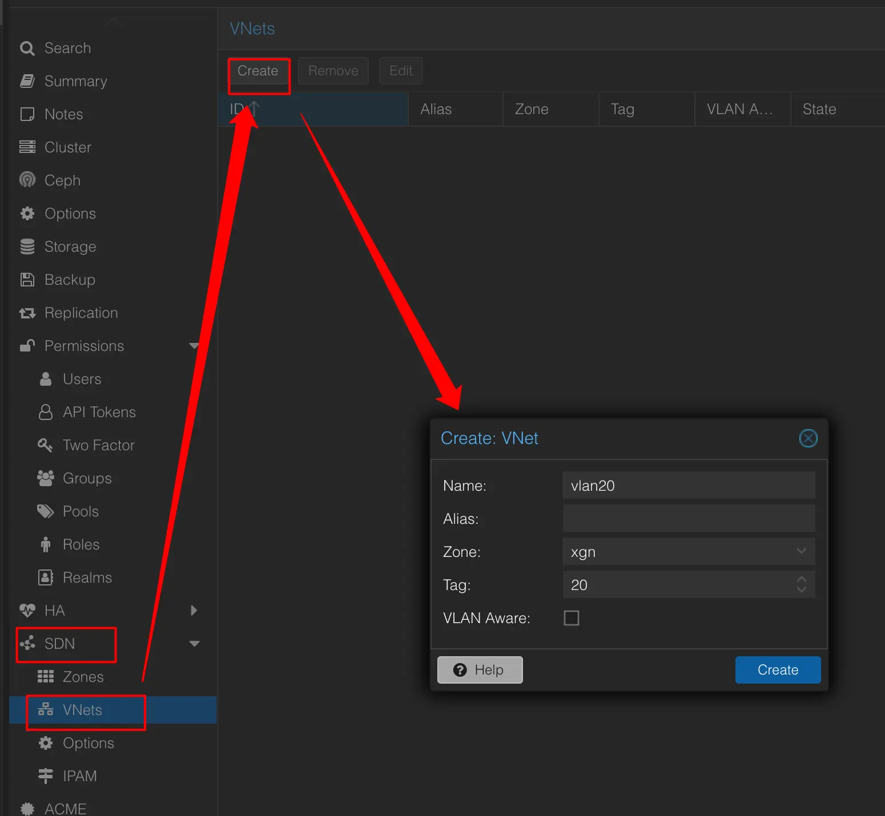

## 安装配置TrueNAS

首先，安装TrueNAS，这个安装比较简单，我就不贴过程了。

这里我给了虚拟机20G的虚拟磁盘，这个磁盘就是装TrueNAS系统的。给了两个虚拟网卡，一个专门用于跑NFS存储（`vmbr1`），只在PVE的虚拟机间使用，一个是桥接了2.5G网卡并且接了WiFi网络（`vmbr2`），用于访问NAS。直通了一个PCI设备，就是SATA的控制器。

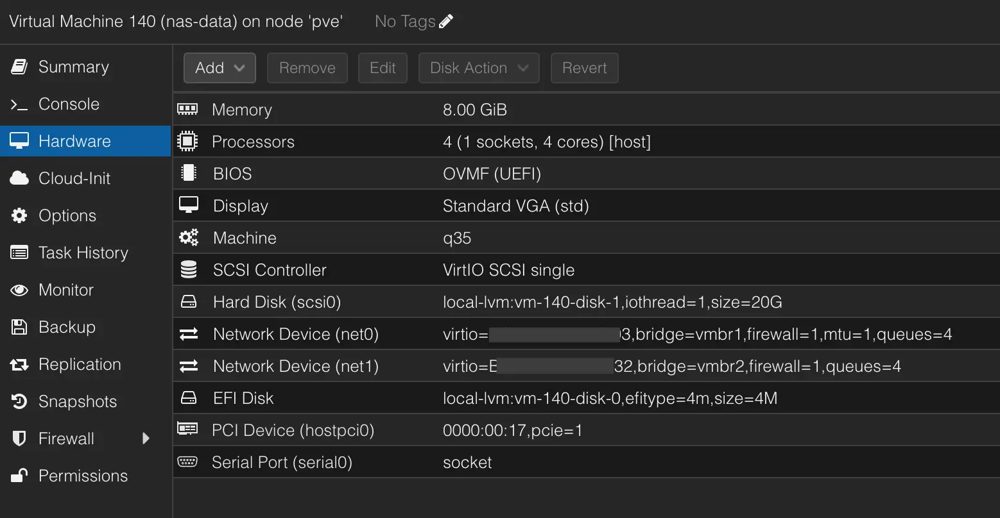

TrueNAS安装好后，两个虚拟网卡我也都配置好了，下图中的`vtnet0`就是接下来跑NFS的接口。

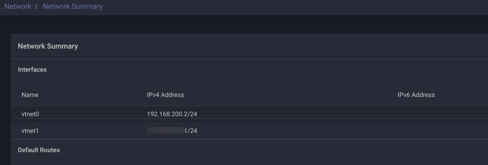

这里我创建了两个Pool，接下来我配置TrueNAS NFS共享`promox`，后边黑群晖的一个虚拟磁盘将会通过NFS创建在这个`proxmox`中。

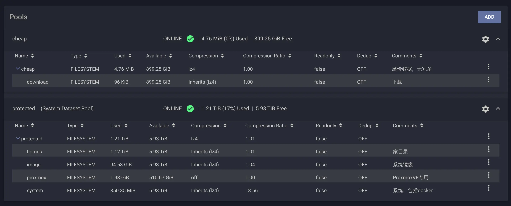

按照下图中的步骤，为`proxmox`配置NFS。允许的网络填写`vmbr1`所在的子网地址即可。

【补充】Maproot User设置为root，Maproot Group保持为空，不要按照图中的选择，虽然似乎真的按图中的设置了也没什么影响。一开始我以为这个参数是等同于Linux中的squash，后来发现并不完全是，为了避免权限错误，就只设置Maproot User就好了，就别点Group了。

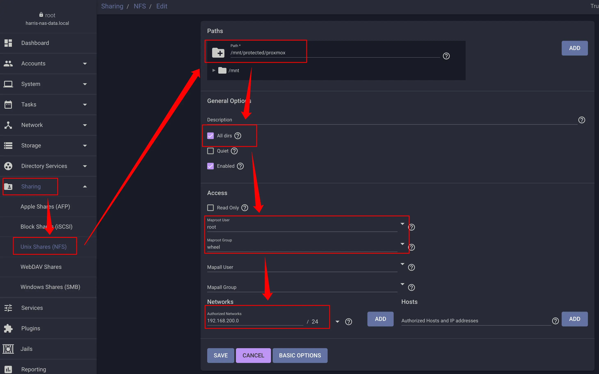

然后配置NFS的参数，只绑定到`vmbr1`中的网卡上，并且允许非root用户挂载，这样可以使用随机端口发起连接，可以避免NFS连接挂死的问题。虽然UDP延迟会低很多，但是这里仍然不建议使用UDP，因为PVE的内核不支持，而且NFS也不推荐使用UDP。

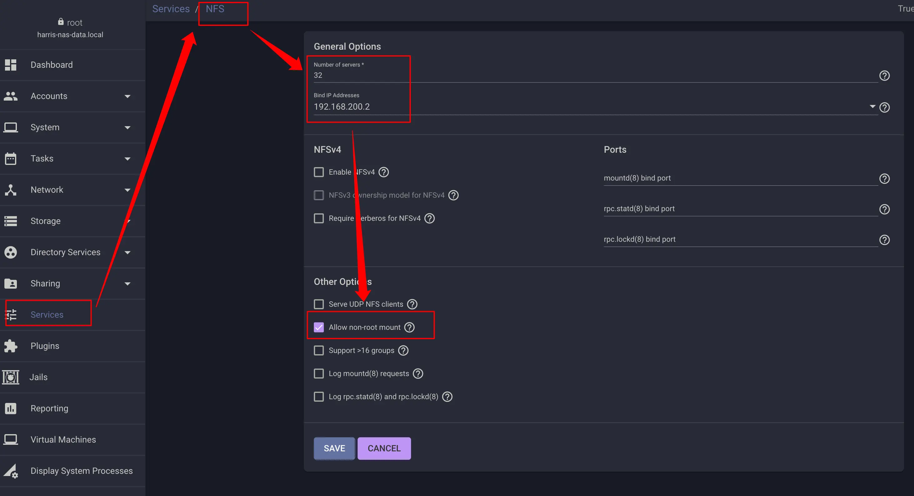

## PVE挂载TrueNAS

其实一开始我是想用ZFS over iSCSI的，查了一下资料，发现TrueNAS没有官方的iSCSI Provider软件提供，FreeBSD的istgt也不支持，所以求稳还是选择了NFS。虽然NFS性能不如iSCSI，但是快照、克隆等功能都还是支持的，只要虚拟磁盘创建的时候使用qcow2格式，这些特性都可以支持，这样一来插件数据实际是存在TrueNAS里，也会受到保护。

但是，PVE挂载NFS只推荐在家庭环境使用，不要用在生产环境，它的性能支撑群晖的数据盘和快照肯定是绰绰有余的，但是生产的高负载、高可靠性场景下，我还是建议老老实实用PVE本地盘RAID或者Ceph，不要乱搞，数据安全是第一。

修改PVE的内核参数，优化NFS的性能。

```bash
cat > /etc/sysctl.d/90-nfs.conf << EOF
# Disable TCP slow start on idle connections
net.ipv4.tcp_slow_start_after_idle = 0

# Increase Linux autotuning TCP buffer limits
# Set max to 16MB for 1GE and 32M (33554432) or 54M (56623104) for 10GE
# Don't set tcp_mem itself! Let the kernel scale it based on RAM.
net.core.rmem_max = 56623104
net.core.wmem_max = 56623104
net.core.rmem_default = 56623104
net.core.wmem_default = 56623104
net.core.optmem_max = 40960
net.ipv4.tcp_rmem = 4096 87380 56623104
net.ipv4.tcp_wmem = 4096 65536 56623104

# TCP Congestion Control
net.ipv4.tcp_congestion_control = bbr
net.core.default_qdisc = cake
EOF

# 重新加载配置，让上边的改动生效
sysctl -p --system
```

修改NFS的TCP连接数量限制，默认只有2，调大能够提高并行的性能。

```bash
cat > /etc/modprobe.d/sunrpc.conf << EOF
options sunrpc tcp_slot_table_entries=16384
options sunrpc tcp_max_slot_table_entries=16384
EOF
```

然后重新生成initramfs。

```bash
update-initramfs -u -k all
```

然后在PVE上添加NFS存储，这里限制只允许使用NFSv3，NFSv4多了一些不需要的功能，性能反而有些许下降。

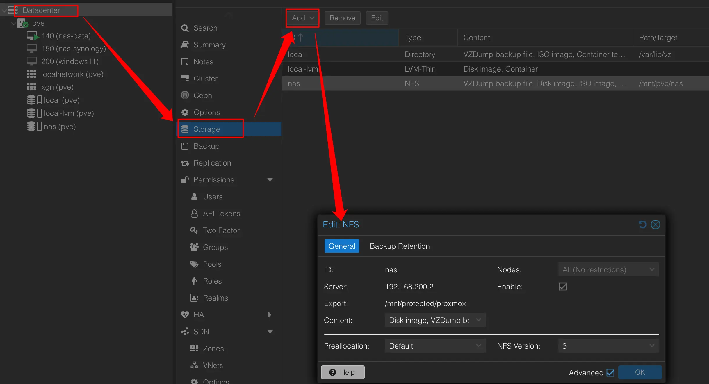

然后修改PVE中的下边这个文件，允许使用非保留端口传输，避免TCP连接挂死的问题，其他参数主要是优化性能。

```bash
# cat /etc/pve/storage.cfg 
# ... 省略一些内容
nfs: nas
        export /mnt/protected/proxmox
        path /mnt/pve/nas
        server 192.168.200.2
        content images,iso,vztmpl,rootdir,backup
        # 修改这里，默认只有vers=3，要添加后边的这一串参数
        options vers=3,nolock,proto=tcp,rsize=1048576,wsize=1048576,hard,timeo=600,retrans=2,noresvport
        prune-backups keep-all=1
```

完成了这些修改后，需要重启一下PVE，重启后执行下边的命令，看到配置生效了就说明可以了。

```bash
# cat /proc/sys/sunrpc/tcp_slot_table_entries
16384
# cat /proc/sys/sunrpc/tcp_max_slot_table_entries 
16384
```

## 安装配置黑群晖

### 寻找Loader

横向对比了一下，发现国人搞的rr不错，这是一个redpill的预安装和恢复环境，易用性大幅提升，资料也非常多，对新手来说非常友好。可以直接点击下边的链接去下载。

[https://github.com/RROrg/rr](https://github.com/RROrg/rr)

这里我使用的24.10.0版本。

### 安装虚拟机

首先，我创建一个虚拟机，并且将rr镜像导入进去。

```bash
qm disk import 150 rr.img local-lvm
```

然后配置虚拟机，这里我设置了3个虚拟盘，一个是刚刚导入的rr loader（3588M那个），一个是黑群晖的系统（20G那个），一个是存放插件数据（50G那个），插件数据的虚拟磁盘文件保存在TrueNAS NFS中。需要特别注意的是，存放插件数据的虚拟磁盘尽量在安装完系统后再添加，避免安装黑群晖的时候把系统装错位置。

再直通虚拟化的核显进去，然后我又添加了一个串口（Serial Port），这样就可以使用xterm.js的终端直接查看到详细的启动日志，noVNC中是不显示详细的启动信息的。

虚拟网卡我给了两个，`net0`接`vmbr1`，用于挂TrueNAS的NFS，`net1`接`vmbr2`，用于在WiFi网络中使用NAS。

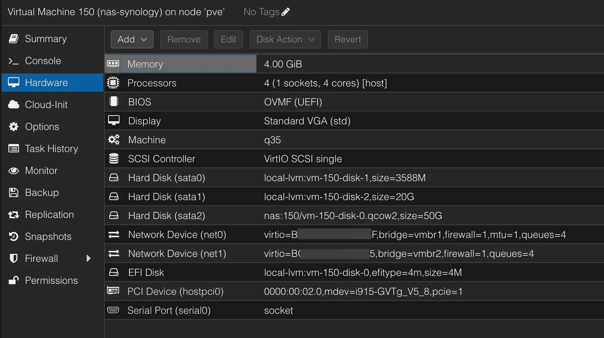

配置完成后，就可以打开虚拟机了。

### 配置Loader

开启虚拟机，我的网络中开启了DHCP，rr启动后能自动获取到IP地址，直接在浏览器中打开该地址的7681端口即可。

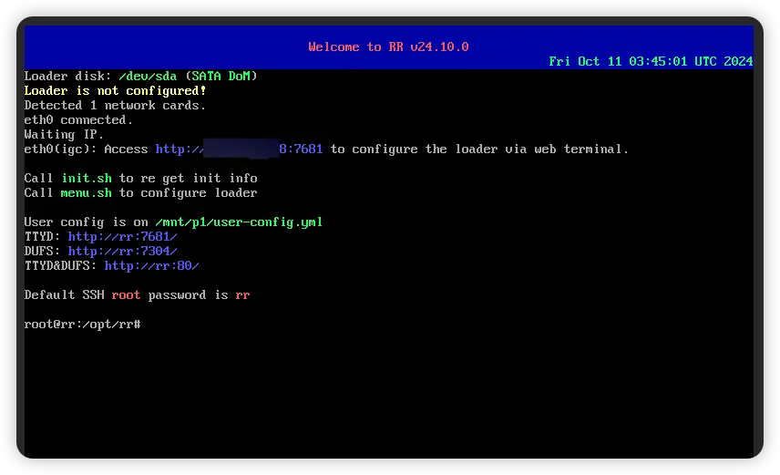

### 选择model

浏览器打开7681端口后，就是一个终端。

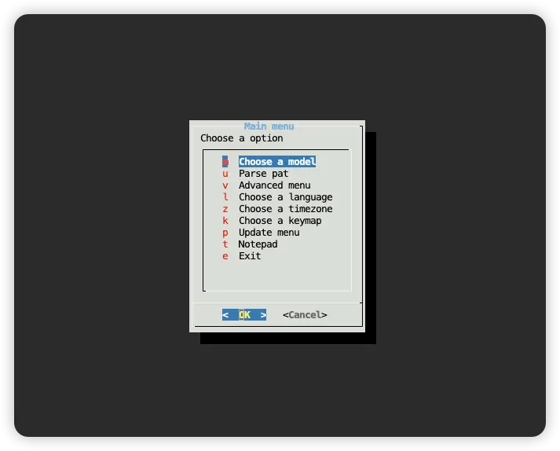

这里由于是第一次使用，需要先选择model，由于我是10代CPU，需要直通核显，就选DS918+。

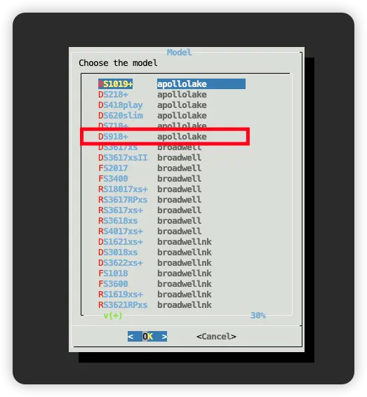

### 选择版本

紧接着是选择版本。7.2.2中群晖移除了Video Station并且宣称不再支持，直接一个大无语，因此这里我选择7.2.1。

补充：建议也不用再使用Video Station了，博主我现在有多用户的需求，发现Video Station不支持索引home目录中的文件，Music Station虽然支持但是不知道为什么一直索引不到文件，这样的话黑群晖对我的价值也就是文件共享、套件、Photos和APP了，视频可以直接用Jellyfin代替了，但是其实套件也可以用PVE的LXC代替了，文件共享可以直接挂TrueNAS，黑群晖的价值并不是那么大了。

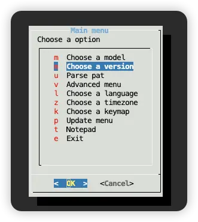

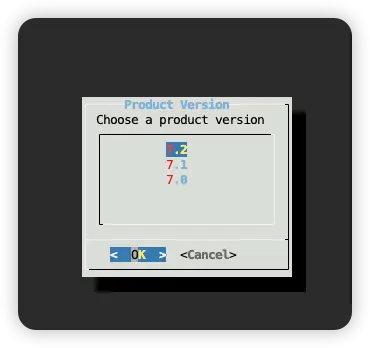

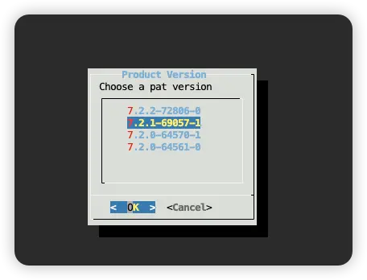

提示确认系统包的下载路径和MD5，这个设计好评。

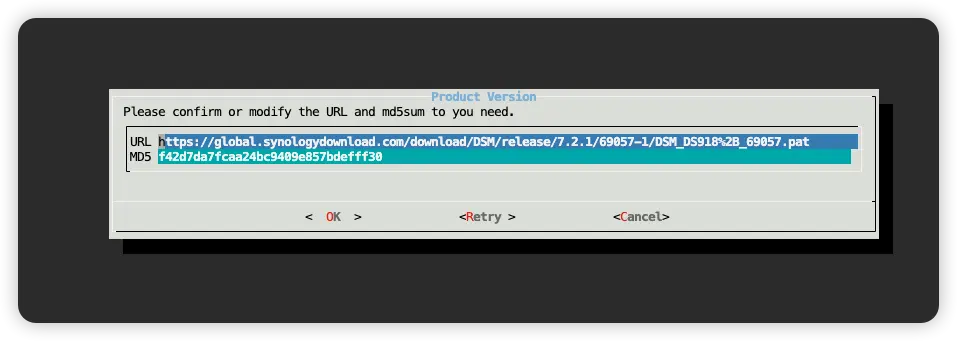

### 自定义配置插件

紧接着会自动跳到`Build the loader`选项，不要确认，因为接下来还需要自定义一些选项。

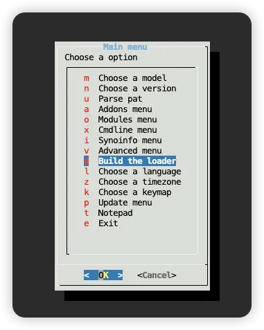

这里我添加一些插件，进入`Addons menu`。

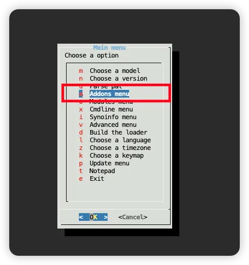

可以先使用`Show all addons`查看所有插件。本着非必要不安装的原则，我增加了一个GPU驱动补丁`i915le10th`，其他红色框的是本身自带的。

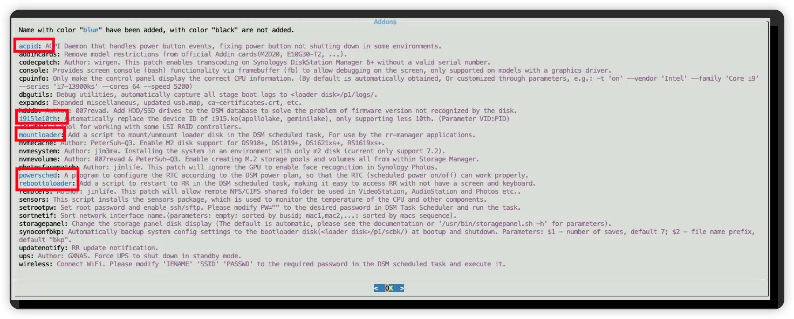

### 自定义配置内核模块

看了一下`Modules menu`，默认已经选上了所有的kmod，因此这个就不用再设置了。

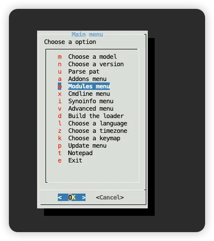

### 自定义配置SN和MAC

再进入`Cmdline menu`中，这里我随机生成了一个SN/MAC。

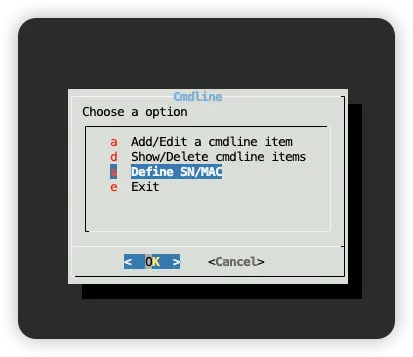

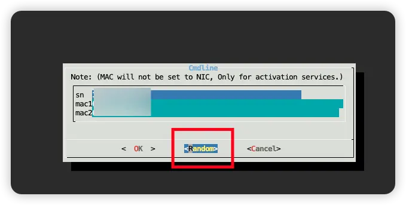

### 修复硬盘顺序

使用xterm.js进入黑群晖虚拟机的命令行，使用命令`dmesg | grep SATA`可以定位到硬盘所在的插槽。

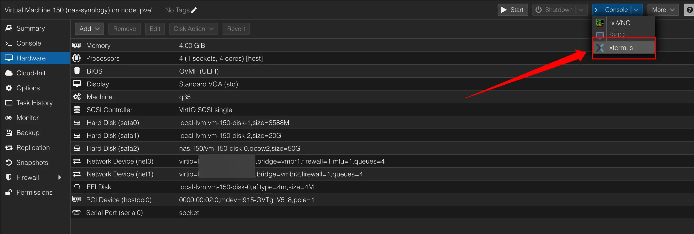

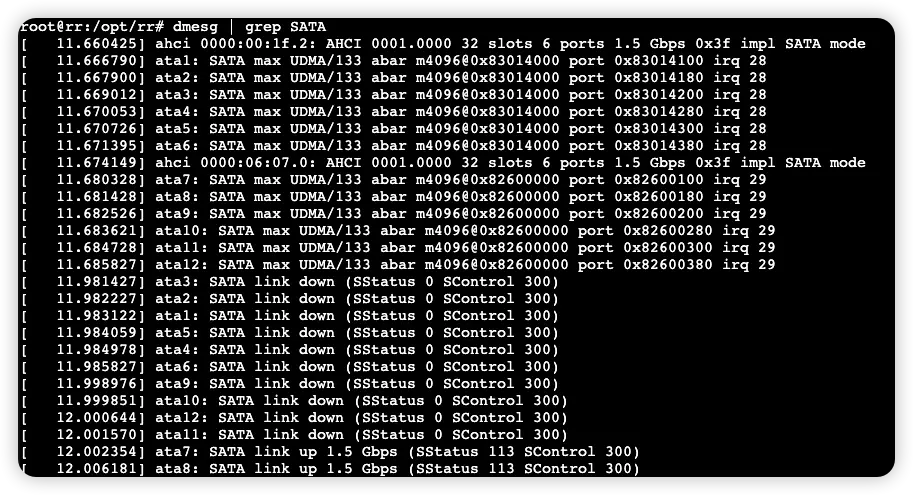

这一部分的内容表示总共有两个SATA控制器，每个控制器都有6个SATA插槽，分别分配为了`ata1`到`ata12`。

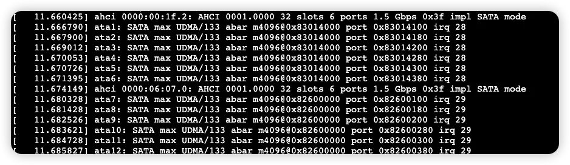

这一部分内容表示扫描`ata1`到`ata12`后，`ata7`和`ata8`两个插槽有硬盘，都是在第二个SATA控制器上。

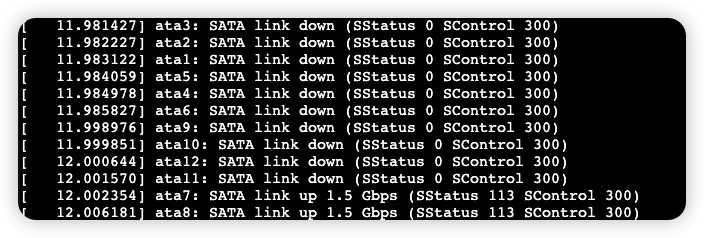

接下来修复一下硬盘的顺序，需要添加cmdline配置，就是让上边的`ata7`、`ata8`分别在系统中显示为硬盘1、硬盘2。

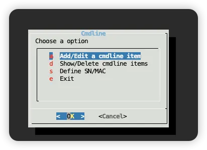

我添加了一个`SataPortMap=04`，代表第一个SATA控制器上没有插槽（PVE默认添加的一个控制器，实际没有任何磁盘），第二个SATA控制器上有4个插槽（实际会用3个，不够可以按需调大，但是不能超过9）。

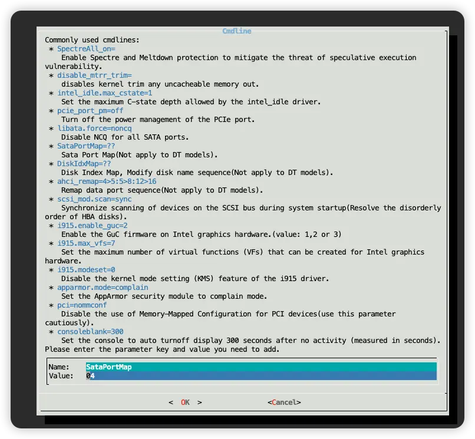

然后再设置`DiskIdxMap=0000`，由于上边设置的第一个控制器中有0个槽位，第二个控制器有4个槽位，那么我们在系统中看到的第一块硬盘将会是第二个控制器上的0号硬盘，第二块硬盘将会是第二个控制器上的1号硬盘，其他以此类推。

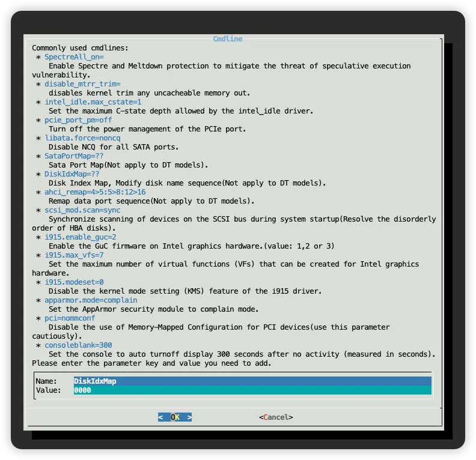

这样一来，安装的系统的时候，就会提示安装到2号盘上了，就是创建的20G的虚拟盘上。如果你此时已经添加了第3块虚拟磁盘（插件数据盘），这里可能要留意一下是不是安装到了硬盘3上，如果是，那可能需要临时先卸载掉第3块虚拟磁盘。

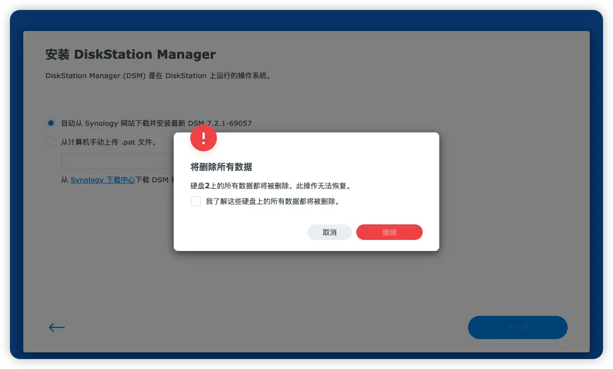

### 安装Loader

看了一下`Synoinfo menu`、`Advanced menu`，没有需要改动的内容了，那么接下来就开始`Build the loader`。

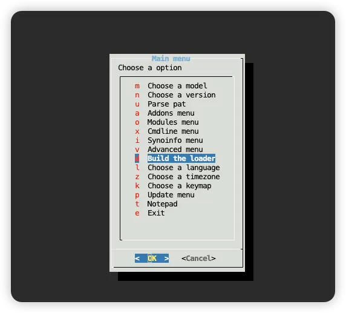

rr会自动下载pat并且修补镜像，稍等片刻完成之后，直接启动就可以了。

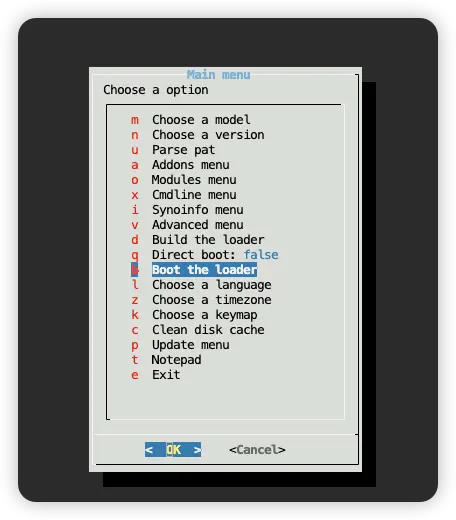

开始启动后，rr的网页端就无法打开了，后续看详细的启动日志，就只能在xtream.js中看了。

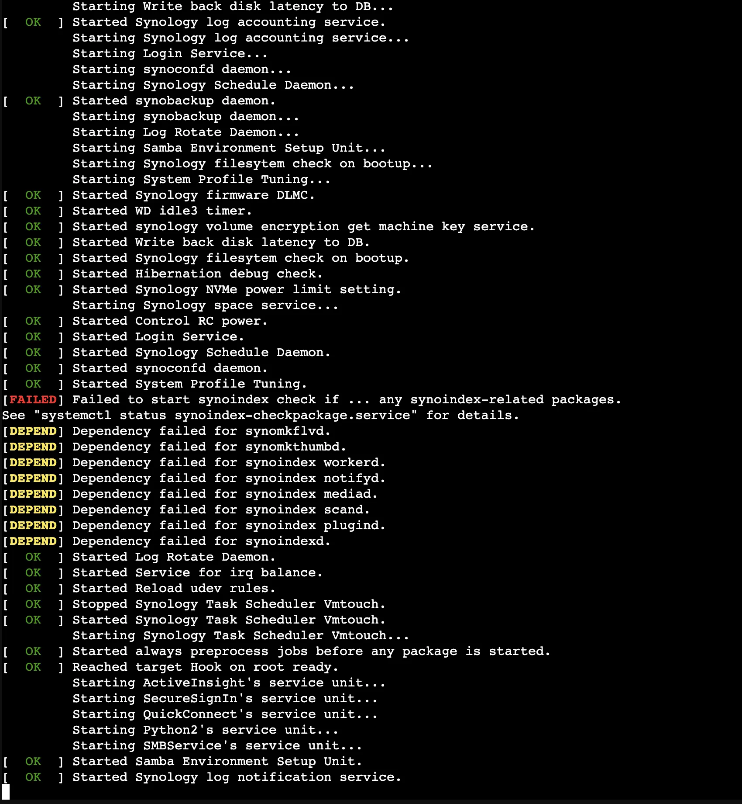

### 安装配置黑群晖

这一步就不多说了，但是特别注意网络要配置正确，不然挂NFS会不通。

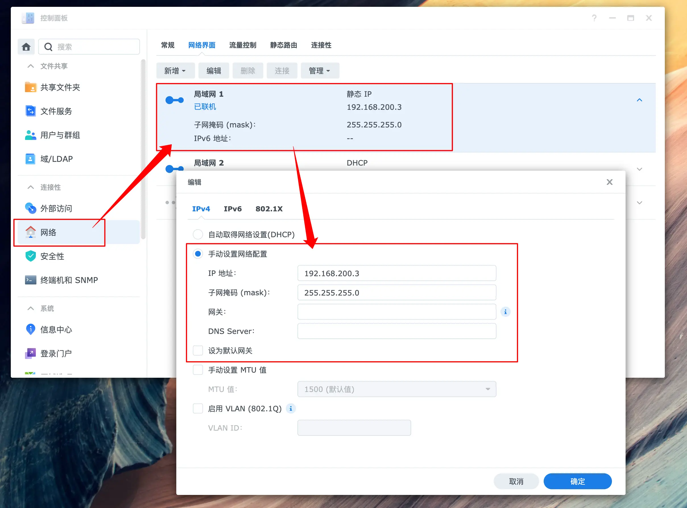

然后初始化3号虚拟磁盘，建立存储池，由于虚拟磁盘底层已经是ZFS了，因此这里用最简单的ext4文件系统即可，不要再用btrfs。50G的空间初始化之后就剩39G了。

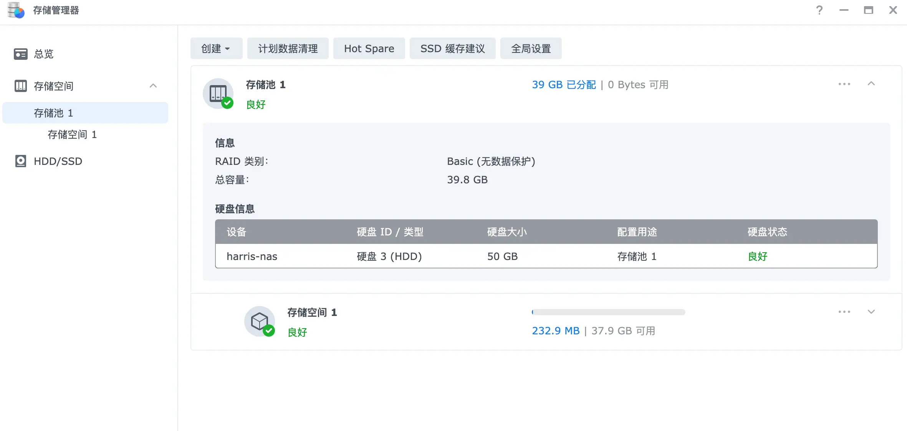

### 黑群晖挂载TrueNAS

我这里更倾向于一家人都使用home目录存储自己的文件，不再开多个共享文件夹，管理也方便，因此需要为所有用户启用家目录。

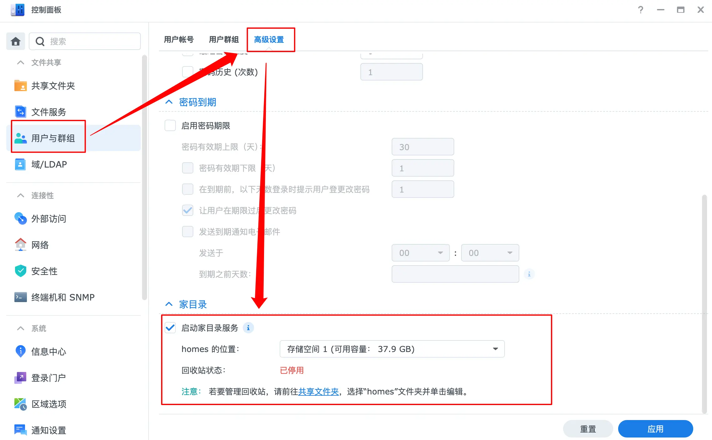

由于将NFS目录挂载到群晖的homes目录时，修改共享文件夹时会提示存储空间不支持ACL，这样所有用户都能看到homes目录和其中的数据，即便是在下图中勾掉两个隐藏，重启之后还是会出现，因此需要为每个用户单独挂载家目录。为用户单独挂载家目录也需要把下边两个勾勾上。

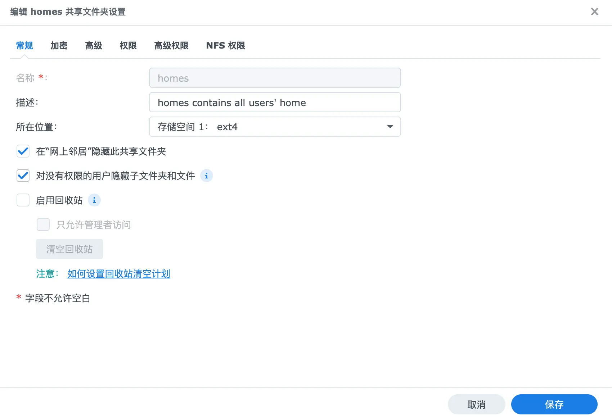

我已经创建好了TrueNAS的NFS，路径为`/mnt/protected/homes`，接下来我创建计划任务，把它挂进去黑群晖。这里我创建两个计划任务，让系统每次启动时把用户的家目录目录挂载上，关机时把家目录卸载掉。

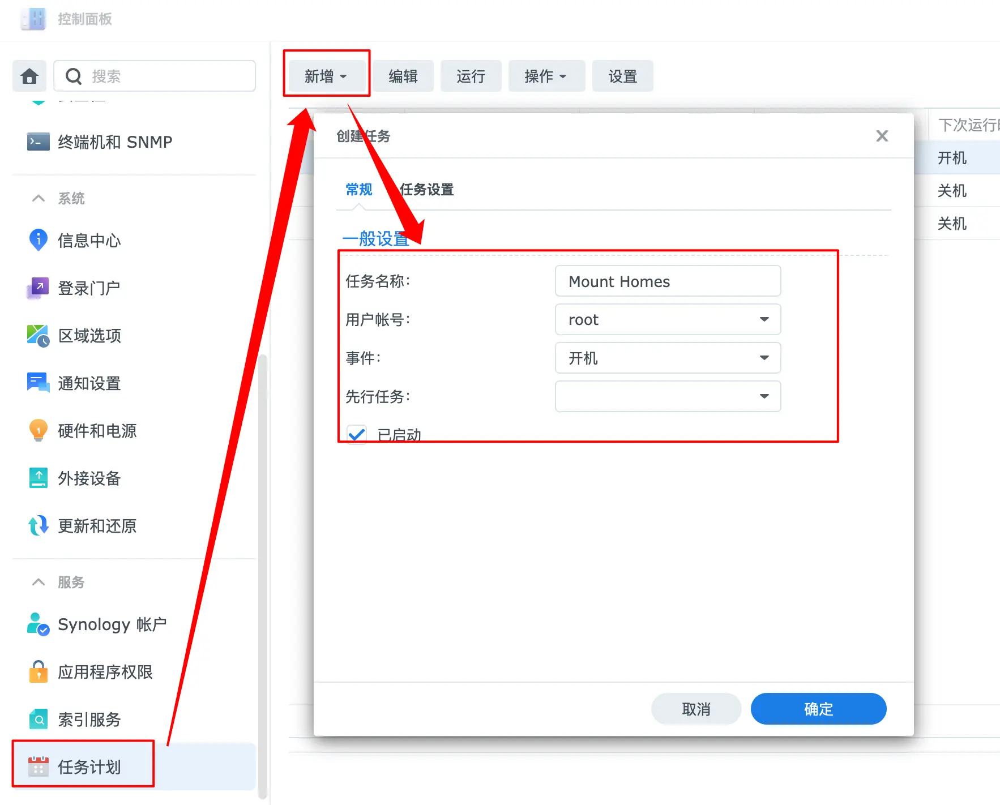

然后把挂载脚本贴进去，让系统每次启动的时候就挂载。每次添加新用户的话，也需要手工来这里加几行。

```bash
mkdir -p /data
mount -t nfs -o vers=3,nolock,proto=tcp,rsize=1048576,wsize=1048576,hard,timeo=600,retrans=2,noresvport 192.168.200.2:/mnt/protected/homes /data

mkdir -p /data/harris
mkdir -p /volume1/homes/harris
mount -t nfs -o vers=3,nolock,proto=tcp,rsize=1048576,wsize=1048576,hard,timeo=600,retrans=2,noresvport 192.168.200.2:/mnt/protected/homes/harris /volume1/homes/harris
chown harris /volume1/homes/harris

mkdir -p /data/xuegao
mkdir -p /volume1/homes/xuegao
mount -t nfs -o vers=3,nolock,proto=tcp,rsize=1048576,wsize=1048576,hard,timeo=600,retrans=2,noresvport 192.168.200.2:/mnt/protected/homes/xuegao /volume1/homes/xuegao
chown xuegao /volume1/homes/xuegao

# 每新增一个用户时，要加下边的内容，删除用户时就删掉
# mkdir -p /data/<用户名>
# mkdir -p /volume1/homes/<用户名>
# mount -t nfs -o vers=3,nolock,proto=tcp,rsize=1048576,wsize=1048576,hard,timeo=600,retrans=2,noresvport 192.168.200.2:/mnt/protected/homes/<用户名> /volume1/homes/<用户名>
# chown <用户名> /volume1/homes/<用户名>
```

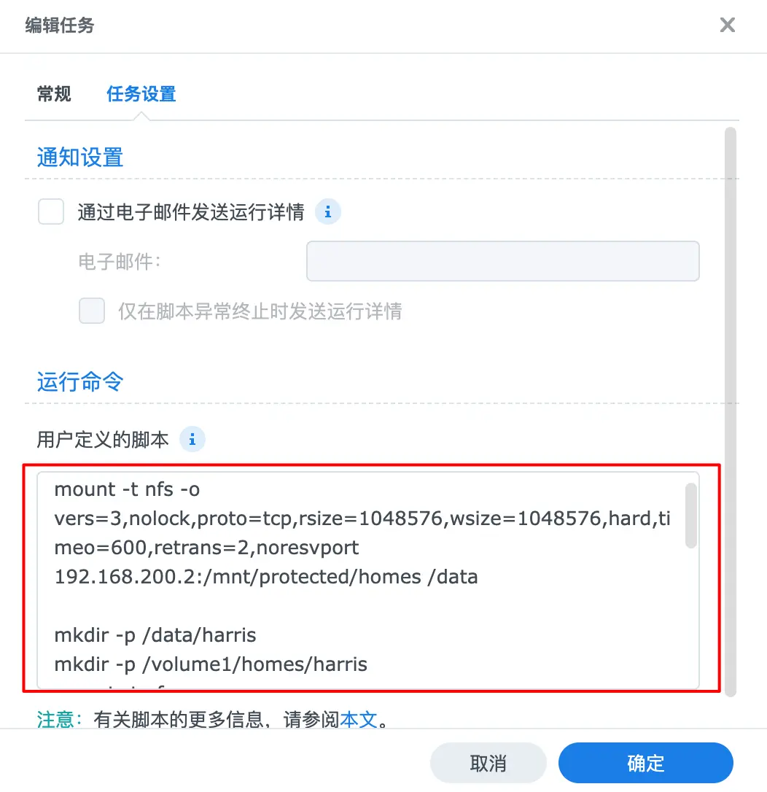

然后再添加一个关机时取消挂载的脚本，脚本复制到刚刚的一样的位置中。每添加一个新用户，也需要

```bash
umount /data

umount /volume1/homes/harris
umount /volume1/homes/xuegao

# 每新增一个用户时，要加一行，删除用户时就删掉
# umount /volume1/homes/<用户名>
```

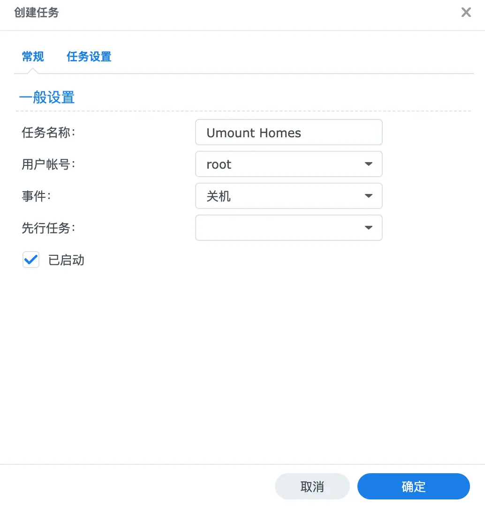

重启后，homes目录就可以被挂载进来了，空间也显示成TrueNAS中的空间了。

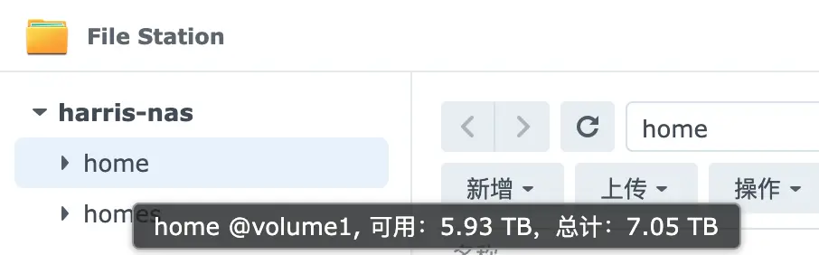

### 群晖通知接入企业微信

因为我这是黑群晖，没办法用群晖管家App接收报警了，SMTP邮件又嫌麻烦，还要去开外发账户，所以这里我直接把通知接入到企业微信中，这样UPS断开、下载任务完成等所有通知就可以走企业微信通知了，还比官方的群晖管家App更可靠。

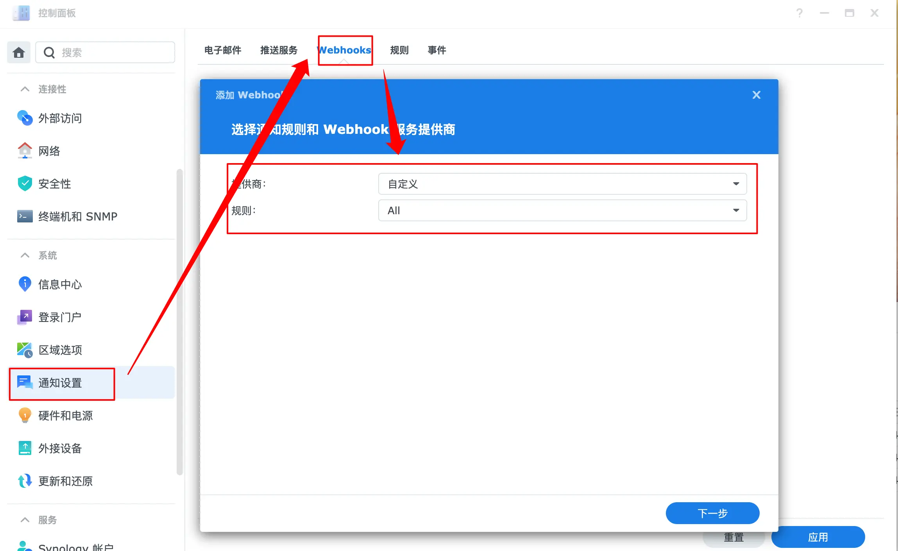

接入企业微信需要创建一个自己的组织，可以把家里人都拉进来凑个人头，满3个人之后就可以拉个群，就可以拉一个机器人进来，就可以得到机器人的Webhook地址了。把机器人的Webhook地址填入到下边的`Webhook URL`中即可。

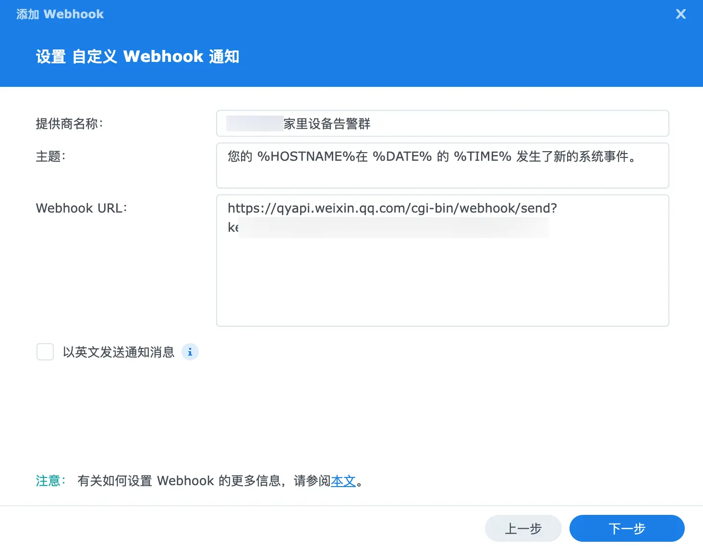

然后选择HTTP方法为POST，`Content-Type`选择`application/json`，HTTP主体中把下边的内容复制进去就可以了。

```json
{
    "msgtype": "markdown",
    "markdown": {
        "content": "@@TEXT@@"
    }
}
```

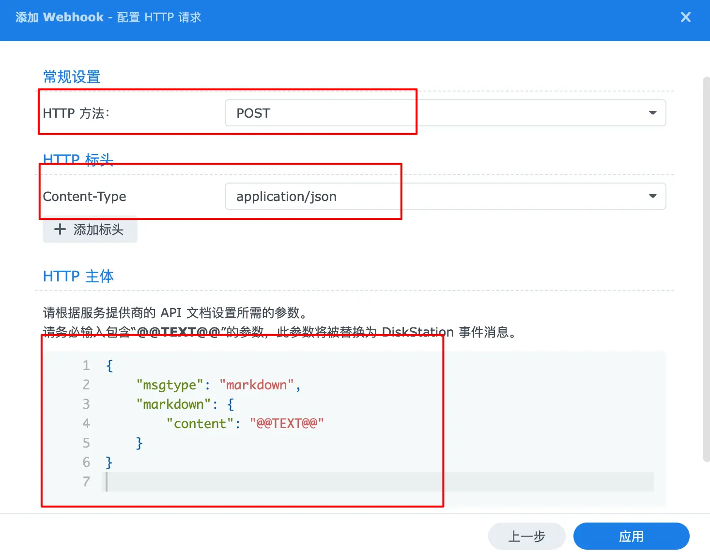

不得不说群晖这个Webhook配置起来太友好了，非常简单就可以接入。完成上边的配置之后，点击发送测试消息，刚点下企业微信就立马弹出消息通知了，非常快速。

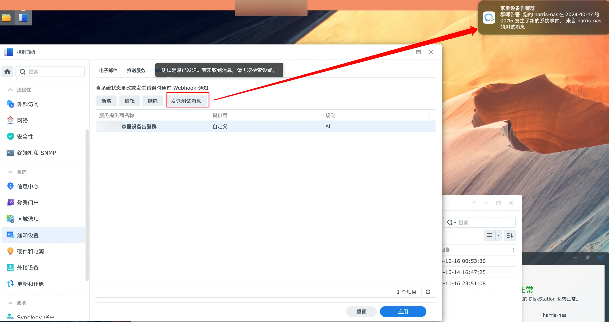

### 安装和激活AME3

首先安装AME，确保版本是`3.1.0-3005`。

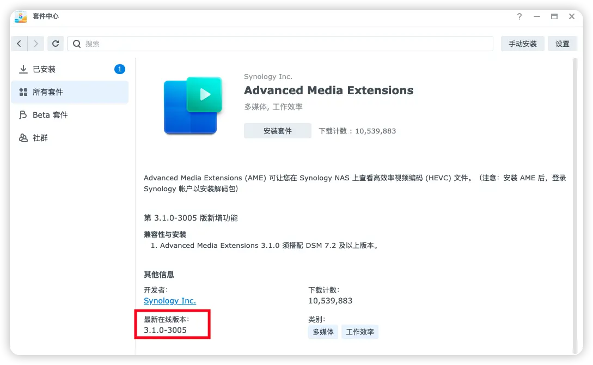

直接执行下边的脚本。

```bash
cat > /tmp/crack.py << EOF
import hashlib
import os

r = ['669066909066906690', 'B801000000', '30']
s = [(0x3718, 0), (0x60A5, 1), (0x60D1, 1), (0x6111, 1), (0x6137, 1), (0xB5F0, 2)]

prefix = '/var/packages/CodecPack/target/usr'
so = prefix + '/lib/libsynoame-license.so'

print("Patching")
with open(so, 'r+b') as fh:
    full = fh.read()
    if hashlib.md5(full).digest().hex() != '09e3adeafe85b353c9427d93ef0185e9':
        print("MD5 mismatch")
        exit(1)
    for x in s:
        fh.seek(x[0] + 0x8000, 0)
        fh.write(bytes.fromhex(r[x[1]]))

lic = '/usr/syno/etc/license/data/ame/offline_license.json'
os.makedirs(os.path.dirname(lic), exist_ok=True)
with open(lic, 'w') as licf:
    licf.write('[{"attribute": {"codec": "hevc", "type": "free"}, "status": "valid", "extension_gid": null, "expireTime": 0, "appName": "ame", "follow": ["device"], "duration": 1576800000, "appType": 14, "licenseContent": 1, "registered_at": 1649315995, "server_time": 1685421618, "firstActTime": 1649315995, "licenseCode": "0"}, {"attribute": {"codec": "aac", "type": "free"}, "status": "valid", "extension_gid": null, "expireTime": 0, "appName": "ame", "follow": ["device"], "duration": 1576800000, "appType": 14, "licenseContent": 1, "registered_at": 1649315995, "server_time": 1685421618, "firstActTime": 1649315995, "licenseCode": "0"}]')

print("Checking whether patch is successful...")
ret = os.system(prefix + "/bin/synoame-bin-check-license")
if ret == 0:
    print("Successful, updating codecs...")
    os.system(prefix + "/bin/synoame-bin-auto-install-needed-codec")
    print("Done")
else:
    print(f"Patch is unsuccessful, retcode = {ret}")
EOF

python3 /tmp/crack.py
```

看到如下输出，就说明可以了。

```bash
# python3 /tmp/crack.py 
Patching
Checking whether patch is successful...
Successful, updating codecs...
Done
```

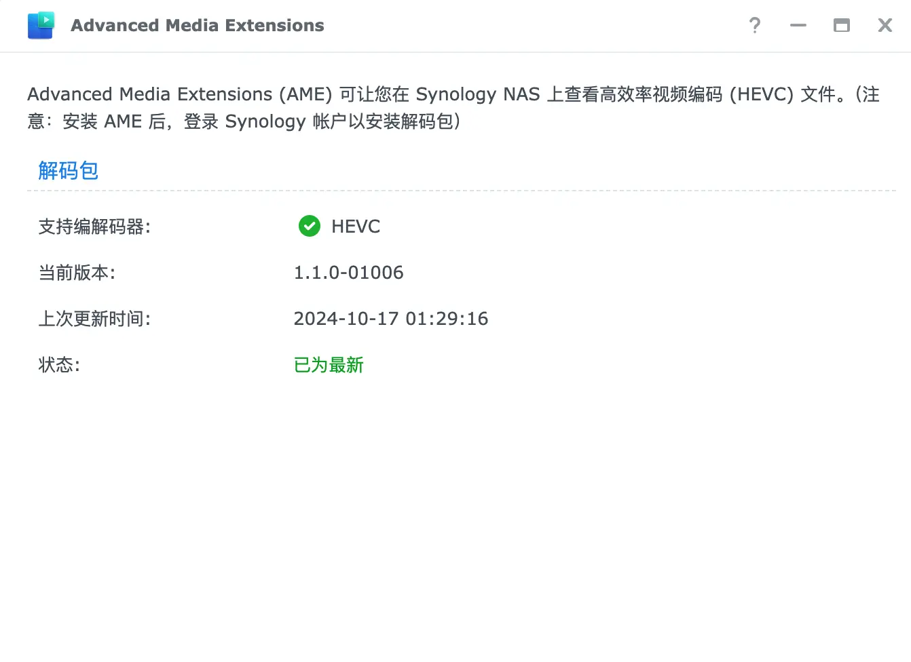

再去安装Photos，就可以正常开始建索引了。

### 修复Photos无法人脸识别

放了一晚上了，一张图也没有识别，寻思着应该是有问题了，看来GPU在我这里工作的不是很好，只能把它禁用掉，用CPU识别了。


看了一下，这里我的版本是`1.6.2-0710`，需要在下边这个项目中找这个版本对应的补丁。

[https://github.com/jinlife/Synology\_Photos\_Face\_Patch/releases](https://github.com/jinlife/Synology_Photos_Face_Patch/releases)


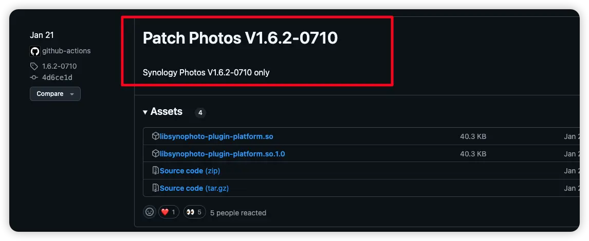

执行下边的脚本。

```bash
# 把文件下载到tmp目录下
cd /tmp
wget https://github.com/jinlife/Synology_Photos_Face_Patch/releases/download/1.6.2-0710/libsynophoto-plugin-platform.so
wget https://github.com/jinlife/Synology_Photos_Face_Patch/releases/download/1.6.2-0710/libsynophoto-plugin-platform.so.1.0

# 备份原始文件
cd /var/packages/SynologyPhotos/target/usr/lib/
mv libsynophoto-plugin-platform.so libsynophoto-plugin-platform.so.bak
mv libsynophoto-plugin-platform.so.1.0 libsynophoto-plugin-platform.so.1.0.bak

# 替换
cp /tmp/libsynophoto-plugin-platform.so .
cp /tmp/libsynophoto-plugin-platform.so.1.0 .

# 重启服务
synopkgctl stop SynologyPhotos
synopkgctl start SynologyPhotos
```

切换到CPU识别之后，就正常了，等待一天重建索引就显示出结果了。

## 设置启动顺序

如果你还需要让黑群晖在PVE启动时自动启动，那么还需设置它们的启动顺序，确保TrueNAS先于黑群晖启动，否则PVE会挂不上NFS，导致黑群晖启动失败。

在TrueNAS的虚拟机设置中，设置一个小于黑群晖的`Start/Shutdown order`，这样可以让TrueNAS先启动。然后设置`Startup delay`为60秒，确保TrueNAS已经完全启动完成了、NFS服务已经开始了，再启动下一个虚拟机（黑群晖）。

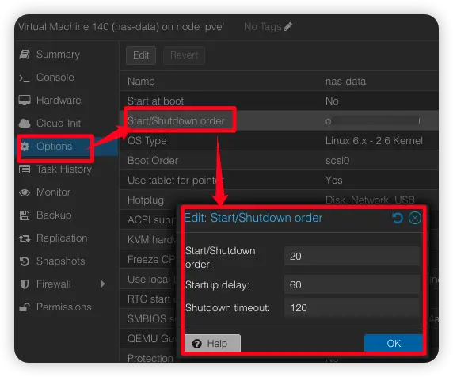

## 参考资料

- [https://xpenology.com/forum/topic/65643-ame-30-patcher/#comment-446229](https://xpenology.com/forum/topic/65643-ame-30-patcher/#comment-446229)

- [https://github.com/AlexPresso/VideoStation-FFMPEG-Patcher#usage](https://github.com/AlexPresso/VideoStation-FFMPEG-Patcher#usage)

- [https://github.com/darknebular/Wrapper\_VideoStation](https://github.com/darknebular/Wrapper_VideoStation)

- [https://github.com/jinlife/Synology\_Photos\_Face\_Patch](https://github.com/jinlife/Synology_Photos_Face_Patch)
