我有一台Windows台式机，日常仅仅会通过RDP远程上来用个银行Token，或者插显示器体验一下首发的新游戏（好比黑悟空，可惜核显只有4FPS），99%的时间都在闲着。同时，家里还开着群晖的NAS、M73t的软路由、UPS，鉴于我主力使用MacBook，这台台式机大概率会长期保持空闲，因此打算利旧这台台式机，让它同时运行NAS、软路由、Windows，把NAS、软路由这些持续大幅贬值的资产卖掉。

这篇文章，就先把物理机的Windows转为虚拟机，然后虚拟化核显给Windows用，能让Windows虚拟机通过串流把游戏画面串流给MacBook，就算达成目标。后续我还会把黑群晖搬上来，届时再看情况决定是否更新下一篇文章。

这台机器性能还不错，扩展性也尚可，有2个3.5寸硬盘位、1个2.5寸硬盘位、1个光驱位（可以改3.5寸位）、2个PCIe x16插槽（其中一个是x4通道）、2个PCIe x1插槽，并且支持Intel AMT（非vPRO，仅支持SerialOverLAN）。配置如下：

- 主机：HP EliteDesk 880 G6 Tower PC

- CPU：Intel(R) Core(TM) i3-10105

- GPU：Intel UHD 630（核显）

- 内存：DDR4 16GB \* 2

- 硬盘：SK hynix 128G

## 打开AMT

Intel i5、i7这些CPU大概率会配有vPRO，会有KVM可以用，但是性价比就没什么优势了。我这台机器里的i3没有vPRO，只有AMT，功能上对比vPRO就只有远程串口（SerialOverLAN）没有KVM。但是，这里我要说但是，AMT一样可以操作grub菜单和系统，一样可以操作BIOS，完全不需要KVM，没有必要为了vPRO而加钱买i5、i7。

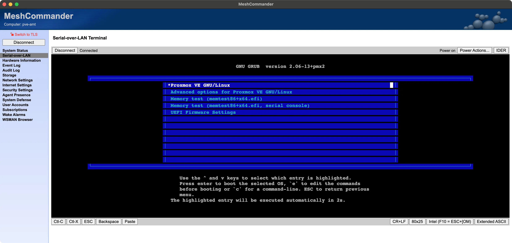

这里我就先把AMT打开，这样装完系统后机器就可以扔墙角里了，日后维护也会方便很多，机器崩溃了也可以远程救火了。

首先要去BIOS里打开Intel AMT，默认应该是关闭的。这里我就不写教程了，大家有需要可以去自己机器的官网搜索资料，我的是机器是HP的，官方提供了文档如下，还是非常详细的。

[https://h10032.www1.hp.com/ctg/Manual/c03975296.pdf](https://h10032.www1.hp.com/ctg/Manual/c03975296.pdf)

需要特别注意的是，在首次进入`MEBx Login`时， 默认密码是`admin`，修改后的密码需要满足数字+大写+小写+特殊字符的格式，否则会一直报错，而且提示看起来非常抽象。配置IP地址的时候，建议使用静态IP，并且和操作系统的IP地址区分开来，以便管理。

打开AMT后，需要去下载一个MeshCommander的软件，将会用它连接AMT进行管理。

## 使用AMT管理BIOS

**在使用AMT远程操作BIOS前，务必把显示语言改成英文，否则会乱码。**

需要先将机器关机，然后在MeshCommander中，选择重启到BIOS。

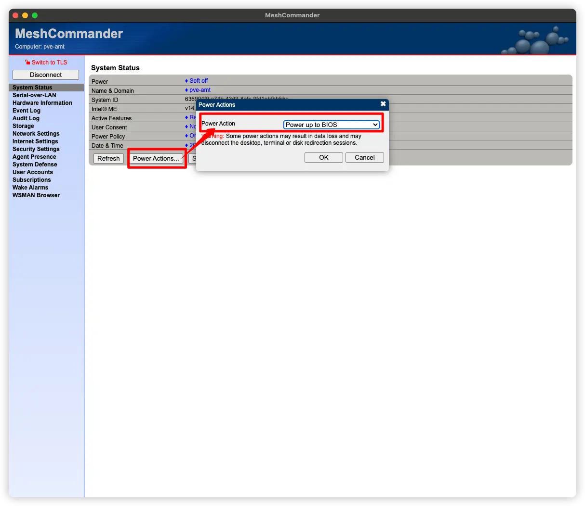

然后进入到Serial-over-LAN页面，确保模拟的键盘布局已经切换为了图中的`Intel (F10 = ESC+[OM)`，字符集切换为了`Extended ASCII`，然后按动键盘上下键，稍等片刻BIOS就会显示出来。这里并不会一次成功，如果切换了后按上下键仍然没有输出，可以在右上角的`Power Actions`选择`Reset to BIOS`重试。

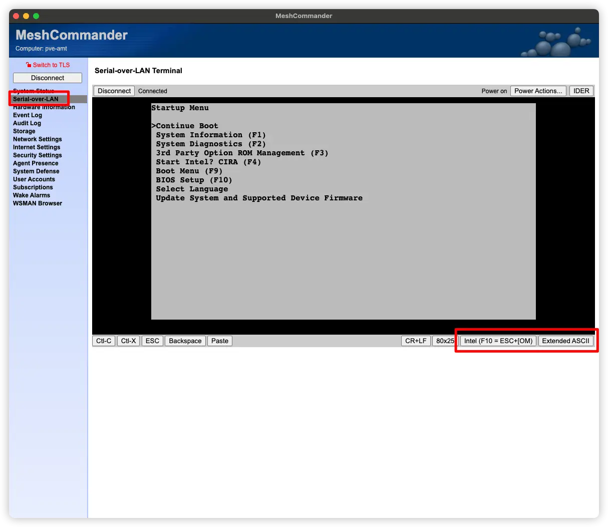

上图中提示选择`BIOS Setup`后，即可进入BIOS操作。这里的操作布局和显示器看到的BIOS布局是一致的，只是插显示器显示的更好看而已，这里就是文本显示了，所有的功能都是具备的。

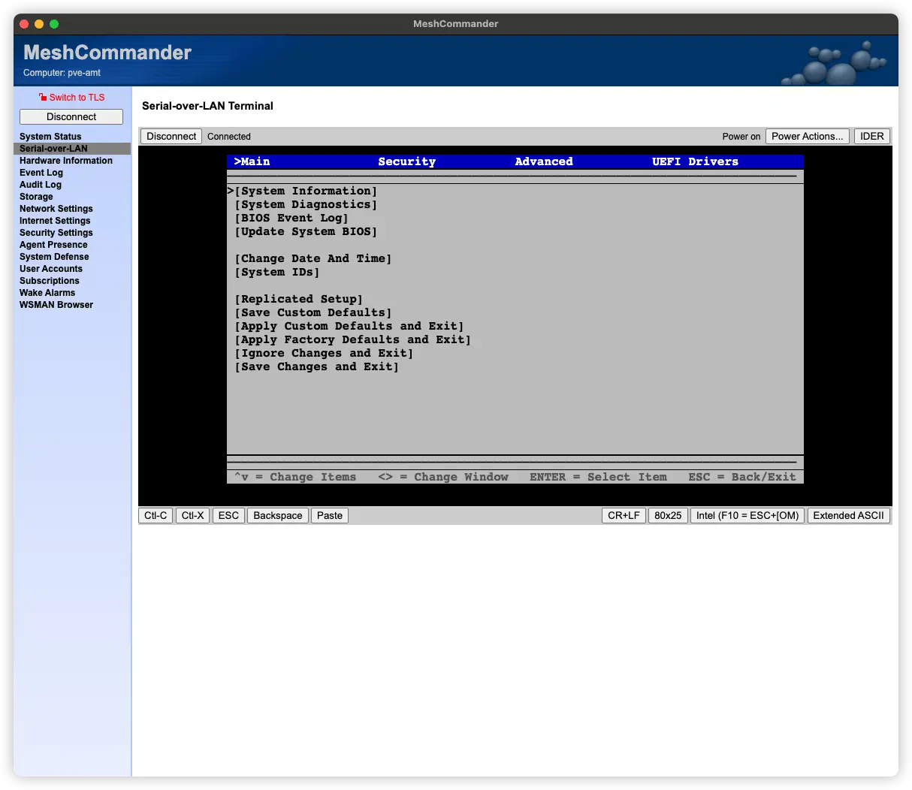

## 优化BIOS设置

不同的机器BIOS可能不一样，这里以我的机器为例。由于我的机器已经配置好了，这里我就拿已经配置好的截图出来说明，直接通过AMT远程操作BIOS，就不再插显示器了。

关闭UEFI安全启动，是必须的，就不多讲了。

打开虚拟化，并且关闭DMA保护。虚拟化就不多讲了，要开虚拟机，DMA保护打开之后可能会出一些奇奇怪怪的错误，这里直接关了。

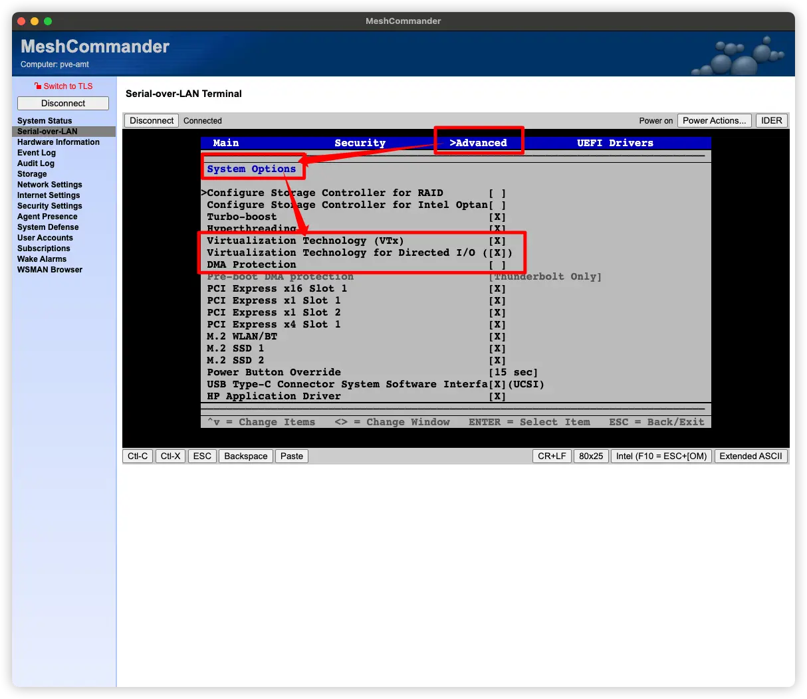

这里完全按照图中的勾选。`Runtime Power Management`就是Intel的P-state，它默认的调频策略会偏保守，而且可供更改的选项不多，升频延迟很高，严重影响性能，这里直接关了它，后边在系统中配置调频。

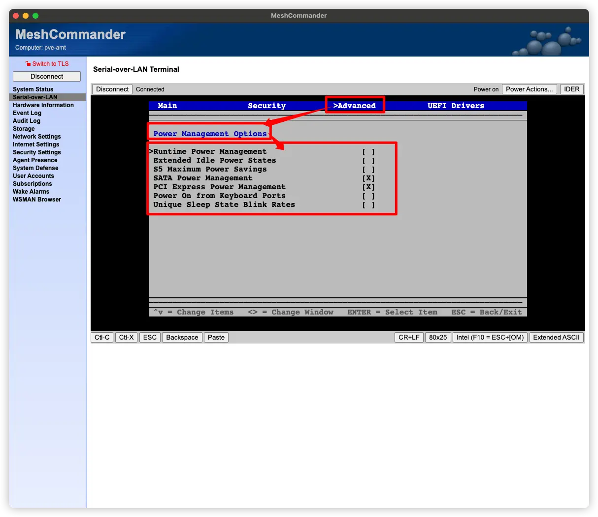

## 安装Proxmox VE

这一步就不用多说了。

## 系统中配置AMT

系统中配置AMT后，才可以在启动时操作grub菜单，并且让Linux输出启动日志到AMT的串口上，否则是不显示任何内容的。

首先，进入操作系统，看一下操作系统里串口是哪一个。

```bash
# dmesg | grep tty
[    0.125023] printk: legacy console [tty0] enabled
[    5.478726] printk: legacy console [ttyS4] disabled
[    5.499960] 0000:00:16.3: ttyS4 at I/O 0x3088 (irq = 19, base_baud = 115200) is a 16550A
```

上边的输出中，`0000:00:16.3`这个设备是PCI设备，大概率就是Intel的CPU片内的控制器，下边的命令中也确认了`ttyS4`就是AMT的串口。

```bash
# lspci 
# 省略了一些内容
00:16.0 Communication controller: Intel Corporation Comet Lake HECI Controller
```

接下来，修改`/etc/default/grub`，添加如下几行，`console=ttyS4`根据机器的不同可能会有所差异，其他内容直接复制粘贴即可。

```bash
GRUB_CMDLINE_LINUX="console=tty0 console=ttyS4,115200n8"
GRUB_TERMINAL=serial
GRUB_SERIAL_COMMAND="serial --speed=115200 --port=0xf0e0 --word=8 --parity=no --stop=1"
```

然后更新grub。

```bash
update-grub
```

使用MeshCommander登录AMT，进入`Serial-over-LAN`，也就是远程串口。远程串口不缓存历史输出，打开后只会显示之后的输出，不显示之前的。这里我把机器重启了，因此显示出来了大量的内容，按下回车后也会提示登录，说明远程串口已经可用了。

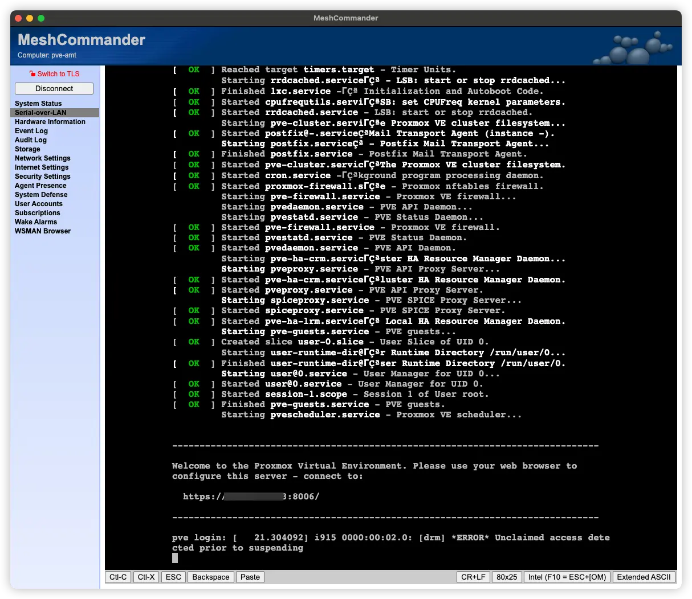

## 配置CPU调频策略

安装依赖。

```bash
apt install cpufrequtils linux-cpupower
```

查看CPU的scale频率区间，这里最大为3.7GHz。

```bash
# cpufreq-info
# ... 省略一些内容
analyzing CPU 7:
  driver: intel_cpufreq
  CPUs which run at the same hardware frequency: 7
  CPUs which need to have their frequency coordinated by software: 7
  maximum transition latency: 20.0 us.
  hardware limits: 800 MHz - 3.70 GHz
  available cpufreq governors: conservative, ondemand, userspace, powersave, performance, schedutil
  current policy: frequency should be within 2.00 GHz and 3.00 GHz.
                  The governor "ondemand" may decide which speed to use
                  within this range.
  current CPU frequency is 3.70 GHz.
```

设置调频策略。这里设置的最大频率就是3.7GHz（相当于不允许Boost），最小值设置2GHz，调度器设置为ondemand，这样能以最快速度响应升频需求，又可以在CPU长时间空闲的时候逐步降频省电，又可以让CPU处在一个比较高能效的区间省电。将此数值乘以10^6填入下边配置中即可。

```bash
cat > /etc/default/cpufrequtils << EOF
ENABLE="true"
GOVERNOR="ondemand"
MAX_SPEED=3700000
MIN_SPEED=2000000
EOF
```

最后重启服务，并配置开机自动设置。

```bash
systemctl restart cpufrequtils.service
systemctl enable cpufrequtils.service
```

## 设置GPU调频策略

这里直接把GPU拉满，至于为什么可以看后边的遇到的问题。这里GPU不拉满的话，转码时GPU会维持在一个比较低的频率，导致转码效率非常低，这一原因我也不清楚，也是偶然发现，只要把频率拉高之后，转码就会明显加快。

按照下面的命令，确认一下你的GPU是不是`card1`，如果这个文件不存在，那么可以往回看看是不是`card0`或者其他名称。

```bash
# cat /sys/class/drm/card1/gt_cur_freq_mhz 
350
```

添加计划任务，让crontab设置GPU始终为最高频率。执行`crontab -e`命令，把下边的命令贴进去，保存即可。这里我是懒省事，直接用crontab设置，如果你有心情，可以加个systemd的启动脚本。

```bash
* * * * * cat /sys/class/drm/card1/gt_max_freq_mhz > /sys/class/drm/card1/gt_min_freq_mhz
```

稍等片刻，就可以看到GPU的频率已经升上去了。

```bash
# cat /sys/class/drm/card1/gt_cur_freq_mhz
1100
```

## 配置存储直通和网卡

由于台式机之前就是WIndows 11系统，系统安装在一块NVME硬盘中，不想再把数据拷贝到虚拟磁盘中，也有点折腾，因此就打算直接把硬盘直通给虚拟机。

**特别注意，如果你的Windows开启了设备加密或者BitLocker，务必先关闭这些功能并且解密数据，否则虚拟机中TPM没有加密凭据会导致无法进系统。在家用的虚拟机中使用设备加密或者BitLocker没有必要且风险较高，建议关闭。**

在PVE中先创建一个Windows的虚拟机，创建完成后，在`Hardware`中将`SCSI Controller`设置为`VirtIO SCSI single`，以提高磁盘的性能。

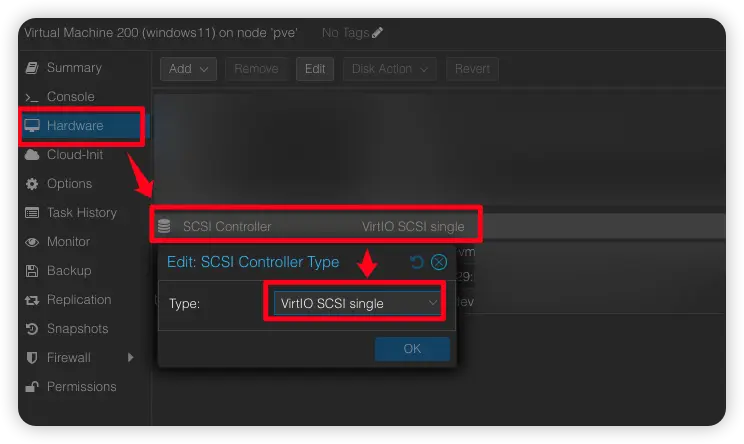

接下来，任意创建一个虚拟磁盘，将`BusDevice`选中为`SCSI`，创建的大小随意。这一步主要是确保Windows设备管理器中能够正常显示设备，以便我们安装驱动并且确认驱动安装成功，不然启动的时候就会蓝屏报`inaccessible boot device`错误。

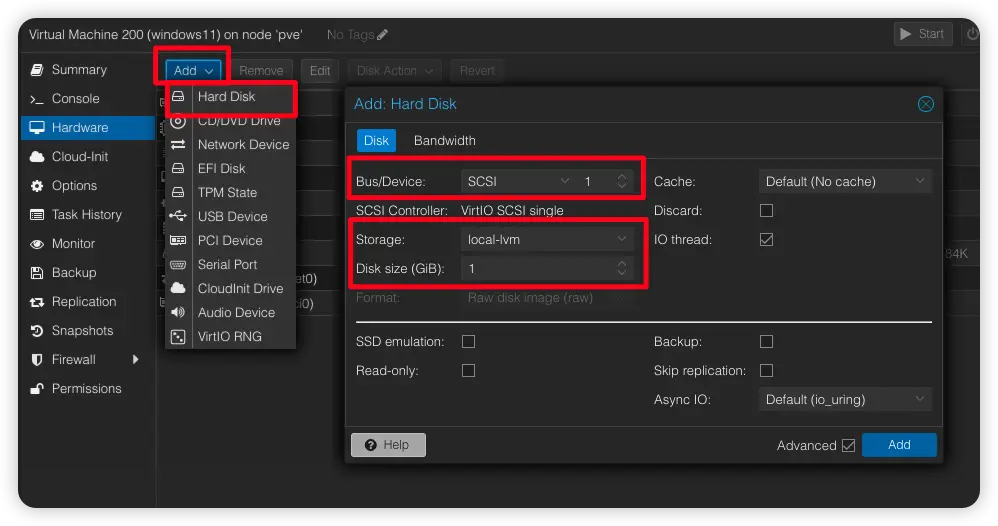

接下来，设置虚拟网卡为E1000e类型，如果没有虚拟网卡就添加一个再设置，这样确保Windows变成虚拟机后，还能够有个网络下载驱动。顺带设置队列数量，与CPU核心数保持一致即可，有助于提高网络性能。

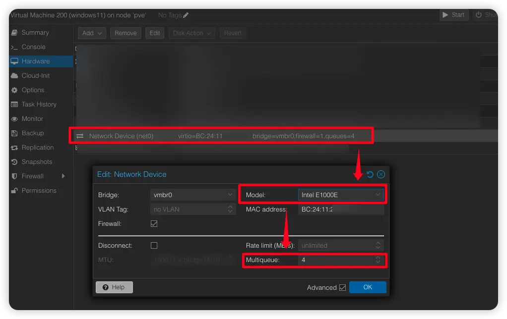

接下来，在终端中，为这个虚拟机直通NVME硬盘。

执行下边的命令，找到Windows所在的硬盘，不带`_1`、`_1-part1`这种尾缀的就是硬盘整体，就是要直通的设备。

```bash
# ls /dev/disk/by-id
dm-name-pve-root
dm-name-pve-swap
nvme-BC501A_NVMe_SK_hynix_128GB_XXXX
nvme-BC501A_NVMe_SK_hynix_128GB_XXXX_1
nvme-BC501A_NVMe_SK_hynix_128GB_XXXX_1-part1
nvme-BC501A_NVMe_SK_hynix_128GB_XXXX_1-part2
nvme-BC501A_NVMe_SK_hynix_128GB_XXXX_1-part3
nvme-BC501A_NVMe_SK_hynix_128GB_XXXX-part1
nvme-BC501A_NVMe_SK_hynix_128GB_XXXX-part2
nvme-BC501A_NVMe_SK_hynix_128GB_XXXX-part3
nvme-WDS100T3X0C-00SJG0_XXXX
nvme-WDS100T3X0C-00SJG0_XXXX_1
nvme-WDS100T3X0C-00SJG0_XXXX_1-part1
nvme-WDS100T3X0C-00SJG0_XXXX_1-part2
nvme-WDS100T3X0C-00SJG0_XXXX_1-part3
nvme-WDS100T3X0C-00SJG0_XXXX_1-part4
nvme-WDS100T3X0C-00SJG0_XXXX-part1
nvme-WDS100T3X0C-00SJG0_XXXX-part2
nvme-WDS100T3X0C-00SJG0_XXXX-part3
nvme-WDS100T3X0C-00SJG0_XXXX-part4
```

接下来，把这个硬盘直通进刚刚创建的虚拟机。`200`是虚拟机的ID，`sata0`是使用SATA的虚拟设备类型，Windows会默认有SATA控制器的驱动，这样可以确保能够正常开机。

```bash
qm set 200 -sata0 /dev/disk/by-id/nvme-WDS100T3X0C-00SJG0_XXXX
```

进系统之后，前往下边的链接下载virtio的Windows驱动，安装后能在磁盘管理中看到我们刚刚创建的那个1GB的虚拟磁盘，说明就成功了。

[https://fedorapeople.org/groups/virt/virtio-win/direct-downloads/archive-virtio](https://fedorapeople.org/groups/virt/virtio-win/direct-downloads/archive-virtio)

最后，再把SATA虚拟设备类型更换为SCSI，就可以正常进入WIndows系统了。找到刚刚创建的1GB的虚拟磁盘，将其Detach掉，并且删除。

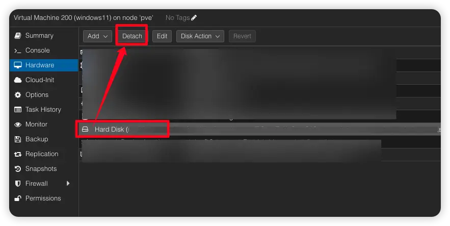

然后，重新直通NVME硬盘，这次就可以使用scsi设备了。

```bash
qm set 200 -scsi0 /dev/disk/by-id/nvme-WDS100T3X0C-00SJG0_XXXX
```

因为驱动已经安装了，这里顺手也可以把虚拟网卡改成VirtIO了，可以提高性能。

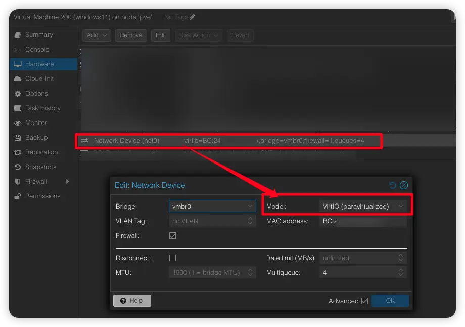

修改完成后，就可以重启进入虚拟机了。

## 配置核显虚拟化和直通

我的台式机仍然需要留着显示输出备用，我的黑群晖虚拟机需要使用显卡做视频转码和人脸识别，我的Windows虚拟机需要使用显卡串流，因此，我需要将核显分割成多份供它们一起使用。由于我的CPU为10代的，核显不支持SR-IOV，只能使用GVT-g来虚拟化。

**在开始这一步之前，需要先记下Windows的IP地址，确保远程桌面能够连接上，我的Windows虚拟机在启动完成后noVNC的输出画面就卡住了（如下图），此时只能通过RDP远程桌面或者串流连上，否则就只能暂时移除虚拟化直通的核显后再重新开机，会比较麻烦。**

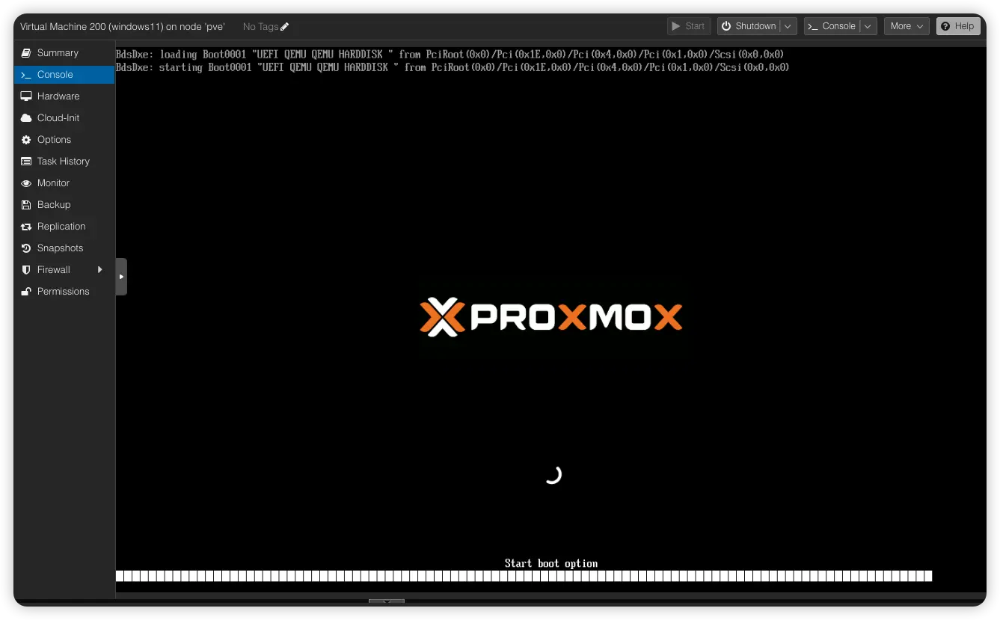

编辑`/etc/default/grub`，添加如下的内核参数。

```bash
GRUB_CMDLINE_LINUX_DEFAULT="intel_iommu=on iommu=pt i915.enable_gvt=1 i915.enable_psr=0 i915.enable_guc=0 i915.enable_dc=0 pcie_acs_override=downstream,multifunction pcie_aspm=off video=efifb:off video=vesa:off vfio_iommu_type1.allow_unsafe_interrupts=1 kvm.ignore_msrs=1 kvm.report_ignored_msrs=0 modprobe.blacklist=radeon,nouveau,nvidia,nvidiafb,nvidia-gpu"
```

编辑`/etc/modules`，添加如下模块。

```bash
vfio
vfio_iommu_type1
vfio_pci
vfio_virqfd
vfio_mdev
i915
kvmgt
```

重新生成grub配置和initramfs。

```bash
update-grub
update-initramfs -u -k all
```

完成上述操作后，重启系统，执行`dmesg | grep IOMMU`，能看到`enabled`即可。

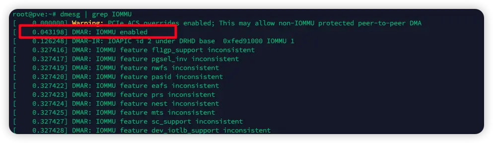

最后，直通虚拟的核显给Windows，`ROM-Bar`、`PCI-Express`的框需要勾上，`Primary GPU`不要勾选，因为核显仅仅用于渲染加速，没有办法直接显示输出，还是需要使用noVNC作为主要输出。【补充：Windows似乎总是更倾向于优先使用直通进去的核显，所以即便`Primary GPU`不勾选，Windows启动完成后noVNC中的画面仍然会卡住，我也不知道为什么】

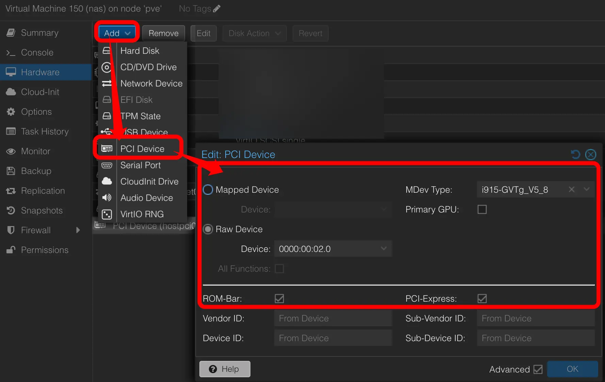

这里的`Raw Device`就选择你的核显。

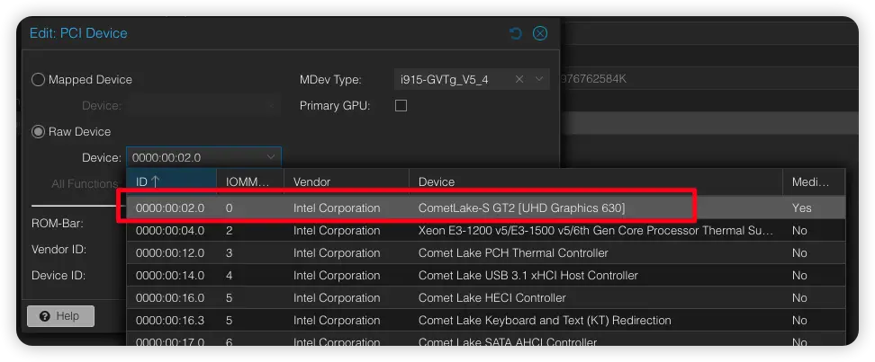

如果虚拟化成功的话，这里的`MDev Type`会出现可供选择的规格，这里因为我有两台设备需要使用核显，因此只能选择`i915-GVTg_V5_8`规格。图中显示的`Avail`为1，是因为我已经开启了一台直通了核显的Windows虚拟机，因此可用的`i915-GVTg_V5_8`规格就只剩下了1个，总共是2个。如果选择`i915-GVTg_V5_4`规格，那么就只能给一台虚拟机使用了。

其实，UHD 630极限是能支持到8个`i915-GVTg_V5_8`规格的，这个主要由BIOS中的`Aperture Size`参数设定，但是我的HP的BIOS没有这个选项，使用了UEFITool分析发现HP根本连这个参数都没，还不是单纯隐藏了，所以只能放弃。

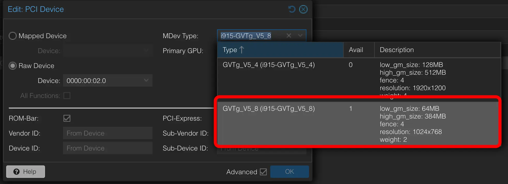

此时，直通核显就成功了，远程进去后任务管理器中就可以看到核显已经直通进去并且在辅助渲染了，就可以用Sunshine这种串流软件连接桌面了，体验非常好，亲测魔兽世界、幻兽帕鲁、黑神话悟空这些都可以启动（只是启动，核显就别想玩了）。

## 配置独显直通

这个方案不仅可以直通虚拟化的核显，还可以直通独显，只是因为我手边还没有独显测试，这一块就先不写了，但是结合以前ESXi直通独显的经验，这里应该不会有太大问题。等日后需要用到独显的时候，预留的PCIe x16插槽就可以插显卡，直通到Windows虚拟机后串流，就可以用来玩游戏了，实现云游戏。

## 禁用Windows 11的TPM检查

确保虚拟机没有TPM的情况下，系统能正常运行和更新。直接参考下边的文章即可。

[https://www.tomshardware.com/how-to/bypass-windows-11-tpm-requirement](https://www.tomshardware.com/how-to/bypass-windows-11-tpm-requirement)

## 遇到的各种问题

### 直通后的iGPU转码性能差

发现这个原因是因为我安装了Jellyfin后，调用核显转码，发现不论怎么样性能都很差，连一个25Mbps码率的HEVC视频转码都能大量丢帧，隐约觉得UHD630性能不会这么差，于是尝试找问题的原因，但是找了很久没找到。无独有偶，我在Windows虚拟机上打开了魔兽世界，并且把画质拉满，又意外去打开了Jellyfin想看看两个会不会抢资源，结果发现Jellyfin不丢帧了，WTF？

经过一番定位后发现，iGPU的调频策略有些奇怪，启动后默认只有350MHz的频率，即便Jellyfin调用它进行转码时，频率也仅仅升到了450MHz左右，此时Jellyfin肉眼可见的卡顿，但是就是没有升频。直到我在PVE中手工将GPU频率调到最高时，Jellyfin的转码才有了好转。

因此，只需要把GPU锁定在最高频率，就可以大幅提升转码速度。确认一下你的核显是`card0`还是`card1`还是其他，然后修改下边的命令后，就可以锁定最高频率了。

如果你已经在上边设置了GPU调频策略，这里就不用设置了。

```bash
cat /sys/class/drm/card1/gt_max_freq_mhz > /sys/class/drm/card1/gt_min_freq_mhz
```

我简单测试了一下各个场景下的核显的性能，其中不升频是指的不锁定1100MHz的最高频率，由其自动控制，升频是指锁定1100MHz的最高频率。

总结一下，这个核显性能本来就不强，一旦有两个虚拟机一起使用时，每个虚机的核显就会被限制到最高50%的性能，所以即便是一个虚机空载，一个虚机跑GB6测试，性能仍然会被限制。并且，开启了升频后，性能会提升大约30%左右，还是非常可观的，但是一定要注意散热。

使用GB6测得的数据如下，数据没有搞错，Windows的直通的反而比虚拟化的还要低，就当看个乐呵吧，懒得查问题了。

#### Windows（RDP）

##### Spilt Passthrough (i915-GVTg\_V5\_8)

- OpenCL（不升频）[https://browser.geekbench.com/v6/compute/2916439](https://browser.geekbench.com/v6/compute/2916439)

- Vulkan（不升频）[https://browser.geekbench.com/v6/compute/2916467](https://browser.geekbench.com/v6/compute/2916467)

##### Full Passthrough

- OpenCL（不升频）[https://browser.geekbench.com/v6/compute/2916585](https://browser.geekbench.com/v6/compute/2916585)

- Vulkan（不升频）[https://browser.geekbench.com/v6/compute/2916642](https://browser.geekbench.com/v6/compute/2916642)

#### Linux (SSH)

### Spilt Passthrough (i915-GVTg\_V5\_8)

- Vulkan（一个虚机，升频）[https://browser.geekbench.com/v6/compute/2917274](https://browser.geekbench.com/v6/compute/2917274)

- Vulkan（两个虚机，升频）[https://browser.geekbench.com/v6/compute/2917421](https://browser.geekbench.com/v6/compute/2917421)

- Vulkan（两个虚机，不升频）[https://browser.geekbench.com/v6/compute/2917594](https://browser.geekbench.com/v6/compute/2917594)

#### Full Passthrough

- Vulkan（忘了升频没了）[https://browser.geekbench.com/v6/compute/2917194](https://browser.geekbench.com/v6/compute/2917194)

### AMT导致网卡掉速

测试了好久核显直通，发现解码性能一直上不去，即便核显升频后也是非常卡，远程桌面都直接掉线了。找了好久问题，一直以为是核显的问题，无意间发现内核日志一行10Mbps，合着原来是网卡掉10Mbps了。

```bash
root@pve:~# dmesg | grep e1000e
[    5.935679] e1000e: Intel(R) PRO/1000 Network Driver
[    5.936067] e1000e: Copyright(c) 1999 - 2015 Intel Corporation.
[    5.937380] e1000e 0000:00:1f.6: Interrupt Throttling Rate (ints/sec) set to dynamic conservative mode
[    6.268079] e1000e 0000:00:1f.6 0000:00:1f.6 (uninitialized): Reset blocked by ME
[    6.597966] e1000e 0000:00:1f.6: PHY reset is blocked due to SOL/IDER session.
[    6.964809] e1000e 0000:00:1f.6 0000:00:1f.6 (uninitialized): registered PHC clock
[    7.673461] e1000e 0000:00:1f.6 eth0: (PCI Express:2.5GT/s:Width x1) 80:e8:2c:eb:e0:60
[    7.673850] e1000e 0000:00:1f.6 eth0: Intel(R) PRO/1000 Network Connection
[    7.674217] e1000e 0000:00:1f.6 eth0: MAC: 13, PHY: 12, PBA No: FFFFFF-0FF
[    7.683881] e1000e 0000:00:1f.6 eno1: renamed from eth0
[   11.216952] e1000e 0000:00:1f.6 eno1: entered allmulticast mode
[   11.217093] e1000e 0000:00:1f.6 eno1: entered promiscuous mode
[   12.369341] e1000e 0000:00:1f.6 eno1: NIC Link is Up 10 Mbps Full Duplex, Flow Control: None
```

搜索了一下lore后，发现是Intel网卡驱动的bug，这个问题仅仅会在通过MeshCommander操作BIOS后、进系统前不断开的情况下触发，网卡的EEPROM会被限制到10Mbps的速度。解决的办法也非常简单，就是在使用MeshCommander连接AMT操作BIOS后，保存配置结束时立即关闭MeshCommander，问题即可解决。

鉴于这个触发条件非常苛刻，不会每次都进去操作BIOS，所以只在操作BIOS后注意一下，其他时候不需要关注。

### 重启Windows虚拟机后蓝屏

Windows的虚拟机启动时，有可能会遇到这个蓝屏，稍等几秒钟Windows会自动重启，重启后即可正常进入系统。此时PVE的内核中会刷出来下下图中的两行内容，似乎没有什么影响。

定位问题发现，这个问题主要出现在核显被直通后、Windows重启时，目前我这里就等它蓝屏后重启就好了，也不需要太关注。

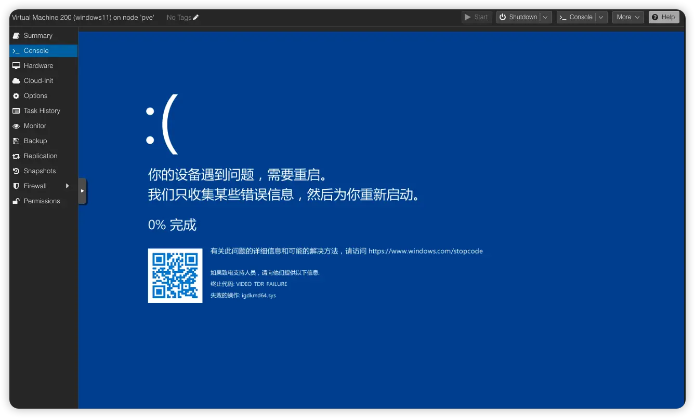


### PCIE AER错误

内核日志中刷出来了大量的直通的NVME硬盘的错误。

```bash
Dec 23 09:03:06 hostname kernel: pcieport 0000:00:1c.0: AER: Corrected error received: id=0100
Dec 23 09:03:06 hostname kernel: nvme 0000:01:00.0: PCIe Bus Error: severity=Corrected, type=Physical Layer, id=0100(Receiver ID)
Dec 23 09:03:06 hostname kernel: nvme 0000:01:00.0:   device [144d:a802] error status/mask=00000001/00006000
Dec 23 09:03:06 hostname kernel: nvme 0000:01:00.0:    [ 0] Receiver Error
```

如果你的硬盘在之前没有任何问题，只有在直通之后出现了这些错误，那么很有可能是电源管理导致的问题，可以在内核参数中配置禁用PCIe设备的电源管理。编辑`/etc/default/grub`添加如下内容，并重新生成grub配置即可。**如果你按照上边的步骤直通了核显，这一步就不需要执行了。**

```bash
# 在 GRUB_CMDLINE_LINUX_DEFAULT 后添加 pcie_aspm=off 即可。
GRUB_CMDLINE_LINUX_DEFAULT="... pcie_aspm=off"
```

如果关闭了ASPM后还存在这些错误，建议使用橡皮擦一下硬盘的金手指，或者检查线路是否有问题。

### Windows虚拟机卡顿

这个问题我排查了很久才找到原因。如果你是一开始就在虚拟化环境中安装的Windows，应该不会有这个问题，如果是从物理机转移到虚拟机的场景，那么就极大概率会遇到这个问题——虚拟机会非常卡。虚拟机卡顿的表现，就是CPU始终是100%占用，系统启动完成都要5-10分钟，远程桌面都不一定连的上。

这个卡顿的根因，是因为物理机中，Windows Defender打开了VBS（Virtualization-based security，基于虚拟化的安全性），而在虚拟机中，默认不允许嵌套虚拟化，VBS将会通过软件仿真的方式运行，效率会非常差，就会导致卡顿。解决的办法就是，禁用VBS相关的功能。

可以看下边这篇文章进行关闭，Windows Defender中关闭后重启就可以生效了。据说新版本的Windows 11默认不允许在Windows Defender中关闭VBS了，需要同步设置注册表和组策略才会生效，下边的文章中有讲步骤。

[https://beebom.com/how-disable-virtualization-based-security-vbs-windows-11](https://beebom.com/how-disable-virtualization-based-security-vbs-windows-11)

如果你已经卡到Windows Defender都打不开了，那么可以按照下图中的方法，临时在PVE中为虚拟机增加嵌套虚拟化，这样最起码能大幅提升你进系统的速度，然后进去系统后再操作就可以了。

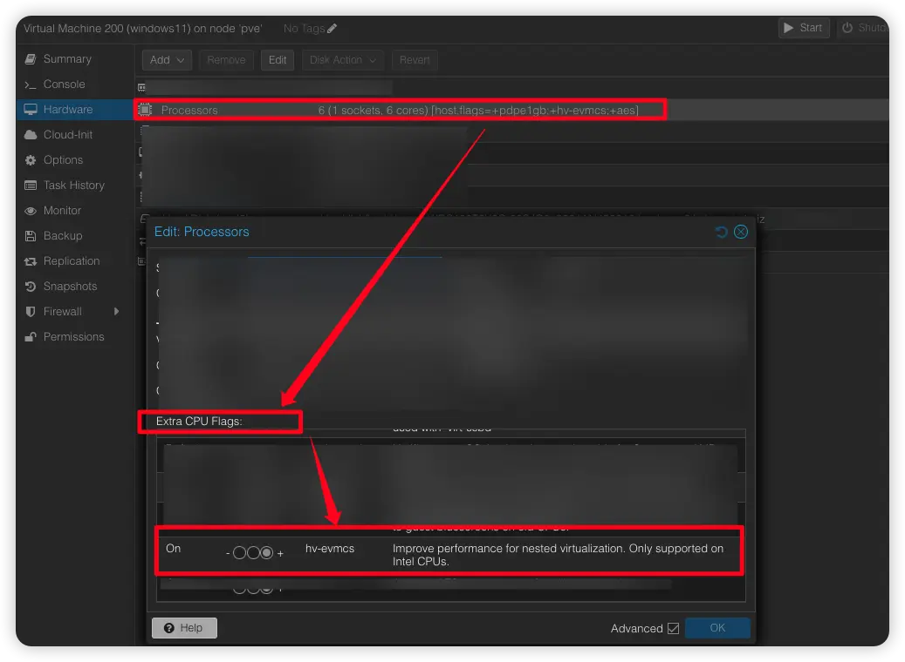

## 总结

这样操作之后，我就用1500块钱的台式机，加上手上已有的几块硬盘，组成了一台NAS+软路由+Windows游戏机一体的All in Boom。盘位管够，不够机箱里还有相当大的空间可以掏，性价比爆棚。

整个过程就是太折腾了，一路都在踩坑，希望这篇文章能给后人一些帮助。

## 相关资料

- [https://forum.proxmox.com/threads/aer-corrected-error-received.131467/](https://forum.proxmox.com/threads/aer-corrected-error-received.131467/)

- [https://www.tomshardware.com/how-to/disable-vbs-windows-11](https://www.tomshardware.com/how-to/disable-vbs-windows-11)

- [https://beebom.com/how-disable-virtualization-based-security-vbs-windows-11/](https://beebom.com/how-disable-virtualization-based-security-vbs-windows-11/)

- [https://3os.org/infrastructure/proxmox/gpu-passthrough/igpu-split-passthrough/#windows-virtual-machine-igpu-passthrough-configuration](https://3os.org/infrastructure/proxmox/gpu-passthrough/igpu-split-passthrough/#windows-virtual-machine-igpu-passthrough-configuration)

- [https://github.com/intel/gvt-linux/issues/77](https://github.com/intel/gvt-linux/issues/77)

- [https://pve.proxmox.com/wiki/Windows\_2022\_guest\_best\_practices](https://pve.proxmox.com/wiki/Windows_2022_guest_best_practices)

- [https://forum.proxmox.com/threads/aer-corrected-error-received.131467/](https://forum.proxmox.com/threads/aer-corrected-error-received.131467/)

- [https://www.tomshardware.com/how-to/bypass-windows-11-tpm-requirement](https://www.tomshardware.com/how-to/bypass-windows-11-tpm-requirement)

- [https://www.intel.com/content/www/us/en/docs/oneapi/optimization-guide-gpu/2023-1/configuring-gpu-device.html](https://www.intel.com/content/www/us/en/docs/oneapi/optimization-guide-gpu/2023-1/configuring-gpu-device.html)

- [https://github.com/intel/gvt-linux/issues/131](https://github.com/intel/gvt-linux/issues/131)

- [https://wiki.gentoo.org/wiki/User:0xdc/Drafts/Configure\_Intel\_GPU\_Aperture\_Size\_via\_hidden\_UEFI\_settings](https://wiki.gentoo.org/wiki/User:0xdc/Drafts/Configure_Intel_GPU_Aperture_Size_via_hidden_UEFI_settings)

- [https://wiki.archlinux.org/title/Intel\_graphics#Enable\_GuC_/_HuC\_firmware\_loading](https://wiki.archlinux.org/title/Intel_graphics#Enable_GuC_/_HuC_firmware_loading)

- [https://blog.ktz.me/why-i-stopped-using-intel-gvt-g-on-proxmox/](https://blog.ktz.me/why-i-stopped-using-intel-gvt-g-on-proxmox/)

- [https://winraid.level1techs.com/t/determine-configurable-aperture-size-from-bios-file/34246/26?page=2](https://winraid.level1techs.com/t/determine-configurable-aperture-size-from-bios-file/34246/26?page=2)
